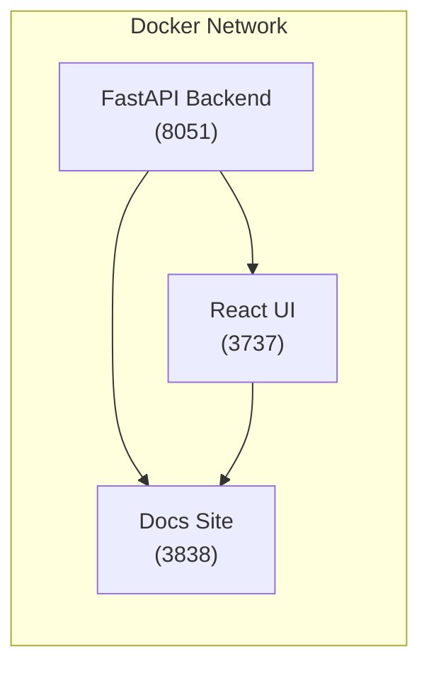

# System Architecture

This section provides a detailed overview of the MCP-Crawl4AI-RAG application architecture.

## Docker Container Setup

- **Dockerfile**: Multi-stage build for docs site using Node.js and Nginx.
- **docker-compose.yml**: Orchestrates backend (FastAPI), frontend (React), and docs services.

## Environment Variables

| Variable                | Description                         | Default      |
| ----------------------- | ----------------------------------- | ------------ |
| SUPABASE_URL            | Supabase API URL                    | *required*   |
| SUPABASE_SERVICE_KEY    | Supabase service role key           | *required*   |
| HOST                    | Backend host                        | `localhost`  |
| PORT                    | Backend port                        | `8051`       |

## Service Topology

