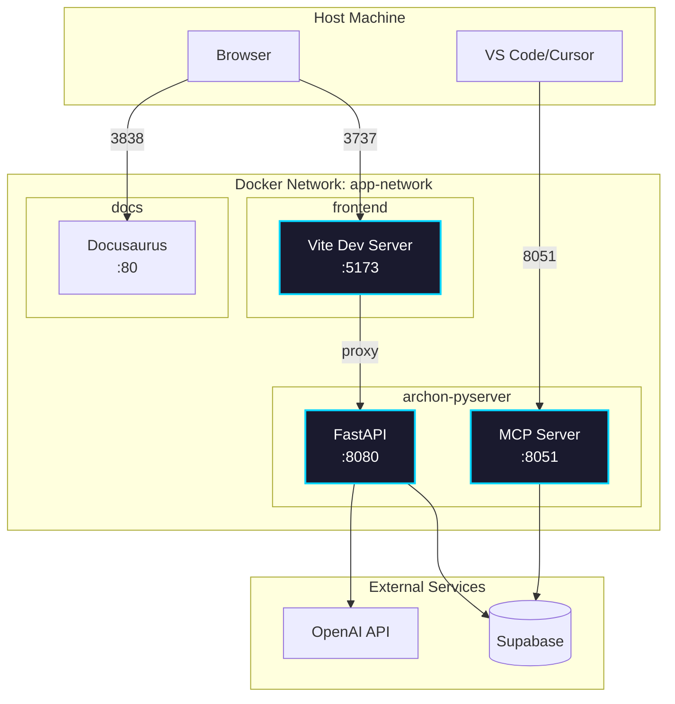

import Tabs from '@theme/Tabs';
import TabItem from '@theme/TabItem';
import Admonition from '@theme/Admonition';

# Configuration

## Docker Architecture

<Admonition type="info" title="Container Communication">
All services run in Docker containers and communicate via the `app-network` bridge network using service names, not localhost.
</Admonition>



### Port Mappings

| Service | Container Port | Host Port | Purpose |
|---------|---------------|-----------|---------|
| Frontend | 5173 | 3737 | React UI |
| FastAPI | 8080 | 8080 | Backend API |
| MCP Server | 8051 | 8051 | AI Agent connections |
| Documentation | 80 | 3838 | This documentation |

## Essential Configuration

### 1. Environment Variables

Create a `.env` file in the root directory:

```bash
# Required - Get from supabase.com dashboard
SUPABASE_URL=https://your-project.supabase.co
SUPABASE_SERVICE_KEY=eyJ0eXAi...

# Optional - Set via UI Settings page
# OPENAI_API_KEY=sk-...
# LOGFIRE_TOKEN=pylf_...
```

<Admonition type="tip" title="API Keys via UI">
You can set API keys through the Settings page in the UI instead of environment variables.
</Admonition>

### 2. Database Setup

<Tabs>
<TabItem value="new" label="New Installation">

1. Create a Supabase project at [supabase.com](https://supabase.com)
2. Copy credentials from Settings → API
3. Tables are auto-created on first run

</TabItem>
<TabItem value="reset" label="Reset Database">

Run this SQL in Supabase to completely reset:

```sql
-- Run migration/RESET_DB.sql
-- This removes ALL data and tables
```

Then restart the backend to recreate tables.

</TabItem>
</Tabs>

### 3. Starting the Application

```bash
# Start all services
docker-compose up -d

# Check status
docker-compose ps

# View logs
docker-compose logs -f
```

## Docker Networking

<Admonition type="warning" title="Important">
Inside Docker containers, services communicate using container names, not `localhost`:
- Frontend → Backend: `http://archon-pyserver:8080`
- Never use `localhost` in container-to-container communication
</Admonition>

### Common Issues

<Tabs>
<TabItem value="connection" label="Connection Refused">

**Problem**: Frontend can't connect to backend

**Solution**: Check `vite.config.ts` uses correct service name:
```typescript
proxy: {
  '/api': {
    target: 'http://archon-pyserver:8080',
    ws: true
  }
}
```

</TabItem>
<TabItem value="websocket" label="WebSocket Issues">

**Problem**: WebSocket disconnects immediately

**Solution**: Ensure WebSocket URLs match backend routes:
- Agent Chat: `/api/agent-chat/sessions/{id}/ws`
- Task Updates: `/api/projects/{id}/tasks/ws`

</TabItem>
</Tabs>

## Quick Reference

### Health Checks

```bash
# Backend API
curl http://localhost:8080/health

# MCP Server
curl http://localhost:8051/health

# Frontend
curl http://localhost:3737
```

### Container Management

```bash
# Restart a service
docker-compose restart frontend

# Rebuild after code changes
docker-compose build frontend
docker-compose up -d frontend

# View real-time logs
docker-compose logs -f archon-pyserver
```

## Next Steps

Once configured and running:

- **Web Interface**: Access at `http://localhost:3000`
- **API Documentation**: Available at `http://localhost:8080/docs`
- **MCP Connection**: Use `archon-mcp://localhost:8051` in your IDE

<Admonition type="tip" title="Configuration Tips">
- All settings are stored in the Supabase database
- API keys can be configured through the web interface  
- Knowledge base content can be managed through the web interface
- MCP clients connect automatically once configured
</Admonition>