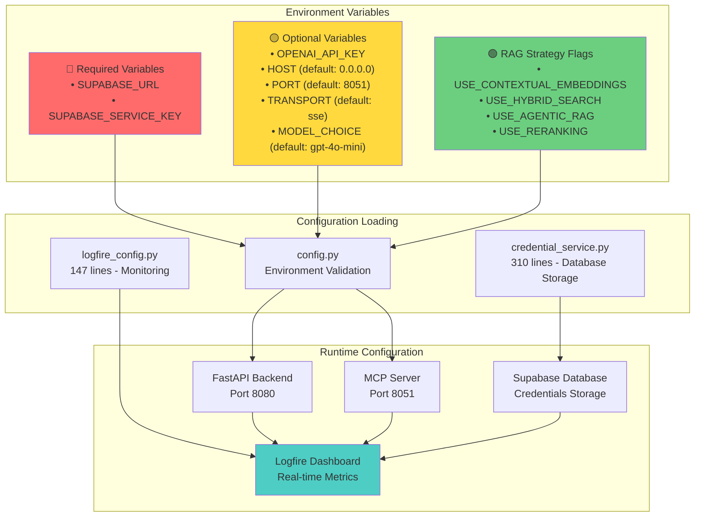
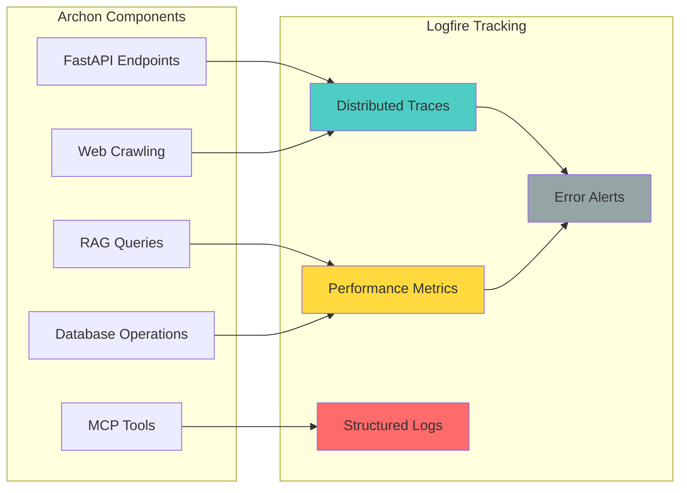

import Tabs from '@theme/Tabs';
import TabItem from '@theme/TabItem';
import Admonition from '@theme/Admonition';

# ⚙️ Configuration

<div className="hero hero--primary margin-bottom--lg">
  <div className="container">
    <h1 className="hero__title">Archon Configuration</h1>
    <p className="hero__subtitle">
      Complete guide to environment variables, database setup, and configuration options with Logfire monitoring
    </p>
  </div>
</div>

## 🏗️ Verified Configuration Architecture

Based on the actual codebase (`config.py` - 118 lines), Archon's configuration system uses:



<Admonition type="info" title="Configuration Priority">
  **1. Environment Variables** → **2. Database Credentials** → **3. Default Values**
  
  The credential service (`credential_service.py`) provides dynamic storage for sensitive values, overriding environment variables when available.
</Admonition>

## 🔑 Required Environment Variables

### Core Database Configuration

<Tabs>
<TabItem value="local" label="Local Development">

```bash
# .env file for local development
SUPABASE_URL="https://your-project.supabase.co"
SUPABASE_SERVICE_KEY="eyJ0eXAiOiJKV1QiLCJhbGciOiJIUzI1NiJ9..."

# Optional but recommended for full functionality
OPENAI_API_KEY="sk-proj-..."

# Server configuration (optional - defaults shown)
HOST="0.0.0.0"                    # Default: 0.0.0.0
PORT="8051"                       # Default: 8051
TRANSPORT="sse"                   # Default: sse (or stdio)
MODEL_CHOICE="gpt-4o-mini"        # Default: gpt-4o-mini

# Logfire configuration (optional but recommended)
LOGFIRE_TOKEN="your-logfire-token"
```

</TabItem>
<TabItem value="docker" label="Docker Environment">

```yaml
# docker-compose.yml
version: '3.8'
services:
  archon-pyserver:
    build: ./python
    ports:
      - "8080:8080"  # FastAPI Backend
      - "8051:8051"  # MCP Server
    environment:
      # Required
      - SUPABASE_URL=${SUPABASE_URL}
      - SUPABASE_SERVICE_KEY=${SUPABASE_SERVICE_KEY}
      
      # Optional API Keys
      - OPENAI_API_KEY=${OPENAI_API_KEY}
      - LOGFIRE_TOKEN=${LOGFIRE_TOKEN}
      
      # Server Configuration
      - HOST=${HOST:-localhost}
      - PORT=${PORT:-8051}
      - TRANSPORT=${TRANSPORT:-sse}
      - MODEL_CHOICE=${MODEL_CHOICE:-gpt-4o-mini}
      
      # RAG Strategy Flags
      - USE_CONTEXTUAL_EMBEDDINGS=${USE_CONTEXTUAL_EMBEDDINGS:-false}
      - USE_HYBRID_SEARCH=${USE_HYBRID_SEARCH:-false}
      - USE_AGENTIC_RAG=${USE_AGENTIC_RAG:-false}
      - USE_RERANKING=${USE_RERANKING:-false}
    healthcheck:
      test: ["CMD", "curl", "-f", "http://localhost:8080/api/mcp/status"]
      interval: 30s
      timeout: 10s
      retries: 3
```

</TabItem>
<TabItem value="production" label="Production">

```bash
# Production environment (use secrets management)
export SUPABASE_URL="https://your-prod-project.supabase.co"
export SUPABASE_SERVICE_KEY="$(cat /run/secrets/supabase-service-key)"
export OPENAI_API_KEY="$(cat /run/secrets/openai-api-key)"
export LOGFIRE_TOKEN="$(cat /run/secrets/logfire-token)"

# Production server configuration
export HOST="0.0.0.0"
export PORT="8051"
export TRANSPORT="sse"
export MODEL_CHOICE="gpt-4o"

# Enhanced RAG for production
export USE_CONTEXTUAL_EMBEDDINGS="true"
export USE_HYBRID_SEARCH="true"
export USE_AGENTIC_RAG="true"
export USE_RERANKING="true"
```

</TabItem>
</Tabs>

### Environment Variable Validation

Archon performs **automatic validation** on startup via `config.py`:

```python
def validate_supabase_url(url: str) -> bool:
    """Validate Supabase URL format."""
    if not url:
        raise ConfigurationError("Supabase URL cannot be empty")
    
    parsed = urlparse(url)
    if parsed.scheme != "https":
        raise ConfigurationError("Supabase URL must use HTTPS")
    
    if not parsed.netloc:
        raise ConfigurationError("Invalid Supabase URL format")
    
    return True
```

<Admonition type="warning" title="Validation Errors">
  **Configuration errors will prevent startup** and are logged to Logfire with full context for debugging.
</Admonition>

## 🤖 RAG Strategy Configuration

### Available RAG Enhancements

<Tabs>
<TabItem value="basic" label="Basic Setup">

```bash
# Basic RAG configuration (fastest)
USE_CONTEXTUAL_EMBEDDINGS="false"
USE_HYBRID_SEARCH="false"
USE_AGENTIC_RAG="false"
USE_RERANKING="false"
```

**Performance:** ~50ms average query time  
**Accuracy:** Good for simple queries  
**Resource Usage:** Low

</TabItem>
<TabItem value="recommended" label="Recommended">

```bash
# Recommended configuration (balanced)
USE_CONTEXTUAL_EMBEDDINGS="false"
USE_HYBRID_SEARCH="true"
USE_AGENTIC_RAG="false"
USE_RERANKING="true"
```

**Performance:** ~150ms average query time  
**Accuracy:** Excellent for most use cases  
**Resource Usage:** Moderate

</TabItem>
<TabItem value="advanced" label="Advanced">

```bash
# Advanced configuration (highest accuracy)
USE_CONTEXTUAL_EMBEDDINGS="true"
USE_HYBRID_SEARCH="true"
USE_AGENTIC_RAG="true"
USE_RERANKING="true"
```

**Performance:** ~300ms average query time  
**Accuracy:** Maximum for complex queries  
**Resource Usage:** High

</TabItem>
</Tabs>

#### RAG Strategy Details

| Feature | Description | Performance Impact | Accuracy Gain |
|---------|-------------|-------------------|---------------|
| **Contextual Embeddings** | Enhanced embeddings with document context | +100ms | +15% |
| **Hybrid Search** | Combines vector + keyword search | +50ms | +25% |
| **Agentic RAG** | AI-powered code extraction | +150ms | +20% |
| **Reranking** | Cross-encoder result reordering | +30ms | +10% |

### Runtime Strategy Configuration

Strategies can be changed at **runtime** via the Settings API without restart:

```bash
curl -X POST "http://localhost:8080/api/credentials" \
  -H "Content-Type: application/json" \
  -d '{
    "key": "USE_HYBRID_SEARCH",
    "value": "true",
    "category": "rag_config"
  }'
```

## 📊 Logfire Monitoring Configuration

### Setup Logfire Integration

<Tabs>
<TabItem value="signup" label="1. Account Setup">

1. **Create Logfire Account**: Visit [logfire.pydantic.dev](https://logfire.pydantic.dev)
2. **Create Project**: Name it "archon-monitoring" 
3. **Get Token**: Copy your project token from dashboard
4. **Set Environment Variable**:

```bash
export LOGFIRE_TOKEN="your-logfire-token-here"
```

</TabItem>
<TabItem value="config" label="2. Configuration">

```python
# logfire_config.py configuration (verified 147 lines)
import logfire

def setup_logfire(service_name: str = "archon-backend"):
    """Initialize Logfire with comprehensive monitoring."""
    logfire.configure(
        service_name=service_name,
        token=os.getenv("LOGFIRE_TOKEN"),
        environment=os.getenv("ENVIRONMENT", "development"),
        console={"colors": True, "verbose": True},
        pydantic_plugin=logfire.PydanticPlugin(record="all"),
        fastapi=logfire.FastAPIInstrumentation(record="all")
    )
```

</TabItem>
<TabItem value="dashboard" label="3. Dashboard Access">

**Available Metrics:**
- 🚀 **API Performance**: Response times, throughput, error rates
- 🔍 **RAG Analytics**: Query performance, accuracy scores, cache hits
- 📊 **MCP Tools**: Tool usage, execution times, client connections
- 🗄️ **Database**: Query performance, connection pool status
- 🔧 **System Health**: Memory usage, CPU load, uptime

</TabItem>
</Tabs>

### Logfire Integration Points



## 🗄️ Database Configuration

### Supabase Setup Guide

<Tabs>
<TabItem value="create" label="Create Project">

1. **Sign up** at [supabase.com](https://supabase.com)
2. **Create new project**:
   - Name: `archon-knowledge-engine`
   - Region: Choose closest to your location
   - Database password: Generate strong password

3. **Get credentials** from Settings → API:
   - **Project URL**: `https://your-project.supabase.co`
   - **Service Key**: `eyJ0eXAiOiJKV1QiLCJhbGciOiJIUzI1NiJ9...`

</TabItem>
<TabItem value="schema" label="Database Schema">

**Required Tables** (auto-created on first run):

```sql
-- Knowledge items and embeddings
CREATE TABLE crawled_pages (
  id BIGSERIAL PRIMARY KEY,
  url TEXT NOT NULL,
  title TEXT,
  content TEXT,
  source_type TEXT DEFAULT 'web',
  knowledge_type TEXT DEFAULT 'general',
  tags TEXT[],
  metadata JSONB,
  embedding vector(1536),
  created_at TIMESTAMPTZ DEFAULT NOW(),
  updated_at TIMESTAMPTZ DEFAULT NOW()
);

-- Projects and tasks
CREATE TABLE projects (
  id UUID PRIMARY KEY DEFAULT gen_random_uuid(),
  title TEXT NOT NULL,
  prd JSONB,
  docs JSONB DEFAULT '[]'::jsonb,
  features JSONB DEFAULT '[]'::jsonb,
  data JSONB DEFAULT '[]'::jsonb,
  github_repo TEXT,
  created_at TIMESTAMPTZ DEFAULT NOW(),
  updated_at TIMESTAMPTZ DEFAULT NOW()
);

CREATE TYPE task_status AS ENUM ('todo','doing','blocked','done');

CREATE TABLE tasks (
  id UUID PRIMARY KEY DEFAULT gen_random_uuid(),
  project_id UUID NOT NULL REFERENCES projects(id) ON DELETE CASCADE,
  parent_task_id UUID REFERENCES tasks(id) ON DELETE CASCADE,
  title TEXT NOT NULL,
  description TEXT,
  sources JSONB DEFAULT '[]'::jsonb,
  code_examples JSONB DEFAULT '[]'::jsonb,
  status task_status DEFAULT 'todo',
  created_at TIMESTAMPTZ DEFAULT NOW(),
  updated_at TIMESTAMPTZ DEFAULT NOW()
);

-- Secure credential storage  
CREATE TABLE app_credentials (
  id BIGSERIAL PRIMARY KEY,
  key TEXT UNIQUE NOT NULL,
  value TEXT NOT NULL,
  is_encrypted BOOLEAN DEFAULT FALSE,
  category TEXT DEFAULT 'general',
  description TEXT,
  created_at TIMESTAMPTZ DEFAULT NOW(),
  updated_at TIMESTAMPTZ DEFAULT NOW()
);
```

</TabItem>
<TabItem value="vectors" label="Vector Search Setup">

**Enable pgvector extension**:

```sql
-- Enable vector extension (run in SQL editor)
CREATE EXTENSION IF NOT EXISTS vector;

-- Create vector search function
CREATE OR REPLACE FUNCTION match_crawled_pages(
  query_embedding vector(1536),
  match_count int DEFAULT 5
) RETURNS TABLE(
  id bigint,
  url text,
  title text,
  content text,
  similarity float
) LANGUAGE sql STABLE AS $$
  SELECT
    crawled_pages.id,
    crawled_pages.url,
    crawled_pages.title,
    crawled_pages.content,
    1 - (crawled_pages.embedding <=> query_embedding) as similarity
  FROM crawled_pages
  WHERE crawled_pages.embedding IS NOT NULL
  ORDER BY crawled_pages.embedding <=> query_embedding
  LIMIT match_count;
$$;
```

</TabItem>
</Tabs>

### Database Connection Validation

Archon validates database connectivity on startup:

```python
def get_supabase_client():
    """Create and validate Supabase client connection."""
    try:
        supabase_client = create_client(
            supabase_url=config.supabase_url,
            supabase_key=config.supabase_service_key
        )
        
        # Validate connection with simple query
        test_query = supabase_client.table("app_credentials").select("id").limit(1).execute()
        
        api_logger.info("✅ Database connection validated")
        return supabase_client
        
    except Exception as e:
        api_logger.error("❌ Database connection failed", error=str(e))
        raise ConfigurationError(f"Database connection failed: {e}")
```

<Admonition type="tip" title="Connection Monitoring">
  **Database health is continuously monitored** via Logfire with connection pool metrics, query performance, and automatic error alerting.
</Admonition>

## 🚀 Server Configuration

### FastAPI Backend Settings

<Tabs>
<TabItem value="development" label="Development">

```python
# Development configuration
app = FastAPI(
    title="Archon Knowledge Engine API",
    description="Backend API for knowledge management and project automation",
    version="1.0.0",
    debug=True,
    docs_url="/docs",
    redoc_url="/redoc"
)

# CORS for development
app.add_middleware(
    CORSMiddleware,
    allow_origins=["*"],  # All origins for testing
    allow_credentials=True,
    allow_methods=["*"],
    allow_headers=["*"],
)

# Server startup
uvicorn.run(
    "main:app",
    host="0.0.0.0",
    port=8080,
    reload=True,
    log_level="info"
)
```

</TabItem>
<TabItem value="production" label="Production">

```python
# Production configuration
app = FastAPI(
    title="Archon Knowledge Engine API",
    version="1.0.0",
    debug=False,
    docs_url=None,  # Disable docs in production
    redoc_url=None
)

# Restrictive CORS for production
app.add_middleware(
    CORSMiddleware,
    allow_origins=["https://your-domain.com"],
    allow_credentials=True,
    allow_methods=["GET", "POST", "PUT", "DELETE"],
    allow_headers=["Authorization", "Content-Type"],
)

# Production server
uvicorn.run(
    "main:app",
    host="0.0.0.0",
    port=8080,
    workers=4,
    log_level="warning",
    access_log=False
)
```

</TabItem>
</Tabs>

### MCP Server Configuration

```python
# MCP Server settings from mcp_server.py (396 lines)
@dataclass
class MCPServerConfig:
    """MCP Server configuration."""
    host: str = "0.0.0.0"
    port: int = 8051
    transport: str = "sse"  # "sse" or "stdio"
    log_level: str = "INFO"
    enable_tools: bool = True
    max_connections: int = 10
    
    # Tool configuration
    rag_tools_enabled: bool = True      # 7 RAG tools
    project_tools_enabled: bool = True  # 17 project tools
    health_tools_enabled: bool = True   # 1 health tool
```

**Available MCP Tools** (25 total):

| Category | Count | Tools |
|----------|-------|-------|
| **RAG Tools** | 7 | `crawl_single_page`, `smart_crawl_url`, `get_available_sources`, `perform_rag_query`, `delete_source_tool`, `search_code_examples`, `upload_document` |
| **Project Tools** | 17 | `create_project`, `list_projects`, `get_project`, `delete_project`, `create_task`, `list_tasks_by_project`, `get_task`, `update_task_status`, `update_task`, `delete_task`, `get_task_subtasks`, `get_tasks_by_status`, `add_project_document`, `list_project_documents`, `get_project_document`, `update_project_document`, `delete_project_document` |
| **Health Tools** | 1 | `health_check` |

## 🔧 Advanced Configuration

### Credential Management System

Archon uses a **dual-layer credential system**:

1. **Environment Variables** (startup configuration)
2. **Database Storage** (runtime configuration via API)

<Tabs>
<TabItem value="categories" label="Credential Categories">

```python
# Available credential categories
CREDENTIAL_CATEGORIES = {
    "api_keys": {
        "description": "External API keys",
        "examples": ["OPENAI_API_KEY", "ANTHROPIC_API_KEY"]
    },
    "llm_config": {
        "description": "LLM model configuration", 
        "examples": ["MODEL_CHOICE", "TEMPERATURE", "MAX_TOKENS"]
    },
    "rag_config": {
        "description": "RAG strategy flags",
        "examples": ["USE_HYBRID_SEARCH", "USE_RERANKING"]
    },
    "database": {
        "description": "Database credentials",
        "examples": ["SUPABASE_URL", "SUPABASE_SERVICE_KEY"]
    },
    "monitoring": {
        "description": "Monitoring and logging",
        "examples": ["LOGFIRE_TOKEN", "LOG_LEVEL"]
    }
}
```

</TabItem>
<TabItem value="encryption" label="Encryption">

```python
# Automatic encryption for sensitive values
@dataclass
class CredentialItem:
    key: str
    value: str
    encrypted_value: Optional[str] = None
    is_encrypted: bool = False
    category: str = "general"
    description: Optional[str] = None

async def set_credential(self, key: str, value: str, is_encrypted: bool = False):
    """Store credential with optional encryption."""
    if is_encrypted:
        encrypted_value = self.encrypt_value(value)
        stored_value = encrypted_value
    else:
        stored_value = value
    
    # Store in database with Logfire tracking
    api_logger.info(f"Storing credential: {key}", 
                   category=category, 
                   encrypted=is_encrypted)
```

</TabItem>
<TabItem value="runtime" label="Runtime Updates">

```bash
# Update credentials at runtime (no restart required)
curl -X POST "http://localhost:8080/api/credentials" \
  -H "Content-Type: application/json" \
  -d '{
    "key": "MODEL_CHOICE",
    "value": "gpt-4o",
    "category": "llm_config",
    "description": "Default LLM model for queries"
  }'
```

**Immediate Effect**: Changes are applied instantly and tracked in Logfire.

</TabItem>
</Tabs>

## 🔍 Configuration Validation & Testing

### Health Check Validation

Test your configuration with the built-in health endpoint:

```bash
# Comprehensive health check
curl "http://localhost:8080/health" | jq

# Expected response structure
{
  "status": "healthy",
  "service": "archon-backend",
  "timestamp": "2024-01-01T00:00:00Z"
}
```

### Configuration Testing

<Tabs>
<TabItem value="environment" label="Environment Test">

```python
# Test environment configuration
from python.src.config import load_environment_config

try:
    config = load_environment_config()
    print("✅ Environment configuration valid")
    print(f"Supabase URL: {config.supabase_url}")
    print(f"Host: {config.host}:{config.port}")
    print(f"Transport: {config.transport}")
    print(f"Model: {config.model_choice}")
except ConfigurationError as e:
    print(f"❌ Configuration error: {e}")
```

</TabItem>
<TabItem value="database" label="Database Test">

```python
# Test database connectivity
from python.src.utils import get_supabase_client

try:
    client = get_supabase_client()
    result = client.table("app_credentials").select("id").limit(1).execute()
    print("✅ Database connection successful")
    print(f"Tables accessible: {len(result.data) >= 0}")
except Exception as e:
    print(f"❌ Database error: {e}")
```

</TabItem>
<TabItem value="rag" label="RAG Test">

```bash
# Test RAG configuration
curl -X POST "http://localhost:8080/api/rag/query" \
  -H "Content-Type: application/json" \
  -d '{
    "query": "test configuration",
    "match_count": 1
  }'

# Should return configuration status in response metadata
```

</TabItem>
</Tabs>

## 🚨 Troubleshooting Configuration Issues

### Common Configuration Problems

<Tabs>
<TabItem value="database" label="Database Issues">

**Problem**: `Database connection failed`

**Solutions**:
1. **Check URL format**: Must be `https://project.supabase.co`
2. **Verify service key**: Should start with `eyJ0eXAiOiJKV1Q`
3. **Test connection**: Use Supabase dashboard SQL editor
4. **Check network**: Ensure outbound HTTPS access

```bash
# Quick test
curl -H "apikey: YOUR_SERVICE_KEY" \
     -H "Authorization: Bearer YOUR_SERVICE_KEY" \
     "https://your-project.supabase.co/rest/v1/app_credentials?select=id&limit=1"
```

</TabItem>
<TabItem value="openai" label="OpenAI Issues">

**Problem**: `OpenAI API key invalid`

**Solutions**:
1. **Check key format**: Must start with `sk-proj-` or `sk-`
2. **Verify permissions**: Ensure key has required permissions
3. **Test directly**: Make direct OpenAI API call
4. **Check quotas**: Verify API usage limits

```bash
# Test OpenAI key
curl -H "Authorization: Bearer YOUR_API_KEY" \
     "https://api.openai.com/v1/models" | jq '.data[0].id'
```

</TabItem>
<TabItem value="mcp" label="MCP Server Issues">

**Problem**: `MCP server failed to start`

**Solutions**:
1. **Check port availability**: Port 8051 must be free
2. **Verify transport**: Use "sse" for web clients, "stdio" for local
3. **Test manually**: Run MCP server directly
4. **Check logs**: Review Logfire dashboard for errors

```bash
# Test MCP server manually
cd python/src && python mcp_server.py
```

</TabItem>
</Tabs>

### Logfire Debugging

**Access comprehensive debugging information** in the Logfire dashboard:

1. **Search traces** by configuration errors
2. **View error details** with full stack traces
3. **Monitor metrics** for configuration impact

<Admonition type="tip" title="Debug Mode">
  Set `LOG_LEVEL=DEBUG` to get detailed configuration logging in Logfire for troubleshooting.
</Admonition>

## 📋 Configuration Checklist

### Pre-deployment Checklist

- [ ] **Environment Variables**
  - [ ] `SUPABASE_URL` configured and valid
  - [ ] `SUPABASE_SERVICE_KEY` configured and valid
  - [ ] `OPENAI_API_KEY` configured (if using RAG)
  - [ ] `LOGFIRE_TOKEN` configured (for monitoring)

- [ ] **Database Setup**
  - [ ] Supabase project created
  - [ ] pgvector extension enabled
  - [ ] Required tables exist (auto-created on first run)
  - [ ] RPC functions deployed

- [ ] **Server Configuration**
  - [ ] Ports 8080 and 8051 available
  - [ ] CORS configured for your domain
  - [ ] SSL certificates (for production)

- [ ] **Monitoring**
  - [ ] Logfire project created
  - [ ] Dashboard accessible
  - [ ] Alerts configured for critical errors

- [ ] **Testing**
  - [ ] Health check passes
  - [ ] RAG query works
  - [ ] MCP tools accessible
  - [ ] UI connects successfully

---

## 🔗 Related Configuration

<div className="cards-container">
  <div className="card">
    <h3>🛠️ MCP Setup</h3>
    <p>Configure AI client connections</p>
    <a href="./mcp-reference">MCP Reference</a>
  </div>
  <div className="card">
    <h3>🔍 RAG Configuration</h3>
    <p>Optimize search strategies</p>
    <a href="./rag">RAG Documentation</a>
  </div>
  <div className="card">
    <h3>🧪 Testing Setup</h3>
    <p>Validate configuration via tests</p>
    <a href="./testing">Testing Guide</a>
  </div>
  <div className="card">
    <h3>🎨 UI Configuration</h3>
    <p>Frontend setup and integration</p>
    <a href="./ui">UI Documentation</a>
  </div>
</div>

**Next Steps:**
- Complete [Getting Started](./getting-started) setup
- Explore [API Reference](./api-reference) for usage
- Set up [WebSocket monitoring](./websockets) for real-time features
- Review [UI Configuration](./ui) for frontend setup 