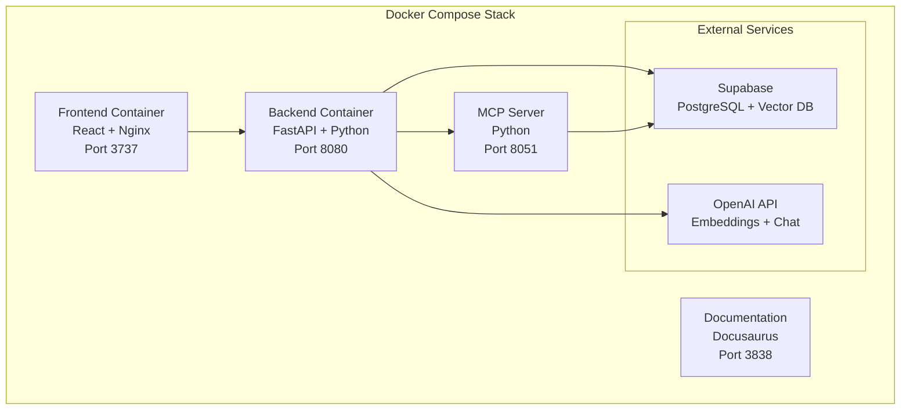

# Deployment Guide

Archon is designed as a containerized application using Docker and Docker Compose. This guide covers deployment options from local development to production environments.

## 🐳 Docker Container Architecture



## 🚀 Quick Start

### Prerequisites

- Docker and Docker Compose installed
- Git for cloning the repository
- API keys for external services

### Environment Setup

1. **Clone the repository:**
```bash
git clone <repository-url>
cd mcp-crawl4ai-rag
```

2. **Create environment file:**
```bash
cp .env.example .env
```

3. **Configure environment variables:**
```bash
# Required API Keys
OPENAI_API_KEY=your_openai_api_key_here
SUPABASE_URL=your_supabase_project_url
SUPABASE_SERVICE_KEY=your_supabase_service_key

# Optional Configuration
JWT_SECRET_KEY=your_jwt_secret_key
CRAWL4AI_API_KEY=your_crawl4ai_key  # Optional
```

4. **Start the application:**
```bash
docker-compose up -d
```

5. **Access the application:**
- Frontend: http://localhost:3737
- Backend API: http://localhost:8080
- MCP Server: http://localhost:8051
- Documentation: http://localhost:3838

## 📋 Environment Variables

### Required Variables

| Variable | Description | Example |
|----------|-------------|----------|
| `OPENAI_API_KEY` | OpenAI API key for embeddings and chat | `sk-...` |
| `SUPABASE_URL` | Supabase project URL | `https://xxx.supabase.co` |
| `SUPABASE_SERVICE_KEY` | Supabase service role key | `eyJ...` |

### Optional Variables

| Variable | Description | Default |
|----------|-------------|----------|
| `JWT_SECRET_KEY` | Secret key for JWT tokens | Auto-generated |
| `CRAWL4AI_API_KEY` | Crawl4AI service key | None |
| `LOG_LEVEL` | Application log level | `INFO` |
| `MAX_UPLOAD_SIZE` | Maximum file upload size | `50MB` |
| `REDIS_URL` | Redis connection URL | `redis://localhost:6379` |

## 🔧 Docker Compose Configuration

### Development Setup

```yaml
# docker-compose.yml
version: '3.8'

services:
  backend:
    build: .
    ports:
      - "8080:8080"
    environment:
      - OPENAI_API_KEY=${OPENAI_API_KEY}
      - SUPABASE_URL=${SUPABASE_URL}
      - SUPABASE_SERVICE_KEY=${SUPABASE_SERVICE_KEY}
    volumes:
      - ./uploads:/app/uploads
      - ./logs:/app/logs
    restart: unless-stopped

  mcp-server:
    build:
      context: .
      dockerfile: Dockerfile.mcp
    ports:
      - "8051:8051"
    environment:
      - OPENAI_API_KEY=${OPENAI_API_KEY}
      - SUPABASE_URL=${SUPABASE_URL}
      - SUPABASE_SERVICE_KEY=${SUPABASE_SERVICE_KEY}
    depends_on:
      - backend
    restart: unless-stopped

  frontend:
    build:
      context: ./archon-ui-main
      dockerfile: Dockerfile
    ports:
      - "3737:80"
    environment:
      - VITE_API_BASE_URL=http://localhost:8080
      - VITE_MCP_BASE_URL=http://localhost:8051
    depends_on:
      - backend
    restart: unless-stopped

  docs:
    build:
      context: ./docs
      dockerfile: Dockerfile
    ports:
      - "3838:3000"
    restart: unless-stopped
```

### Production Setup

```yaml
# docker-compose.prod.yml
version: '3.8'

services:
  backend:
    build: .
    ports:
      - "8080:8080"
    environment:
      - ENVIRONMENT=production
      - OPENAI_API_KEY=${OPENAI_API_KEY}
      - SUPABASE_URL=${SUPABASE_URL}
      - SUPABASE_SERVICE_KEY=${SUPABASE_SERVICE_KEY}
      - JWT_SECRET_KEY=${JWT_SECRET_KEY}
    volumes:
      - ./uploads:/app/uploads
      - ./logs:/app/logs
    restart: always
    healthcheck:
      test: ["CMD", "curl", "-f", "http://localhost:8080/health"]
      interval: 30s
      timeout: 10s
      retries: 3

  mcp-server:
    build:
      context: .
      dockerfile: Dockerfile.mcp
    ports:
      - "8051:8051"
    environment:
      - ENVIRONMENT=production
      - OPENAI_API_KEY=${OPENAI_API_KEY}
      - SUPABASE_URL=${SUPABASE_URL}
      - SUPABASE_SERVICE_KEY=${SUPABASE_SERVICE_KEY}
    depends_on:
      - backend
    restart: always
    healthcheck:
      test: ["CMD", "curl", "-f", "http://localhost:8051/health"]
      interval: 30s
      timeout: 10s
      retries: 3

  frontend:
    build:
      context: ./archon-ui-main
      dockerfile: Dockerfile.prod
    ports:
      - "3737:80"
    environment:
      - VITE_API_BASE_URL=${API_BASE_URL:-http://localhost:8080}
      - VITE_MCP_BASE_URL=${MCP_BASE_URL:-http://localhost:8051}
    depends_on:
      - backend
    restart: always

  nginx:
    image: nginx:alpine
    ports:
      - "80:80"
      - "443:443"
    volumes:
      - ./nginx.conf:/etc/nginx/nginx.conf
      - ./ssl:/etc/nginx/ssl
    depends_on:
      - frontend
      - backend
    restart: always
```

## 🌐 Production Deployment

### Server Requirements

- **CPU**: 2+ cores recommended
- **RAM**: 4GB+ recommended
- **Storage**: 20GB+ for application and logs
- **Network**: Stable internet connection for API calls

### Deployment Steps

1. **Prepare the server:**
```bash
# Update system
sudo apt update && sudo apt upgrade -y

# Install Docker
curl -fsSL https://get.docker.com -o get-docker.sh
sudo sh get-docker.sh

# Install Docker Compose
sudo curl -L "https://github.com/docker/compose/releases/latest/download/docker-compose-$(uname -s)-$(uname -m)" -o /usr/local/bin/docker-compose
sudo chmod +x /usr/local/bin/docker-compose
```

2. **Deploy the application:**
```bash
# Clone repository
git clone <repository-url>
cd mcp-crawl4ai-rag

# Set up environment
cp .env.example .env
nano .env  # Configure your API keys

# Start production stack
docker-compose -f docker-compose.prod.yml up -d
```

3. **Verify deployment:**
```bash
# Check container status
docker-compose ps

# Check logs
docker-compose logs -f archon-pyserver
docker-compose logs -f frontend
docker-compose logs -f docs

# Test health endpoints
curl http://localhost:8080/health
curl http://localhost:8051/health
```

## 🔍 Monitoring and Maintenance

### Health Checks

```bash
# Check application health
curl http://localhost:8080/health
curl http://localhost:8051/health

# Check container status
docker-compose ps

# View resource usage
docker stats
```

### Log Management

```bash
# View logs
docker-compose logs -f archon-pyserver
docker-compose logs -f frontend
docker-compose logs -f docs

# Log rotation (add to crontab)
0 2 * * * docker system prune -f
```

### Backup Strategy

```bash
#!/bin/bash
# backup.sh

# Backup uploads directory
tar -czf uploads-backup-$(date +%Y%m%d).tar.gz uploads/

# Backup environment configuration
cp .env env-backup-$(date +%Y%m%d)

# Upload to cloud storage (optional)
# aws s3 cp uploads-backup-$(date +%Y%m%d).tar.gz s3://your-backup-bucket/
```

### Updates and Maintenance

```bash
# Update application
git pull origin main
docker-compose build
docker-compose up -d

# Clean up old images
docker image prune -f

# Update system packages
sudo apt update && sudo apt upgrade -y
```

## 🐛 Troubleshooting

### Common Issues

**Container won't start:**
```bash
# Check logs for errors
docker-compose logs archon-pyserver

# Verify environment variables
docker-compose config

# Check port conflicts
sudo netstat -tulpn | grep :8080
```

**API connection issues:**
```bash
# Test API connectivity
curl -v http://localhost:8080/health

# Check firewall settings
sudo ufw status

# Verify network connectivity
docker network ls
docker network inspect mcp-crawl4ai-rag_default
```

**Performance issues:**
```bash
# Monitor resource usage
docker stats

# Check disk space
df -h

# Monitor logs for errors
tail -f logs/app.log
```

### Recovery Procedures

**Complete restart:**
```bash
docker-compose down
docker-compose up -d
```

**Reset application data:**
```bash
docker-compose down -v
docker-compose up -d
```

**Rollback to previous version:**
```bash
git checkout <previous-commit>
docker-compose build
docker-compose up -d
```

## 🔒 Security Considerations

### Environment Security

- Store sensitive environment variables securely
- Use strong JWT secret keys
- Regularly rotate API keys
- Limit file upload sizes and types
- Enable firewall rules for production

### Container Security

```bash
# Run security scan
docker scan archon-pyserver:latest

# Update base images regularly
docker pull python:3.11-slim
docker pull node:18-alpine
```

### Network Security

```bash
# Configure firewall
sudo ufw allow 22    # SSH
sudo ufw allow 80    # HTTP
sudo ufw allow 443   # HTTPS
sudo ufw enable
```

---

**Next Steps:**
- Explore [Testing](./testing) for quality assurance
- Learn about [API Reference](./api-reference) for integration
- Check [Server Architecture](./server) for system details
