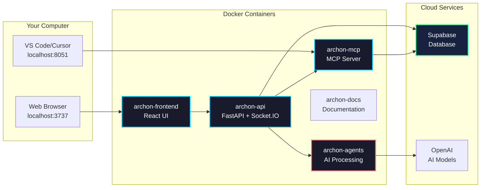

import Tabs from '@theme/Tabs';
import TabItem from '@theme/TabItem';
import Admonition from '@theme/Admonition';

# Deployment

## Quick Start

<Admonition type="tip" title="Prerequisites">
- Docker and Docker Compose installed
- Supabase account (free tier works)
- Git for cloning the repository
</Admonition>

### 1. Clone & Setup

```bash
# Clone repository
git clone <repository-url>
cd archon

# Create environment file
cp .env.example .env
```

### 2. Configure

Edit `.env` with your credentials:

```bash
SUPABASE_URL=https://your-project.supabase.co
SUPABASE_SERVICE_KEY=eyJ0eXAi...
```

### 3. Launch

```bash
# Start all services
docker-compose up -d

# Check status
docker-compose ps
```

### 4. Access

- **UI**: http://localhost:3737
- **API Docs**: http://localhost:8080/docs
- **Documentation**: http://localhost:3838

## Service Architecture



## Common Commands

<Tabs>
<TabItem value="basic" label="Basic Operations">

```bash
# Start services
docker-compose up -d

# Stop services
docker-compose down

# View logs
docker-compose logs -f

# Restart a service
docker-compose restart archon-frontend
```

</TabItem>
<TabItem value="troubleshooting" label="Troubleshooting">

```bash
# Check container status
docker ps

# View service logs
docker logs archon-api
docker logs archon-mcp
docker logs archon-agents

# Rebuild after changes
docker-compose build
docker-compose up -d

# Complete reset
docker-compose down -v
docker-compose up -d --build
```

</TabItem>
</Tabs>

## Production Deployment

<Admonition type="info" title="Cloud Deployment">
For production deployments, consider:
- Using a reverse proxy (nginx/Caddy)
- Setting up SSL certificates
- Configuring environment-specific settings
- Using managed databases
</Admonition>

### Docker Compose Production

```yaml
# docker-compose.prod.yml
services:
  archon-api:
    image: your-registry/archon-api:latest
    environment:
      - ENVIRONMENT=production
      - LOG_LEVEL=WARNING
    deploy:
      replicas: 2
      resources:
        limits:
          cpus: '2.0'
          memory: 2G

  archon-mcp:
    image: your-registry/archon-mcp:latest
    environment:
      - ENVIRONMENT=production
      - LOG_LEVEL=WARNING
    deploy:
      resources:
        limits:
          cpus: '1.0'
          memory: 1G

  archon-agents:
    image: your-registry/archon-agents:latest
    environment:
      - ENVIRONMENT=production
    deploy:
      replicas: 2
      resources:
        limits:
          cpus: '4.0'
          memory: 4G

  archon-frontend:
    image: your-registry/archon-frontend:latest
    deploy:
      replicas: 2
      resources:
        limits:
          memory: 512M
```

## Database Management

### Reset Database

<Admonition type="warning" title="Data Loss Warning">
This will delete ALL data in your database!
</Admonition>

```sql
-- Run in Supabase SQL editor
-- migration/RESET_DB.sql
```

### Backup Data

```bash
# Export data before reset
pg_dump -h your-db-host -U postgres -d postgres > backup.sql
```

## Monitoring

### Health Checks

```bash
# API Health
curl http://localhost:8080/health

# Check all services
echo "Frontend: http://localhost:3737"
curl -s http://localhost:3737 > /dev/null && echo "✓ Running" || echo "✗ Not running"

echo "API: http://localhost:8080/health"
curl -s http://localhost:8080/health | jq '.status' || echo "✗ Not running"

echo "MCP: http://localhost:8051/sse"
curl -s http://localhost:8051/sse > /dev/null && echo "✓ Running" || echo "✗ Not running"

echo "Agents: http://localhost:8052/health"
curl -s http://localhost:8052/health | jq '.status' || echo "✗ Not running"
```

### Container Resources

```bash
# View resource usage
docker stats

# Check disk usage
docker system df
```

## Next Steps

<Admonition type="success" title="Ready to Go!">
Your Archon instance is now running. Next:

1. **Set up API keys** in Settings
2. **Configure MCP** for AI agents
3. **Start crawling** knowledge sources
4. **Create projects** and tasks
</Admonition> 