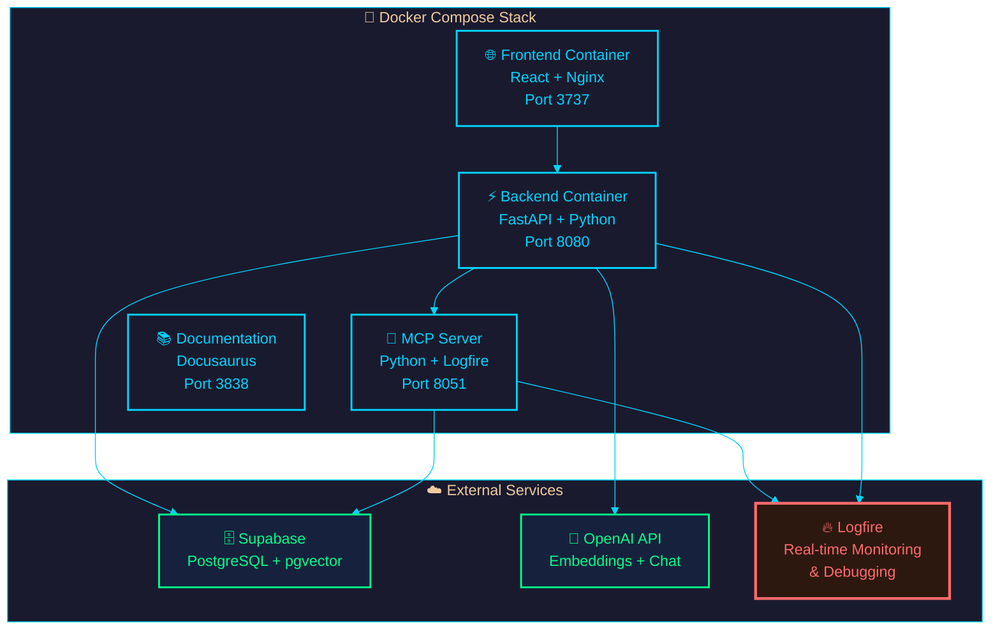

import Tabs from '@theme/Tabs';
import TabItem from '@theme/TabItem';
import Admonition from '@theme/Admonition';

# 🚀 Deployment & Real-Time Monitoring

<div className="hero hero--primary">
  <div className="container">
    <h2 className="hero__subtitle">
      **Production-ready deployment** with Docker, comprehensive monitoring via Logfire, and seamless scaling options
    </h2>
  </div>
</div>

Archon is designed as a containerized application using Docker and Docker Compose with **integrated Logfire monitoring**. This guide covers everything from local development to production deployments with full observability.

## 🏗️ Architecture Overview



## ⚡ Quick Start

<Tabs>
<TabItem value="development" label="🛠️ Development" default>

### Prerequisites
- **Docker** and **Docker Compose** installed
- **Git** for repository cloning
- **API keys** for external services

### Step-by-Step Setup

**1. Clone & Navigate**
```bash
git clone <repository-url>
cd archon
```

**2. Environment Configuration**
```bash
cp .env.example .env
```

**3. Configure Required Variables**
```bash
# Essential API Keys
OPENAI_API_KEY=sk-your_openai_key_here
SUPABASE_URL=https://your-project.supabase.co
SUPABASE_SERVICE_KEY=eyJ0eXAiOiJKV1QiLCJhbGciOiJIUzI1NiJ9...

# Logfire Monitoring (Recommended)
LOGFIRE_TOKEN=your_logfire_token_here
LOGFIRE_SERVICE_NAME=archon-dev
LOGFIRE_PROJECT_NAME=archon-development
```

**4. Launch Application**
```bash
docker-compose up -d
```

**5. Verify Deployment**
- 🌐 **Frontend**: http://localhost:3737
- ⚡ **Backend API**: http://localhost:8080/docs
- 🔧 **MCP Server**: http://localhost:8051/health
- 📚 **Documentation**: http://localhost:3838

</TabItem>
<TabItem value="production" label="🏭 Production">

### Production Deployment

**1. Environment Setup**
```bash
# Production environment file
cp .env.production.example .env.production
```

**2. Production Configuration**
```bash
# Required Production Variables
ENVIRONMENT=production
OPENAI_API_KEY=sk-your_production_key
SUPABASE_URL=https://your-prod-project.supabase.co
SUPABASE_SERVICE_KEY=your_production_service_key
JWT_SECRET_KEY=your_super_secure_jwt_secret

# Logfire Production Monitoring
LOGFIRE_TOKEN=your_production_logfire_token
LOGFIRE_SERVICE_NAME=archon-production
LOGFIRE_PROJECT_NAME=archon-prod
LOGFIRE_ENVIRONMENT=production

# Security & Performance
MAX_UPLOAD_SIZE=100MB
LOG_LEVEL=WARNING
ENABLE_CORS=false
```

**3. Production Deployment**
```bash
docker-compose -f docker-compose.prod.yml up -d
```

</TabItem>
</Tabs>

## 🔥 Logfire Integration & Monitoring

<Admonition type="tip" icon="🔥" title="New Feature: Real-Time Monitoring">
Archon now includes **comprehensive Logfire integration** for real-time debugging, performance monitoring, and complete request tracing across all components.
</Admonition>

### Key Monitoring Capabilities

- **🎯 RAG Query Debugging**: Real-time vector search performance and result analysis
- **📊 MCP Server Health**: Tool execution times, connection status, and error tracking
- **🔍 WebSocket Monitoring**: Live progress tracking and connection health
- **⚡ FastAPI Performance**: Complete request lifecycle with timing details
- **🧠 AI Agent Interactions**: Monitor all MCP tool calls and responses

### Logfire Configuration

<Tabs>
<TabItem value="setup" label="🔧 Setup">

**1. Create Logfire Account**
- Visit [logfire.pydantic.dev](https://logfire.pydantic.dev/)
- Create account and project
- Generate API token

**2. Environment Variables**
```bash
# Logfire Configuration
LOGFIRE_TOKEN=your_logfire_api_token
LOGFIRE_SERVICE_NAME=archon-mcp-server
LOGFIRE_PROJECT_NAME=archon
LOGFIRE_ENVIRONMENT=development  # or production
```

**3. Dashboard Access**
Your monitoring dashboard will be available at:
`https://logfire-us.pydantic.dev/your-username/your-project`

</TabItem>
<TabItem value="features" label="📊 Features">

### Monitoring Dashboard Features

**Real-Time RAG Debugging**
- Vector embedding generation timing
- Similarity search performance metrics
- Result ranking and filtering analysis
- Source document identification

**MCP Server Performance**
- Tool execution latency tracking
- Connection health monitoring
- Error rate analysis and alerting
- WebSocket connection stability

**Request Tracing**
- Complete FastAPI request lifecycle
- Database query performance
- External API call monitoring
- Error propagation tracking

</TabItem>
</Tabs>

## 📋 Environment Variables Reference

<Tabs>
<TabItem value="required" label="✅ Required">

| Variable | Description | Example |
|----------|-------------|----------|
| `OPENAI_API_KEY` | OpenAI API key for embeddings and chat | `sk-proj-...` |
| `SUPABASE_URL` | Supabase project URL | `https://xxx.supabase.co` |
| `SUPABASE_SERVICE_KEY` | Supabase service role key | `eyJ0eXAiOiJKV1Qi...` |

</TabItem>
<TabItem value="monitoring" label="🔥 Monitoring">

| Variable | Description | Default |
|----------|-------------|----------|
| `LOGFIRE_TOKEN` | **Logfire API token for monitoring** | - |
| `LOGFIRE_SERVICE_NAME` | Service identifier in Logfire | `archon-mcp-server` |
| `LOGFIRE_PROJECT_NAME` | Project name in Logfire | `archon` |
| `LOGFIRE_ENVIRONMENT` | Environment tag | `development` |

</TabItem>
<TabItem value="optional" label="⚙️ Optional">

| Variable | Description | Default |
|----------|-------------|----------|
| `JWT_SECRET_KEY` | Secret key for JWT tokens | Auto-generated |
| `LOG_LEVEL` | Application log level | `INFO` |
| `MAX_UPLOAD_SIZE` | Maximum file upload size | `50MB` |
| `FRONTEND_PORT` | Frontend application port | `3737` |
| `BACKEND_PORT` | Backend API port | `8080` |
| `MCP_PORT` | MCP server port | `8051` |
| `ENABLE_CORS` | Enable CORS middleware | `true` |

</TabItem>
</Tabs>

## 🐳 Docker Compose Configurations

<Tabs>
<TabItem value="development" label="🛠️ Development">

```yaml title="docker-compose.yml"
version: '3.8'

services:
  backend:
    build: .
    ports:
      - "${BACKEND_PORT:-8080}:8080"
      - "${MCP_PORT:-8051}:8051"
    environment:
      # Core Configuration
      - SUPABASE_URL=${SUPABASE_URL}
      - SUPABASE_SERVICE_KEY=${SUPABASE_SERVICE_KEY}
      - OPENAI_API_KEY=${OPENAI_API_KEY:-}
      
      # Logfire Monitoring
      - LOGFIRE_TOKEN=${LOGFIRE_TOKEN:-}
      - LOGFIRE_SERVICE_NAME=${LOGFIRE_SERVICE_NAME:-archon-mcp-server}
      - LOGFIRE_PROJECT_NAME=${LOGFIRE_PROJECT_NAME:-archon}
      - LOGFIRE_ENVIRONMENT=${LOGFIRE_ENVIRONMENT:-development}
      
      # Optional Configuration
      - LOG_LEVEL=${LOG_LEVEL:-INFO}
      - MAX_UPLOAD_SIZE=${MAX_UPLOAD_SIZE:-50MB}
    volumes:
      - ./uploads:/app/uploads
      - ./logs:/app/logs
    restart: unless-stopped
    healthcheck:
      test: ["CMD", "curl", "-f", "http://localhost:8080/health"]
      interval: 30s
      timeout: 10s
      retries: 3

  frontend:
    build:
      context: ./archon-ui-main
      dockerfile: Dockerfile
    ports:
      - "${FRONTEND_PORT:-3737}:80"
    environment:
      - VITE_API_BASE_URL=http://localhost:${BACKEND_PORT:-8080}
      - VITE_MCP_BASE_URL=http://localhost:${MCP_PORT:-8051}
    depends_on:
      - backend
    restart: unless-stopped

  docs:
    build:
      context: ./docs
      dockerfile: Dockerfile
    ports:
      - "3838:3000"
    restart: unless-stopped
```

</TabItem>
<TabItem value="production" label="🏭 Production">

```yaml title="docker-compose.prod.yml"
version: '3.8'

services:
  backend:
    build: .
    ports:
      - "${BACKEND_PORT:-8080}:8080"
      - "${MCP_PORT:-8051}:8051"
    environment:
      # Environment
      - ENVIRONMENT=production
      
      # Core Configuration
      - SUPABASE_URL=${SUPABASE_URL}
      - SUPABASE_SERVICE_KEY=${SUPABASE_SERVICE_KEY}
      - OPENAI_API_KEY=${OPENAI_API_KEY}
      - JWT_SECRET_KEY=${JWT_SECRET_KEY}
      
      # Logfire Production Monitoring
      - LOGFIRE_TOKEN=${LOGFIRE_TOKEN}
      - LOGFIRE_SERVICE_NAME=${LOGFIRE_SERVICE_NAME:-archon-production}
      - LOGFIRE_PROJECT_NAME=${LOGFIRE_PROJECT_NAME:-archon-prod}
      - LOGFIRE_ENVIRONMENT=production
      
      # Production Settings
      - LOG_LEVEL=${LOG_LEVEL:-WARNING}
      - MAX_UPLOAD_SIZE=${MAX_UPLOAD_SIZE:-100MB}
      - ENABLE_CORS=${ENABLE_CORS:-false}
    volumes:
      - ./uploads:/app/uploads
      - ./logs:/app/logs
    restart: always
    healthcheck:
      test: ["CMD", "curl", "-f", "http://localhost:8080/health"]
      interval: 30s
      timeout: 10s
      retries: 3
    deploy:
      resources:
        limits:
          cpus: '2.0'
          memory: 2G
        reservations:
          cpus: '1.0'
          memory: 1G

  frontend:
    build:
      context: ./archon-ui-main
      dockerfile: Dockerfile
    ports:
      - "${FRONTEND_PORT:-3737}:80"
    environment:
      - VITE_API_BASE_URL=${API_BASE_URL:-http://localhost:8080}
      - VITE_MCP_BASE_URL=${MCP_BASE_URL:-http://localhost:8051}
    depends_on:
      - backend
    restart: always
    deploy:
      resources:
        limits:
          cpus: '1.0'
          memory: 512M
```

</TabItem>
</Tabs>

## 🔍 Health Checks & Monitoring

### Endpoint Health Verification

<Admonition type="info" icon="💡" title="Quick Health Check">
After deployment, verify all services are running correctly:
</Admonition>

```bash
# Backend API Health
curl http://localhost:8080/health

# MCP Server Health  
curl http://localhost:8051/health

# Frontend Accessibility
curl http://localhost:3737

# Logfire Integration Status
# Check your Logfire dashboard for real-time data
```

### Troubleshooting Common Issues

<Tabs>
<TabItem value="connection" label="🔌 Connection Issues">

**MCP Server Connection Failed**
```bash
# Check container status
docker-compose ps

# Check MCP server logs
docker-compose logs backend

# Verify environment variables
docker-compose exec backend env | grep -E "(SUPABASE|OPENAI|LOGFIRE)"
```

</TabItem>
<TabItem value="logfire" label="🔥 Logfire Issues">

**Logfire Authentication Errors**
```bash
# Verify token is set
echo $LOGFIRE_TOKEN

# Check logfire integration in logs
docker-compose logs backend | grep -i logfire

# Test logfire connection
docker-compose exec backend python -c "import logfire; print('Logfire OK')"
```

</TabItem>
<TabItem value="performance" label="⚡ Performance">

**Slow RAG Queries**
- Check Logfire dashboard for vector search timing
- Monitor Supabase connection performance
- Verify OpenAI API response times
- Check memory and CPU usage in containers

</TabItem>
</Tabs>

## 🔐 Security Considerations

<Admonition type="warning" icon="🛡️" title="Production Security">
Ensure proper security measures for production deployments:
</Admonition>

- **Environment Variables**: Never commit API keys to version control
- **JWT Secrets**: Use strong, unique JWT secret keys
- **Network Security**: Configure proper firewall rules
- **CORS Settings**: Disable CORS in production or configure allowed origins
- **Logfire Data**: Review data retention and privacy settings
- **Container Security**: Keep Docker images updated and scan for vulnerabilities

## 📈 Scaling & Performance

### Horizontal Scaling Options

- **Load Balancing**: Use nginx or cloud load balancers
- **Container Orchestration**: Deploy with Kubernetes for auto-scaling
- **Database Scaling**: Utilize Supabase connection pooling
- **Monitoring**: Leverage Logfire metrics for scaling decisions

### Performance Optimization

- **Resource Limits**: Configure appropriate CPU and memory limits
- **Caching**: Implement Redis for frequently accessed data
- **CDN**: Use CDN for static frontend assets
- **Database Indexing**: Optimize vector search performance in Supabase 