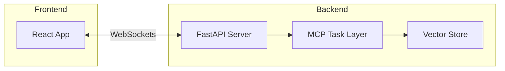

# Getting Started

Welcome to the **mcp-crawl4ai-rag** documentation. This guide will help you install, configure, and run the project.

## Prerequisites

- Docker & Docker Compose
- Node.js >=14
- Python 3.9+

## Installation

```bash
git clone https://github.com/your-org/mcp-crawl4ai-rag.git
cd mcp-crawl4ai-rag
npm install --prefix archon-ui-main
pip install -r requirements.txt
```

## Running the Project

```bash
docker compose up -d
# Services:
# - backend: FastAPI + MCP
# - frontend: React WebSocket UI
# - vector-store: Elasticsearch
```

## Architecture Overview


