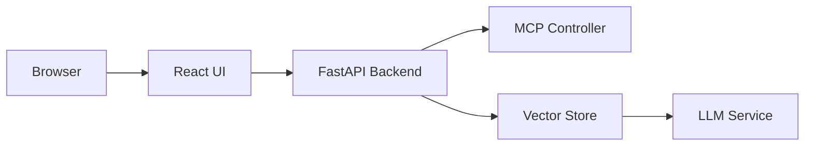

# Getting Started

Welcome to **Crawl4AI RAG**, a powerful Retrieval-Augmented Generation system integrated with a Modular Control Plane (MCP) for task orchestration.

## Prerequisites

- Git >= 2.25.0
- Docker & Docker Compose >= 1.27.0
- Node.js >= 18.x
- Python 3.10+

## Clone the Repository

```bash
git clone https://github.com/your-org/mcp-crawl4ai-rag.git
cd mcp-crawl4ai-rag
git checkout feature/docusauraus
```

## Project Structure

```bash
tree -L 2 .
```

```text
.
├── src/                   # Python server source code
├── archon-ui-main/        # React (Vite) frontend
├── docs/                  # Docusaurus site folder
│   └── docs/              # Markdown content
├── docker-compose.yml     # Development services
└── Dockerfile             # Server Dockerfile
```

## Environment Variables

| Variable                  | Description                                   | Default                   |
|---------------------------|-----------------------------------------------|---------------------------|
| SUPABASE_URL              | Supabase API endpoint                         | –                         |
| SUPABASE_SERVICE_KEY      | Supabase service role key                     | –                         |
| HOST                      | Backend host                                  | `localhost`               |
| PORT                      | Backend port                                  | `8051`                    |
| VITE_API_URL              | Frontend API URL                              | `http://localhost:8080`   |

## Running Locally

```bash
docker-compose up --build
```

- Backend API: http://localhost:8080
- Frontend UI: http://localhost:3737
- Documentation: http://localhost:3838

## Architecture Diagram



For details on server setup, see the [Server documentation](server), and for frontend usage, see the [UI documentation](ui).
