import Tabs from '@theme/Tabs';
import TabItem from '@theme/TabItem';
import Admonition from '@theme/Admonition';

# 🚀 Getting Started with Archon

<div className="hero hero--primary">
  <div className="container">
    <h2 className="hero__subtitle">
      **Complete setup guide** from zero to fully operational AI knowledge engine with real-time monitoring
    </h2>
  </div>
</div>

This comprehensive guide will walk you through setting up Archon from scratch, configuring all components including **Logfire monitoring**, and getting your first knowledge base operational with the RAG system.

<Admonition type="tip" icon="🎯" title="What You'll Build">
By the end of this guide, you'll have a **fully operational Archon system** with:
- ✅ **25 MCP tools** enabled and working
- 🔥 **Real-time Logfire monitoring** and debugging
- 🧠 **RAG system** for intelligent knowledge retrieval
- 🌐 **Modern UI** for project and task management
</Admonition>

## ⚡ Quick Start

<Admonition type="info" icon="🚀" title="Fast Track Setup">
Already familiar with Docker and APIs? Follow this quickstart to get Archon running in under 10 minutes.
</Admonition>

### Prerequisites
- **[Docker Desktop](https://www.docker.com/products/docker-desktop/)** installed and running
- **[Supabase](https://supabase.com/)** account (free tier works perfectly)
- **[OpenAI API key](https://platform.openai.com/api-keys)** for embeddings

### 1. Clone & Setup

```bash
git clone https://github.com/coleam00/archon.git
cd archon

# Create environment file
cp .env.example .env
```

### 2. Configure Environment

Edit `.env` and add your credentials:

```bash
# Required
SUPABASE_URL=https://your-project.supabase.co
SUPABASE_SERVICE_KEY=your-service-key-here

# Optional (but recommended for monitoring)
LOGFIRE_TOKEN=your-logfire-token-here
```

### 3. Set Up Database

1. **Create a new [Supabase project](https://supabase.com/dashboard)**
2. **In SQL Editor, run these scripts in order:**
   - `migration/initial_setup.sql` (creates vector database, credentials, and core tables)
   - `migration/archon_tasks.sql` (creates project and task management tables)

### 4. Start Archon

```bash
docker-compose up -d
```

### 5. Access & Configure

| Service | URL | Purpose |
|---------|-----|---------|
| **🌐 Web Interface** | http://localhost:3737 | Main dashboard and controls |
| **📚 Documentation** | http://localhost:3838 | Complete setup and usage guides |
| **⚡ API Docs** | http://localhost:8080/docs | FastAPI documentation |

1. **Open the Web Interface** (http://localhost:3737)
2. **Go to Settings** and add your OpenAI API key
3. **Start the MCP server** from the MCP Dashboard
4. **Get connection details** for your AI client

<Admonition type="success" icon="🎉" title="You're Ready!">
Your Archon system is now running with **25 MCP tools** available. Continue below for detailed configuration and advanced features.
</Admonition>

---

## 📖 Detailed Setup Guide

## 📋 Prerequisites & Setup Overview

### Required Software & Accounts

<Tabs>
<TabItem value="software" label="💻 Software" default>

**Essential Tools**
- **[Docker Desktop](https://www.docker.com/products/docker-desktop/)** (v4.0+)
- **[Git](https://git-scm.com/)** for repository cloning
- **Modern Web Browser** (Chrome, Firefox, Safari, Edge)

**System Requirements**
- **RAM**: 4GB minimum, **8GB recommended**
- **Storage**: 2GB free space
- **Network**: Stable internet for setup and API calls

</TabItem>
<TabItem value="accounts" label="🔑 Accounts & Keys">

**Required Services**
- **[Supabase Account](https://supabase.com/)** (free tier sufficient)
- **[OpenAI API Account](https://platform.openai.com/api-keys)** for embeddings
- **[Logfire Account](https://logfire.pydantic.dev/)** for monitoring (optional but recommended)

**API Key Costs (Approximate)**
- **OpenAI**: ~$0.10-$1.00 for initial testing and crawling
- **Supabase**: Free tier covers development needs
- **Logfire**: Free tier includes comprehensive monitoring

</TabItem>
</Tabs>

### Architecture Overview

```mermaid
graph TB
    subgraph "🚀 Your Complete Setup"
        UI["🌐 Frontend UI<br/>localhost:3737"]
        API["⚡ FastAPI Backend<br/>localhost:8080"]
        MCP["🔧 MCP Server<br/>localhost:8051<br/>25 Tools Enabled"]
        Docs["📚 Documentation<br/>localhost:3838"]
    end

    subgraph "☁️ External Services"
        Supabase["🗄️ Supabase<br/>PostgreSQL + pgvector"]
        OpenAI["🤖 OpenAI API<br/>Embeddings"]
        Logfire["🔥 Logfire<br/>Real-time Monitoring"]
    end

    UI --> API
    API --> MCP
    MCP --> Supabase
    MCP --> OpenAI
    MCP --> Logfire
    API --> Logfire

    style Logfire fill:#ff6b6b,stroke:#ff4757,stroke-width:3px
    style MCP fill:#4834d4,stroke:#686de0,stroke-width:2px
    style Supabase fill:#00d2d3,stroke:#01a3a4,stroke-width:2px
```



## 🗄️ Step 1: Database Setup (Supabase)

### 1.1 Create Supabase Project

<Tabs>
<TabItem value="create" label="🆕 Create Project" default>

**Create Your Database**

1. **Go to [Supabase Dashboard](https://supabase.com/dashboard)**
2. **Click "New Project"**
3. **Enter Project Details:**
   - **Name**: `archon-knowledge-base`
   - **Database Password**: Generate strong password (save it!)
   - **Region**: Choose closest to your location
4. **Click "Create new project"**
5. **Wait 2-3 minutes** for initialization

</TabItem>
<TabItem value="schema" label="📊 Database Schema">

**Run SQL Scripts in Order**

Navigate to **SQL Editor** in your Supabase dashboard and run these scripts:

**Script 1: Enable Vector Extension**
```sql
-- Enable pgvector for embeddings
CREATE EXTENSION IF NOT EXISTS vector;
CREATE EXTENSION IF NOT EXISTS "pgcrypto";
```

**Script 2: Credentials Table**
```sql
-- API key storage
CREATE TABLE IF NOT EXISTS credentials (
    id SERIAL PRIMARY KEY,
    key_name VARCHAR(255) UNIQUE NOT NULL,
    key_value TEXT NOT NULL,
    created_at TIMESTAMP DEFAULT CURRENT_TIMESTAMP,
    updated_at TIMESTAMP DEFAULT CURRENT_TIMESTAMP
);

-- Default settings
INSERT INTO credentials (key_name, key_value) VALUES 
('openai_api_key', '') ON CONFLICT (key_name) DO NOTHING;
```

**Script 3: Knowledge Base Tables**
```sql
-- Main knowledge storage with vector embeddings
CREATE TABLE IF NOT EXISTS crawled_pages (
    id uuid PRIMARY KEY DEFAULT gen_random_uuid(),
    url text NOT NULL,
    title text,
    content text NOT NULL,
    content_vector vector(1536),
    source text NOT NULL,
    crawled_at timestamp WITH time zone DEFAULT now(),
    chunk_index integer DEFAULT 0,
    metadata jsonb DEFAULT '{}'::jsonb
);

-- Optimize vector searches
CREATE INDEX crawled_pages_content_vector_idx 
ON crawled_pages USING ivfflat (content_vector vector_cosine_ops);
```

</TabItem>
<TabItem value="functions" label="🔧 RPC Functions">

**Script 4: Search Functions**
```sql
-- Vector similarity search function
CREATE OR REPLACE FUNCTION match_crawled_pages(
  query_embedding vector(1536),
  match_count int DEFAULT 5,
  filter jsonb DEFAULT '{}'
)
RETURNS TABLE (
  id uuid,
  url text,
  title text,
  content text,
  source text,
  similarity float
)
LANGUAGE plpgsql
AS $$
BEGIN
  RETURN QUERY
  SELECT
    crawled_pages.id,
    crawled_pages.url,
    crawled_pages.title,
    crawled_pages.content,
    crawled_pages.source,
    1 - (crawled_pages.content_vector <=> query_embedding) AS similarity
  FROM crawled_pages
  WHERE 
    CASE 
      WHEN filter ? 'source' THEN crawled_pages.source = (filter->>'source')
      ELSE true
    END
  ORDER BY crawled_pages.content_vector <=> query_embedding
  LIMIT match_count;
END;
$$;
```

</TabItem>
</Tabs>

### 1.2 Get Connection Details

<Admonition type="info" icon="🔑" title="Required Credentials">
You'll need these values from your Supabase project:
</Admonition>

1. **Go to Settings > API** in your Supabase dashboard
2. **Copy these values:**
   - **Project URL**: `https://xxxxx.supabase.co`
   - **Service Role Key**: `eyJ0eXAiOiJKV1Qi...` (long token)

## 🔥 Step 2: Monitoring Setup (Logfire)

<Tabs>
<TabItem value="create" label="🆕 Create Account" default>

### 2.1 Create Logfire Account

1. **Visit [logfire.pydantic.dev](https://logfire.pydantic.dev/)**
2. **Sign up** with GitHub or email
3. **Create a new project:**
   - **Project Name**: `archon`
   - **Service Name**: `archon-mcp-server`
4. **Generate API Token** and save it securely

</TabItem>
<TabItem value="benefits" label="🎯 Benefits">

### Why Use Logfire?

**Real-Time RAG Debugging**
- Monitor vector search performance
- Track embedding generation timing
- Debug empty result issues instantly

**MCP Server Health**
- Track all 25 tool executions
- Monitor connection stability
- Error tracking and alerting

**Performance Insights**
- Request timing breakdown
- Database query optimization
- API response monitoring

</TabItem>
</Tabs>

## 🐳 Step 3: Clone & Configure

### 3.1 Clone Repository

```bash
# Clone the repository
git clone https://github.com/coleam00/archon.git
cd archon

# Verify directory structure
ls -la
```

### 3.2 Environment Configuration

<Tabs>
<TabItem value="create" label="📝 Create .env File" default>

**Create Environment File**
```bash
# Copy example file
cp .env.example .env

# Edit with your preferred editor
nano .env
# or
code .env
```

**Essential Configuration**
```bash
# 🗄️ Supabase Database
SUPABASE_URL=https://your-project-id.supabase.co
SUPABASE_SERVICE_KEY=eyJ0eXAiOiJKV1Qi...your-service-key

# 🤖 OpenAI API (for embeddings)
OPENAI_API_KEY=sk-proj-...your-openai-key

# 🔥 Logfire Monitoring (Optional but Recommended)
LOGFIRE_TOKEN=your-logfire-token-here
LOGFIRE_SERVICE_NAME=archon-mcp-server
LOGFIRE_PROJECT_NAME=archon
LOGFIRE_ENVIRONMENT=development

# ⚙️ Optional Configuration
FRONTEND_PORT=3737
BACKEND_PORT=8080
MCP_PORT=8051
LOG_LEVEL=INFO
```

</TabItem>
<TabItem value="security" label="🔐 Security Notes">

**Environment Variable Security**

<Admonition type="warning" icon="🛡️" title="Keep Credentials Safe">
- **Never commit** your `.env` file to version control
- **Use strong passwords** for all services
- **Rotate API keys** regularly
- **Review permissions** on service accounts
</Admonition>

**Production Considerations**
- Use separate environment files for different stages
- Implement proper secret management
- Enable audit logging on Supabase
- Configure proper CORS settings

</TabItem>
</Tabs>

## 🚀 Step 4: Launch Archon

### 4.1 Start the Application

<Tabs>
<TabItem value="launch" label="🚀 Launch Command" default>

```bash
# Start all services with Docker Compose
docker-compose up -d

# Monitor startup logs
docker-compose logs -f

# Verify all containers are running
docker-compose ps
```

**Expected Output:**
```
NAME                COMMAND                  SERVICE             STATUS              PORTS
archon-backend-1    "python -m uvicorn ..."  backend             running             0.0.0.0:8080->8080/tcp, 0.0.0.0:8051->8051/tcp
archon-frontend-1   "/docker-entrypoint...."  frontend            running             0.0.0.0:3737->80/tcp
archon-docs-1       "docker-entrypoint.s..."  docs                running             0.0.0.0:3838->3000/tcp
```

</TabItem>
<TabItem value="verify" label="✅ Verification">

### 4.2 Verify Installation

**Check All Services**
```bash
# Backend API Health
curl http://localhost:8080/health

# MCP Server Health  
curl http://localhost:8051/health

# Frontend Accessibility
curl -I http://localhost:3737

# Documentation Site
curl -I http://localhost:3838
```

**Access Points:**
- 🌐 **Frontend UI**: http://localhost:3737
- ⚡ **Backend API**: http://localhost:8080/docs
- 🔧 **MCP Server**: http://localhost:8051/health
- 📚 **Documentation**: http://localhost:3838

</TabItem>
</Tabs>

## 🧠 Step 5: Test RAG System

### 5.1 First Knowledge Base

<Tabs>
<TabItem value="crawl" label="🕷️ Crawl Documentation" default>

**Test with Pydantic AI Docs**

1. **Open Frontend**: http://localhost:3737
2. **Navigate to MCP Page**
3. **Start MCP Server** (should show **25 tools enabled**)
4. **Use Crawl Tool:**

```bash
# Or via curl
curl -X POST http://localhost:8080/api/crawl \
  -H "Content-Type: application/json" \
  -d '{
    "url": "https://ai.pydantic.dev",
    "max_depth": 2
  }'
```

</TabItem>
<TabItem value="query" label="🧠 Test RAG Queries">

**Test RAG System**

```bash
# Test basic RAG query
curl -X POST http://localhost:8080/api/rag/query \
  -H "Content-Type: application/json" \
  -d '{
    "query": "What is Pydantic AI?",
    "match_count": 5
  }'

# Test source-filtered query
curl -X POST http://localhost:8080/api/rag/query \
  -H "Content-Type: application/json" \
  -d '{
    "query": "agent decorators",
    "source": "ai.pydantic.dev",
    "match_count": 3
  }'
```

**Expected Success Response:**
```json
{
  "success": true,
  "results": [
    {
      "content": "Pydantic AI is a Python agent framework...",
      "source": "ai.pydantic.dev",
      "similarity_score": 0.89,
      "url": "https://ai.pydantic.dev/..."
    }
  ]
}
```

</TabItem>
</Tabs>

## 📊 Step 6: Monitor with Logfire

### 6.1 Access Monitoring Dashboard

<Admonition type="success" icon="🔥" title="Real-Time Monitoring Active">
Your Logfire dashboard will show real-time data as you use the system.
</Admonition>

**Dashboard Access:**
1. **Go to**: `https://logfire-us.pydantic.dev/your-username/your-project`
2. **Monitor Real-Time:**
   - RAG query performance
   - MCP tool executions
   - Error tracking and debugging
   - Request timing breakdowns

### 6.2 Key Metrics to Watch

<Tabs>
<TabItem value="performance" label="⚡ Performance" default>

**Query Performance Metrics**
- **Average RAG Query Time**: 200-300ms
- **Embedding Generation**: 80-120ms
- **Vector Search**: 100-150ms
- **MCP Tool Execution**: &lt;100ms

</TabItem>
<TabItem value="health" label="🏥 Health Monitoring">

**System Health Indicators**
- **MCP Connection Status**: Green (25 tools enabled)
- **Database Connection**: Active
- **API Response Rates**: &gt;95% success
- **Error Rate**: &lt;5%

</TabItem>
<TabItem value="debugging" label="🔍 Debugging">

**Common Debug Scenarios**
- **Empty RAG Results**: Check source availability and embeddings
- **Slow Queries**: Monitor database performance and API latency
- **MCP Tool Failures**: Track individual tool execution errors
- **Connection Issues**: Monitor WebSocket and HTTP connection health

</TabItem>
</Tabs>

## 🎯 Step 7: Create Your First Project

### 7.1 Project Management Setup

**Via Frontend UI:**
1. **Open**: http://localhost:3737
2. **Navigate to Projects**
3. **Create New Project:**
   - **Title**: "My First AI Knowledge Base"
   - **Description**: "Learning to use Archon"
4. **Add Tasks** and start organizing your work

**Via MCP Tools:**
```bash
# Create project via API
curl -X POST http://localhost:8080/api/projects \
  -H "Content-Type: application/json" \
  -d '{
    "title": "My First AI Knowledge Base",
    "description": "Learning to use Archon with full monitoring"
  }'
```

## 🔧 Troubleshooting Common Issues

<Tabs>
<TabItem value="container" label="🐳 Container Issues" default>

**Containers Won't Start**
```bash
# Check Docker status
docker --version
docker-compose --version

# Rebuild containers
docker-compose down
docker-compose up --build -d

# Check container logs
docker-compose logs backend
docker-compose logs frontend
```

</TabItem>
<TabItem value="connection" label="🔌 Connection Issues">

**MCP Server Connection Failed**
```bash
# Verify environment variables
docker-compose exec backend env | grep -E "(SUPABASE|OPENAI|LOGFIRE)"

# Check MCP server health
curl http://localhost:8051/health

# Monitor Logfire for connection errors
```

**Database Connection Issues**
- Verify Supabase URL and service key
- Check network connectivity
- Ensure pgvector extension is enabled

</TabItem>
<TabItem value="rag" label="🧠 RAG Issues">

**Empty RAG Results**
**Check Available Sources:**
   ```bash
   curl http://localhost:8080/api/sources
   ```

**Verify Embeddings:**
   - Check OpenAI API key validity
   - Monitor embedding generation in Logfire
   - Verify vector index creation

3. **Test Without Filters:**
   ```bash
   curl -X POST http://localhost:8080/api/rag/query \
     -H "Content-Type: application/json" \
     -d '{"query": "test", "match_count": 1}'
   ```

</TabItem>
</Tabs>

## 🎉 Next Steps

<Admonition type="success" icon="🚀" title="Congratulations!">
You now have a **fully operational Archon system** with real-time monitoring and debugging capabilities!
</Admonition>

### Recommended Next Actions

1. **📚 Crawl More Documentation**
   - Add your favorite technical documentation
   - Try different content types (APIs, tutorials, code repos)

2. **🧪 Experiment with RAG Queries**
   - Test complex technical questions
   - Compare results with and without source filtering

3. **📊 Explore Logfire Dashboard**
   - Monitor query performance over time
   - Set up alerts for critical issues

4. **🛠️ Customize Your Setup**
   - Adjust crawling parameters
   - Configure additional monitoring
   - Integrate with your development workflow

### Advanced Configuration

- **[Deployment Guide](./deployment.mdx)**: Production deployment strategies
- **[RAG Configuration](./rag.mdx)**: Advanced RAG strategies and optimization
- **[MCP Reference](./mcp-reference.mdx)**: Complete MCP tool documentation
- **[API Reference](./api-reference.mdx)**: REST API endpoints and usage

## 💬 Getting Help

**Community Support:**
- **GitHub Issues**: Report bugs and request features
- **Documentation**: Comprehensive guides and references
- **Logfire Dashboard**: Real-time debugging and monitoring

**Monitoring Resources:**
- **Logfire Documentation**: [logfire.pydantic.dev/docs](https://logfire.pydantic.dev/docs)
- **Performance Optimization**: Monitor your dashboard for optimization opportunities
- **Error Tracking**: Use Logfire alerts for proactive issue resolution 