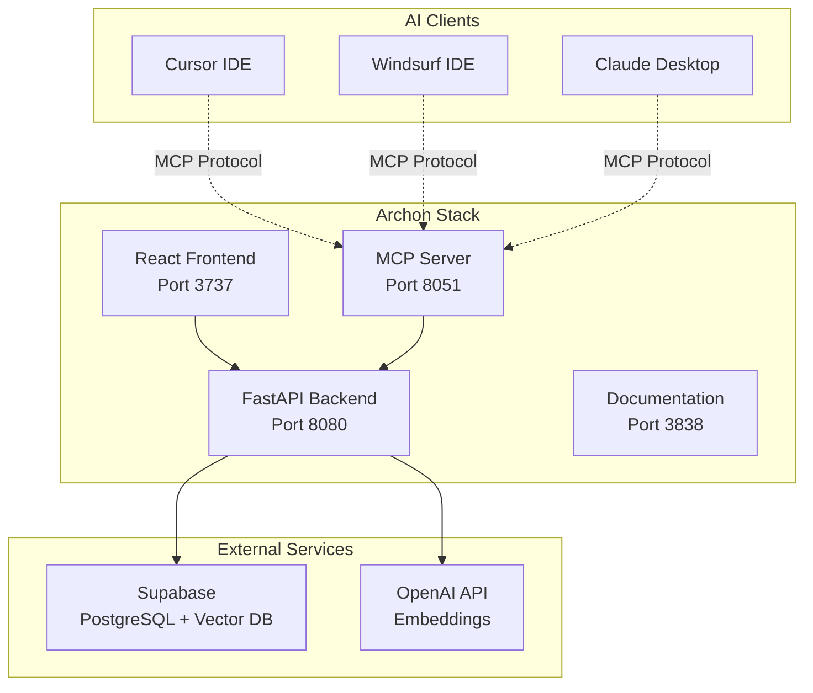

# Welcome to Archon Documentation

  <em>Build Your AI's Knowledge Base with Web Crawling and Document Management</em>

## 🎯 What is Archon?

Archon is a powerful knowledge engine that integrates the [Model Context Protocol (MCP)](https://modelcontextprotocol.io) with [Crawl4AI](https://crawl4ai.com) and [Supabase](https://supabase.com/) to create a centralized knowledge base for your AI agents and coding assistants.

**Connect your Cursor or Windsurf agents to Archon** and give them access to:
- Your technical documentation
- Your business/project documentation  
- Any website content you've crawled
- Uploaded documents (PDFs, Word docs, markdown files)
- A searchable knowledge base with advanced RAG capabilities

With Archon's web interface, you can **manage all your knowledge in one place** - crawl websites, upload documents, organize by type, and even chat with your knowledge base to test queries before your AI agents use them.

## ✨ Key Features

### 📚 Knowledge Management
- **Smart Web Crawling**: Intelligently crawl documentation sites, handling sitemaps, recursive crawling, and various content types
- **Document Upload**: Upload and process PDFs, Word documents, markdown, and text files
- **Organization**: Segment knowledge by technical documentation vs business/project documentation
- **Source Filtering**: RAG queries can filter by specific domains or document sources

### 📄 Document Processing
- **PDF Support**: Dual-engine extraction (PyPDF2 + pdfplumber) for reliable text extraction
- **Word Documents**: Full support for .doc and .docx files via python-docx
- **Markdown & Text**: Direct processing of .md and .txt files
- **Smart Chunking**: Context-aware content chunking preserving structure
- **AI-Generated Metadata**: Automatic title and description generation for uploaded documents

### 🤖 Advanced RAG Capabilities
- **Smart URL Detection**: Automatically detects and handles different URL types (regular webpages, sitemaps, text files)
- **Contextual Embeddings**: Enhanced semantic understanding of technical content
- **Hybrid Search**: Combines vector and keyword search for better results
- **Code Example Extraction**: Special handling for code snippets in documentation
- **Reranking**: Improves result relevance using cross-encoder models

### 🔌 MCP Integration
- **Universal Compatibility**: Works with any MCP-compatible client (Cursor, Windsurf, Claude Desktop, etc.)
- **Dual Transport**: SSE for web clients, stdio for standard MCP clients
- **Easy Connection**: Get connection details directly from the web UI
- **Real-time Access**: Your AI agents get immediate access to newly added knowledge

### 🖥 Web Interface
- **MCP Dashboard**: Monitor server status, view real-time logs, and get connection configuration
- **Server Management**: Start/stop the MCP server with one click, see uptime and status
- **Settings Page**: Configure credentials (OpenAI API key) and RAG strategies through an intuitive UI
- **Crawling Dashboard**: Initiate and monitor web crawling operations
- **Document Management**: Upload and organize your documentation with drag-and-drop interface
- **Knowledge Chat**: Test RAG queries through an interactive chat interface
- **Real-time Log Streaming**: Watch server logs in real-time as operations execute

## 🚀 Quick Start

Ready to get started? Follow our comprehensive setup guide:

👉 **[Getting Started Guide](./getting-started)** - Complete setup from installation to first knowledge base

## 📚 Documentation Sections

| Section | Description |
|---------|-------------|
| **[Getting Started](./getting-started)** | Complete setup guide from prerequisites to first crawl |
| **[MCP Integration](./mcp-reference)** | Connect AI clients like Cursor, Windsurf, Claude Desktop |
| **[API Reference](./api-reference)** | Complete REST API documentation with examples |
| **[WebSocket Communication](./websockets)** | Real-time updates, progress tracking, and troubleshooting |
| **[RAG Strategies](./rag)** | Configure advanced retrieval strategies for optimal performance |
| **[Task Management](./tasks)** | Organize projects and tasks with AI agent integration |
| **[Web Interface](./ui)** | Comprehensive guide to the React frontend |
| **[Server Architecture](./server)** | Technical details about the backend and MCP server |
| **[Testing](./testing)** | Testing strategies and troubleshooting guides |
| **[Deployment](./deployment)** | Production deployment with Docker and scaling |

## 🛠️ Architecture Overview

## 🔮 Real-Time Features

Archon implements comprehensive real-time communication:

- **🔄 Live Progress Tracking**: Real-time updates during crawling operations
- **📡 Server Log Streaming**: WebSocket-based log streaming from MCP server to UI
- **🎯 Progress Callbacks**: Business logic reports progress via callbacks to WebSocket broadcasts
- **🔗 Auto-Reconnection**: Robust connection handling with automatic reconnect on failures
- **📱 Responsive UI Updates**: Instant feedback without polling or page refreshes

📋 **[Complete WebSocket Guide](./server#websocket-communication)** - Implementation patterns and best practices

## 🎯 Next Steps

1. **[Set up Archon](./getting-started)** - Get your knowledge engine running
2. **[Connect your AI client](./mcp-reference)** - Integrate with Cursor, Windsurf, or Claude Desktop  
3. **[Build your knowledge base](./getting-started#building-your-knowledge-base)** - Start crawling and uploading content
4. **[Optimize for your use case](./rag)** - Configure RAG strategies
5. **[Deploy to production](./deployment)** - Scale for team or enterprise use

---

**Transform your AI coding experience with Archon** - *Build once, query everywhere*
