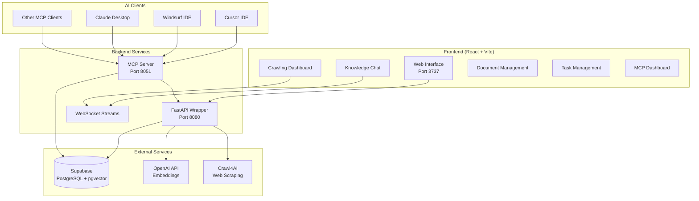

# Archon - Knowledge Engine MCP Server

<div style={{textAlign: 'center'}}>
  <em>Build Your AI's Knowledge Base with Web Crawling and Document Management</em>
</div>

---

## 🎯 What is Archon?

Archon is a powerful knowledge engine that integrates the [Model Context Protocol (MCP)](https://modelcontextprotocol.io) with [Crawl4AI](https://crawl4ai.com) and [Supabase](https://supabase.com/) to create a centralized knowledge base for your AI agents and coding assistants.

**Connect your Cursor or Windsurf agents to Archon** and give them access to:
- Your technical documentation
- Your business/project documentation  
- Any website content you've crawled
- Uploaded documents (PDFs, Word docs, markdown files)
- A searchable knowledge base with advanced RAG capabilities
- Project and task management capabilities

With Archon's web interface, you can **manage all your knowledge in one place** - crawl websites, upload documents, organize by type, manage projects and tasks, and even chat with your knowledge base to test queries before your AI agents use them.

## 🏗️ Architecture Overview



## ✨ Key Features

### 📚 Knowledge Management
- **Web Crawling**: Intelligently crawl documentation sites, handling sitemaps, recursive crawling, and various content types
- **Document Upload**: Upload and process PDFs, Word documents, markdown, and text files
- **Organization**: Segment knowledge by technical documentation vs business/project documentation
- **Source Filtering**: RAG queries can filter by specific domains or document sources

### 📄 Document Processing
- **PDF Support**: Dual-engine extraction (PyPDF2 + pdfplumber) for reliable text extraction
- **Word Documents**: Full support for .doc and .docx files via python-docx
- **Markdown & Text**: Direct processing of .md and .txt files
- **Smart Chunking**: Context-aware content chunking preserving structure
- **AI-Generated Metadata**: Automatic title and description generation for uploaded documents

### 🤖 Advanced RAG Capabilities
- **Smart URL Detection**: Automatically detects and handles different URL types (regular webpages, sitemaps, text files)
- **Contextual Embeddings**: Enhanced semantic understanding of technical content
- **Hybrid Search**: Combines vector and keyword search for better results
- **Code Example Extraction**: Special handling for code snippets in documentation
- **Reranking**: Improves result relevance using cross-encoder models

### 🔌 MCP Integration
- **Universal Compatibility**: Works with any MCP-compatible client (Cursor, Windsurf, Claude Desktop, etc.)
- **Dual Transport**: SSE for web clients, stdio for standard MCP clients
- **Easy Connection**: Get connection details directly from the web UI
- **Real-time Access**: Your AI agents get immediate access to newly added knowledge

### 📋 Project & Task Management (Archon)
- **Project Organization**: Structured project management with PRDs, features, and documentation
- **Task Hierarchy**: Support for parent-child task relationships
- **Status Tracking**: Todo, Doing, Blocked, Done status management
- **MCP Integration**: AI agents can create, update, and query tasks autonomously
- **Reference Management**: Link tasks to code examples and documentation sources

### 🖥 Web Interface
- **MCP Dashboard**: Monitor server status, view real-time logs, and get connection configuration
- **Server Management**: Start/stop the MCP server with one click, see uptime and status
- **Settings Page**: Configure credentials (OpenAI API key) and RAG strategies through an intuitive UI
- **Crawling Dashboard**: Initiate and monitor web crawling operations
- **Document Management**: Upload and organize your documentation with drag-and-drop interface
- **Knowledge Chat**: Test RAG queries through an interactive chat interface
- **Task Management**: Create and manage projects and tasks with a modern interface
- **Real-time Log Streaming**: Watch server logs in real-time as operations execute

## 🚀 Quick Start

### Prerequisites

- [Docker/Docker Desktop](https://www.docker.com/products/docker-desktop/)
- [Supabase](https://supabase.com/) account (free tier works great)
- [OpenAI API key](https://platform.openai.com/api-keys) for embeddings

### Setup Process

1. **Clone Archon**:
   ```bash
   git clone https://github.com/coleam00/archon.git
   cd archon
   ```

2. **Set up Supabase Database**:
   - Create a new Supabase project (or use existing)
   - Go to SQL Editor in your Supabase dashboard
   - Run `credentials_setup.sql` first (creates settings storage)
   - Run `crawled_pages.sql` second (creates vector database)
   - Run `supabase_archon.sql` third (creates task management tables)

3. **Configure Environment**:
   ```bash
   cp .env-doc.md .env
   # Edit .env and add only these two values:
   # SUPABASE_URL=your_supabase_project_url
   # SUPABASE_SERVICE_KEY=your_supabase_service_key
   ```

4. **Launch with Docker**:
   ```bash
   docker-compose up -d
   ```

5. **Access the Interface**:
   - Open http://localhost:3737 in your browser
   - Configure your OpenAI API key in Settings
   - Start crawling or uploading documents!

## 📖 Documentation Structure

This documentation is organized into the following sections:

- **[Getting Started](./getting-started)** - Detailed setup and configuration guide
- **[Server Architecture](./server)** - Backend FastAPI server and Docker container details
- **[API Reference](./api-reference)** - Complete REST API documentation
- **[MCP Integration](./mcp-reference)** - Model Context Protocol server implementation
- **[Task Management](./tasks)** - Archon project and task management system
- **[RAG System](./rag)** - Retrieval-Augmented Generation features and strategies
- **[User Interface](./ui)** - Frontend React application and WebSocket communication
- **[Testing](./testing)** - Testing strategies and examples
- **[Deployment](./deployment)** - Production deployment guides

## 🤝 Contributing

Archon is designed to grow with the community's needs. We welcome contributions for:

- **Document Processors**: Additional file format support (EPUB, RTF, etc.)
- **Embedding Models**: Support for local models and alternatives to OpenAI
- **UI Enhancements**: Better visualization and user experience
- **Performance**: Optimization for large-scale knowledge bases
- **Integration**: New MCP client integrations

---

<div style={{textAlign: 'center'}}>
  <strong>Transform your AI coding experience with Archon</strong><br/>
  <em>Build once, query everywhere</em>
</div>
