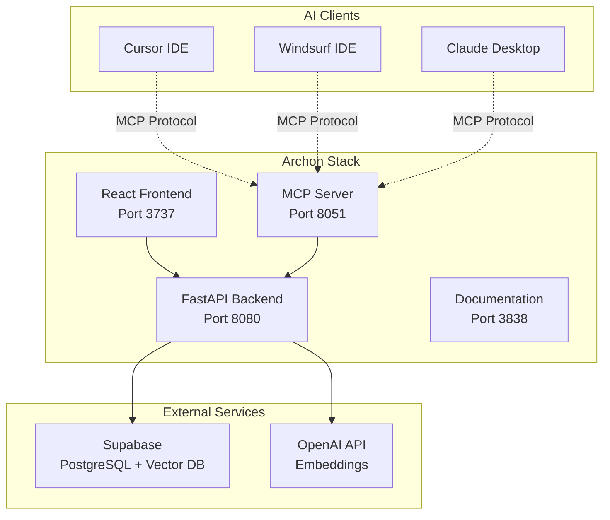

  

    <h1 className="hero__title">Archon</h1>
    
Supercharge your AI development workflow. Plug Cursor, Windsurf, or any AI IDE into Archon to unlock instant access to your business knowledge, technical docs, project requirements, and development tasks. Your AI gets smarter, your code gets better.

    

      <a 
        className="button button--green-neon button--lg" 
        href="/getting-started"
      >
        Get Started - Quick Setup ⚡
      </a>
    

  

## 🎯 What is Archon?

Archon is a powerful knowledge engine that integrates the [Model Context Protocol (MCP)](https://modelcontextprotocol.io) with [Crawl4AI](https://crawl4ai.com) and [Supabase](https://supabase.com/) to create a centralized knowledge base for your AI agents and coding assistants.

**Connect your Cursor or Windsurf agents to Archon** and give them access to:
- Your technical documentation
- Your business/project documentation  
- Any website content you've crawled
- Uploaded documents (PDFs, Word docs, markdown files)
- A searchable knowledge base with advanced RAG capabilities

With Archon's web interface, you can **manage all your knowledge in one place** - crawl websites, upload documents, organize by type, and even chat with your knowledge base to test queries before your AI agents use them.

## ✨ Key Features

  

    

      <h3>▣ Knowledge Management</h3>
      

        Intelligently crawl documentation sites, upload PDFs and documents, and organize knowledge by type (technical vs business). Advanced source filtering enables precise RAG queries across your entire knowledge base.
      

    

  

  

    

      <h3>◉ Advanced RAG Capabilities</h3>
      

        Smart URL detection, contextual embeddings, hybrid search, and reranking deliver superior search results. Special handling for code snippets and technical documentation with AI-powered content understanding.
      

    

  

  

    

      <h3>⬢ MCP Integration</h3>
      

        Universal compatibility with Cursor, Windsurf, Claude Desktop, and any MCP client. Dual transport support (SSE/stdio) with real-time access to your knowledge base directly from your AI coding assistants.
      

    

  

  

    

      <h3>▤ Document Processing</h3>
      

        Dual-engine PDF extraction, Word document support, markdown processing, and smart chunking. AI-generated metadata and automatic code example extraction for comprehensive document understanding.
      

    

  

  

    

      <h3>▢ Web Interface</h3>
      

        Complete web dashboard for MCP server management, document upload, crawling operations, and interactive knowledge chat. Real-time log streaming and progress tracking for all operations.
      

    

  

  

    

      <h3>▧ Task Management</h3>
      

        Integrated project and task management with AI agent integration. Create, track, and organize development tasks with automatic linking to relevant documentation and code examples.
      

    

  

## 🚀 Quick Start

Ready to get started? Follow our comprehensive setup guide:

👉 **[Getting Started Guide](./getting-started)** - Complete setup from installation to first knowledge base

## 📚 Documentation Sections

| Section | Description |
|---------|-------------|
| **[Getting Started](./getting-started)** | Complete setup guide from prerequisites to first crawl |
| **[Configuration](./configuration)** | Environment variables, database setup, and service configuration |
| **[MCP Integration](./mcp-reference)** | Connect AI clients like Cursor, Windsurf, Claude Desktop |
| **[API Reference](./api-reference)** | Complete REST API documentation with examples |
| **[WebSocket Communication](./websockets)** | Real-time updates, progress tracking, and troubleshooting |
| **[RAG Strategies](./rag)** | Configure advanced retrieval strategies for optimal performance |
| **[Task Management](./tasks)** | Organize projects and tasks with AI agent integration |
| **[Web Interface](./ui)** | Comprehensive guide to the React frontend |
| **[Server Architecture](./server)** | Technical details about the backend and MCP server |
| **[Testing](./testing)** | Testing strategies and troubleshooting guides |
| **[Deployment](./deployment)** | Production deployment with Docker and scaling |

## 🛠️ Architecture Overview

## 🔮 Real-Time Features

Archon implements comprehensive real-time communication:

- **🔄 Live Progress Tracking**: Real-time updates during crawling operations
- **📡 Server Log Streaming**: WebSocket-based log streaming from MCP server to UI
- **🎯 Progress Callbacks**: Business logic reports progress via callbacks to WebSocket broadcasts
- **🔗 Auto-Reconnection**: Robust connection handling with automatic reconnect on failures
- **📱 Responsive UI Updates**: Instant feedback without polling or page refreshes

📋 **[Complete WebSocket Guide](./server#websocket-communication)** - Implementation patterns and best practices

## 🎯 Next Steps

1. **[Set up Archon](./getting-started)** - Get your knowledge engine running
2. **[Connect your AI client](./mcp-reference)** - Integrate with Cursor, Windsurf, or Claude Desktop  
3. **[Build your knowledge base](./getting-started#building-your-knowledge-base)** - Start crawling and uploading content
4. **[Optimize for your use case](./rag)** - Configure RAG strategies
5. **[Deploy to production](./deployment)** - Scale for team or enterprise use

---

**Transform your AI coding experience with Archon** - *Build once, query everywhere* 