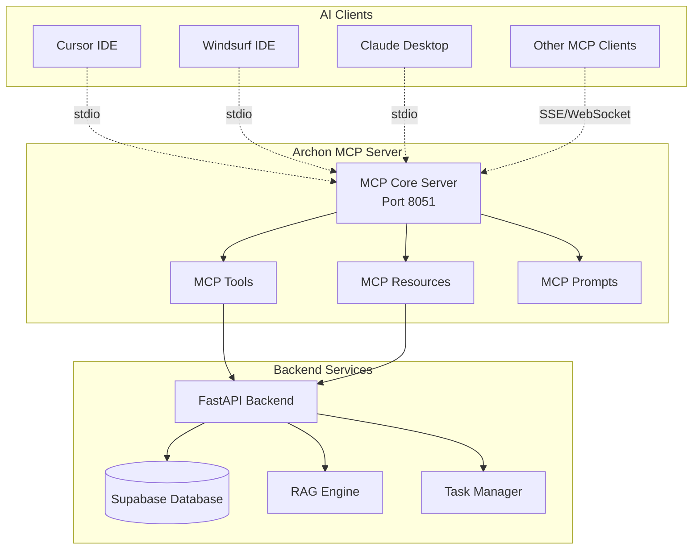

# Model Context Protocol (MCP) Integration

Archon implements the Model Context Protocol (MCP) to provide seamless integration with AI coding assistants like Cursor, Windsurf, Claude Desktop, and other MCP-compatible clients. This guide covers setup, configuration, and advanced usage patterns.

## 🎯 What is MCP?

The [Model Context Protocol](https://modelcontextprotocol.io) is an open standard that enables AI applications to securely access external data sources and tools. Archon's MCP server exposes your knowledge base and task management capabilities directly to your AI coding assistants.

### Key Benefits

- **Universal Compatibility**: Works with any MCP-compatible client
- **Real-time Access**: AI agents get immediate access to newly added knowledge
- **Secure Integration**: Controlled access to your knowledge base
- **Tool Integration**: AI agents can create and manage tasks autonomously
- **Context Awareness**: Provide relevant documentation context to AI conversations

## 🏗️ MCP Server Architecture



## 🛠️ Available MCP Tools

Archon provides a comprehensive set of tools that AI clients can use to interact with your knowledge base and manage tasks.

### Knowledge Management Tools

#### `search_knowledge`
Search the knowledge base using semantic similarity and filters.

**Parameters:**
- `query` (string, required): Search query text
- `limit` (integer, optional): Maximum results (default: 10, max: 50)
- `knowledge_type` (string[], optional): Filter by knowledge types
- `tags` (string[], optional): Filter by tags
- `source_domains` (string[], optional): Filter by source domains
- `use_reranking` (boolean, optional): Enable result reranking (default: true)

**Example Usage:**
```json
{
  "tool": "search_knowledge",
  "arguments": {
    "query": "How to implement authentication in FastAPI?",
    "limit": 5,
    "knowledge_type": ["technical"],
    "tags": ["fastapi", "authentication"],
    "use_reranking": true
  }
}
```

**Response:**
```json
{
  "results": [
    {
      "id": 123,
      "title": "FastAPI Authentication Guide",
      "content": "FastAPI provides several ways to implement authentication...",
      "url": "https://fastapi.tiangolo.com/tutorial/security/",
      "similarity_score": 0.92,
      "knowledge_type": "technical",
      "tags": ["fastapi", "authentication", "security"]
    }
  ],
  "total_results": 1,
  "processing_time": 0.245
}
```

#### `get_document`
Retrieve a specific document by ID.

**Parameters:**
- `document_id` (integer, required): Document ID
- `include_content` (boolean, optional): Include full content (default: true)

#### `list_sources`
Get available knowledge sources for filtering.

**Response:**
```json
{
  "domains": ["docs.python.org", "fastapi.tiangolo.com"],
  "knowledge_types": ["technical", "business", "general"],
  "tags": ["python", "fastapi", "database"],
  "total_items": 1250
}
```

### Task Management Tools

#### `create_project`
Create a new project for organizing tasks.

**Parameters:**
- `title` (string, required): Project title
- `description` (string, optional): Project description
- `github_repo` (string, optional): GitHub repository URL
- `prd` (object, optional): Product Requirements Document

**Example:**
```json
{
  "tool": "create_project",
  "arguments": {
    "title": "API Documentation Improvement",
    "description": "Enhance the API documentation with better examples",
    "github_repo": "https://github.com/user/project",
    "prd": {
      "overview": "Improve API docs for better developer experience",
      "goals": ["Add more examples", "Improve navigation"]
    }
  }
}
```

#### `create_task`
Create a new task within a project.

**Parameters:**
- `project_id` (string, required): Project UUID
- `title` (string, required): Task title
- `description` (string, optional): Task description
- `parent_task_id` (string, optional): Parent task UUID for subtasks
- `status` (string, optional): Initial status (default: "todo")
- `sources` (array, optional): Reference documentation sources
- `code_examples` (array, optional): Related code examples

**Example:**
```json
{
  "tool": "create_task",
  "arguments": {
    "project_id": "550e8400-e29b-41d4-a716-446655440000",
    "title": "Add authentication examples to API docs",
    "description": "Create comprehensive examples showing JWT authentication implementation",
    "status": "todo",
    "sources": [
      {"name": "FastAPI Security", "url": "https://fastapi.tiangolo.com/tutorial/security/"}
    ],
    "code_examples": [
      {
        "language": "python",
        "description": "JWT token validation",
        "code": "from fastapi import Depends, HTTPException\nfrom fastapi.security import HTTPBearer"
      }
    ]
  }
}
```

#### `update_task`
Update an existing task.

**Parameters:**
- `task_id` (string, required): Task UUID
- `status` (string, optional): New status ("todo", "doing", "blocked", "done")
- `description` (string, optional): Updated description
- `sources` (array, optional): Updated reference sources
- `code_examples` (array, optional): Updated code examples

#### `list_projects`
Retrieve all projects.

**Parameters:**
- `limit` (integer, optional): Maximum results (default: 50)
- `offset` (integer, optional): Pagination offset

#### `list_tasks`
Retrieve tasks with filtering options.

**Parameters:**
- `project_id` (string, optional): Filter by project
- `status` (string, optional): Filter by status
- `limit` (integer, optional): Maximum results
- `offset` (integer, optional): Pagination offset

#### `get_task`
Retrieve a specific task by ID.

**Parameters:**
- `task_id` (string, required): Task UUID

### Content Management Tools

#### `crawl_website`
Initiate web crawling for a URL.

**Parameters:**
- `url` (string, required): Target URL
- `knowledge_type` (string, required): Knowledge classification
- `tags` (string[], optional): Tags for categorization
- `max_pages` (integer, optional): Maximum pages to crawl
- `max_depth` (integer, optional): Maximum crawl depth

**Example:**
```json
{
  "tool": "crawl_website",
  "arguments": {
    "url": "https://docs.python.org/3/tutorial/",
    "knowledge_type": "technical",
    "tags": ["python", "tutorial"],
    "max_pages": 20,
    "max_depth": 2
  }
}
```

## 🔧 Client Configuration

### Cursor IDE Setup

1. **Install MCP Extension** (if available) or configure manually
2. **Add Archon MCP Server** to your Cursor configuration

#### Configuration File
Create or edit `~/.cursor/mcp_servers.json`:

```json
{
  "mcpServers": {
    "archon": {
      "command": "python",
      "args": ["/path/to/archon/src/mcp_server.py"],
      "env": {
        "SUPABASE_URL": "https://your-project.supabase.co",
        "SUPABASE_SERVICE_KEY": "your-service-key"
      }
    }
  }
}
```

#### Alternative: Direct Connection
```json
{
  "mcpServers": {
    "archon": {
      "command": "curl",
      "args": [
        "-X", "POST",
        "http://localhost:8080/api/mcp/connect",
        "-H", "Content-Type: application/json"
      ]
    }
  }
}
```

### Windsurf IDE Setup

1. **Open Windsurf Settings**
2. **Navigate to Extensions > MCP**
3. **Add New Server**:
   - **Name**: Archon Knowledge Engine
   - **Command**: `python /path/to/archon/src/mcp_server.py`
   - **Environment Variables**:
     ```
     SUPABASE_URL=https://your-project.supabase.co
     SUPABASE_SERVICE_KEY=your-service-key
     ```

### Claude Desktop Setup

1. **Open Claude Desktop Settings**
2. **Go to Developer > MCP Servers**
3. **Add Configuration**:

```json
{
  "archon-knowledge": {
    "command": "python",
    "args": ["/path/to/archon/src/mcp_server.py"],
    "env": {
      "SUPABASE_URL": "https://your-project.supabase.co",
      "SUPABASE_SERVICE_KEY": "your-service-key"
    }
  }
}
```

### Generic MCP Client Setup

For other MCP-compatible clients:

#### Standard I/O Transport
```bash
# Start MCP server
python /path/to/archon/src/mcp_server.py

# Or via Docker
docker run -p 8051:8051 archon-mcp-server
```

#### Server-Sent Events (SSE) Transport
```javascript
// Connect via SSE
const eventSource = new EventSource('http://localhost:8080/api/mcp/sse');

eventSource.onmessage = function(event) {
  const mcpMessage = JSON.parse(event.data);
  // Handle MCP message
};
```

## 🚀 Getting Connection Details

Archon provides an easy way to get the exact connection configuration for your setup:

### Via Web Interface

1. Open http://localhost:3737
2. Go to **MCP Dashboard**
3. Click **"Get Connection Info"**
4. Copy the configuration for your specific client

### Via API

```bash
curl http://localhost:8080/api/mcp/connection-info
```

**Response:**
```json
{
  "server_status": "running",
  "connection_methods": {
    "stdio": {
      "command": "python",
      "args": ["/app/src/mcp_server.py"],
      "working_directory": "/app"
    },
    "sse": {
      "endpoint": "http://localhost:8080/api/mcp/sse",
      "headers": {
        "Accept": "text/event-stream"
      }
    }
  },
  "environment_variables": {
    "SUPABASE_URL": "https://your-project.supabase.co",
    "SUPABASE_SERVICE_KEY": "your-service-key"
  },
  "client_configurations": {
    "cursor": {
      "config_file": "~/.cursor/mcp_servers.json",
      "configuration": {
        "archon": {
          "command": "python",
          "args": ["/app/src/mcp_server.py"]
        }
      }
    },
    "claude_desktop": {
      "config_file": "~/Library/Application Support/Claude/claude_desktop_config.json",
      "configuration": {
        "archon-knowledge": {
          "command": "python",
          "args": ["/app/src/mcp_server.py"]
        }
      }
    }
  }
}
```

## 💡 Usage Examples

### Example 1: Research and Documentation

**Scenario**: You're working on a new feature and need to understand existing patterns.

**AI Prompt**:
```
I'm implementing user authentication in our FastAPI application. 
Can you search our knowledge base for authentication examples and 
create a task to document the implementation?
```

**AI Actions**:
1. Uses `search_knowledge` to find authentication-related documentation
2. Uses `create_task` to create a documentation task
3. Provides code examples based on found knowledge

### Example 2: Project Planning

**AI Prompt**:
```
I need to plan a new API versioning system. Create a project for this 
and break it down into tasks based on best practices from our knowledge base.
```

**AI Actions**:
1. Uses `search_knowledge` to find API versioning best practices
2. Uses `create_project` to create the project
3. Uses `create_task` multiple times to create subtasks
4. References relevant documentation in task descriptions

### Example 3: Code Review Assistance

**AI Prompt**:
```
Review this code and check if it follows our documented patterns. 
Create tasks for any improvements needed.

[code snippet]
```

**AI Actions**:
1. Uses `search_knowledge` to find coding standards and patterns
2. Compares code against documented practices
3. Uses `create_task` for each improvement needed
4. Links relevant documentation in task sources

## 🔍 Advanced Features

### Custom Prompts

Archon provides pre-configured prompts that enhance AI interactions:

#### `knowledge_search_prompt`
Optimizes search queries for better knowledge retrieval.

#### `task_creation_prompt`
Guides AI in creating well-structured tasks with proper context.

#### `code_review_prompt`
Provides context for code review based on documented standards.

### Resource Access

MCP resources provide direct access to knowledge items:

#### `knowledge://documents/{id}`
Direct access to document content.

#### `knowledge://sources/{domain}`
Access to all content from a specific domain.

#### `tasks://projects/{id}`
Access to project details and associated tasks.

### Real-time Updates

The MCP server provides real-time notifications when:
- New knowledge is added to the base
- Tasks are created or updated
- Crawling operations complete

## 🛠️ Development & Debugging

### Testing MCP Connection

```bash
# Test MCP server directly
python src/mcp_server.py --test

# Test with MCP client simulator
curl -X POST http://localhost:8080/api/mcp/test \
  -H "Content-Type: application/json" \
  -d '{
    "tool": "search_knowledge",
    "arguments": {
      "query": "test query",
      "limit": 1
    }
  }'
```

### Debug Logging

Enable debug logging for MCP operations:

```bash
# Set environment variable
export MCP_DEBUG=true

# Or in .env file
MCP_DEBUG=true
MCP_LOG_LEVEL=DEBUG
```

### MCP Server Logs

Monitor MCP server activity:

```bash
# View logs via API
curl http://localhost:8080/api/mcp/logs

# Stream logs via WebSocket
wscat ws://localhost:8080/api/mcp/logs/stream
```

### Common Issues & Solutions

#### Connection Refused
**Problem**: Client can't connect to MCP server

**Solutions**:
1. Verify MCP server is running: `curl http://localhost:8080/api/mcp/status`
2. Check firewall settings
3. Verify environment variables are set correctly
4. Check client configuration file syntax

#### Tool Not Found
**Problem**: AI client reports tool not available

**Solutions**:
1. Restart MCP server: `curl -X POST http://localhost:8080/api/mcp/restart`
2. Verify tool registration in server logs
3. Check database connectivity

#### Slow Response Times
**Problem**: MCP tools respond slowly

**Solutions**:
1. Check database performance
2. Optimize vector index: See [Server Architecture](./server#performance-optimization)
3. Enable query caching
4. Reduce search result limits

## 🔒 Security Considerations

### Access Control

- MCP server runs with limited database permissions
- API keys are encrypted in storage
- Client connections are logged and monitored

### Network Security

```bash
# Restrict MCP server to localhost only
MCP_BIND_ADDRESS=127.0.0.1

# Use TLS for production deployments
MCP_USE_TLS=true
MCP_CERT_FILE=/path/to/cert.pem
MCP_KEY_FILE=/path/to/key.pem
```

### Audit Logging

All MCP tool usage is logged:

```json
{
  "timestamp": "2024-01-15T10:45:30Z",
  "client_id": "cursor_client_001",
  "tool_name": "search_knowledge",
  "arguments": {"query": "authentication"},
  "response_size": 1024,
  "execution_time": 0.245,
  "success": true
}
```

## 📈 Performance Optimization

### Caching Strategies

```python
# Enable MCP response caching
MCP_ENABLE_CACHE=true
MCP_CACHE_TTL=3600  # 1 hour
MCP_CACHE_SIZE=1000  # Max cached responses
```

### Connection Pooling

```python
# Configure connection limits
MCP_MAX_CONNECTIONS=50
MCP_CONNECTION_TIMEOUT=30
MCP_KEEPALIVE_TIMEOUT=300
```

### Resource Limits

```python
# Limit resource usage per client
MCP_MAX_SEARCH_RESULTS=50
MCP_MAX_QUERY_LENGTH=1000
MCP_RATE_LIMIT_PER_MINUTE=100
```

## 🔮 Future Enhancements

### Planned Features

- **Multi-tenant Support**: Separate knowledge bases per team
- **Advanced Permissions**: Role-based access control
- **Plugin System**: Custom tool development
- **Webhook Integration**: Real-time notifications
- **GraphQL Support**: More flexible data queries

### Experimental Features

- **AI-Powered Task Suggestions**: Automatic task creation based on code changes
- **Smart Context Injection**: Automatic relevant context for AI conversations
- **Cross-Project Knowledge Linking**: Automatic relationship detection

---

**Next Steps**:
- Set up your first MCP client with the [Getting Started Guide](./getting-started)
- Explore [Task Management](./tasks) for project organization
- Learn about [RAG Strategies](./rag) for optimal search performance
