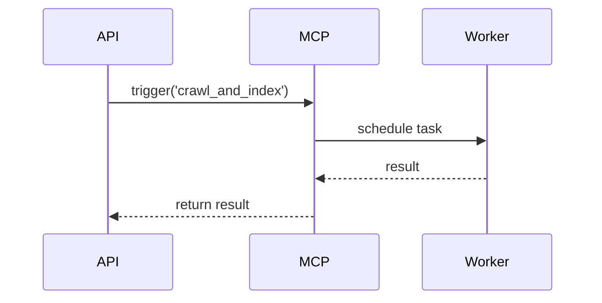

# MCP Reference

The **MCP** (Modular Computing Platform) provides decorators and an event-driven task execution model.

## Tool Decorators

- `@mcp.tool()` - defines a task
- `mcp.trigger(task_name, params)` - invoke tasks programmatically

## Event Loop

