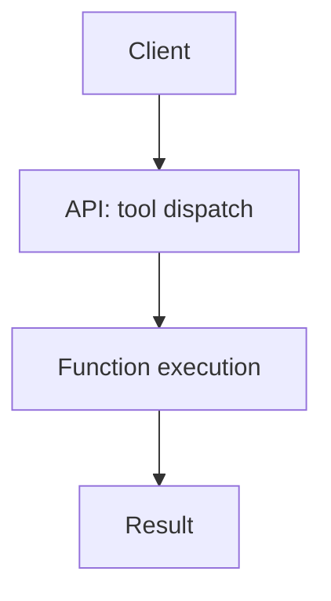

# MCP Reference

The **Modular Control Plane (MCP)** provides task orchestration via decorators.

## @mcp.tool Decorator

Wrap functions as callable tools:

```python
from mcp import tool

@tool(name="summarize")
def summarize_text(text: str) -> str:
    return text[:100]
```

## Tool Registration

All decorated functions auto-register on startup.

## Data Flow



See [Tasks](tasks) for scheduling examples.
