import Tabs from '@theme/Tabs';
import TabItem from '@theme/TabItem';
import Admonition from '@theme/Admonition';

# 🔌 Model Context Protocol (MCP) Integration

<div className="hero hero--primary">
  <div className="container">
    <h2 className="hero__subtitle">
      **Connect any AI client** to your knowledge base with 25 powerful MCP tools and real-time Logfire monitoring
    </h2>
  </div>
</div>

Archon implements the [Model Context Protocol (MCP)](https://modelcontextprotocol.io) to provide seamless integration with AI coding assistants like **Cursor**, **Windsurf**, **Claude Desktop**, and other MCP-compatible clients.

<Admonition type="success" icon="🎉" title="25 MCP Tools Available">
Archon provides **25 comprehensive MCP tools** across knowledge management, task organization, and project tracking - all monitored in real-time with Logfire.
</Admonition>

## 🎯 What is MCP?

The **Model Context Protocol** is an open standard that enables AI applications to securely access external data sources and tools. Archon's MCP server exposes your knowledge base and task management capabilities directly to your AI coding assistants.

### Key Benefits

<div className="row">
  <div className="col col--6">
    <div className="card">
      <div className="card__header">
        <h4>🌐 **Universal Compatibility**</h4>
      </div>
      <div className="card__body">
        <ul>
          <li>Works with **any MCP-compatible client**</li>
          <li>Cursor IDE, Windsurf, Claude Desktop support</li>
          <li>Future-proof protocol standard</li>
        </ul>
      </div>
    </div>
  </div>
  <div className="col col--6">
    <div className="card">
      <div className="card__header">
        <h4>⚡ **Real-Time Access**</h4>
      </div>
      <div className="card__body">
        <ul>
          <li>AI agents get **immediate access** to newly added knowledge</li>
          <li>Live task updates and project synchronization</li>
          <li>Comprehensive **Logfire monitoring** of all interactions</li>
        </ul>
      </div>
    </div>
  </div>
</div>

## 🏗️ MCP Server Architecture

```mermaid
graph TB
    subgraph "🤖 AI Clients"
        Cursor["💻 Cursor IDE<br/>stdio protocol"]
        Windsurf["🏄 Windsurf IDE<br/>stdio protocol"]
        Claude["🧠 Claude Desktop<br/>stdio protocol"]
        Other["🔧 Other MCP Clients<br/>SSE/WebSocket"]
    end
    
    subgraph "🔥 Archon MCP Server (Port 8051)"
        MCPCore["⚡ MCP Core Server<br/>+ Logfire Monitoring"]
        Tools["🛠️ 25 MCP Tools"]
        Resources["📚 MCP Resources"]
        Health["🏥 Health Check"]
    end
    
    subgraph "🏗️ Backend Services"
        RAGModule["🧠 RAG Module<br/>7 tools"]
        ProjectModule["📊 Project Module<br/>17 tools"]
        FastAPI["⚡ FastAPI Backend"]
        Supabase[("🗄️ Supabase Database<br/>pgvector")]
        Logfire["🔥 Logfire Dashboard<br/>Real-time Monitoring"]
    end
    
    Cursor -.->|JSON-RPC| MCPCore
    Windsurf -.->|JSON-RPC| MCPCore
    Claude -.->|JSON-RPC| MCPCore
    Other -.->|SSE| MCPCore
    
    MCPCore --> Tools
    MCPCore --> Resources
    MCPCore --> Health
    
    Tools --> RAGModule
    Tools --> ProjectModule
    RAGModule --> FastAPI
    ProjectModule --> FastAPI
    FastAPI --> Supabase
    MCPCore --> Logfire
    RAGModule --> Logfire
    ProjectModule --> Logfire

    style MCPCore fill:#4834d4,stroke:#686de0,stroke-width:3px
    style Logfire fill:#ff6b6b,stroke:#ff4757,stroke-width:3px
    style RAGModule fill:#00d2d3,stroke:#01a3a4,stroke-width:2px
    style ProjectModule fill:#5f27cd,stroke:#341f97,stroke-width:2px
```



## 🛠️ Complete MCP Tools Reference

<Admonition type="info" icon="📊" title="Tool Distribution">
- **🧠 RAG Module**: 7 tools for knowledge search and management
- **📊 Project Module**: 17 tools for task and project management  
- **🏥 Core Server**: 1 health check tool
- **🔥 Monitoring**: All tools include comprehensive Logfire tracing
</Admonition>

### 🧠 Knowledge Management Tools (7 tools)

<Tabs>
<TabItem value="search" label="🔍 Search Tools" default>

#### `perform_rag_query`
**Advanced semantic search with source filtering and monitoring**

```python
# Parameters
{
  "query": "How to implement authentication in FastAPI?",  # required
  "source": "fastapi.tiangolo.com",                       # optional: filter by source domain
  "match_count": 5                                        # optional: max results (default: 5)
}

# Response with full Logfire tracing
{
  "success": true,
  "results": [
    {
      "content": "FastAPI provides several ways to implement authentication...",
      "source": "fastapi.tiangolo.com",
      "url": "https://fastapi.tiangolo.com/tutorial/security/",
      "title": "FastAPI Security Documentation",
      "similarity_score": 0.92,
      "chunk_index": 2
    }
  ],
  "query_metadata": {
    "total_results": 5,
    "processing_time_ms": 245,
    "embedding_time_ms": 89,
    "search_time_ms": 156
  }
}
```

#### `search_code_examples`
**Search specifically for code examples with AI-generated summaries**

```python
{
  "query": "async database connection with FastAPI",
  "source_id": "fastapi.tiangolo.com",
  "match_count": 3
}
```

#### `get_available_sources`
**List all crawled sources for filtering**

```python
# Returns all available domains and source information
{
  "sources": [
    {
      "domain": "fastapi.tiangolo.com",
      "name": "FastAPI Documentation", 
      "total_pages": 142,
      "last_crawled": "2024-01-15T10:30:00Z"
    }
  ]
}
```

</TabItem>
<TabItem value="management" label="📚 Content Management">

#### `crawl_single_page`
**Crawl and index a single web page**

```python
{
  "url": "https://docs.python.org/3/tutorial/introduction.html"
}
```

#### `smart_crawl_url`
**Intelligent crawling with automatic detection of sitemaps and content types**

```python
{
  "url": "https://fastapi.tiangolo.com",
  "max_depth": 3,
  "max_concurrent": 10,
  "chunk_size": 5000
}
```

#### `upload_document`
**Upload and process documents (PDFs, Word, text files)**

```python
{
  "file_content": "base64_encoded_content",
  "filename": "api_guide.pdf",
  "knowledge_type": "technical",
  "tags": ["api", "documentation", "guide"]
}
```

#### `delete_source_tool`
**Remove a source and all associated content**

```python
{
  "source_id": "example.com"
}
```

</TabItem>
</Tabs>

### 📊 Project Management Tools (17 tools)

<Tabs>
<TabItem value="projects" label="📁 Project Tools" default>

#### `create_project`
**Create a new project with PRD support**

```python
{
  "title": "API Documentation Improvement",
  "prd": {
    "overview": "Enhance API documentation for better developer experience",
    "goals": ["Add more examples", "Improve navigation", "Add video tutorials"],
    "target_audience": "Backend developers using our API"
  },
  "github_repo": "https://github.com/user/api-docs"
}
```

#### `list_projects`
**Get all projects with metadata**

#### `get_project`
**Retrieve detailed project information**

```python
{
  "project_id": "550e8400-e29b-41d4-a716-446655440000"
}
```

#### `delete_project` 
**Remove project and all associated tasks**

</TabItem>
<TabItem value="tasks" label="✅ Task Management">

#### `create_task`
**Create tasks with source references and code examples**

```python
{
  "project_id": "550e8400-e29b-41d4-a716-446655440000",
  "title": "Implement JWT authentication middleware",
  "description": "Create reusable JWT auth middleware with proper error handling",
  "parent_task_id": null,  # Optional: for subtasks
  "sources": [
    {"name": "FastAPI Security", "url": "https://fastapi.tiangolo.com/tutorial/security/"}
  ],
  "code_examples": [
    {
      "language": "python",
      "description": "JWT token validation example",
      "code": "from fastapi import Depends, HTTPException..."
    }
  ]
}
```

#### `list_tasks_by_project`
**Get all tasks for a specific project**

#### `get_task`
**Retrieve detailed task information with subtasks**

#### `update_task_status`
**Update task status with Logfire tracking**

```python
{
  "task_id": "task-uuid-here",
  "status": "doing"  # "todo", "doing", "blocked", "done"
}
```

#### `update_task`
**Update task details (title, description, status)**

#### `delete_task`
**Remove task and all subtasks**

#### `get_task_subtasks`
**Get all subtasks of a parent task**

#### `get_tasks_by_status`
**Filter tasks by status within a project**

```python
{
  "project_id": "project-uuid",
  "status": "todo"
}
```

</TabItem>
<TabItem value="documents" label="📝 Documentation">

#### `add_project_document`
**Add structured documents to projects**

```python
{
  "project_id": "project-uuid",
  "document_type": "technical_spec",
  "title": "Authentication API Specification",
  "content": {
    "version": "1.0",
    "endpoints": [...],
    "security": {...}
  },
  "tags": ["api", "auth", "specification"],
  "author": "Development Team"
}
```

#### `list_project_documents`
**Get all documents for a project**

#### `get_project_document`
**Retrieve specific document with full content**

#### `update_project_document`
**Modify document content and metadata**

#### `delete_project_document`
**Remove document from project**

</TabItem>
</Tabs>

### 🏥 System Tools (1 tool)

#### `health_check`
**Comprehensive system health monitoring**

```python
# Returns detailed health status
{
  "success": true,
  "health": {
    "status": "ready",
    "crawler_ready": true,
    "database_ready": true,
    "openai_key_cached": true,
    "last_health_check": "2024-01-15T10:30:00Z"
  },
  "uptime_seconds": 3600,
  "timestamp": "2024-01-15T10:30:00Z"
}
```

## 🔌 Client Setup Guides

<Tabs>
<TabItem value="cursor" label="💻 Cursor IDE" default>

### Cursor IDE Integration

**File**: `~/.cursor/mcp.json` (or global settings)

```json
{
  "mcpServers": {
    "archon": {
      "command": "docker",
      "args": [
        "exec", 
        "-i",
        "-e", "TRANSPORT=stdio",
        "-e", "HOST=localhost", 
        "-e", "PORT=8051",
        "archon-pyserver",
        "python", "src/mcp_server.py"
      ]
    }
  }
}
```

**Alternative: Direct Connection**
```json
{
  "mcpServers": {
    "archon": {
      "command": "python",
      "args": ["/path/to/archon/python/src/mcp_server.py"],
      "env": {
        "TRANSPORT": "stdio",
        "SUPABASE_URL": "your-supabase-url",
        "SUPABASE_SERVICE_KEY": "your-service-key",
        "OPENAI_API_KEY": "your-openai-key",
        "LOGFIRE_TOKEN": "your-logfire-token"
      }
    }
  }
}
```

</TabItem>
<TabItem value="windsurf" label="🏄 Windsurf IDE">

### Windsurf IDE Integration

**Configuration in Windsurf settings**:

```json
{
  "mcp": {
    "servers": {
      "archon-knowledge-base": {
        "command": "docker",
        "args": [
          "exec", "-i",
          "-e", "TRANSPORT=stdio",
          "archon-backend-1", 
          "python", "src/mcp_server.py"
        ],
        "description": "Archon Knowledge Base with 25 tools"
      }
    }
  }
}
```

</TabItem>
<TabItem value="claude" label="🧠 Claude Desktop">

### Claude Desktop Integration

**File**: `~/Library/Application Support/Claude/claude_desktop_config.json` (macOS)

```json
{
  "mcpServers": {
    "archon": {
      "command": "docker",
      "args": [
        "exec", "-i",
        "-e", "TRANSPORT=stdio", 
        "-e", "LOGFIRE_TOKEN=your-token",
        "archon-backend-1",
        "python", "src/mcp_server.py"
      ]
    }
  }
}
```

**Windows**: `%APPDATA%/Claude/claude_desktop_config.json`

</TabItem>
<TabItem value="generic" label="🔧 Generic MCP Client">

### Generic MCP Client Setup

**Server Endpoint**: `http://localhost:8051/sse`

**Connection Options**:
- **stdio**: Direct process communication (recommended)
- **SSE**: Server-Sent Events for web clients
- **WebSocket**: Real-time bidirectional communication

**Environment Variables**:
```bash
TRANSPORT=stdio          # or "sse"
HOST=localhost          # Server host
PORT=8051              # Server port
LOGFIRE_TOKEN=optional  # For monitoring
```

</TabItem>
</Tabs>

## 🔥 Real-Time Monitoring with Logfire

<Admonition type="tip" icon="🔥" title="Complete Observability">
Every MCP tool call is traced in real-time with comprehensive performance metrics, error tracking, and client identification.
</Admonition>

### Dashboard Features

<div className="row">
  <div className="col col--4">
    <div className="card">
      <div className="card__header">
        <h4>⚡ **Real-Time Traces**</h4>
      </div>
      <div className="card__body">
        <ul>
          <li>See every MCP tool call live</li>
          <li>Client identification (Cursor, Windsurf, etc.)</li>
          <li>Performance timing breakdown</li>
        </ul>
      </div>
    </div>
  </div>
  <div className="col col--4">
    <div className="card">
      <div className="card__header">
        <h4>📊 **Performance Metrics**</h4>
      </div>
      <div className="card__body">
        <ul>
          <li>RAG query response times</li>
          <li>Database connection health</li>
          <li>Tool execution latency</li>
        </ul>
      </div>
    </div>
  </div>
  <div className="col col--4">
    <div className="card">
      <div className="card__header">
        <h4>🚨 **Error Tracking**</h4>
      </div>
      <div className="card__body">
        <ul>
          <li>Automatic error detection</li>
          <li>Tool failure analysis</li>
          <li>Connection issue debugging</li>
        </ul>
      </div>
    </div>
  </div>
</div>

### Example Monitoring Dashboard

**Access**: `https://logfire-us.pydantic.dev/your-project`

- **📊 Tool Usage Patterns**: Which tools are used most frequently
- **⚡ Performance Trends**: Response time analysis over time  
- **🎯 Client Analytics**: Usage patterns by different AI clients
- **🔍 Detailed Traces**: Drill down into specific tool executions

## 🚀 Usage Patterns & Best Practices

### Effective Knowledge Queries

<Tabs>
<TabItem value="basic" label="🔍 Basic Searches" default>

```python
# Good: Specific, contextual queries
"How to implement JWT authentication middleware in FastAPI with proper error handling?"

# Better: Include technology context
"FastAPI JWT authentication with dependency injection and custom exceptions"

# Best: Specific implementation details
"FastAPI HTTPBearer dependency with JWT token validation and user context injection"
```

</TabItem>
<TabItem value="filtered" label="🎯 Filtered Searches">

```python
# Filter by source for authoritative results
{
  "query": "async database operations", 
  "source": "docs.sqlalchemy.org"
}

# Search code examples specifically
{
  "query": "database connection pooling",
  "tool": "search_code_examples"
}

# Combine with task creation
results = search_knowledge("authentication patterns")
create_task(project_id, "Implement auth", sources=results)
```

</TabItem>
</Tabs>

### Task Organization Strategies

<Tabs>
<TabItem value="projects" label="📁 Project Structure" default>

```python
# 1. Create project with clear PRD
project = create_project(
    title="Authentication System Redesign",
    prd={
        "overview": "Modernize auth system with JWT and OAuth2",
        "goals": ["Security", "Performance", "Developer Experience"],
        "timeline": "Q1 2024"
    }
)

# 2. Create main tasks with research sources
auth_task = create_task(
    project_id=project.id,
    title="Research authentication patterns",
    sources=[search_knowledge("JWT best practices")]
)

# 3. Break down into subtasks
create_task(
    project_id=project.id,
    title="Implement JWT middleware",
    parent_task_id=auth_task.id
)
```

</TabItem>
<TabItem value="workflow" label="🔄 Workflow Integration">

```python
# Typical AI-assisted workflow:

# 1. Research phase
knowledge = search_knowledge("FastAPI authentication patterns")

# 2. Planning phase  
project = create_project("Auth Implementation")
tasks = create_task(project.id, "JWT Auth", sources=knowledge)

# 3. Implementation phase
update_task_status(tasks.id, "doing")

# 4. Documentation phase
add_project_document(
    project.id, 
    "implementation_notes",
    content={"approach": "...", "challenges": "..."}
)

# 5. Completion
update_task_status(tasks.id, "done")
```

</TabItem>
</Tabs>

## 🔧 Advanced Configuration

### Custom Transport Options

<Tabs>
<TabItem value="stdio" label="📡 stdio (Recommended)" default>

**Best for**: Cursor, Windsurf, Claude Desktop

```bash
TRANSPORT=stdio
python src/mcp_server.py
```

**Benefits**:
- Direct process communication
- Lower latency
- Better error handling
- Cleaner JSON-RPC protocol

</TabItem>
<TabItem value="sse" label="🌐 Server-Sent Events">

**Best for**: Web clients, custom integrations

```bash
TRANSPORT=sse
HOST=0.0.0.0
PORT=8051
python src/mcp_server.py
```

**Access**: `http://localhost:8051/sse`

</TabItem>
</Tabs>

### Performance Tuning

```bash
# Environment variables for optimization
MAX_CONCURRENT_REQUESTS=10      # Concurrent MCP requests
RAG_CACHE_SIZE=1000            # Result caching
EMBEDDING_BATCH_SIZE=50        # Batch embedding requests
LOGFIRE_SAMPLE_RATE=1.0        # Full tracing (reduce for high volume)
```

## 🆘 Troubleshooting

<Tabs>
<TabItem value="connection" label="🔌 Connection Issues" default>

**MCP Server Won't Start**
```bash
# Check Docker container
docker-compose ps

# Check logs
docker-compose logs backend

# Test health endpoint
curl http://localhost:8051/health
```

**Client Can't Connect**
```bash
# Verify MCP server process
ps aux | grep mcp_server

# Check stdio transport
echo '{"jsonrpc":"2.0","method":"ping","id":1}' | python src/mcp_server.py
```

</TabItem>
<TabItem value="tools" label="🛠️ Tool Issues">

**Tools Not Available**
- Verify all 25 tools are registered
- Check module imports in `mcp_server.py`
- Review Logfire dashboard for registration errors

**RAG Queries Failing**
- Verify OpenAI API key
- Check Supabase connection
- Monitor embedding generation in Logfire

</TabItem>
<TabItem value="performance" label="⚡ Performance Issues">

**Slow Tool Responses**
- Monitor Logfire dashboard for bottlenecks
- Check database query performance
- Verify network connectivity to external APIs

**Memory Issues**
- Reduce embedding cache size
- Limit concurrent requests
- Monitor Docker container resources

</TabItem>
</Tabs>

## 🔮 Advanced Features

### Custom Tool Development

```python
# Add new tools to modules/custom_module.py
@mcp.tool()
async def custom_search_tool(query: str, filters: dict) -> str:
    """Custom search with specialized filtering"""
    
    with logfire_logger.span("custom_tool_execution") as span:
        span.set_attribute("tool_name", "custom_search")
        span.set_attribute("query", query)
        
        # Implementation with full Logfire monitoring
        results = await your_custom_logic(query, filters)
        
        span.set_attribute("results_count", len(results))
        return json.dumps(results)
```

### Integration with External Services

- **GitHub Integration**: Sync issues with tasks
- **Slack Integration**: Task notifications  
- **Notion Integration**: Document synchronization
- **Custom APIs**: Extend tool functionality

### Monitoring & Analytics

- **Usage Analytics**: Track tool popularity and performance
- **Error Analysis**: Identify and fix common failure patterns
- **Performance Optimization**: Use Logfire data for system tuning
- **Client Behavior**: Understand how different AI clients use tools 