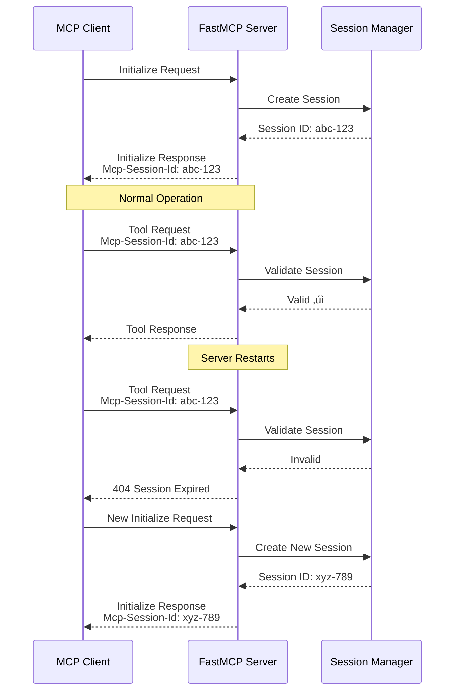

import Tabs from '@theme/Tabs';
import TabItem from '@theme/TabItem';
import Admonition from '@theme/Admonition';

# Archon MCP Server Documentation

## Overview

Archon's MCP Server exposes your knowledge base and project management capabilities to any MCP-compatible AI client. With 14 comprehensive tools (7 project/task tools + 7 RAG tools), real-time Logfire monitoring, and SSE transport, you can integrate Archon with your preferred AI development environment.

## MCP Server Architecture

```mermaid
%%{init:{
  'theme':'base',
  'themeVariables': {
    'primaryColor':'#1f2937',
    'primaryTextColor':'#ffffff',
    'primaryBorderColor':'#8b5cf6',
    'lineColor':'#a855f7',
    'textColor':'#ffffff',
    'fontFamily':'Inter',
    'fontSize':'14px',
    'background':'#000000',
    'mainBkg':'#1f2937',
    'secondBkg':'#111827',
    'borderColor':'#8b5cf6',
    'clusterBkg':'#111827',
    'clusterBorder':'#8b5cf6'
  }
}}%%
graph TB
    subgraph "🤖 AI Clients"
        Cursor["💻 Cursor IDE<br/>SSE transport"]
        Windsurf["🏄 Windsurf IDE<br/>SSE transport"]
        Claude["🧠 Claude Code<br/>SSE transport"]
        Other["🔧 Other MCP Clients<br/>SSE transport"]
    end
    
    subgraph "🔥 Archon MCP Service (Port 8051)"
        MCPCore["⚡ FastMCP Server<br/>+ Logfire Monitoring"]
        Tools["🛠️ 14 MCP Tools"]
        Health["🏥 Health & Session Info"]
    end
    
    subgraph "📦 Microservices"
        API["⚡ Server Service<br/>Archon-Server:8080"]
        Agents["🤖 Agents Service<br/>archon-agents:8052"]
    end
    
    subgraph "🏗️ Backend Services"
        RAGModule["🧠 RAG Module<br/>7 tools"]
        ProjectModule["📊 Project Module<br/>7 tools"]
        Supabase["🗄️ Supabase Database<br/>pgvector"]
        Logfire["🔥 Logfire Dashboard<br/>Real-time Monitoring"]
    end
    
    Cursor -.->|SSE| MCPCore
    Windsurf -.->|SSE| MCPCore
    Claude -.->|SSE| MCPCore
    Other -.->|SSE| MCPCore
    
    MCPCore --> Tools
    MCPCore --> Health
    
    Tools --> RAGModule
    Tools --> ProjectModule
    
    RAGModule --> API
    ProjectModule --> API
    API --> Agents
    
    API --> Supabase
    Agents --> Supabase
    MCPCore --> Logfire
    RAGModule --> Logfire
    ProjectModule --> Logfire
```



## Available Tools

Archon provides 14 comprehensive MCP tools organized into two main categories:

### Knowledge Management Tools (7 tools)

| Tool | Description | Use Case |
|------|-------------|----------|
| `perform_rag_query` | Semantic search across crawled content | "Find all documentation about authentication" |
| `search_code_examples` | Search code with AI summaries | "Show me React hook examples" |
| `crawl_single_page` | Index a single web page | Quickly add specific documentation |
| `smart_crawl_url` | Intelligent multi-page crawling | Index entire documentation sites |
| `get_available_sources` | List all indexed sources | See what knowledge is available |
| `upload_document` | Process and index documents | Upload PDFs, Word docs, markdown |
| `delete_source` | Remove indexed content | Clean up outdated sources |

### Project Management Tools (7 tools)

| Tool | Description | Use Case |
|------|-------------|----------|
| `create_project` | Create new project | Start a new AI development project |
| `list_projects` | List all projects | View all active projects |
| `create_task` | Create task in project | Add development tasks |
| `update_task` | Update task status/details | Mark tasks as complete |
| `list_tasks` | List project tasks | View tasks by status |
| `add_document` | Add document to project | Attach specs, notes |
| `search_projects` | Search across projects | Find specific projects |

## 🏗️ Microservices Integration

<Admonition type="info" icon="🔧" title="Service Communication">
  The MCP service communicates with other Archon microservices through Docker's internal network. This architecture enables scalability and separation of concerns.
</Admonition>


## Setup {#setup}

### Prerequisites

- **Docker**: Archon runs in containers
- **AI Client**: Cursor, Windsurf, Claude Desktop, or any MCP client
- **Network Access**: AI client must reach Archon's Docker container

### 1. Start Archon

<Tabs>
<TabItem value="docker" label="🐳 Docker (Recommended)" default>

```bash
# Start Archon with Docker Compose
cd archon
docker compose up -d

# Verify containers are running
docker compose ps
```

**Expected output:**
```
NAME                IMAGE               STATUS
archon-server      archon-server:latest Up 30 seconds (healthy)
archon-mcp         archon-mcp:latest   Up 30 seconds (healthy)
archon-agents      archon-agents:latest Up 30 seconds (healthy)
archon-frontend    archon-frontend:latest Up 30 seconds
```

</TabItem>
<TabItem value="local" label="💻 Local Development">

```bash
# Start backend services
cd python
python -m uvicorn src.main:socket_app --host 0.0.0.0 --port 8080

# Start MCP server (separate terminal)
cd python
python src/mcp_server.py

# Start agents service (separate terminal)
cd python
python -m uvicorn src.agents.server:app --host 0.0.0.0 --port 8052
```

</TabItem>
</Tabs>

### 2. Configure Your AI Client

<Tabs>
<TabItem value="cursor" label="💻 Cursor IDE" default>

**Option 1: One-Click Install (Recommended)**

1. **Generate Deeplink**: Visit the Archon MCP page and click "One-Click Install for Cursor"
2. **Or use this deeplink format**:
```
cursor://anysphere.cursor-deeplink/mcp/install?name=archon&config=BASE64_ENCODED_CONFIG
```

**Option 2: Manual Configuration**

1. **Open Cursor Settings**
   - `Ctrl/Cmd + ,` → Search "MCP"
   - Or edit `~/.cursor/mcp.json` directly

2. **Add Archon Configuration**

```json title="~/.cursor/mcp.json"
{
  "mcpServers": {
    "archon": {
      "url": "http://localhost:8051/sse"
    }
  }
}
```

3. **Restart Cursor**
   - Close and reopen Cursor to load the new configuration

**Deeplink Generation Example**:
```javascript
const config = {
  "archon": {
    "url": "http://localhost:8051/sse"
  }
};
const base64Config = btoa(JSON.stringify(config));
const deeplink = `cursor://anysphere.cursor-deeplink/mcp/install?name=archon&config=${base64Config}`;
```

</TabItem>
<TabItem value="windsurf" label="🏄 Windsurf IDE">

**1. Open Windsurf MCP Settings**
- Click the "MCP servers" button (hammer icon)
- Click "Configure"
- Select "View raw config"

**2. Add Server Configuration**

**Option A: Remote MCP Server (SSE)**
```json title="windsurf mcp configuration"
{
  "mcpServers": {
    "archon": {
      "command": "npx",
      "args": [
        "mcp-remote",
        "http://localhost:8051/sse"
      ]
    }
  }
}
```

**Option B: Local Docker Server (stdio)**
```json title="windsurf mcp configuration"
{
  "mcpServers": {
    "archon": {
      "command": "docker",
      "args": [
        "exec", "-i",
        "-e", "TRANSPORT=stdio", 
        "archon-mcp",
        "python", "src/mcp_server.py"
      ]
    }
  }
}
```

**3. Refresh Connection**
- Click "Refresh" button to connect to the server
- The server status should show as connected

</TabItem>
<TabItem value="claudecode" label="🧳 Claude Code">

**Claude Code uses CLI commands for MCP server management:**

**Option 1: Add SSE Server**
```bash
# Add Archon as an SSE server
claude mcp add --transport sse archon http://localhost:8051/sse

# With environment variables
claude mcp add --transport sse archon -e API_KEY=your-key http://localhost:8051/sse
```

**Option 2: Add stdio Server (Docker)**
```bash
# Add Archon with Docker stdio transport
claude mcp add archon docker exec -i -e TRANSPORT=stdio archon-mcp python src/mcp_server.py

# With specific scope (local, project, user)
claude mcp add -s project archon docker exec -i -e TRANSPORT=stdio archon-mcp python src/mcp_server.py
```

**Managing MCP Servers**
```bash
# List all configured servers
claude mcp list

# Get details for Archon server
claude mcp get archon

# Remove server if needed
claude mcp remove archon

# Import from Claude Desktop
claude mcp add-from-claude-desktop
```

**Scope Options**:
- `local` (default): Available only in current project
- `project`: Shared via `.mcp.json` file in project
- `user`: Available across all projects

</TabItem>
<TabItem value="claude" label="🧠 Claude Desktop">

**1. Locate Configuration File**
- **macOS**: `~/Library/Application Support/Claude/claude_desktop_config.json`
- **Windows**: `%APPDATA%\Claude\claude_desktop_config.json`

**2. Add Archon Server**

```json title="claude_desktop_config.json"
{
  "mcpServers": {
    "archon": {
      "command": "docker",
      "args": [
        "exec", "-i",
        "-e", "TRANSPORT=stdio",
        "archon-mcp", 
        "python", "src/mcp_server.py"
      ]
    }
  }
}
```

**3. Restart Claude Desktop**

</TabItem>
<TabItem value="custom" label="🔧 Custom Client">

**For any MCP-compatible client:**

```bash
# Direct command execution
docker exec -i \
  -e TRANSPORT=stdio \
  archon-mcp \
  python src/mcp_server.py
```

**Or use SSE transport:**
```
POST http://localhost:8051/sse
Content-Type: application/json

{
  "jsonrpc": "2.0",
  "method": "initialize",
  "id": 1,
  "params": {
    "protocolVersion": "2024-11-05",
    "capabilities": {},
    "clientInfo": {
      "name": "custom-client",
      "version": "1.0.0"
    }
  }
}
```

</TabItem>
</Tabs>

### 3. First Tool Call {#first-tool-call}

Test your connection by making a simple tool call:

<Tabs>
<TabItem value="health" label="🏥 Health Check" default>

**In your AI client, ask:**
```
Check the health of the Archon system
```

**Expected response:**
```json
{
  "status": "healthy",
  "server": "running",
  "database": "connected", 
  "tools_available": 14,
  "version": "2.0.0"
}
```

</TabItem>
<TabItem value="rag" label="🧠 RAG Query">

**Ask your AI client:**
```
Search the knowledge base for information about authentication
```

**The AI will use the `perform_rag_query` tool to search your indexed content.**

</TabItem>
<TabItem value="project" label="📊 Create Project">

**Ask your AI client:**
```
Create a new project called "My AI App" with a basic description
```

**The AI will use the `create_project` tool to set up project management.**

</TabItem>
</Tabs>

## 🔄 Session Management & Reconnection {#session-management}

### Overview

Archon's MCP server includes simplified session management that enables clients to automatically reconnect after server restarts or connection failures. This implementation follows the MCP specification for session handling.

<Admonition type="tip" icon="🔄" title="Automatic Reconnection">

MCP clients like Claude Desktop, Cursor, and Windsurf will automatically reconnect to Archon if the server restarts. No manual intervention required!

</Admonition>

### How It Works

1. **Session Creation**: FastMCP handles session creation and returns a unique session ID in the `Mcp-Session-Id` header
2. **Session Tracking**: Our simplified session manager tracks active sessions with minimal overhead
3. **Session Validation**: Requests are validated against active sessions (1-hour timeout by default)
4. **Automatic Reconnection**: When a session expires, FastMCP returns HTTP 404, triggering client reconnection
5. **Clean Architecture**: Session management is integrated with FastMCP's SSE transport

### Session Lifecycle



### Monitoring Sessions

Use the `session_info` tool to monitor active sessions:

```json
// Ask your AI: "Show me the current MCP sessions"
// Response:
{
  "active_sessions": 2,
  "total_events": 156,
  "sessions": [
    {
      "session_id": "abc-123-def",
      "created_at": "2024-01-20T10:30:00Z",
      "last_seen": "2024-01-20T10:35:23Z",
      "active_streams": 1,
      "pending_events": 0
    }
  ],
  "server_uptime_seconds": 3600
}
```

### Configuration

| Parameter | Default | Description |
|-----------|---------|-------------|
| `session_timeout` | 3600s (1 hour) | Time before inactive sessions expire |

The simplified session manager automatically handles cleanup when sessions are accessed, eliminating the need for background cleanup tasks.

### Implementation Details

The session management is integrated with FastMCP's SSE transport:

1. **Minimal Overhead**: Sessions are tracked with just ID and last-seen timestamp
2. **No Background Tasks**: Cleanup happens on-demand during session validation
3. **MCP Compliant**: Follows the official MCP specification for session handling
4. **FastMCP Integration**: Works seamlessly with FastMCP's internal protocol handling

### Troubleshooting Session Issues

**Session Expired Errors:**
- Normal after server restart or 1-hour timeout
- Client will automatically reconnect
- Check `session_info` tool for active sessions

**Multiple Session Warnings:**
- Each client connection gets its own session
- Old sessions are cleaned up automatically
- Use `session_info` to monitor active sessions

**Reconnection Loops:**
- Check server logs for initialization errors
- Verify credentials are properly loaded
- Ensure database connection is stable

## ⚙️ Environment Setup {#environment-setup}

### Environment Variables

<Admonition type="note" icon="🔧" title="Environment Configuration">

Archon uses environment variables for configuration. These are set automatically in Docker, but you can customize them as needed.

</Admonition>

| Variable | Default | Description |
|----------|---------|-------------|
| `TRANSPORT` | `stdio` | MCP transport type (`stdio`, `sse`, `websocket`) |
| `MCP_PORT` | `8051` | Port for SSE/WebSocket transports |
| `LOG_LEVEL` | `INFO` | Logging level (`DEBUG`, `INFO`, `WARN`, `ERROR`) |
| `LOGFIRE_TOKEN` | *(required)* | Logfire monitoring token |
| `DATABASE_URL` | *(auto)* | PostgreSQL connection string |
| `OPENAI_API_KEY` | *(required)* | OpenAI API key for embeddings |

### Transport Configuration

<Tabs>
<TabItem value="stdio" label="📡 stdio (Default)" default>

**Best for**: IDE integrations (Cursor, Windsurf, Claude Desktop)

```bash
# Set in Docker environment
TRANSPORT=stdio

# Or pass during execution
docker exec -i -e TRANSPORT=stdio archon-mcp python src/mcp_server.py
```

**Characteristics:**
- ✅ Direct JSON-RPC over stdin/stdout
- ✅ No network configuration needed
- ✅ Maximum compatibility
- ✅ Lowest latency

</TabItem>
<TabItem value="sse" label="🌐 Server-Sent Events (SSE)">

**Best for**: Web-based clients, remote connections

```bash
# Set in Docker environment
TRANSPORT=sse
MCP_PORT=8051
```

**Endpoint:** `http://localhost:8051/sse`

**Characteristics:**
- ✅ HTTP-based, firewall-friendly
- ✅ Works with web browsers
- ✅ Good for remote connections
- ⚠️ Requires network configuration

</TabItem>
<TabItem value="websocket" label="📡 WebSocket">

**Best for**: Real-time applications, custom clients

```bash
# Set in Docker environment  
TRANSPORT=websocket
MCP_PORT=8051
```

**Endpoint:** `ws://localhost:8051/ws`

**Characteristics:**
- ✅ Full-duplex communication
- ✅ Real-time updates
- ✅ Custom client integration
- ⚠️ More complex setup

</TabItem>
</Tabs>

## 🔍 Monitoring {#monitoring}

### Logfire Integration

<Admonition type="tip" icon="🔥" title="Real-time Monitoring">

Archon includes comprehensive Logfire integration for real-time monitoring of all MCP tool calls, performance metrics, and error tracking.

</Admonition>

**Setup Logfire:**

1. **Get Logfire Token**
   - Visit [Logfire Dashboard](https://logfire.pydantic.dev)
   - Create account and project
   - Get your project token

2. **Configure Token**
   ```bash
   # In docker-compose.yml or environment
   LOGFIRE_TOKEN=your_token_here
   ```

3. **View Real-time Traces**
   - Visit your Logfire dashboard
   - See every tool call with timing
   - Monitor performance and errors

### Server Logs

<Tabs>
<TabItem value="docker-logs" label="🐳 Docker Logs" default>

```bash
# View MCP server logs
docker logs archon-mcp -f

# View all service logs
docker compose logs -f

# Filter for specific service
docker compose logs archon-mcp -f
```

</TabItem>
<TabItem value="log-levels" label="📊 Log Levels">

```bash
# Debug mode for troubleshooting
docker exec -e LOG_LEVEL=DEBUG archon-mcp python src/mcp_server.py

# Production mode
docker exec -e LOG_LEVEL=INFO archon-mcp python src/mcp_server.py
```

**Log Level Details:**
- `DEBUG`: All operations, JSON messages, detailed traces
- `INFO`: Tool calls, connection events, performance metrics  
- `WARN`: Recoverable errors, deprecated usage
- `ERROR`: Critical failures, connection issues

</TabItem>
</Tabs>

### Health Monitoring

```bash
# Check MCP server health via SSE endpoint
curl http://localhost:8051/sse

# Check API service health
curl http://localhost:8080/health

# Check agents service health  
curl http://localhost:8052/health

# Expected response from API
{
  "status": "healthy",
  "server": "running",
  "database": "connected",
  "tools_available": 14,
  "version": "2.0.0",
  "uptime": "0:05:23",
  "memory_usage": "45.2 MB"
}
```

## 🔧 Troubleshooting {#troubleshooting}

### Common Issues

<Admonition type="warning" icon="⚠️" title="Most Common Issues">

The majority of MCP server issues stem from **environment configuration** and **credential management**. Follow this troubleshooting guide systematically.

</Admonition>

#### 🔑 OpenAI API Key Issues

**Symptoms:**
- `KeyError: 'OPENAI_API_KEY'` errors in logs
- RAG queries failing
- Embedding operations not working

**Solutions:**

<Tabs>
<TabItem value="check-key" label="1️⃣ Check API Key" default>

```bash
# Check if environment variable is set
docker exec archon-mcp env | grep OPENAI

# Should show:
# OPENAI_API_KEY=sk-...your-key-here

# If not set, check credential service
docker exec archon-server python -c "
import os
from src.credential_service import initialize_credentials
initialize_credentials()
print('OPENAI_API_KEY:', os.getenv('OPENAI_API_KEY', 'NOT SET'))
"
```

</TabItem>
<TabItem value="set-key" label="2️⃣ Set API Key">

**Option A: Via Web UI (Recommended)**
1. Open http://localhost:3737
2. Go to Settings
3. Add your OpenAI API key
4. Save settings

**Option B: Via Database**
```sql
-- Connect to Supabase
-- Run in Supabase SQL Editor

-- Insert or update OpenAI key
INSERT INTO credentials (key, value) 
VALUES ('OPENAI_API_KEY', 'sk-your-key-here')
ON CONFLICT (key) DO UPDATE SET value = EXCLUDED.value;

-- Verify
SELECT key, substring(value, 1, 10) || '...' as value_preview 
FROM credentials WHERE key = 'OPENAI_API_KEY';
```

**Option C: Via Environment Variable**
```bash
# In docker-compose.yml
services:
  archon-mcp:
    environment:
      - OPENAI_API_KEY=sk-your-key-here
```

</TabItem>
<TabItem value="restart" label="3️⃣ Restart Services">

```bash
# Restart containers to load new credentials
docker compose restart

# Verify credentials loaded
docker exec archon-mcp python -c "
import os
print('OPENAI_API_KEY loaded:', bool(os.getenv('OPENAI_API_KEY')))
"
```

</TabItem>
</Tabs>

#### 🔌 Connection Issues

**Symptoms:**
- "Connection refused" in AI client
- MCP server not responding
- Tools not appearing in client

**Diagnostic Steps:**

<Tabs>
<TabItem value="container" label="1️⃣ Check Containers" default>

```bash
# Verify all containers running
docker compose ps

# Expected status: Up and healthy
# If any containers are down:
docker compose up -d

# Check container health
docker inspect archon-mcp | grep -A 5 Health
```

</TabItem>
<TabItem value="network" label="2️⃣ Network Connectivity">

```bash
# Test MCP service connectivity
curl http://localhost:8051/sse

# Test from inside container
docker exec archon-mcp curl -f http://localhost:8051/sse

# Check port mapping:
docker port archon-mcp
```

</TabItem>
<TabItem value="stdio" label="3️⃣ stdio Transport">

```bash
# Test stdio transport directly
docker exec -i archon-mcp python src/mcp_server.py

# Should start and wait for input
# Test with initialization message:
echo '{"jsonrpc":"2.0","method":"initialize","id":1,"params":{"protocolVersion":"2024-11-05","capabilities":{},"clientInfo":{"name":"test","version":"1.0.0"}}}' | docker exec -i archon-mcp python src/mcp_server.py
```

</TabItem>
</Tabs>

#### 🗄️ Database Issues

**Symptoms:**
- "Connection to database failed"
- Tools return database errors
- Project/task operations failing

**Solutions:**

<Tabs>
<TabItem value="db-check" label="1️⃣ Check Database" default>

```bash
# Check if tables exist in Supabase
# Run in Supabase SQL Editor:

-- Check main tables
SELECT tablename FROM pg_tables 
WHERE schemaname = 'public'
ORDER BY tablename;

-- Should include:
-- credentials, crawled_pages, documents, projects, tasks, etc.
```

</TabItem>
<TabItem value="db-init" label="2️⃣ Initialize Database">

If tables are missing, run the migration scripts in order:

1. Run `migration/1_initial_setup.sql` in Supabase SQL Editor
2. Run `migration/2_archon_projects.sql` if using projects
3. Run `migration/3_mcp_client_management.sql` if using MCP clients

Then restart services:
```bash
docker compose restart
```

</TabItem>
<TabItem value="db-reset" label="3️⃣ Reset Database (Last Resort)">

**⚠️ This will delete all data!**

1. **Run reset script** in Supabase SQL Editor:
   ```sql
   -- Copy and paste contents of migration/RESET_DB.sql
   ```

2. **Rebuild database** by running migrations in order (1, 2, 3)

3. **Restart services**:
   ```bash
   docker compose restart
   ```

4. **Reconfigure**:
   - Add OpenAI API key in Settings
   - Re-upload documents or re-crawl websites

</TabItem>
</Tabs>

#### 🧠 Tool-Specific Issues

**RAG Tools Not Working:**

```bash
# Check if sources exist
curl http://localhost:8080/api/sources

# If no sources, crawl some content via UI or tools
```

**Project Tools Failing:**

```bash
# Check project tables via Supabase SQL Editor
SELECT COUNT(*) as project_count FROM projects;
SELECT COUNT(*) as task_count FROM tasks;
```

### 🚨 Emergency Recovery

If all else fails, here's a complete reset procedure:

<Tabs>
<TabItem value="full-reset" label="🔄 Complete Reset" default>

```bash
# 1. Stop all services
docker compose down -v

# 2. Remove all containers and volumes
docker system prune -f
docker volume prune -f

# 3. Rebuild from scratch
docker compose build --no-cache
docker compose up -d

# 4. Wait for services to start
sleep 30

# 5. Set up credentials via Web UI
# Open http://localhost:3737 → Settings → Add OpenAI API key

# 6. Test functionality
curl http://localhost:8051/sse
```

</TabItem>
<TabItem value="config-verify" label="✅ Verify Configuration">

```bash
# Check all environment variables
docker exec archon-mcp env | grep -E "(OPENAI|DATABASE|LOGFIRE|TRANSPORT)"

# Verify MCP server can start
docker exec archon-mcp python -c "
import sys
sys.path.append('/app/src')
from mcp_server import app
print('MCP server import successful')
"

# Test all services are healthy
curl http://localhost:8080/health
curl http://localhost:8051/sse
curl http://localhost:8052/health
```

</TabItem>
</Tabs>

### 📞 Getting Help

If you're still experiencing issues:

1. **Check Logs**: `docker logs archon-mcp -f`
2. **Verify Environment**: All required credentials set
3. **Test Connectivity**: Container networking and port access
4. **Review Configuration**: AI client MCP configuration 
5. **Monitor with Logfire**: Real-time debugging traces

<Admonition type="info" icon="🆘" title="Community Support">

Join our community for help with complex issues:
- **GitHub Issues**: Report bugs and feature requests
- **Discord**: Real-time community support  
- **Documentation**: Comprehensive guides and examples

</Admonition>

## 🚀 Custom Tools {#custom-tools}

### Custom Tool Development

Create your own MCP tools by extending Archon's architecture:

```python title="src/modules/custom_module.py"
from typing import Any, Dict
from mcp.server.models import Tool
from mcp.types import TextContent

class CustomModule:
    def get_tools(self) -> list[Tool]:
        return [
            Tool(
                name="custom_tool",
                description="Your custom tool description",
                inputSchema={
                    "type": "object",
                    "properties": {
                        "param": {"type": "string", "description": "Parameter description"}
                    },
                    "required": ["param"]
                }
            )
        ]
    
    async def custom_tool(self, param: str) -> list[TextContent]:
        # Your custom logic here
        result = f"Processed: {param}"
        return [TextContent(type="text", text=result)]
```

### Adding Custom Tools

1. **Create Module**: Add your module to `src/modules/`
2. **Register Tools**: Import in `mcp_server.py`
3. **Test Tools**: Use the health check to verify registration
4. **Monitor Usage**: View tool calls in Logfire dashboard

## ⚡ Performance {#performance}

### Performance Tuning

**Database Optimization:**
```sql
-- Optimize for RAG queries
CREATE INDEX CONCURRENTLY idx_crawled_pages_embedding ON crawled_pages USING ivfflat (embedding);

-- Optimize for project queries  
CREATE INDEX idx_tasks_project_status ON tasks(project_id, status);
CREATE INDEX idx_tasks_updated ON tasks(updated_at DESC);
```

**Connection Pooling:**
```python title="Database connection optimization"
# Configure in database_service.py
DATABASE_CONFIG = {
    "pool_size": 20,
    "max_overflow": 30,
    "pool_timeout": 30,
    "pool_recycle": 3600
}
```

### Scaling Considerations

**Horizontal Scaling:**
- Run multiple MCP server instances
- Use load balancer for SSE/WebSocket transports
- Scale database with read replicas

**Microservices Scaling:**
```bash
# Scale individual services
docker compose up -d --scale archon-agents=3
docker compose up -d --scale archon-server=2
```

## 📈 Monitoring & Analytics

### Logfire Dashboards

Create custom dashboards to monitor:
- **Tool Usage**: Most popular tools and usage patterns
- **Performance**: Response times and throughput
- **Errors**: Error rates and failure patterns
- **Clients**: Which AI clients are connecting

### Custom Metrics

```python title="Add custom metrics to your tools"
import logfire

async def custom_tool(self, param: str):
    with logfire.span("custom_tool", param=param):
        # Your tool logic
        result = process(param)
        logfire.info("Tool completed", result_size=len(result))
        return result
```

## 🎯 Best Practices

### Security

1. **Credential Management**: Store API keys securely in database
2. **Access Control**: Limit tool access based on client capabilities  
3. **Input Validation**: Sanitize all tool inputs
4. **Rate Limiting**: Implement rate limiting for high-volume usage

### Performance

1. **Connection Reuse**: Keep database connections pooled
2. **Caching**: Cache frequently accessed data
3. **Async Operations**: Use async/await for I/O operations
4. **Resource Cleanup**: Properly close connections and clean up resources

### Reliability

1. **Error Handling**: Comprehensive error handling in all tools
2. **Health Checks**: Regular health monitoring and alerting
3. **Graceful Degradation**: Fallback mechanisms for external dependencies
4. **Resource Limits**: Set appropriate memory and CPU limits

---

<div className="text--center">
  <p><strong>🎉 Ready to supercharge your AI workflows?</strong></p>
  <p>You now have everything needed to connect any AI client to Archon's powerful MCP server!</p>
  
  <div className="margin-top--lg">
    <a href="/mcp-client" className="button button--primary button--lg margin-right--md">
      🔌 Explore MCP Client →
    </a>
    <a href="/mcp-overview" className="button button--secondary button--lg">
      ← Back to MCP Overview
    </a>
  </div>
</div> 