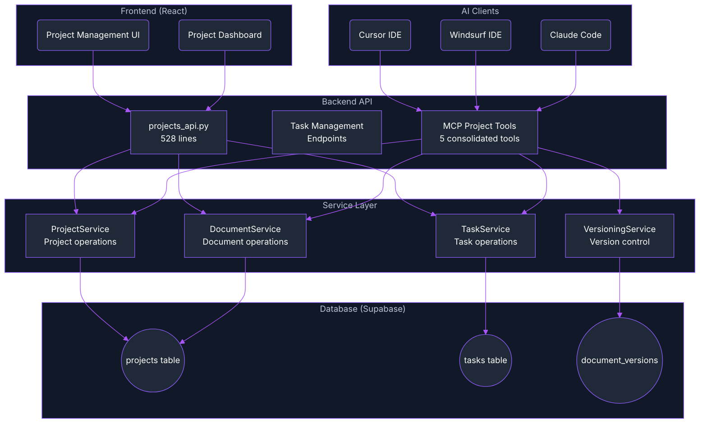
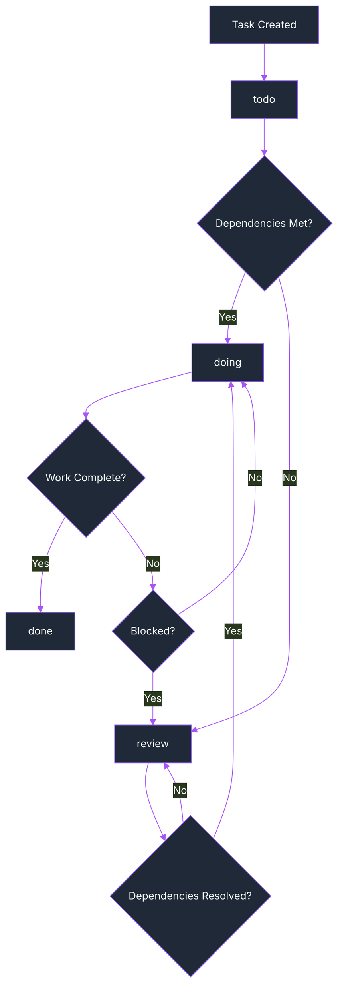
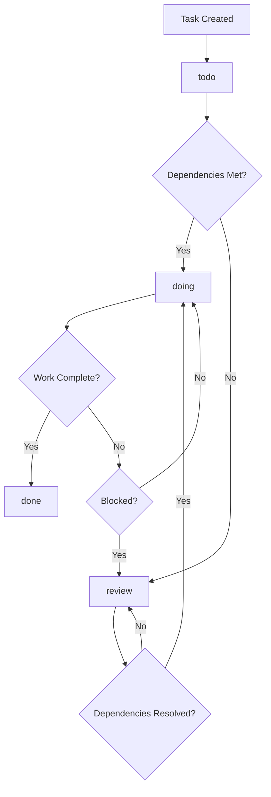

import Tabs from '@theme/Tabs';
import TabItem from '@theme/TabItem';
import Admonition from '@theme/Admonition';

# 📊 Archon Projects: AI-Powered Project Management

<div className="hero hero--primary">
  <div className="container">
    <h2 className="hero__subtitle">
      **Manage your development projects** with AI assistance. Track tasks, organize documentation, and connect your entire workflow with Cursor, Windsurf, and other AI coding assistants.
    </h2>
  </div>
</div>

Archon Projects brings intelligent project management to your AI development workflow. Your AI assistants can understand project context, create and update tasks, manage documentation, and help you stay organized while you code.

## 🎯 Overview

The Archon task management system provides:

- **Project Organization**: Structured project management with PRDs, features, and documentation
- **Hierarchical Tasks**: Support for parent-child task relationships
- **Status Tracking**: Todo, Doing, Review, Done status management
- **MCP Integration**: AI agents can create, update, and query tasks autonomously
- **Reference Management**: Link tasks to code examples and documentation sources
- **GitHub Integration**: Connect projects to repositories for context

## 🏗️ System Architecture



## 📊 Database Schema

The task management system uses two main tables in Supabase:

### Projects Table

```sql
CREATE TABLE projects (
  id UUID PRIMARY KEY DEFAULT gen_random_uuid(),
  title TEXT NOT NULL,
  prd JSONB DEFAULT '{}'::jsonb,           -- Product Requirements Document
  docs JSONB DEFAULT '[]'::jsonb,          -- Reference documentation array
  features JSONB DEFAULT '[]'::jsonb,      -- Feature list with status
  data JSONB DEFAULT '[]'::jsonb,          -- Sample datasets or resources
  github_repo TEXT,                        -- GitHub repository URL
  created_at TIMESTAMPTZ DEFAULT NOW(),
  updated_at TIMESTAMPTZ DEFAULT NOW()
);
```

#### Project Fields Explained

| Field | Type | Purpose | Example |
|-------|------|---------|----------|
| `id` | UUID | Unique project identifier | `550e8400-e29b-41d4-a716-446655440000` |
| `title` | TEXT | Project name | "API Documentation Overhaul" |
| `prd` | JSONB | Product Requirements Document | `{"overview": "...", "goals": [...]}` |
| `docs` | JSONB | Reference documentation array | `[{"id": "uuid", "title": "API Spec", "content": {...}}]` |
| `features` | JSONB | Feature list with status | `[{"name": "Auth", "status": "done"}]` |
| `data` | JSONB | Sample data or resources | `[{"name": "Test Data", "url": "..."}]` |
| `github_repo` | TEXT | Repository URL | `https://github.com/user/repo` |

### Tasks Table

```sql
CREATE TYPE task_status AS ENUM ('todo','doing','review','done');

CREATE TABLE tasks (
  id UUID PRIMARY KEY DEFAULT gen_random_uuid(),
  project_id UUID NOT NULL REFERENCES projects(id) ON DELETE CASCADE,
  parent_task_id UUID REFERENCES tasks(id) ON DELETE CASCADE,
  title TEXT NOT NULL,
  description TEXT,
  sources JSONB DEFAULT '[]'::jsonb,       -- Reference documentation
  code_examples JSONB DEFAULT '[]'::jsonb, -- Code snippets and examples
  status task_status DEFAULT 'todo',
  created_at TIMESTAMPTZ DEFAULT NOW(),
  updated_at TIMESTAMPTZ DEFAULT NOW()
);

-- Indexes for performance
CREATE INDEX idx_tasks_project ON tasks(project_id);
CREATE INDEX idx_tasks_parent ON tasks(parent_task_id);
CREATE INDEX idx_tasks_status ON tasks(status);
```

#### Task Fields Explained

| Field | Type | Purpose | Example |
|-------|------|---------|----------|
| `id` | UUID | Unique task identifier | `660e8400-e29b-41d4-a716-446655440001` |
| `project_id` | UUID | Parent project reference | Links to projects table |
| `parent_task_id` | UUID | Parent task for subtasks | Creates task hierarchy |
| `title` | TEXT | Task name | "Implement JWT authentication" |
| `description` | TEXT | Detailed task description | "Add JWT-based auth to all API endpoints" |
| `sources` | JSONB | Reference documentation | `[{"name": "JWT Guide", "url": "..."}]` |
| `code_examples` | JSONB | Related code snippets | `[{"language": "python", "code": "..."}]` |
| `status` | ENUM | Current task status | `todo`, `doing`, `review`, `done` |

## 🚀 Getting Started

### Creating Your First Project

#### Via Web Interface

1. **Open Archon**: Navigate to http://localhost:3737
2. **Go to Projects**: Click the "Projects" tab in the navigation
3. **Create Project**: Click "New Project"
4. **Fill Details**:
   - **Title**: "My Documentation Project"
   - **Description**: Brief project overview
   - **GitHub Repo**: (optional) Repository URL
5. **Save Project**: Click "Create"

#### Via API

```bash
curl -X POST "http://localhost:8080/api/projects" \
  -H "Content-Type: application/json" \
  -d '{
    "title": "API Documentation Overhaul",
    "prd": {
      "overview": "Improve API documentation for better developer experience",
      "goals": [
        "Add comprehensive examples",
        "Improve navigation structure",
        "Add interactive API explorer"
      ],
      "success_criteria": [
        "Reduce support tickets by 30%",
        "Increase API adoption by 50%"
      ]
    },
    "github_repo": "https://github.com/company/api-docs"
  }'
```

#### Via MCP (AI Agent)

AI agents can autonomously create projects:

```
User: "I need to start a new project to improve our API documentation"
AI: [Uses create_project MCP tool] 
    "I've created a new project 'API Documentation Improvement' with a comprehensive PRD..."
```

### Creating Tasks

#### Via Web Interface

1. **Select Project**: Choose your project from the project list
2. **Add Task**: Click "New Task"
3. **Fill Details**:
   - **Title**: Clear, actionable task name
   - **Description**: Detailed requirements
   - **Status**: Initial status (usually "todo")
   - **Assignee**: Choose from User, Archon, or AI IDE Agent
   - **Sources**: Add reference documentation
   - **Code Examples**: Add relevant code snippets
4. **Save Task**: Click "Create"

#### Via API

```bash
curl -X POST "http://localhost:8080/api/tasks" \
  -H "Content-Type: application/json" \
  -d '{
    "project_id": "550e8400-e29b-41d4-a716-446655440000",
    "title": "Create authentication examples",
    "description": "Write comprehensive examples showing how to implement JWT authentication with our API, including token generation, validation, and error handling.",
    "assignee": "Archon",
    "sources": [
      {
        "name": "JWT.io Introduction",
        "url": "https://jwt.io/introduction/",
        "description": "Basic JWT concepts and structure"
      },
      {
        "name": "FastAPI Security",
        "url": "https://fastapi.tiangolo.com/tutorial/security/",
        "description": "FastAPI authentication patterns"
      }
    ],
    "code_examples": [
      {
        "language": "python",
        "description": "JWT token generation",
        "code": "import jwt\nfrom datetime import datetime, timedelta\n\ndef create_token(user_id: str) -> str:\n    payload = {\n        'user_id': user_id,\n        'exp': datetime.utcnow() + timedelta(hours=24)\n    }\n    return jwt.encode(payload, SECRET_KEY, algorithm='HS256')"
      }
    ],
    "status": "todo"
  }'
```

## 🔧 Task Management Features

### Task Hierarchy

Create subtasks to break down complex work:

<Tabs>
<TabItem value="api" label="API Example">

```bash
# Create parent task
curl -X POST "http://localhost:8080/api/tasks" \
  -H "Content-Type: application/json" \
  -d '{
    "project_id": "550e8400-e29b-41d4-a716-446655440000",
    "title": "Implement user authentication system",
    "description": "Complete authentication system with JWT tokens",
    "status": "todo"
  }'

# Create subtasks (using parent_task_id from response)
curl -X POST "http://localhost:8080/api/tasks" \
  -H "Content-Type: application/json" \
  -d '{
    "project_id": "550e8400-e29b-41d4-a716-446655440000",
    "parent_task_id": "parent-task-uuid-here",
    "title": "Design JWT token structure",
    "description": "Define token payload and expiration strategy",
    "status": "todo"
  }'
```

</TabItem>
<TabItem value="mcp" label="MCP (AI) Example">

```
User: "Break down the authentication task into smaller pieces"
AI: [Uses create_task MCP tool multiple times]
    "I've broken down your authentication task into 5 subtasks:
    1. Design JWT token structure
    2. Implement token generation
    3. Create middleware for validation
    4. Add authentication endpoints
    5. Write comprehensive tests"
```

</TabItem>
</Tabs>

### Status Management

Update task status as work progresses:

<Tabs>
<TabItem value="api" label="API Status Update">

```bash
# Update task status
curl -X PATCH "http://localhost:8080/api/tasks/task-uuid-here" \
  -H "Content-Type: application/json" \
  -d '{
    "status": "doing",
    "description": "Started implementing JWT token generation. Updated payload structure to include user roles and permissions."
  }'
```

</TabItem>
<TabItem value="mcp" label="MCP Status Update">

```
User: "I finished implementing the authentication middleware"
AI: [Uses update_task_status MCP tool]
    "Great! I've updated the authentication middleware task to 'done' and added your completion notes."
```

</TabItem>
</Tabs>

#### Status Workflow



### Task Filtering and Queries

#### Get Tasks by Status

```bash
# Get all "doing" tasks
curl "http://localhost:8080/api/tasks?status=doing"

# Get all tasks for a project
curl "http://localhost:8080/api/tasks?project_id=550e8400-e29b-41d4-a716-446655440000"

# Get subtasks of a parent task
curl "http://localhost:8080/api/tasks?parent_task_id=parent-uuid-here"
```

#### Advanced Filtering

```bash
# Get tasks by status with project filter
curl "http://localhost:8080/api/tasks?project_id=550e8400-e29b-41d4-a716-446655440000&status=review"
```

## 🤖 MCP Integration

AI coding assistants can autonomously manage tasks through MCP tools:

### Available MCP Tools (5 Consolidated Tools)

<Admonition type="success" title="Streamlined MCP Tools">
  Following MCP best practices, we've consolidated 22 individual tools into 5 flexible, action-based tools. This provides better performance, easier maintenance, and more intuitive usage for AI agents.
</Admonition>

#### Consolidated Project & Task Tools

| Tool | Actions | Description | Parameters |
|------|---------|-------------|------------|
| **`manage_project`** | `create`, `list`, `get`, `delete` | Complete project lifecycle | `action`, `project_id`, `title`, `prd`, `github_repo` |
| **`manage_task`** | `create`, `list`, `get`, `update`, `delete`, `archive` | All task operations | `action`, `task_id`, `project_id`, `filter_by`, `filter_value`, `update_fields` |
| **`manage_document`** | `add`, `list`, `get`, `update`, `delete` | Document management *(Not yet implemented)* | `action`, `project_id`, `doc_id`, `document_type`, `title`, `content`, `metadata` |
| **`manage_versions`** | `create`, `list`, `get`, `restore` | Version control *(Not yet implemented)* | `action`, `project_id`, `field_name`, `version_number`, `content` |
| **`get_project_features`** | *(query only)* | Retrieve features | `project_id` |

<Admonition type="info" title="Implementation Status">
  The `manage_document` and `manage_versions` tools are defined in the MCP module but require corresponding Server API endpoints to be implemented. Currently, these tools will return "not yet implemented" errors. The other tools (`manage_project`, `manage_task`, and `get_project_features`) are fully functional.
</Admonition>

#### Action Patterns

<Tabs>
<TabItem value="project" label="Project Operations">

```python
# Create a new project
result = await manage_project(
    action="create",
    title="AI Documentation System",
    prd={"overview": "Automated docs generation", "goals": ["Generate API docs", "Maintain accuracy"]},
    github_repo="https://github.com/user/ai-docs"
)

# List all projects
projects = await manage_project(action="list")

# Get specific project
project = await manage_project(
    action="get",
    project_id="550e8400-e29b-41d4-a716-446655440000"
)
```

</TabItem>
<TabItem value="task" label="Task Operations">

```python
# Create a task
task = await manage_task(
    action="create",
    project_id="project-uuid",
    title="Implement JWT authentication",
    description="Add JWT-based auth to all API endpoints",
    assignee="Archon"
)

# Update task status
await manage_task(
    action="update",
    task_id="task-uuid",
    update_fields={"status": "done", "description": "Completed with tests"}
)

# List tasks by status
tasks = await manage_task(
    action="list",
    filter_by="status",
    filter_value="doing",
    project_id="project-uuid"
)

# Get subtasks
subtasks = await manage_task(
    action="list",
    filter_by="parent",
    filter_value="parent-task-uuid"
)
```

</TabItem>
<TabItem value="document" label="Document Operations">

```python
# Add a document (MUST use clean MCP format)
doc = await manage_document(
    action="add",
    project_id="project-uuid",
    document_type="prd",
    title="System Architecture Document",
    content={
        "project_overview": {
            "description": "Microservices architecture",
            "target_completion": "Q2 2024"
        },
        "architecture": {
            "frontend": ["React", "TypeScript"],
            "backend": ["FastAPI", "PostgreSQL"]
        }
    },
    metadata={
        "tags": ["architecture", "technical"],
        "author": "System Architect"
    }
)

# Update document
await manage_document(
    action="update",
    project_id="project-uuid",
    doc_id="doc-uuid",
    content={
        "project_overview": {
            "description": "Updated microservices architecture with event sourcing"
        }
    }
)
```

</TabItem>
</Tabs>

<Admonition type="warning" title="Document Format Requirements">
  When using `manage_document` with `add` or `update` actions, the `content` field MUST follow the structured MCP format. The UI will automatically convert this to editable blocks. Do not use flat text or unstructured data.
</Admonition>

### AI-Driven Task Management Examples

#### Scenario 1: Project Planning

**User Prompt**:
```
I need to plan a new feature for user profile management. 
Create a project and break it down into tasks.
```

**AI Actions**:
1. `manage_project` with `action="create"` - Creates "User Profile Management" project with comprehensive PRD
2. `perform_rag_query` - Finds existing user management patterns in knowledge base
3. `manage_task` with `action="create"` (multiple calls) - Creates structured task breakdown:
   - Design user profile schema
   - Implement profile CRUD endpoints
   - Add profile validation
   - Create profile UI components
   - Write integration tests
4. Links relevant documentation in task sources

#### Scenario 2: Progress Tracking

**User Prompt**:
```
I just finished implementing the user registration endpoint. 
Update my tasks and suggest what to work on next.
```

**AI Actions**:
1. `manage_task` with `action="list"` and `filter_by="project"` - Gets current project tasks
2. `manage_task` with `filter_by="status"` and `filter_value="doing"` - Finds active tasks
3. `manage_task` with `action="update"` - Marks registration task as "done"
4. `manage_task` with `filter_by="parent"` - Checks for dependent tasks
5. Provides recommendations for next priority tasks

#### Scenario 3: Code Review Integration

**User Prompt**:
```
Review this authentication code and create tasks for any improvements needed:
[code snippet]
```

**AI Actions**:
1. `perform_rag_query` - Finds coding standards and security patterns
2. Analyzes code against documented best practices
3. `manage_task` with `action="create"` - Creates improvement tasks:
   - Add input validation
   - Implement rate limiting
   - Add comprehensive error handling
   - Improve test coverage
4. `manage_document` with `action="add"` - Documents findings
5. Sets appropriate priorities and dependencies

## 📊 Project Management Patterns

### PRD (Product Requirements Document) Structure

When creating projects, Archon automatically generates a structured PRD:

```json
{
  "prd": {
    "overview": "Clear description of what we're building and why",
    "problem_statement": "What problem are we solving?",
    "goals": [
      "Specific, measurable objectives",
      "User experience improvements",
      "Technical achievements"
    ],
    "success_criteria": [
      "Quantifiable success metrics",
      "User satisfaction targets",
      "Performance benchmarks"
    ],
    "scope": {
      "in_scope": ["Features to include"],
      "out_of_scope": ["Features explicitly excluded"]
    },
    "technical_requirements": [
      "Performance requirements",
      "Security requirements",
      "Scalability requirements"
    ],
    "stakeholders": [
      {
        "name": "Product Manager",
        "role": "Requirements owner",
        "contact": "pm@company.com"
      }
    ]
  }
}
```

### Project Document Management

Archon provides a sophisticated document management system that stores documents in a clean, structured format optimized for AI agent consumption while providing rich editing capabilities through the BlockNote editor.

#### Document Architecture

Documents are stored in the project's `docs` JSONB field using a dual-format approach:

1. **Clean MCP Format**: Structured content for AI agents
2. **BlockNote Integration**: Rich editing with automatic format conversion

#### Document Structure

```json
{
  "docs": [
    {
      "id": "doc-uuid-1",
      "document_type": "prd",
      "title": "E-commerce Platform v1.0 - Product Requirements Document",
      "content": {
        "project_overview": {
          "description": "A modern e-commerce platform built with React and Node.js, featuring a responsive UI, secure payment processing, and comprehensive product management.",
          "target_completion": "Q3 2024"
        },
        "goals": [
          "Enable seamless project creation with automatic document generation",
          "Provide intuitive document editing with JSONB field management",
          "Implement AI agents for feature planning from PRDs"
        ],
        "scope": {
          "frontend": "React TypeScript with Tailwind CSS and shadcn/ui",
          "backend": "FastAPI Python backend on port 8080 with Pydantic validation",
          "database": "Supabase PostgreSQL with JSONB document storage"
        },
        "architecture": {
          "frontend": [
            "React + TypeScript",
            "Redux for state management",
            "React Router for navigation",
            "Tailwind CSS for styling"
          ],
          "backend": [
            "Node.js + Express",
            "MongoDB for database",
            "JWT for authentication",
            "RESTful API architecture"
          ]
        },
        "tech_packages": {
          "frontend_dependencies": [
            "react ^18.2.0",
            "react-dom ^18.2.0",
            "tailwindcss ^3.2.4"
          ],
          "backend_dependencies": [
            "express ^4.18.2",
            "mongoose ^6.9.0",
            "jsonwebtoken ^9.0.0"
          ]
        },
        "ui_ux_requirements": {
          "color_palette": [
            "#1a1a2e",
            "#16213e", 
            "#0f3460",
            "#e94560"
          ],
          "typography": {
            "headings": "Poppins (600, 700)",
            "body": "Inter (400, 500)"
          }
        },
        "coding_standards": [
          "Follow Airbnb JavaScript Style Guide",
          "Use functional components with hooks",
          "Implement strict TypeScript typing"
        ]
      },
      "status": "approved",
      "tags": ["prd", "requirements", "e-commerce"],
      "version": "1.0",
      "author": "System",
      "created_at": "2024-01-15T10:00:00Z",
      "updated_at": "2024-01-15T10:00:00Z"
    }
  ]
}
```

#### Document Format Guidelines for AI Agents

<Admonition type="warning" title="MCP Document Format">
  When creating documents via MCP tools, always use the clean structured format below. The UI will automatically convert this to editable blocks.
</Admonition>

**Required Format for `content` field**:

```json
{
  "content": {
    "project_overview": {
      "description": "Clear project description",
      "target_completion": "Timeline or milestone"
    },
    "goals": [
      "Specific goal 1",
      "Specific goal 2", 
      "Specific goal 3"
    ],
    "scope": {
      "section_name": "Description or array of items",
      "in_scope": ["Feature 1", "Feature 2"],
      "out_of_scope": ["Excluded feature 1"]
    },
    "architecture": {
      "frontend": ["Technology 1", "Technology 2"],
      "backend": ["Technology 1", "Technology 2"],
      "database": ["Database choice", "Schema approach"]
    },
    "tech_packages": {
      "frontend_dependencies": [
        "package-name ^version",
        "another-package ^version"
      ],
      "backend_dependencies": [
        "package-name ^version"
      ]
    },
    "ui_ux_requirements": {
      "color_palette": ["#hex1", "#hex2", "#hex3"],
      "typography": {
        "headings": "Font family and weights",
        "body": "Font family and weights"
      },
      "ui_components": [
        "Component library choice",
        "Custom component requirements"
      ]
    },
    "coding_standards": [
      "Style guide to follow",
      "Architecture patterns",
      "Testing requirements"
    ]
  }
}
```

#### Document Types

| Type | Purpose | Key Sections |
|------|---------|--------------|
| `prd` | Product Requirements Document | `project_overview`, `goals`, `scope`, `architecture` |
| `technical_spec` | Technical Specification | `architecture`, `tech_packages`, `coding_standards` |
| `feature_plan` | Feature Planning Document | `goals`, `scope`, `ui_ux_requirements` |
| `meeting_notes` | Meeting Documentation | `attendees`, `agenda`, `action_items` |
| `api_docs` | API Documentation | `endpoints`, `authentication`, `examples` |

#### Template System

The UI provides predefined templates that automatically create documents in the correct MCP format:

```javascript
// Example template structure (internal)
const PRD_TEMPLATE = {
  name: 'PRD Template',
  icon: '📋',
  generates: {
    content: {
      project_overview: { description: "Describe the project overview here..." },
      goals: ["Goal 1", "Goal 2", "Goal 3"],
      success_criteria: ["Criteria 1", "Criteria 2"],
      requirements: ["Requirement 1", "Requirement 2"]
    }
  }
}
```

#### BlockNote Editor Integration

The BlockNote editor automatically:

1. **Converts MCP format to editable blocks** when loading documents
2. **Maintains clean MCP format** when saving changes
3. **Provides rich editing** with headings, lists, and formatting
4. **Auto-saves changes** with debounced updates
5. **Supports dark/light themes** matching the application

#### Document Creation Workflow

**Via UI Templates**:
1. Click "New Doc" → Choose template
2. Template creates document in clean MCP format
3. BlockNote editor loads and converts to editable blocks
4. User edits in rich editor
5. Changes auto-save in MCP format

**Via MCP Tools**:
1. AI agent calls `add_project_document` with structured content
2. Document stored in clean MCP format
3. UI automatically displays in BlockNote editor when selected
4. User can edit and changes maintain MCP structure

### Feature Tracking

Track feature development progress:

```json
{
  "features": [
    {
      "name": "User Authentication",
      "status": "done",
      "priority": "high",
      "effort_estimate": "5 days",
      "actual_effort": "4 days",
      "dependencies": [],
      "tasks": [
        "660e8400-e29b-41d4-a716-446655440001",
        "660e8400-e29b-41d4-a716-446655440002"
      ]
    },
    {
      "name": "User Profile Management",
      "status": "in_progress",
      "priority": "medium",
      "effort_estimate": "8 days",
      "dependencies": ["User Authentication"],
      "blockers": []
    }
  ]
}
```

## 🎨 Frontend Integration

The React frontend (`ProjectPage.tsx` - 593 lines) provides intuitive task management interfaces:

### Project Dashboard Features

- **Project Overview**: Title, description, GitHub integration
- **Task Summary**: Status breakdown, progress indicators
- **Document Management**: PRD viewer, document creation
- **Feature Tracking**: Feature status and dependencies

### Task Management Interface

- **Task List**: Filterable by status, searchable
- **Task Details**: Full task information, sources, code examples
- **Status Updates**: Drag-and-drop status changes
- **Subtask Management**: Hierarchical task display

### Real-time Updates

The frontend receives real-time updates via Socket.IO connections when:
- Tasks are created or updated by AI agents
- Project status changes
- Documents are added or modified

## 📈 Analytics and Reporting

### Project Progress Tracking

```sql
-- Get project completion percentage
SELECT 
  p.title,
  COUNT(t.id) as total_tasks,
  COUNT(CASE WHEN t.status = 'done' THEN 1 END) as completed_tasks,
  ROUND(
    (COUNT(CASE WHEN t.status = 'done' THEN 1 END)::float / COUNT(t.id)) * 100, 
    2
  ) as completion_percentage
FROM projects p
LEFT JOIN tasks t ON p.id = t.project_id
GROUP BY p.id, p.title
ORDER BY completion_percentage DESC;
```

### Task Velocity Analysis

```sql
-- Tasks completed per week
SELECT 
  DATE_TRUNC('week', updated_at) as week,
  COUNT(*) as tasks_completed
FROM tasks 
WHERE status = 'done'
  AND updated_at >= NOW() - INTERVAL '8 weeks'
GROUP BY week
ORDER BY week;
```

### Review Tasks Report

```sql
-- Currently review tasks with duration
SELECT 
  t.title,
  p.title as project,
  t.description,
  t.updated_at,
  NOW() - t.updated_at as review_duration
FROM tasks t
JOIN projects p ON t.project_id = p.id
WHERE t.status = 'review'
ORDER BY review_duration DESC;
```

## 🔍 Best Practices

### Task Writing Guidelines

#### Good Task Examples

✅ **Good**: "Implement JWT authentication middleware for FastAPI"
- Specific technology mentioned
- Clear deliverable
- Actionable

✅ **Good**: "Write unit tests for user registration endpoint covering happy path and validation errors"
- Specific scope
- Clear acceptance criteria
- Testable outcome

#### Poor Task Examples

❌ **Poor**: "Fix authentication"
- Too vague
- No clear scope
- Not actionable

❌ **Poor**: "Make the app better"
- No specific deliverable
- Subjective criteria
- Not measurable

### Project Organization

#### Recommended Project Structure

```
Project: "User Management System"
├── Epic: "Authentication"
│   ├── Task: "Design JWT token structure"
│   ├── Task: "Implement login endpoint"
│   ├── Task: "Implement logout endpoint"
│   └── Task: "Add authentication middleware"
├── Epic: "User Profiles"
│   ├── Task: "Design user profile schema"
│   ├── Task: "Implement profile CRUD endpoints"
│   └── Task: "Add profile validation"
└── Epic: "Testing & Documentation"
    ├── Task: "Write integration tests"
    ├── Task: "Update API documentation"
    └── Task: "Create user guides"
```

### Status Management Best Practices

#### When to Use Each Status

- **Todo**: Task is ready to start, all dependencies met
- **Doing**: Work is actively in progress
- **Blocked**: Cannot proceed due to external dependencies
- **Done**: Task is completed and verified

#### Status Transition Guidelines



## 🚀 Integration Examples

### Cursor IDE Integration

Example of AI-assisted task management in Cursor:

```
User: "I need to implement user authentication for our API"

AI Response:
I'll help you plan the authentication implementation. Let me create a project and break this down into manageable tasks.

[AI uses MCP tools to:]
1. manage_project(action="create") with authentication project details
2. perform_rag_query("FastAPI authentication JWT")
3. manage_task(action="create") for each implementation step
4. Link relevant documentation from knowledge base

I've created a project "User Authentication System" with the following tasks:

1. ✅ Design JWT token structure
   - Status: todo
   - Sources: FastAPI Security docs, JWT.io guide
   - Code examples: Token generation and validation

2. ✅ Implement authentication middleware
   - Status: todo  
   - Sources: FastAPI middleware documentation
   - Code examples: Dependency injection patterns

3. ✅ Create login/logout endpoints
   - Status: todo
   - Sources: FastAPI routing documentation
   - Code examples: Request/response models

4. ✅ Add password hashing
   - Status: todo
   - Sources: Security best practices
   - Code examples: bcrypt implementation

5. ✅ Write authentication tests
   - Status: todo
   - Sources: FastAPI testing guide
   - Code examples: Test fixtures and mocks

Would you like me to start with any specific task?
```

### GitHub Integration

While not directly implemented yet, the system is designed for GitHub integration:

```python
# Future GitHub integration example
class GitHubTaskSync:
    async def sync_issues_to_tasks(self, project_id: str) -> List[Dict]:
        """Sync GitHub issues to Archon tasks"""
        issues = self.repo.get_issues(state='open')
        created_tasks = []
        
        for issue in issues:
            # Check if task already exists
            existing_task = await self.find_task_by_github_issue(issue.number)
            
            if not existing_task:
                task_data = {
                    "project_id": project_id,
                    "title": issue.title,
                    "description": issue.body or "",
                    "sources": [
                        {
                            "name": f"GitHub Issue #{issue.number}",
                            "url": issue.html_url,
                            "description": "Original GitHub issue"
                        }
                    ],
                    "status": "todo"
                }
                
                # Create task via MCP tool
                task = await self.create_task(task_data)
                created_tasks.append(task)
        
        return created_tasks
```

## 🔮 Future Enhancements

### Planned Features

- **Time Tracking**: Built-in time tracking for tasks
- **Task Templates**: Reusable task templates for common workflows
- **Advanced Dependencies**: Complex dependency graphs with visualization
- **Team Collaboration**: Multi-user task assignment and collaboration
- **Reporting Dashboard**: Advanced analytics and progress reporting
- **GitHub Integration**: Bidirectional sync with GitHub issues

### Experimental Features

- **AI Task Estimation**: Automatic effort estimation based on historical data
- **Smart Task Suggestions**: AI-powered task recommendations based on code changes
- **Automated Testing Integration**: Automatic task creation from failing tests
- **Code Change Tracking**: Link tasks to specific code changes and commits

---

**Next Steps**:
- Learn about [RAG System](./rag) for knowledge-driven task creation
- Explore [User Interface](./ui) for task management workflows
- Check [API Reference](./api-reference) for programmatic task management
- Review [MCP Integration](./mcp-overview) for AI client setup 