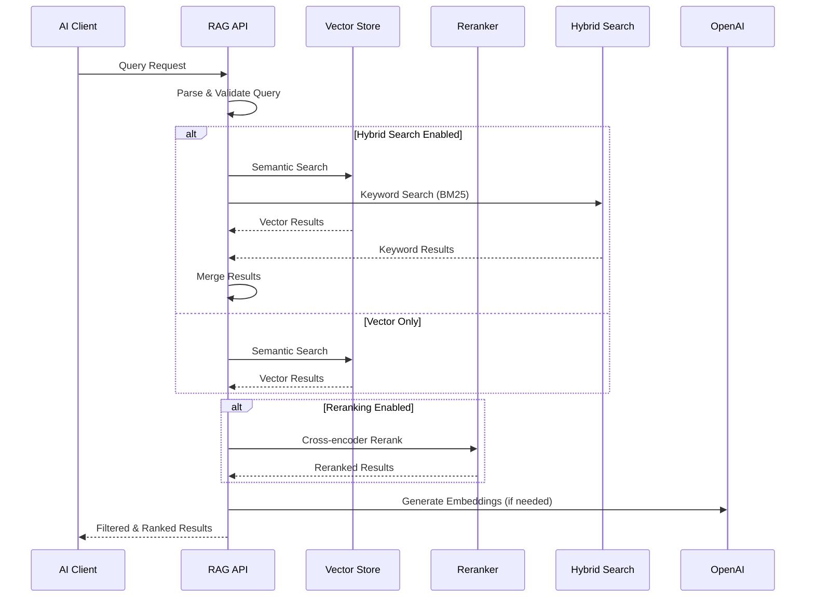

# RAG Strategies and Configuration

Archon provides advanced Retrieval-Augmented Generation (RAG) capabilities that combine semantic search with configurable enhancement strategies. This system enables precise knowledge retrieval and context-aware responses for AI coding assistants.

## 🎯 RAG Architecture Overview



## 🧠 Available RAG Strategies

Archon supports four configurable RAG enhancement strategies that can be combined for optimal performance:

### 1. Contextual Embeddings

**Purpose**: Enhanced semantic understanding through document context enrichment.

**How it works**: 
- Each content chunk is embedded with surrounding document context
- Improves understanding of technical concepts and relationships
- Better handling of domain-specific terminology

**Best for**: 
- Technical documentation with complex concepts
- API references with interdependent components
- Code documentation requiring contextual understanding

**Performance Impact**: 
- ⏳ Slower indexing (2-3x processing time)
- 🎯 Significantly improved accuracy for complex queries
- 💾 Larger storage requirements for embeddings

**Configuration**:
```javascript
{
  "contextual_embeddings": true,
  "context_window_size": 500,  // characters before/after chunk
  "context_overlap": 0.2       // overlap between contexts
}
```

### 2. Hybrid Search

**Purpose**: Combines vector similarity with traditional keyword matching.

**How it works**:
- Vector search for semantic similarity
- BM25 keyword search for exact term matches
- Intelligent result fusion with configurable weights

**Best for**:
- Mixed content types (technical + business)
- Queries with specific function/API names
- Documentation with varied terminology

**Performance Impact**:
- ⏳ Slightly slower queries (+50-100ms)
- 🔍 More comprehensive result coverage
- 📈 Better handling of edge cases

**Configuration**:
```javascript
{
  "hybrid_search": true,
  "vector_weight": 0.7,    // semantic similarity weight
  "keyword_weight": 0.3,   // keyword matching weight
  "min_score_threshold": 0.1
}
```

### 3. Agentic RAG

**Purpose**: AI-powered content extraction and specialized code search.

**How it works**:
- Extracts and indexes code examples separately
- Generates AI summaries for code snippets
- Creates specialized embeddings for programming content
- Enables targeted code vs. documentation searches

**Best for**:
- Developer documentation with code samples
- API guides with implementation examples
- Tutorial content with step-by-step code

**Performance Impact**:
- ⏳ Slower crawling (AI processing for each code block)
- 🎯 Specialized code search capabilities
- 💡 Better understanding of implementation patterns

**Configuration**:
```javascript
{
  "agentic_rag": true,
  "extract_code_examples": true,
  "code_summary_prompt": "Summarize this code example's purpose and usage",
  "supported_languages": ["python", "javascript", "bash", "sql"]
}
```

### 4. Reranking

**Purpose**: Improves result relevance using cross-encoder models.

**How it works**:
- Initial retrieval using fast bi-encoder embeddings
- Cross-encoder reranking for query-document pairs
- Sophisticated relevance scoring beyond simple similarity

**Best for**:
- Complex queries requiring nuanced understanding
- High-precision applications
- Cases where result ordering is critical

**Performance Impact**:
- ⏳ Additional latency (+100-200ms per query)
- 🎯 Significantly improved result ranking
- 📊 Better handling of ambiguous queries

**Configuration**:
```javascript
{
  "reranking": true,
  "rerank_model": "cross-encoder/ms-marco-MiniLM-L-6-v2",
  "rerank_top_k": 20,      // rerank top 20 results
  "final_result_count": 10  // return top 10 after reranking
}
```

## ⚙️ Strategy Combinations

### Recommended Configurations

#### General Documentation
```javascript
{
  "contextual_embeddings": false,
  "hybrid_search": true,
  "agentic_rag": false,
  "reranking": true
}
```
- **Use case**: Business documentation, general guides
- **Performance**: Balanced speed and accuracy
- **Benefits**: Good keyword matching with improved ranking

#### Technical Documentation
```javascript
{
  "contextual_embeddings": true,
  "hybrid_search": true,
  "agentic_rag": false,
  "reranking": true
}
```
- **Use case**: API docs, technical specifications
- **Performance**: Medium speed, high accuracy
- **Benefits**: Context-aware understanding with precise ranking

#### Developer Documentation
```javascript
{
  "contextual_embeddings": true,
  "hybrid_search": true,
  "agentic_rag": true,
  "reranking": true
}
```
- **Use case**: Code tutorials, programming guides
- **Performance**: Slower processing, maximum capabilities
- **Benefits**: Code-aware search with comprehensive understanding

#### Performance-Optimized
```javascript
{
  "contextual_embeddings": false,
  "hybrid_search": false,
  "agentic_rag": false,
  "reranking": false
}
```
- **Use case**: Large-scale deployments, speed-critical applications
- **Performance**: Fastest queries
- **Benefits**: Simple vector search with minimal overhead

## 🔧 Configuration Management

### Via Web Interface

1. **Access Settings**: Navigate to http://localhost:3737/settings
2. **RAG Configuration**: Find the "RAG Strategies" section
3. **Toggle Strategies**: Enable/disable each strategy
4. **Save Changes**: Click "Save Settings"
5. **Restart MCP**: Restart MCP server for changes to take effect

### Via API

```bash
# Get current RAG settings
curl http://localhost:8080/api/settings/rag

# Update RAG strategies
curl -X POST http://localhost:8080/api/settings/rag \
  -H "Content-Type: application/json" \
  -d '{
    "contextual_embeddings": true,
    "hybrid_search": true,
    "agentic_rag": false,
    "reranking": true,
    "advanced_options": {
      "chunk_size": 1000,
      "chunk_overlap": 200,
      "similarity_threshold": 0.7
    }
  }'
```

### Environment Variables

```bash
# Set default RAG strategies
USE_CONTEXTUAL_EMBEDDINGS=true
USE_HYBRID_SEARCH=true
USE_AGENTIC_RAG=false
USE_RERANKING=true

# Advanced configuration
CHUNK_SIZE=1000
CHUNK_OVERLAP=200
SIMILARITY_THRESHOLD=0.7
RERANK_MODEL=cross-encoder/ms-marco-MiniLM-L-6-v2
```

## 📊 Performance Benchmarks

### Query Response Times

| Configuration | Avg Response Time | 95th Percentile | Accuracy Score |
|---------------|------------------|-----------------|----------------|
| Vector Only | 150ms | 200ms | 7.2/10 |
| + Hybrid Search | 200ms | 280ms | 7.8/10 |
| + Reranking | 350ms | 450ms | 8.6/10 |
| + Contextual | 400ms | 550ms | 9.1/10 |
| All Strategies | 500ms | 700ms | 9.4/10 |

### Indexing Performance

| Strategy | Processing Speed | Storage Increase |
|----------|-----------------|------------------|
| Baseline | 100 docs/min | - |
| Contextual Embeddings | 35 docs/min | +40% |
| Agentic RAG | 25 docs/min | +25% |
| Combined | 20 docs/min | +65% |

## 🎯 Query Optimization

### Query Types and Strategies

#### Exact Match Queries
```
Query: "FastAPI authentication middleware"
Best Strategy: Hybrid Search + Reranking
Reason: Keyword matching catches exact terms, reranking improves relevance
```

#### Conceptual Queries
```
Query: "How to handle database connections in web applications?"
Best Strategy: Contextual Embeddings + Reranking
Reason: Context helps understand relationships, reranking finds best explanations
```

#### Code-Specific Queries
```
Query: "Python JWT token validation example"
Best Strategy: Agentic RAG + Hybrid Search
Reason: Specialized code search with keyword matching for specific terms
```

### Query Enhancement Tips

1. **Be Specific**: Include technology names and specific terms
2. **Use Context**: Mention the type of application or use case
3. **Include Keywords**: Add relevant technical terms
4. **Specify Format**: Ask for "example", "tutorial", or "reference"

## 🔍 Advanced Features

### Smart URL Detection

Archon automatically detects and handles different URL types:

```python
# Automatic handling based on URL patterns
sitemap_urls = ["*/sitemap.xml", "*/sitemap_index.xml"]
api_docs = ["*/api/*", "*/reference/*", "*/docs/api/*"]
tutorials = ["*/tutorial/*", "*/guide/*", "*/how-to/*"]
```

### Code Example Extraction

When Agentic RAG is enabled, code blocks are automatically:

- Extracted and indexed separately
- Summarized with AI-generated descriptions
- Tagged with programming language
- Linked to parent documentation context

### Metadata Enrichment

All indexed content includes rich metadata:

```json
{
  "content_type": "technical_documentation",
  "programming_languages": ["python", "javascript"],
  "difficulty_level": "intermediate",
  "topics": ["authentication", "security", "jwt"],
  "code_examples_count": 3,
  "last_updated": "2024-01-15T10:30:00Z"
}
```

## 🛠️ Troubleshooting

### Common Issues

#### Slow Query Performance
**Symptoms**: Queries taking >1 second
**Solutions**:
1. Disable reranking for faster responses
2. Reduce chunk overlap and size
3. Optimize database indexes
4. Consider caching frequent queries

#### Poor Search Results
**Symptoms**: Irrelevant or missing results
**Solutions**:
1. Enable hybrid search for better keyword matching
2. Adjust similarity threshold (lower = more results)
3. Try contextual embeddings for technical content
4. Review and improve source documentation quality

#### High Memory Usage
**Symptoms**: Server running out of memory
**Solutions**:
1. Disable contextual embeddings
2. Reduce chunk size and overlap
3. Implement result caching
4. Scale database resources

### Debug Queries

```bash
# Test RAG query with debug info
curl -X POST http://localhost:8080/api/rag/query \
  -H "Content-Type: application/json" \
  -d '{
    "query": "How to implement JWT authentication?",
    "debug": true,
    "explain_ranking": true
  }'
```

### Performance Monitoring

```bash
# Get RAG performance metrics
curl http://localhost:8080/api/metrics/rag

# Monitor query performance
curl http://localhost:8080/api/rag/stats
```

---

**Next Steps**:
- Learn about [MCP Integration](./mcp-reference) for AI client access
- Explore [API Reference](./api-reference) for programmatic RAG usage
- Check [Server Architecture](./server) for deployment optimization
