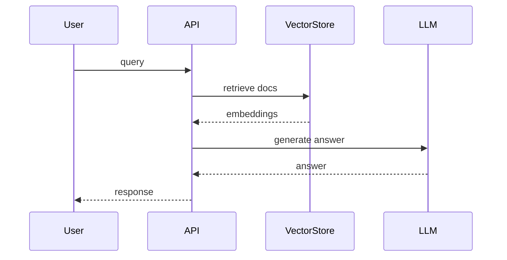

# RAG (Retrieval-Augmented Generation)

Combines vector retrieval with LLM generation.

## Pipeline Overview



## Configuration

| Env Var                   | Purpose                          | Default |
|---------------------------|----------------------------------|---------|
| USE_CONTEXTUAL_EMBEDDINGS | Toggle contextual embeddings      | false   |
| USE_HYBRID_SEARCH         | Hybrid BM25 + vector search      | false   |

## Code Snippet

```python
from services.vector import retrieve
from services.llm import generate

def rag_query(query: str) -> str:
    docs = retrieve(query)
    return generate(query, docs)
```
