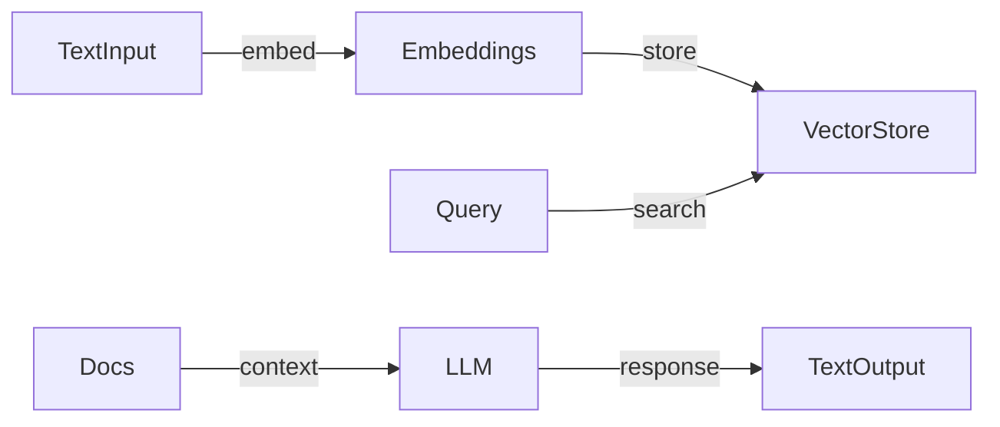

# RAG Overview

The RAG pipeline enriches LLM responses with real-time retrieved documents.

## Components

1. **Vector Store** (Elasticsearch)
2. **Embeddings** (OpenAI)
3. **Retrieval**
4. **Generation**

