import Tabs from '@theme/Tabs';
import TabItem from '@theme/TabItem';
import Admonition from '@theme/Admonition';

# 🧠 RAG System & Intelligent Vector Search

<div className="hero hero--primary">
  <div className="container">
    <h2 className="hero__subtitle">
      **Production-ready RAG** with real-time Logfire monitoring, intelligent vector search, and comprehensive threading optimizations
    </h2>
  </div>
</div>

Archon's Retrieval-Augmented Generation (RAG) system combines semantic search with configurable enhancement strategies, now featuring **comprehensive Logfire monitoring** and **optimized threading patterns** for real-time debugging and peak performance.

<Admonition type="tip" icon="🎉" title="Fully Operational RAG System">
The RAG system is **now fully functional** with 14 MCP tools enabled, comprehensive error handling, threading optimizations, and real-time monitoring via Logfire dashboard.
</Admonition>

## 🏗️ RAG Architecture with Monitoring

```mermaid
%%{init:{
  'theme':'base',
  'themeVariables': {
    'primaryColor':'#1f2937',
    'primaryTextColor':'#ffffff',
    'primaryBorderColor':'#8b5cf6',
    'lineColor':'#a855f7',
    'textColor':'#ffffff',
    'fontFamily':'Inter',
    'fontSize':'14px',
    'background':'#000000',
    'mainBkg':'#1f2937',
    'secondBkg':'#111827',
    'borderColor':'#8b5cf6',
    'actorBkg':'#1f2937',
    'actorBorder':'#8b5cf6',
    'actorTextColor':'#ffffff',
    'activationBkgColor':'#111827',
    'activationBorderColor':'#a855f7',
    'sequenceNumberColor':'#a855f7'
  }
}}%%
sequenceDiagram
    participant Client as 🤖 AI Agent
    participant MCP as 🔧 MCP Server
    participant RAG as 🧠 RAG Module
    participant Logfire as 🔥 Logfire
    participant Vector as 🗄️ Supabase Vector
    participant OpenAI as 🤖 OpenAI API

    Client->>MCP: RAG Query Request
    MCP->>Logfire: Start Query Span
    MCP->>RAG: Process Query
    
    RAG->>Logfire: Log Query Processing
    RAG->>OpenAI: Generate Embeddings
    OpenAI-->>RAG: Query Embedding Vector
    
    RAG->>Logfire: Log Embedding Generation
    RAG->>Vector: Vector Similarity Search
    Note over Vector: match_crawled_pages RPC
    Vector-->>RAG: Matching Documents
    
    RAG->>Logfire: Log Search Results
    RAG->>RAG: Filter & Rank Results
    RAG-->>MCP: Formatted Results
    
    MCP->>Logfire: Complete Query Span
    MCP-->>Client: RAG Response with Sources
```



## ⚡ RAG Threading & Concurrency Architecture

<Admonition type="warning" title="🚨 Critical: RAG Threading Architecture">
RAG operations involve CPU-intensive embedding generation, I/O-bound vector searches, and real-time Socket.IO updates. Proper threading patterns are essential for performance and stability.
</Admonition>

The RAG system implements sophisticated threading patterns derived from the proven `crawl4ai_mcp.py` architecture, ensuring high performance while maintaining Socket.IO connection health.

### 🧠 Embedding Generation Threading

<Tabs>
<TabItem value="contextual" label="🎯 Contextual Embeddings" default>

**ThreadPoolExecutor for CPU-Intensive Operations**
```python title="✅ Proven: Contextual embedding generation"
import asyncio
from concurrent.futures import ThreadPoolExecutor
from tenacity import retry, stop_after_attempt, wait_exponential

class ContextualEmbeddingGenerator:
    """Thread-safe contextual embedding generation"""
    
    def __init__(self, max_workers=2, context_size=5000):
        self.max_workers = max_workers
        self.context_size = context_size
        self.executor = ThreadPoolExecutor(max_workers=max_workers)
        self.semaphore = asyncio.Semaphore(2)  # Rate limiting
    
    @retry(
        stop=stop_after_attempt(3),
        wait=wait_exponential(multiplier=1, min=4, max=10)
    )
    async def generate_contextual_embedding(self, text: str, context: str = "") -> List[float]:
        """Generate contextual embedding with rate limiting and retry logic"""
        
        async with self.semaphore:  # Limit concurrent OpenAI calls
            # Prepare contextual text (CPU-intensive)
            contextual_text = await asyncio.get_event_loop().run_in_executor(
                self.executor, self._prepare_contextual_text, text, context
            )
            
            # Generate embedding via OpenAI
            response = await openai.Embedding.acreate(
                input=contextual_text,
                model="text-embedding-3-small"
            )
            
            return response['data'][0]['embedding']
    
    def _prepare_contextual_text(self, text: str, context: str) -> str:
        """CPU-intensive context preparation (runs in thread pool)"""
        # Complex text processing, chunking, context injection
        enhanced_text = f"Context: {context[:self.context_size]}\n\nContent: {text}"
        return self._smart_truncate(enhanced_text, self.context_size)
    
    async def batch_generate_embeddings(
        self, 
        documents: List[dict], 
        socketio_connection = None
    ) -> List[List[float]]:
        """Generate embeddings for multiple documents with progress tracking"""
        
        total_docs = len(documents)
        embeddings = []
        
        # Process in batches to avoid overwhelming OpenAI API
        batch_size = 15  # Optimized for rate limits
        
        for batch_start in range(0, total_docs, batch_size):
            batch = documents[batch_start:batch_start + batch_size]
            
            # Generate embeddings concurrently within rate limits
            batch_tasks = [
                self.generate_contextual_embedding(
                    doc['content'], 
                    doc.get('context', '')
                ) for doc in batch
            ]
            
            # Execute with controlled concurrency
            batch_embeddings = await asyncio.gather(*batch_tasks)
            embeddings.extend(batch_embeddings)
            
            # Progress reporting
            progress = ((batch_start + len(batch)) / total_docs) * 100
            if websocket:
                await websocket.send_json({
                    "type": "embedding_progress",
                    "percentage": progress,
                    "batch": f"Batch {batch_start//batch_size + 1}",
                    "processed": len(embeddings),
                    "total": total_docs
                })
            
            # Yield control for Socket.IO health
            await asyncio.sleep(0.2)
        
        return embeddings
```

</TabItem>
<TabItem value="rate-limiting" label="🎛️ Rate Limiting">

**Smart Rate Limiting for OpenAI API**
```python title="✅ Production: OpenAI rate limiting patterns"
import asyncio
import time
from collections import deque
from dataclasses import dataclass

@dataclass
class RateLimitConfig:
    """Configuration for OpenAI API rate limiting"""
    tokens_per_minute: int = 200_000  # OpenAI embedding limit
    requests_per_minute: int = 3000   # Request rate limit
    max_concurrent: int = 2           # Concurrent request limit

class OpenAIRateLimiter:
    """Thread-safe rate limiter for OpenAI API calls"""
    
    def __init__(self, config: RateLimitConfig):
        self.config = config
        self.request_times = deque()
        self.token_usage = deque()
        self.semaphore = asyncio.Semaphore(config.max_concurrent)
        self._lock = asyncio.Lock()
    
    async def acquire(self, estimated_tokens: int = 8000) -> bool:
        """Acquire permission to make API call with token awareness"""
        
        async with self._lock:
            now = time.time()
            
            # Clean old entries (older than 1 minute)
            self._clean_old_entries(now)
            
            # Check if we can make the request
            if not self._can_make_request(estimated_tokens):
                # Calculate wait time
                wait_time = self._calculate_wait_time(estimated_tokens)
                if wait_time > 0:
                    await asyncio.sleep(wait_time)
                    return await self.acquire(estimated_tokens)  # Retry
                return False
            
            # Record the request
            self.request_times.append(now)
            self.token_usage.append((now, estimated_tokens))
            
            return True
    
    def _can_make_request(self, estimated_tokens: int) -> bool:
        """Check if request can be made within limits"""
        # Check request rate limit
        if len(self.request_times) >= self.config.requests_per_minute:
            return False
        
        # Check token usage limit
        current_tokens = sum(tokens for _, tokens in self.token_usage)
        if current_tokens + estimated_tokens > self.config.tokens_per_minute:
            return False
        
        return True
    
    def _clean_old_entries(self, current_time: float):
        """Remove entries older than 1 minute"""
        cutoff_time = current_time - 60
        
        # Clean request times
        while self.request_times and self.request_times[0] < cutoff_time:
            self.request_times.popleft()
        
        # Clean token usage
        while self.token_usage and self.token_usage[0][0] < cutoff_time:
            self.token_usage.popleft()
    
    def _calculate_wait_time(self, estimated_tokens: int) -> float:
        """Calculate how long to wait before retrying"""
        if not self.request_times:
            return 0
        
        # Wait until we can make another request
        oldest_request = self.request_times[0]
        time_since_oldest = time.time() - oldest_request
        
        if time_since_oldest < 60:
            return 60 - time_since_oldest + 0.1  # Small buffer
        
        return 0
```

</TabItem>
<TabItem value="memory-adaptive" label="🧠 Memory Adaptive Processing">

**Memory-Aware Concurrent Processing (From crawl4ai_mcp.py)**
```python title="✅ Proven: Memory adaptive dispatcher"
import psutil
from typing import Dict, Any

class MemoryAdaptiveDispatcher:
    """Dynamically adjust concurrency based on memory usage"""
    
    def __init__(self, base_concurrency: int = 2, memory_threshold: float = 0.8):
        self.base_concurrency = base_concurrency
        self.memory_threshold = memory_threshold
        self.current_concurrency = base_concurrency
        
    def get_optimal_concurrency(self) -> int:
        """Calculate optimal concurrency based on current memory usage"""
        memory_percent = psutil.virtual_memory().percent / 100.0
        
        if memory_percent > self.memory_threshold:
            # Reduce concurrency when memory is high
            self.current_concurrency = max(1, self.base_concurrency // 2)
        elif memory_percent < 0.5:
            # Increase concurrency when memory is low
            self.current_concurrency = min(self.base_concurrency * 2, 8)
        else:
            # Use base concurrency
            self.current_concurrency = self.base_concurrency
        
        return self.current_concurrency
    
    async def process_documents_adaptive(
        self, 
        documents: List[dict], 
        process_func: callable,
        socketio_connection = None
    ) -> List[Any]:
        """Process documents with adaptive concurrency"""
        
        results = []
        optimal_concurrency = self.get_optimal_concurrency()
        semaphore = asyncio.Semaphore(optimal_concurrency)
        
        async def process_single(doc: dict, index: int) -> Any:
            async with semaphore:
                try:
                    result = await process_func(doc)
                    
                    # Progress reporting
                    if websocket:
                        await websocket.send_json({
                            "type": "processing_progress",
                            "processed": index + 1,
                            "total": len(documents),
                            "percentage": ((index + 1) / len(documents)) * 100,
                            "memory_usage": psutil.virtual_memory().percent,
                            "current_concurrency": optimal_concurrency
                        })
                    
                    return result
                    
                except Exception as e:
                    logfire.error(f"Document processing failed: {e}")
                    return None
        
        # Create tasks for all documents
        tasks = [
            process_single(doc, idx) 
            for idx, doc in enumerate(documents)
        ]
        
        # Execute with adaptive concurrency
        results = await asyncio.gather(*tasks, return_exceptions=True)
        
        # Filter out failed results
        successful_results = [r for r in results if r is not None and not isinstance(r, Exception)]
        
        return successful_results
```

</TabItem>
</Tabs>

### 🗄️ Vector Search Optimization

**High-Performance Database Operations with Connection Pooling**
```python title="✅ Optimized: Vector search with connection pooling"
import asyncpg
from typing import List, Optional

class OptimizedVectorSearch:
    """High-performance vector search with connection pooling"""
    
    def __init__(self, pool_size=10, max_overflow=20):
        self.pool = None
        self.pool_size = pool_size
        self.max_overflow = max_overflow
        self._query_cache = {}
    
    async def initialize_pool(self):
        """Initialize connection pool for vector operations"""
        self.pool = await asyncpg.create_pool(
            dsn=DATABASE_URL,
            min_size=self.pool_size,
            max_size=self.pool_size + self.max_overflow,
            command_timeout=30,
            server_settings={
                'jit': 'off',  # Disable JIT for consistent performance
                'shared_preload_libraries': 'pg_stat_statements',
                'work_mem': '256MB',  # Increase work memory for vector operations
                'maintenance_work_mem': '512MB',
            }
        )
    
    async def parallel_vector_search(
        self, 
        queries: List[List[float]], 
        match_count: int = 5,
        source_filter: Optional[str] = None
    ) -> List[List[dict]]:
        """Perform multiple vector searches in parallel"""
        
        if not self.pool:
            await self.initialize_pool()
        
        # Create tasks for parallel execution
        search_tasks = [
            self._single_vector_search(query, match_count, source_filter)
            for query in queries
        ]
        
        # Execute searches concurrently
        results = await asyncio.gather(*search_tasks)
        return results
    
    async def _single_vector_search(
        self, 
        query_embedding: List[float], 
        match_count: int,
        source_filter: Optional[str] = None
    ) -> List[dict]:
        """Perform single vector search with connection from pool"""
        
        async with self.pool.acquire() as conn:
            # Use optimized vector search function
            if source_filter:
                query = """
                    SELECT id, content, url, title, source, 
                           (content_vector <=> $1::vector) as similarity
                    FROM crawled_pages 
                    WHERE source = $3
                    ORDER BY content_vector <=> $1::vector 
                    LIMIT $2
                """
                params = [query_embedding, match_count, source_filter]
            else:
                query = """
                    SELECT id, content, url, title, source, 
                           (content_vector <=> $1::vector) as similarity
                    FROM crawled_pages 
                    ORDER BY content_vector <=> $1::vector 
                    LIMIT $2
                """
                params = [query_embedding, match_count]
            
            # Execute with prepared statement for performance
            rows = await conn.fetch(query, *params)
            
            return [
                {
                    'id': row['id'],
                    'content': row['content'],
                    'url': row['url'],
                    'title': row['title'],
                    'source': row['source'],
                    'similarity_score': 1 - row['similarity']  # Convert distance to similarity
                }
                for row in rows
            ]
    
    async def batch_insert_embeddings(
        self, 
        documents_with_embeddings: List[dict]
    ) -> int:
        """Batch insert documents with embeddings for optimal performance"""
        
        if not self.pool:
            await self.initialize_pool()
        
        async with self.pool.acquire() as conn:
            # Use COPY for bulk inserts (much faster than individual INSERTs)
            insert_query = """
                INSERT INTO crawled_pages 
                (url, title, content, content_vector, source, metadata)
                VALUES ($1, $2, $3, $4, $5, $6)
            """
            
            # Prepare data for batch insert
            insert_data = [
                (
                    doc['url'],
                    doc['title'],
                    doc['content'],
                    doc['embedding'],
                    doc['source'],
                    doc.get('metadata', {})
                )
                for doc in documents_with_embeddings
            ]
            
            # Execute batch insert
            result = await conn.executemany(insert_query, insert_data)
            return len(insert_data)
```

### 🎯 Complete RAG Threading Architecture

**Integrated Threading Engine**
```python title="✅ Production: Complete RAG engine with optimized threading"
class ThreadedRAGEngine:
    """Complete RAG engine with optimized threading"""
    
    def __init__(self):
        self.embedding_generator = ContextualEmbeddingGenerator()
        self.vector_search = OptimizedVectorSearch()
        self.rate_limiter = OpenAIRateLimiter(RateLimitConfig())
        self.memory_dispatcher = MemoryAdaptiveDispatcher()
    
    async def perform_threaded_rag_query(
        self, 
        query: str, 
        source: Optional[str] = None,
        match_count: int = 5,
        socketio_connection = None
    ) -> dict:
        """Complete RAG query with optimized threading"""
        
        with logfire.span("threaded_rag_query") as span:
            span.set_attribute("query", query)
            span.set_attribute("source", source or "all")
            span.set_attribute("match_count", match_count)
            
            try:
                # 1. Generate query embedding (rate-limited)
                start_time = time.time()
                async with self.rate_limiter.semaphore:
                    query_embedding = await self._generate_query_embedding(query)
                
                embedding_time = time.time() - start_time
                span.set_attribute("embedding_time_ms", embedding_time * 1000)
                
                # 2. Perform vector search (connection pooled)
                search_start = time.time()
                search_results = await self.vector_search._single_vector_search(
                    query_embedding, match_count, source
                )
                
                search_time = time.time() - search_start
                span.set_attribute("search_time_ms", search_time * 1000)
                
                # 3. Process and rank results (adaptive concurrency)
                processing_start = time.time()
                processed_results = await self._process_search_results(search_results)
                
                processing_time = time.time() - processing_start
                span.set_attribute("processing_time_ms", processing_time * 1000)
                span.set_attribute("results_found", len(processed_results))
                span.set_attribute("success", True)
                
                total_time = time.time() - start_time
                span.set_attribute("total_time_ms", total_time * 1000)
                
                return {
                    "success": True,
                    "results": processed_results,
                    "query": query,
                    "source": source,
                    "total_found": len(processed_results),
                    "performance": {
                        "embedding_time_ms": embedding_time * 1000,
                        "search_time_ms": search_time * 1000,
                        "processing_time_ms": processing_time * 1000,
                        "total_time_ms": total_time * 1000
                    }
                }
                
            except Exception as e:
                span.set_attribute("success", False)
                span.set_attribute("error", str(e))
                logfire.error(f"RAG query failed: {e}")
                raise
    
    async def _process_search_results(self, results: List[dict]) -> List[dict]:
        """Process search results with adaptive concurrency"""
        if len(results) > 20:  # Use thread pool for large result sets
            return await self.memory_dispatcher.process_documents_adaptive(
                results, self._process_single_result
            )
        else:
            return results  # Small result sets can be processed directly
    
    async def _process_single_result(self, result: dict) -> dict:
        """Process a single search result (can run in thread pool)"""
        # CPU-intensive operations: content enhancement, relevance scoring
        loop = asyncio.get_event_loop()
        
        enhanced_result = await loop.run_in_executor(
            None, self._enhance_result_sync, result
        )
        
        return enhanced_result
    
    def _enhance_result_sync(self, result: dict) -> dict:
        """Synchronous result enhancement (runs in thread pool)"""
        # CPU-intensive operations: reranking, content enhancement, etc.
        result['processed_content'] = self._enhance_content(result['content'])
        result['relevance_score'] = self._calculate_relevance(result)
        result['keywords'] = self._extract_keywords(result['content'])
        
        return result
    
    def _enhance_content(self, content: str) -> str:
        """Enhance content with formatting and highlighting"""
        # Add semantic highlighting, formatting improvements
        return content  # Placeholder for actual enhancement
    
    def _calculate_relevance(self, result: dict) -> float:
        """Calculate relevance score based on multiple factors"""
        # Combine similarity score with other factors
        base_score = result.get('similarity_score', 0)
        
        # Factor in content length, source quality, recency, etc.
        length_factor = min(len(result['content']) / 1000, 1.0)
        source_factor = 1.0  # Could be based on source reputation
        
        return base_score * 0.7 + length_factor * 0.2 + source_factor * 0.1
    
    def _extract_keywords(self, content: str) -> List[str]:
        """Extract keywords from content (CPU-intensive)"""
        # Simple keyword extraction - could use NLP libraries
        import re
        words = re.findall(r'\b\w{4,}\b', content.lower())
        return list(set(words))[:10]  # Top 10 unique keywords
```

## 🔍 Using perform_rag_query

### Basic Search

The `perform_rag_query` tool is the primary interface for semantic search across your knowledge base:

```javascript title="Basic RAG Query"
// Simple search across all sources
await mcp.callTool('perform_rag_query', {
  query: "authentication best practices",
  match_count: 5  // Optional, defaults to 5
});
```

### Filtered Search by Source

Filter results to specific domains or sources:

```javascript title="Source-Filtered Search"
// Search only within a specific domain
await mcp.callTool('perform_rag_query', {
  query: "MCP session management",
  source: "modelcontextprotocol.io",  // Filter by domain
  match_count: 10
});

// Get available sources first
const sources = await mcp.callTool('get_available_sources', {});
// Returns: ["ai.pydantic.dev", "modelcontextprotocol.io", ...]
```

### Advanced Usage Examples

<Tabs>
<TabItem value="technical" label="Technical Documentation" default>

```javascript
// Search for technical implementation details
await mcp.callTool('perform_rag_query', {
  query: "SSE transport implementation MCP protocol",
  source: "modelcontextprotocol.io",
  match_count: 5
});

// Response includes:
// - Matched content chunks
// - Source URLs
// - Similarity scores
// - Metadata (headers, context)
```

</TabItem>
<TabItem value="code" label="Code Examples">

```javascript
// Search for code examples
await mcp.callTool('search_code_examples', {
  query: "React hooks useState useEffect",
  source_id: "react.dev",  // Optional source filter
  match_count: 10
});

// Returns:
// - Code snippets with syntax highlighting
// - AI-generated summaries
// - Full context (before/after code)
// - Source file information
```

</TabItem>
<TabItem value="multi-source" label="Multi-Source Search">

```javascript
// Search across all indexed sources
const results = await mcp.callTool('perform_rag_query', {
  query: "best practices for API design REST GraphQL",
  // No source filter - searches everything
  match_count: 15
});

// Group results by source
const groupedResults = results.reduce((acc, result) => {
  const source = result.metadata.source;
  if (!acc[source]) acc[source] = [];
  acc[source].push(result);
  return acc;
}, {});
```

</TabItem>
</Tabs>

## 🎯 Advanced RAG Strategies

### 1. Contextual Embeddings

**Enhanced semantic understanding through document context enrichment**

```python
# Configuration for contextual embeddings
contextual_config = {
    "USE_CONTEXTUAL_EMBEDDINGS": "true",
    "CONTEXTUAL_EMBEDDINGS_CONTEXT_SIZE": "5000",  # Reduced from 25k to avoid rate limits
    "CONTEXTUAL_EMBEDDINGS_MAX_WORKERS": "2",       # Parallel processing workers
    "MODEL_CHOICE": "gpt-4o-nano"                   # Optimized for embeddings
}
```

**Key Improvements:**
- 🎯 **Optimized Context Window**: 5k characters provides sufficient context while staying within OpenAI's 200k tokens/minute limit
- 🔄 **Parallel Processing**: 2 workers balance speed and rate limit compliance
- 📊 **Token Usage**: ~7-8k tokens per embedding request with 5k context
- ⚡ **Batch Processing**: 15-document batches with smart progress reporting

**Benefits:**
- 🎯 Improved understanding of technical concepts
- 🔗 Better handling of cross-references
- 📚 Enhanced domain-specific terminology recognition
- 🚀 No more rate limiting errors (429)

### 2. Intelligent Source Filtering

**Domain-specific knowledge retrieval with source attribution**

```python
# Available sources can be retrieved
sources = await mcp_archon_get_available_sources()

# Filter by specific source
filtered_results = await mcp_archon_perform_rag_query(
    query="async programming patterns",
    source="ai.pydantic.dev"  # Only search Pydantic AI docs
)
```

### 3. Code-Specific Search

**Specialized search for code examples and implementations**

```python
# Search specifically for code examples
code_results = await mcp_archon_search_code_examples(
    query="dependency injection with agents",
    source_id="ai.pydantic.dev",
    match_count=5
)
```

**Features:**
- 💻 Language-specific code extraction
- 📝 AI-generated code summaries
- 🔍 Implementation pattern recognition

## ⚡ Performance Optimization & Threading Best Practices

<Admonition type="info" title="🏗️ Architecture Principles">

**Backend Threading (Preserve Original Patterns):**
- ✅ **ThreadPoolExecutor** for CPU-intensive tasks (AI summaries, embeddings)
- ✅ **MemoryAdaptiveDispatcher** for smart concurrency control
- ✅ **Batch processing** with exponential backoff retry logic
- ✅ **Connection pooling** for database operations

**Frontend Socket.IO Safety:**
- ✅ **Socket.IO-safe threading utilities** for UI responsiveness
- ✅ **Rate limiting and yielding** to prevent connection drops
- ✅ **Progress reporting** with smooth updates

</Admonition>

### Query Performance Metrics

<Admonition type="success" icon="📊" title="Current Performance">
- **Average Query Time**: 200-300ms
- **Embedding Generation**: 80-120ms  
- **Vector Search**: 100-150ms
- **Result Processing**: 20-30ms
- **Batch Processing**: 15 documents per batch
- **Context Window**: 5,000 characters (optimized)
- **Memory Usage**: Adaptive based on system load
- **Concurrency**: 2-8 workers (memory adaptive)
</Admonition>

### Threading Safety Guidelines

<Tabs>
<TabItem value="backend" label="🔧 Backend Patterns" default>

**Proven Patterns from crawl4ai_mcp.py**
```python title="✅ Keep These Backend Patterns"
# 1. ThreadPoolExecutor for CPU-intensive work
executor = ThreadPoolExecutor(max_workers=2)
await loop.run_in_executor(executor, cpu_intensive_function, data)

# 2. Async semaphores for rate limiting
semaphore = asyncio.Semaphore(2)
async with semaphore:
    await api_call()

# 3. Batch processing with memory awareness
class MemoryAdaptiveDispatcher:
    def get_optimal_concurrency(self) -> int:
        memory_percent = psutil.virtual_memory().percent / 100.0
        if memory_percent > 0.8:
            return max(1, self.base_concurrency // 2)
        return self.base_concurrency

# 4. Exponential backoff for retries
@retry(
    stop=stop_after_attempt(3),
    wait=wait_exponential(multiplier=1, min=4, max=10)
)
async def resilient_operation():
    pass
```

</TabItem>
<TabItem value="database" label="🗄️ Database Optimization">

**Connection Pooling & Query Optimization**
```python title="✅ Production Database Patterns"
# 1. Connection pooling for performance
pool = await asyncpg.create_pool(
    dsn=DATABASE_URL,
    min_size=10,
    max_size=30,
    command_timeout=30,
    server_settings={
        'jit': 'off',  # Consistent performance
        'work_mem': '256MB',  # Vector operations
        'maintenance_work_mem': '512MB',
    }
)

# 2. Batch operations for efficiency
async def batch_insert_embeddings(documents):
    async with pool.acquire() as conn:
        await conn.executemany(insert_query, batch_data)

# 3. Optimized vector indexes
"""
CREATE INDEX CONCURRENTLY crawled_pages_vector_cosine_idx 
ON crawled_pages 
USING ivfflat (content_vector vector_cosine_ops)
WITH (lists = 100);
"""
```

</TabItem>
<TabItem value="monitoring" label="📊 Performance Monitoring">

**Logfire Integration for Real-Time Monitoring**
```python title="✅ Production Monitoring"
async def monitored_rag_operation():
    with logfire.span("rag_query") as span:
        # Track performance metrics
        start_time = time.time()
        
        span.set_attribute("query", query)
        span.set_attribute("source", source)
        
        try:
            # Perform operation
            result = await rag_operation()
            
            # Log success metrics
            span.set_attribute("results_count", len(result))
            span.set_attribute("processing_time_ms", 
                             (time.time() - start_time) * 1000)
            span.set_attribute("success", True)
            
            return result
            
        except Exception as e:
            span.record_exception(e)
            span.set_attribute("error", str(e))
            raise
```

</TabItem>
</Tabs>

## 📈 Progress Reporting & Real-Time Updates

### Socket.IO-Based Progress Tracking

**Smooth, real-time progress updates during document processing**

```javascript
// Socket.IO connection for progress updates
const socket = io('/crawl', { path: '/socket.io' });
socket.emit('subscribe', { progress_id: progressId });

ws.onmessage = (event) => {
  const progress = JSON.parse(event.data);
  // Progress shows smooth 0-100% across all batches
  console.log(`${progress.log} - ${progress.percentage}%`);
};
```

**Progress Reporting Features:**
- 📊 **Smooth Progress**: Linear progression from 0-100% across all document batches
- 📦 **Batch Details**: "Batch 1/9: Processing items 1-15..." with accurate percentages
- 🔄 **Real-Time Updates**: Socket.IO broadcasts for each processing step
- ⏱️ **No Progress Jumps**: Fixed the issue of progress bar resetting between batches
- 🧠 **Memory Awareness**: Progress includes memory usage and adaptive concurrency

## 🗄️ Vector Database Schema

### Supabase Functions

<Admonition type="info" icon="🛠️" title="Function Overloading Resolution">
The system now correctly handles Supabase function overloading by using the appropriate `source_filter` parameter when filtering by source domain.
</Admonition>

**Primary Search Function**
```sql
-- Basic vector similarity search
match_crawled_pages(
  query_embedding vector,
  match_count integer,
  filter jsonb
)

-- Source-filtered search (used when source parameter provided)
match_crawled_pages(
  query_embedding vector,
  match_count integer,  
  filter jsonb,
  source_filter text
)
```

### Database Tables

<Tabs>
<TabItem value="crawled_pages" label="📄 crawled_pages">

```sql
CREATE TABLE crawled_pages (
  id uuid PRIMARY KEY DEFAULT gen_random_uuid(),
  url text NOT NULL,
  title text,
  content text NOT NULL,
  content_vector vector(1536), -- OpenAI embedding dimension
  source text NOT NULL,
  crawled_at timestamp WITH time zone DEFAULT now(),
  chunk_index integer DEFAULT 0,
  metadata jsonb DEFAULT '{}'::jsonb
);

-- Vector similarity index
CREATE INDEX crawled_pages_content_vector_idx 
ON crawled_pages 
USING ivfflat (content_vector vector_cosine_ops);
```

</TabItem>
<TabItem value="sources" label="🌐 sources">

```sql
CREATE TABLE sources (
  id uuid PRIMARY KEY DEFAULT gen_random_uuid(),
  domain text UNIQUE NOT NULL,
  name text NOT NULL,
  description text,
  last_crawled timestamp WITH time zone,
  total_pages integer DEFAULT 0,
  status text DEFAULT 'active'
);
```

</TabItem>
<TabItem value="code_examples" label="💻 code_examples">

```sql
CREATE TABLE code_examples (
  id uuid PRIMARY KEY DEFAULT gen_random_uuid(),
  source_url text NOT NULL,
  language text NOT NULL,
  code_content text NOT NULL,
  summary text,
  embedding vector(1536),
  source_id uuid REFERENCES sources(id),
  created_at timestamp WITH time zone DEFAULT now()
);
```

</TabItem>
</Tabs>

## 🔧 Troubleshooting Guide

### Common Issues and Solutions

<Tabs>
<TabItem value="threading" label="🧵 Threading Issues">

**Socket.IO Disconnects During Processing**
```python
# ❌ Blocking operation that kills Socket.IO connections
def blocking_cpu_work():
    # Heavy computation without yielding
    pass

# ✅ Thread-safe alternative
async def websocket_safe_processing():
    loop = asyncio.get_event_loop()
    result = await loop.run_in_executor(
        ThreadPoolExecutor(max_workers=2),
        cpu_intensive_work
    )
    
    # Yield control for WebSocket health
    await asyncio.sleep(0.1)
    return result
```

**Solution**: Use ThreadPoolExecutor for CPU-intensive work and yield control regularly.

</TabItem>
<TabItem value="performance" label="⚡ Performance Issues">

**Slow Embedding Generation**

**Debugging Steps:**
1. **Check Rate Limiting**
   ```python
   # Monitor rate limiter status
   limiter = OpenAIRateLimiter(config)
   can_proceed = await limiter.acquire(estimated_tokens=8000)
   ```

2. **Memory Usage Monitoring**
   ```python
   # Check memory adaptive dispatcher
   dispatcher = MemoryAdaptiveDispatcher()
   optimal_workers = dispatcher.get_optimal_concurrency()
   print(f"Using {optimal_workers} workers")
   ```

3. **Database Connection Pool**
   ```python
   # Monitor pool health
   pool_status = {
       "size": pool.get_size(),
       "idle": pool.get_idle_size(),
       "used": pool.get_size() - pool.get_idle_size()
   }
   ```

</TabItem>
<TabItem value="memory" label="🧠 Memory Issues">

**High Memory Usage During Processing**

**Memory Management Strategies:**
```python
# 1. Use memory adaptive processing
class MemoryManager:
    def should_reduce_batch_size(self) -> bool:
        memory_percent = psutil.virtual_memory().percent
        return memory_percent > 80
    
    def get_optimal_batch_size(self) -> int:
        if self.should_reduce_batch_size():
            return 5  # Smaller batches
        return 15  # Normal batch size

# 2. Clear caches periodically
def clear_caches():
    gc.collect()  # Force garbage collection
    torch.cuda.empty_cache()  # Clear GPU cache if using CUDA

# 3. Monitor memory trends
def log_memory_usage():
    memory = psutil.virtual_memory()
    logfire.info(f"Memory: {memory.percent}% used, {memory.available // 1024 // 1024}MB available")
```

</TabItem>
</Tabs>

## 🚀 Integration Examples

### Complete RAG Workflow with Threading

```python
# Complete RAG workflow example with optimized threading
async def intelligent_rag_workflow(question: str, domain: str = None):
    """Perform intelligent RAG search with comprehensive threading optimizations"""
    
    # Initialize threaded RAG engine
    rag_engine = ThreadedRAGEngine()
    
    try:
        # Get available sources if domain not specified
        if not domain:
            sources = await mcp_archon_get_available_sources()
            print("Available sources:", [s["domain"] for s in sources["sources"]])
        
        # Perform threaded RAG query
        with logfire.span("intelligent_rag_workflow") as span:
            span.set_attribute("question", question)
            span.set_attribute("domain", domain)
            
            # Main RAG query with threading optimizations
            results = await rag_engine.perform_threaded_rag_query(
                query=question,
                source=domain,
                match_count=5
            )
            
            # Parallel code example search
            if results["success"] and len(results["results"]) > 0:
                code_task = asyncio.create_task(
                    mcp_archon_search_code_examples(
                        query=question,
                        source_id=domain
                    )
                )
                
                # Wait for code search to complete
                code_results = await code_task
                
                return {
                    "documents": results["results"],
                    "code_examples": code_results.get("results", []),
                    "total_sources": len(set(r["source"] for r in results["results"])),
                    "performance": results.get("performance", {}),
                    "threading_info": {
                        "memory_usage": psutil.virtual_memory().percent,
                        "concurrent_workers": rag_engine.memory_dispatcher.current_concurrency
                    }
                }
                
    except Exception as e:
        logfire.error(f"RAG workflow error: {e}")
        return {"error": str(e)}

# Usage example
result = await intelligent_rag_workflow(
    "How to create async agents with dependency injection?",
    domain="ai.pydantic.dev"
)
```

## 🔮 Future Enhancements

### Planned Threading Improvements

- **🤖 Multi-Model Parallel Processing**: Support for simultaneous Claude, GPT, and local model inference
- **🔄 Dynamic Load Balancing**: Automatic distribution of work across multiple API providers
- **📊 Advanced Memory Management**: Predictive memory usage and automatic batch size optimization
- **🌐 Distributed Processing**: Multi-node RAG processing with Socket.IO coordination
- **🎯 ML-Powered Optimization**: Machine learning models to predict optimal threading parameters

### Advanced RAG Features

- **🧠 Agentic RAG**: AI-powered content extraction with multi-agent coordination
- **🔄 Hybrid Search**: Parallel vector and keyword search with result fusion
- **🎯 Neural Reranking**: Cross-encoder models running in dedicated thread pools
- **📚 Graph RAG**: Knowledge graph traversal with concurrent relationship mining 