import Tabs from '@theme/Tabs';
import TabItem from '@theme/TabItem';
import Admonition from '@theme/Admonition';

# 🧠 RAG System & Intelligent Vector Search

<div className="hero hero--primary">
  <div className="container">
    <h2 className="hero__subtitle">
      **Production-ready RAG** with real-time Logfire monitoring, intelligent vector search, and comprehensive debugging capabilities
    </h2>
  </div>
</div>

Archon's Retrieval-Augmented Generation (RAG) system combines semantic search with configurable enhancement strategies, now featuring **comprehensive Logfire monitoring** for real-time debugging and performance optimization.

<Admonition type="tip" icon="🎉" title="Fully Operational RAG System">
The RAG system is **now fully functional** with 14 MCP tools enabled, comprehensive error handling, and real-time monitoring via Logfire dashboard.
</Admonition>

## 🏗️ RAG Architecture with Monitoring

```mermaid
%%{init:{
  'theme':'base',
  'themeVariables': {
    'primaryColor':'#1f2937',
    'primaryTextColor':'#ffffff',
    'primaryBorderColor':'#8b5cf6',
    'lineColor':'#a855f7',
    'textColor':'#ffffff',
    'fontFamily':'Inter',
    'fontSize':'14px',
    'background':'#000000',
    'mainBkg':'#1f2937',
    'secondBkg':'#111827',
    'borderColor':'#8b5cf6',
    'actorBkg':'#1f2937',
    'actorBorder':'#8b5cf6',
    'actorTextColor':'#ffffff',
    'activationBkgColor':'#111827',
    'activationBorderColor':'#a855f7',
    'sequenceNumberColor':'#a855f7'
  }
}}%%
sequenceDiagram
    participant Client as 🤖 AI Agent
    participant MCP as 🔧 MCP Server
    participant RAG as 🧠 RAG Module
    participant Logfire as 🔥 Logfire
    participant Vector as 🗄️ Supabase Vector
    participant OpenAI as 🤖 OpenAI API

    Client->>MCP: RAG Query Request
    MCP->>Logfire: Start Query Span
    MCP->>RAG: Process Query
    
    RAG->>Logfire: Log Query Processing
    RAG->>OpenAI: Generate Embeddings
    OpenAI-->>RAG: Query Embedding Vector
    
    RAG->>Logfire: Log Embedding Generation
    RAG->>Vector: Vector Similarity Search
    Note over Vector: match_crawled_pages RPC
    Vector-->>RAG: Matching Documents
    
    RAG->>Logfire: Log Search Results
    RAG->>RAG: Filter & Rank Results
    RAG-->>MCP: Formatted Results
    
    MCP->>Logfire: Complete Query Span
    MCP-->>Client: RAG Response with Sources
```



## 🔍 Using perform_rag_query

### Basic Search

The `perform_rag_query` tool is the primary interface for semantic search across your knowledge base:

```javascript title="Basic RAG Query"
// Simple search across all sources
await mcp.callTool('perform_rag_query', {
  query: "authentication best practices",
  match_count: 5  // Optional, defaults to 5
});
```

### Filtered Search by Source

Filter results to specific domains or sources:

```javascript title="Source-Filtered Search"
// Search only within a specific domain
await mcp.callTool('perform_rag_query', {
  query: "MCP session management",
  source: "modelcontextprotocol.io",  // Filter by domain
  match_count: 10
});

// Get available sources first
const sources = await mcp.callTool('get_available_sources', {});
// Returns: ["ai.pydantic.dev", "modelcontextprotocol.io", ...]
```

### Advanced Usage Examples

<Tabs>
<TabItem value="technical" label="Technical Documentation" default>

```javascript
// Search for technical implementation details
await mcp.callTool('perform_rag_query', {
  query: "SSE transport implementation MCP protocol",
  source: "modelcontextprotocol.io",
  match_count: 5
});

// Response includes:
// - Matched content chunks
// - Source URLs
// - Similarity scores
// - Metadata (headers, context)
```

</TabItem>
<TabItem value="code" label="Code Examples">

```javascript
// Search for code examples
await mcp.callTool('search_code_examples', {
  query: "React hooks useState useEffect",
  source_id: "react.dev",  // Optional source filter
  match_count: 10
});

// Returns:
// - Code snippets with syntax highlighting
// - AI-generated summaries
// - Full context (before/after code)
// - Source file information
```

</TabItem>
<TabItem value="multi-source" label="Multi-Source Search">

```javascript
// Search across all indexed sources
const results = await mcp.callTool('perform_rag_query', {
  query: "best practices for API design REST GraphQL",
  // No source filter - searches everything
  match_count: 15
});

// Group results by source
const groupedResults = results.reduce((acc, result) => {
  const source = result.metadata.source;
  if (!acc[source]) acc[source] = [];
  acc[source].push(result);
  return acc;
}, {});
```

</TabItem>
</Tabs>

### Understanding RAG Results

<Admonition type="info" icon="📊" title="RAG Result Structure">

Each RAG query returns structured results with:

- **content**: The matched text chunk
- **metadata**: Source URL, headers, crawl date
- **similarity_score**: Semantic similarity (0-1)
- **source_id**: Domain or source identifier

</Admonition>

```json title="Example RAG Response"
{
  "success": true,
  "results": [
    {
      "id": 7123,
      "content": "MCP session management enables clients to reconnect...",
      "metadata": {
        "source": "modelcontextprotocol.io",
        "source_url": "https://modelcontextprotocol.io/docs/session",
        "headers": "### Session Management; ### Reconnection",
        "crawl_type": "smart_crawl"
      },
      "similarity_score": 0.89,
      "rerank_score": 1.24  // If reranking enabled
    }
  ],
  "query": "MCP session management",
  "source": "modelcontextprotocol.io",
  "match_count": 5,
  "total_found": 5
}
```

## ✅ Current RAG System Status

<Tabs>
<TabItem value="working" label="✅ Working Features" default>

### Fully Operational Components

- **🔧 MCP Server**: 14 tools enabled with green cursor status
- **🧠 Vector Search**: `match_crawled_pages` RPC function optimized
- **🎯 Source Filtering**: Filter by domain (e.g., `ai.pydantic.dev`)
- **📊 Real-time Monitoring**: Complete Logfire integration
- **🔍 Semantic Search**: OpenAI embeddings with similarity scoring
- **📝 Document Chunking**: Intelligent content segmentation with 5k context window
- **⚡ Error Handling**: Comprehensive error recovery and logging
- **📈 Progress Reporting**: Smooth batch progress updates via WebSockets
- **🎛️ Rate Limiting**: Optimized for OpenAI token limits with contextual embeddings
- **🎚️ Crawl Depth Control**: Configurable crawl depth (1-5 levels) for precise content indexing

### Recent Fixes Applied

- **PGRST202 Error**: Removed invalid `match_threshold` parameter
- **PGRST203 Error**: Fixed function overloading with proper `source_filter` parameter
- **Logfire Integration**: Added comprehensive monitoring and debugging
- **Span API Issues**: Corrected Logfire span methodology
- **Import Dependencies**: Fixed missing imports in RAG module
- **Rate Limiting**: Reduced context window from 25k to 5k characters to stay within OpenAI limits
- **Progress Reporting**: Fixed async/sync mismatch for smooth batch progress updates
- **WebSocket Timing**: Added connection delays to prevent race conditions
- **Crawl Depth**: Added user-configurable crawl depth control (1-5 levels) with UI slider

</TabItem>
<TabItem value="monitoring" label="🔥 Monitoring">

### Logfire Dashboard Metrics

**RAG Query Performance**
- Query processing time breakdown
- Embedding generation latency
- Vector search performance
- Result filtering and ranking timing

**Error Tracking**
- Database connection issues
- API rate limit monitoring
- Vector search failures
- Import and dependency errors

**Success Metrics**
- Query success rate
- Result quality scores
- Source coverage analysis
- Response time percentiles

### Real-Time Debugging

Access your monitoring at: `https://logfire-us.pydantic.dev/your-username/your-project`

</TabItem>
</Tabs>

## 🎛️ Crawl Depth Control

### Configuring Crawl Depth

<Admonition type="tip" icon="🎯" title="New Feature: Crawl Depth Control">
You can now control how deep the crawler follows links when indexing websites. This helps balance between comprehensive coverage and avoiding irrelevant content.
</Admonition>

The crawl depth parameter (`max_depth`) controls how many levels of links the crawler will follow:

<Tabs>
<TabItem value="ui" label="🖱️ UI Control" default>

When adding a URL to the knowledge base through the UI, you'll see:

- **Interactive Slider**: Range from 1-5 levels
- **Visual Indicator**: Shows current depth selection
- **Contextual Help**: Descriptive text for each level
- **Detailed Tooltip**: Hover over the (i) icon for comprehensive guidance

```mermaid
graph LR
    subgraph "Crawl Depth Visualization"
        A[🌐 Starting URL] -->|Level 1| A1[Single Page Only]
        
        A -->|Level 2| B[📄 Page Content]
        B --> B1[🔗 Link 1]
        B --> B2[🔗 Link 2]
        B --> B3[🔗 Link 3]
        
        A -->|Level 3| C[📄 Page Content]
        C --> C1[🔗 Link 1]
        C1 --> C11[📑 Sub-link 1.1]
        C1 --> C12[📑 Sub-link 1.2]
        C --> C2[🔗 Link 2]
        C2 --> C21[📑 Sub-link 2.1]
        
        A -->|Level 4-5| D[📄 Page Content]
        D --> D1[🔗 Link 1]
        D1 --> D11[📑 Sub-link 1.1]
        D11 --> D111[📋 Deep link 1.1.1]
        D11 --> D112[📋 Deep link 1.1.2]
        
        style A fill:#8b5cf6,stroke:#7c3aed,stroke-width:2px,color:#fff
        style A1 fill:#3b82f6,stroke:#2563eb,stroke-width:2px,color:#fff
        style B fill:#3b82f6,stroke:#2563eb,stroke-width:2px,color:#fff
        style C fill:#10b981,stroke:#059669,stroke-width:2px,color:#fff
        style D fill:#f59e0b,stroke:#d97706,stroke-width:2px,color:#fff
    end
```



**UI Component Features:**
- **Glass-morphism design** with multi-layer buttons
- **Progressive selection** - all levels up to selected are highlighted
- **Visual feedback** - Blue glow for selected, red glow for unselected
- **Compact inline display** similar to star rating components

</TabItem>
<TabItem value="api" label="🔧 API Usage">

```javascript
// Via MCP Tools
await mcp.callTool('smart_crawl_url', {
  url: "https://docs.example.com",
  max_depth: 3,  // Crawl 3 levels deep
  max_concurrent: 10,
  chunk_size: 5000
});

// Via REST API
curl -X POST http://localhost:8080/api/knowledge-items/crawl \
  -H "Content-Type: application/json" \
  -d '{
    "url": "https://docs.example.com",
    "knowledge_type": "technical",
    "tags": ["documentation"],
    "max_depth": 2
  }'
```

</TabItem>
</Tabs>

### Depth Level Guidelines

| Level | Description | Best For | Estimated Pages |
|-------|-------------|----------|-----------------|
| **1** | Single page or sitemap entries only | Single articles, specific pages | 1-50 pages |
| **2** | URL + all directly linked pages (default) | Documentation sections, blogs | 10-200 pages |
| **3** | URL + 2 levels of links | Entire sites, comprehensive docs | 50-500 pages |
| **4-5** | Very deep crawling | Large documentation sites | 100-1000+ pages |

<Admonition type="warning" icon="⚠️" title="Performance Considerations">
Higher crawl depths may:
- Take significantly longer to complete
- Include duplicate or irrelevant content
- Consume more storage and processing resources
- May hit rate limits on some sites
</Admonition>

### Smart Crawling Behavior

The crawler intelligently handles different URL types:

- **Regular URLs**: Uses recursive crawling up to `max_depth`
- **Sitemaps (sitemap.xml)**: Crawls all URLs listed but doesn't follow links within those pages
- **Text Files (.txt)**: Downloads and processes as a single document

## 🚀 RAG System Usage

### Basic Query Examples

<Tabs>
<TabItem value="python" label="🐍 Python MCP">

```python
# Basic RAG query
result = await mcp_archon_perform_rag_query(
    query="What is Pydantic AI and how does it work?",
    match_count=5
)

# Source-filtered query
result = await mcp_archon_perform_rag_query(
    query="agent decorators and instructions",
    source="ai.pydantic.dev",
    match_count=3
)

# Code-specific search
code_results = await mcp_archon_search_code_examples(
    query="async agent with context",
    source_id="ai.pydantic.dev"
)
```

</TabItem>
<TabItem value="curl" label="🌐 REST API">

```bash
# Basic RAG query via REST API
curl -X POST http://localhost:8080/api/rag/query \
  -H "Content-Type: application/json" \
  -d '{
    "query": "What is Pydantic AI?",
    "match_count": 5
  }'

# Source-filtered query
curl -X POST http://localhost:8080/api/rag/query \
  -H "Content-Type: application/json" \
  -d '{
    "query": "agent decorators",
    "source": "ai.pydantic.dev",
    "match_count": 3
  }'
```

</TabItem>
<TabItem value="response" label="📄 Response Format">

```json
{
  "success": true,
  "results": [
    {
      "content": "# Agent Instructions and Decorators\n\nPydantic AI agents use decorators to define behavior...",
      "source": "ai.pydantic.dev",
      "url": "https://ai.pydantic.dev/agents/#decorators",
      "title": "Agent Decorators - Pydantic AI",
      "similarity_score": 0.89,
      "chunk_index": 2
    }
  ],
  "query_metadata": {
    "total_results": 5,
    "processing_time_ms": 245,
    "embedding_time_ms": 89,
    "search_time_ms": 156
  }
}
```

</TabItem>
</Tabs>

## 🗄️ Vector Database Schema

### Supabase Functions

<Admonition type="info" icon="🛠️" title="Function Overloading Resolution">
The system now correctly handles Supabase function overloading by using the appropriate `source_filter` parameter when filtering by source domain.
</Admonition>

**Primary Search Function**
```sql
-- Basic vector similarity search
match_crawled_pages(
  query_embedding vector,
  match_count integer,
  filter jsonb
)

-- Source-filtered search (used when source parameter provided)
match_crawled_pages(
  query_embedding vector,
  match_count integer,  
  filter jsonb,
  source_filter text
)
```

### Database Tables

<Tabs>
<TabItem value="crawled_pages" label="📄 crawled_pages">

```sql
CREATE TABLE crawled_pages (
  id uuid PRIMARY KEY DEFAULT gen_random_uuid(),
  url text NOT NULL,
  title text,
  content text NOT NULL,
  content_vector vector(1536), -- OpenAI embedding dimension
  source text NOT NULL,
  crawled_at timestamp WITH time zone DEFAULT now(),
  chunk_index integer DEFAULT 0,
  metadata jsonb DEFAULT '{}'::jsonb
);

-- Vector similarity index
CREATE INDEX crawled_pages_content_vector_idx 
ON crawled_pages 
USING ivfflat (content_vector vector_cosine_ops);
```

</TabItem>
<TabItem value="sources" label="🌐 sources">

```sql
CREATE TABLE sources (
  id uuid PRIMARY KEY DEFAULT gen_random_uuid(),
  domain text UNIQUE NOT NULL,
  name text NOT NULL,
  description text,
  last_crawled timestamp WITH time zone,
  total_pages integer DEFAULT 0,
  status text DEFAULT 'active'
);
```

</TabItem>
<TabItem value="code_examples" label="💻 code_examples">

```sql
CREATE TABLE code_examples (
  id uuid PRIMARY KEY DEFAULT gen_random_uuid(),
  source_url text NOT NULL,
  language text NOT NULL,
  code_content text NOT NULL,
  summary text,
  embedding vector(1536),
  source_id uuid REFERENCES sources(id),
  created_at timestamp WITH time zone DEFAULT now()
);
```

</TabItem>
</Tabs>

## 🎯 Advanced RAG Strategies

### 1. Contextual Embeddings

**Enhanced semantic understanding through document context enrichment**

```python
# Configuration for contextual embeddings
contextual_config = {
    "USE_CONTEXTUAL_EMBEDDINGS": "true",
    "CONTEXTUAL_EMBEDDINGS_CONTEXT_SIZE": "5000",  # Reduced from 25k to avoid rate limits
    "CONTEXTUAL_EMBEDDINGS_MAX_WORKERS": "2",       # Parallel processing workers
    "MODEL_CHOICE": "gpt-4o-nano"                   # Optimized for embeddings
}
```

**Key Improvements:**
- 🎯 **Optimized Context Window**: 5k characters provides sufficient context while staying within OpenAI's 200k tokens/minute limit
- 🔄 **Parallel Processing**: 2 workers balance speed and rate limit compliance
- 📊 **Token Usage**: ~7-8k tokens per embedding request with 5k context
- ⚡ **Batch Processing**: 15-document batches with smart progress reporting

**Benefits:**
- 🎯 Improved understanding of technical concepts
- 🔗 Better handling of cross-references
- 📚 Enhanced domain-specific terminology recognition
- 🚀 No more rate limiting errors (429)

### 2. Intelligent Source Filtering

**Domain-specific knowledge retrieval with source attribution**

```python
# Available sources can be retrieved
sources = await mcp_archon_get_available_sources()

# Filter by specific source
filtered_results = await mcp_archon_perform_rag_query(
    query="async programming patterns",
    source="ai.pydantic.dev"  # Only search Pydantic AI docs
)
```

### 3. Code-Specific Search

**Specialized search for code examples and implementations**

```python
# Search specifically for code examples
code_results = await mcp_archon_search_code_examples(
    query="dependency injection with agents",
    source_id="ai.pydantic.dev",
    match_count=5
)
```

**Features:**
- 💻 Language-specific code extraction
- 📝 AI-generated code summaries
- 🔍 Implementation pattern recognition

## 📈 Progress Reporting & Real-Time Updates

### WebSocket-Based Progress Tracking

**Smooth, real-time progress updates during document processing**

```javascript
// WebSocket connection for progress updates
const ws = new WebSocket('ws://localhost:8080/api/crawl-progress/{progressId}');

ws.onmessage = (event) => {
  const progress = JSON.parse(event.data);
  // Progress shows smooth 0-100% across all batches
  console.log(`${progress.log} - ${progress.percentage}%`);
};
```

**Progress Reporting Features:**
- 📊 **Smooth Progress**: Linear progression from 0-100% across all document batches
- 📦 **Batch Details**: "Batch 1/9: Processing items 1-15..." with accurate percentages
- 🔄 **Real-Time Updates**: WebSocket broadcasts for each processing step
- ⏱️ **No Progress Jumps**: Fixed the issue of progress bar resetting between batches

### Processing Steps with Progress

1. **Document Analysis** (0-10%)
   - URL type detection
   - Content extraction
   - Initial processing

2. **Document Storage** (10-90%)
   - Batch processing with smooth progress
   - Contextual embedding generation
   - Database storage operations

3. **Code Examples** (90-95%)
   - Code block extraction
   - AI summary generation
   - Separate progress phase

4. **Finalization** (95-100%)
   - Index updates
   - Completion verification

## ⚡ Performance Optimization

### Query Performance Metrics

<Admonition type="success" icon="📊" title="Current Performance">
- **Average Query Time**: 200-300ms
- **Embedding Generation**: 80-120ms  
- **Vector Search**: 100-150ms
- **Result Processing**: 20-30ms
- **Batch Processing**: 15 documents per batch
- **Context Window**: 5,000 characters (optimized)
</Admonition>

### Optimization Strategies

<Tabs>
<TabItem value="indexing" label="📊 Database Indexing">

```sql
-- Optimize vector similarity search
CREATE INDEX CONCURRENTLY crawled_pages_vector_cosine_idx 
ON crawled_pages 
USING ivfflat (content_vector vector_cosine_ops)
WITH (lists = 100);

-- Source filtering optimization
CREATE INDEX crawled_pages_source_idx ON crawled_pages(source);

-- Full-text search support
CREATE INDEX crawled_pages_content_gin_idx 
ON crawled_pages 
USING gin(to_tsvector('english', content));
```

</TabItem>
<TabItem value="caching" label="🗄️ Caching Strategies">

**Embedding Cache**
- Cache frequently used query embeddings
- Reduce OpenAI API calls for repeated queries
- Implement LRU eviction policy

**Result Cache**
- Cache popular query results
- Time-based invalidation for fresh content
- Source-specific cache segments

</TabItem>
<TabItem value="scaling" label="📈 Scaling">

**Horizontal Scaling**
- Multiple MCP server instances
- Load balancing for query distribution
- Supabase connection pooling

**Vertical Optimization**
- Optimized embedding dimensions
- Efficient vector storage formats
- Query batch processing

</TabItem>
</Tabs>

## 🔧 Troubleshooting Guide

### Common Issues and Solutions

<Tabs>
<TabItem value="connection" label="🔌 Connection Issues">

**MCP Server Connection Failed**
```bash
# Check server status
curl http://localhost:8051/health

# Verify environment variables
docker-compose exec backend env | grep -E "(SUPABASE|OPENAI)"

# Check Logfire dashboard for connection errors
```

**Solution**: Verify all required environment variables are set and containers are running.

</TabItem>
<TabItem value="empty-results" label="📭 Empty Results">

**RAG Query Returns No Results**

**Debugging Steps:**
1. **Check Available Sources**
   ```python
   sources = await mcp_archon_get_available_sources()
   print(sources)
   ```

2. **Verify Source Filter**
   ```python
   # Try without source filter first
   results = await mcp_archon_perform_rag_query("test query")
   ```

3. **Check Logfire Dashboard**
   - Monitor embedding generation
   - Verify vector search execution
   - Check similarity scores

</TabItem>
<TabItem value="performance" label="⚡ Performance Issues">

**Slow Query Response Times**

**Monitoring via Logfire:**
- Embedding generation latency
- Database query performance
- Network request timing

**Optimization Actions:**
- Check database connection pool
- Monitor OpenAI API response times
- Verify vector index usage

</TabItem>
</Tabs>

## 📚 Integration Examples

### MCP Client Integration

```python
# Complete RAG workflow example
async def intelligent_search(question: str, domain: str = None):
    """Perform intelligent RAG search with comprehensive error handling"""
    
    try:
        # Get available sources if domain not specified
        if not domain:
            sources = await mcp_archon_get_available_sources()
            print("Available sources:", [s["domain"] for s in sources["sources"]])
        
        # Perform RAG query
        results = await mcp_archon_perform_rag_query(
            query=question,
            source=domain,
            match_count=5
        )
        
        # Check for code examples
        if results["success"] and len(results["results"]) > 0:
            code_results = await mcp_archon_search_code_examples(
                query=question,
                source_id=domain
            )
            
            return {
                "documents": results["results"],
                "code_examples": code_results.get("results", []),
                "total_sources": len(set(r["source"] for r in results["results"]))
            }
            
    except Exception as e:
        print(f"RAG search error: {e}")
        return {"error": str(e)}

# Usage example
result = await intelligent_search(
    "How to create async agents with dependency injection?",
    domain="ai.pydantic.dev"
)
```

### Real-Time Monitoring Integration

```python
# Monitor RAG performance in real-time
async def monitored_rag_query(query: str):
    """RAG query with comprehensive Logfire monitoring"""
    
    with logfire.span("rag_query", query=query) as span:
        start_time = time.time()
        
        try:
            # Log query start
            span.set_attribute("query_length", len(query))
            
            # Perform search
            results = await mcp_archon_perform_rag_query(query=query)
            
            # Log results
            span.set_attribute("results_count", len(results.get("results", [])))
            span.set_attribute("success", results.get("success", False))
            
            processing_time = time.time() - start_time
            span.set_attribute("processing_time_seconds", processing_time)
            
            return results
            
        except Exception as e:
            span.record_exception(e)
            span.set_attribute("error", str(e))
            raise
```

## 🔮 Future Enhancements

### Planned Features

- **🤖 Multi-Model Support**: Integration with Claude, Gemini, and local models
- **🔄 Incremental Updates**: Real-time document synchronization
- **📊 Analytics Dashboard**: Query patterns and performance insights  
- **🎯 Personalization**: User-specific search preferences and history
- **🌐 Multi-Language**: Support for non-English content and queries

### Advanced RAG Strategies

- **🧠 Agentic RAG**: AI-powered content extraction and specialized search
- **🔄 Hybrid Search**: Combining vector similarity with keyword matching
- **🎯 Reranking**: Cross-encoder models for improved result relevance
- **📚 Graph RAG**: Knowledge graph integration for relationship understanding 