import Tabs from '@theme/Tabs';
import TabItem from '@theme/TabItem';
import Admonition from '@theme/Admonition';

# 🏗️ Server Architecture Overview

<div className="hero hero--primary">
  <div className="container">
    <h2 className="hero__subtitle">
      Archon's backend: **Microservices + Docker + Logfire** = Complete observability for your AI knowledge engine
    </h2>
  </div>
</div>

Archon's backend is built on a modern, scalable architecture using FastAPI microservices, Docker containers, and comprehensive **Logfire monitoring and observability**. This overview provides the fundamental understanding of Archon's architecture principles and microservices design.

## 🎯 Architecture Principles

<Admonition type="warning" icon="⚠️" title="Critical Understanding: Service Responsibilities">

**These principles are FUNDAMENTAL to understanding Archon's architecture:**

1. **Server Service (Port 8080)**: Contains **ALL** business logic, services, ML models, and data operations
2. **MCP Service (Port 8051)**: A **lightweight HTTP-based protocol wrapper** that calls Server APIs and exposes them as MCP tools
3. **Agents Service (Port 8052)**: Contains **ONLY** PydanticAI agents that use MCP tools

**There is NO business logic outside the Server. MCP and Agents are lightweight HTTP-based consumers of Server functionality.**

</Admonition>

### Key Architecture Rules

- **Single Source of Truth**: ALL business logic lives in the Server service (`/src/server/`)
- **Inter-Service Communication**: Services communicate via HTTP APIs for true microservices separation
- **MCP is a Lightweight Wrapper**: MCP makes HTTP calls to Server and exposes them as MCP tools
- **Agents are Pure AI**: Agents only contain PydanticAI logic and use MCP tools for everything else
- **ML Models in Server**: ALL ML models (embeddings, reranking, etc.) belong in Server, NOT in Agents or MCP

## 🎯 Microservices Architecture

```mermaid
%%{init:{
  'theme':'base',
  'themeVariables': {
    'primaryColor':'#1f2937',
    'primaryTextColor':'#ffffff',
    'primaryBorderColor':'#8b5cf6',
    'lineColor':'#a855f7',
    'textColor':'#ffffff',
    'fontFamily':'Inter',
    'fontSize':'14px',
    'background':'#000000',
    'mainBkg':'#1f2937',
    'secondBkg':'#111827',
    'borderColor':'#8b5cf6',
    'clusterBkg':'#111827',
    'clusterBorder':'#8b5cf6'
  }
}}%%
graph TB
    subgraph "🐳 Docker Microservices Environment"
        subgraph "🚀 Server Service (Archon-Server)"
            FastAPI["⚡ FastAPI Application<br/>Port 8080"]
            WS["📡 Socket.IO Server<br/>Port 8080"]
        end
        
        subgraph "🔌 MCP Service (archon-mcp)"
            MCP["🤖 MCP Server<br/>Port 8051<br/>14 AI Tools"]
        end
        
        subgraph "⚙️ Agents Service (archon-agents)"
            Agents["🧠 AI Processing<br/>Port 8052<br/>Document & Task Agents"]
        end
        
        subgraph "🌐 Frontend (archon-frontend)"
            React["⚛️ React + Vite<br/>Port 3737"]
        end
        
        subgraph "📚 Docs (archon-docs)"
            Docs["📖 Docusaurus<br/>Port 3838"]
        end
    end
    
    subgraph "☁️ External Services"
        Supabase["🗄️ Supabase<br/>PostgreSQL + pgvector"]
        OpenAI["🤖 OpenAI API<br/>Embeddings"]
        Logfire["🔥 Logfire<br/>Real-time Monitoring & Debugging"]
    end
    
    React --> FastAPI
    React -.->|Socket.IO| WS
    FastAPI --> Agents
    FastAPI --> MCP
    MCP --> Supabase
    MCP --> FastAPI
    Agents --> Supabase
    Agents --> OpenAI
    FastAPI --> Supabase
    FastAPI --> OpenAI
    FastAPI --> Logfire
    MCP --> Logfire
    Agents --> Logfire
```



### 🎯 Service Breakdown

<Admonition type="info" icon="🏗️" title="Critical Architecture Principle">

**The Server contains ALL business logic, services, and ML models. MCP and Agents are lightweight layers that use the Server's functionality.**

</Admonition>

<div className="row">
  <div className="col col--4">
    <div className="card">
      <div className="card__header">
        <h4>⚡ **Server Service (Archon-Server)**</h4>
      </div>
      <div className="card__body">
        <ul>
          <li><strong>Contains ALL business logic</strong></li>
          <li>FastAPI + Socket.IO server</li>
          <li>REST API endpoints for UI</li>
          <li>ALL service implementations</li>
          <li>ALL ML models (embeddings, reranking)</li>
          <li>Database operations</li>
          <li>Authentication & settings</li>
          <li>Port: **8080**</li>
        </ul>
        <div className="alert alert--success" role="alert">
          <strong>This is the ONLY place where business logic lives</strong>
        </div>
      </div>
    </div>
  </div>
  <div className="col col--4">
    <div className="card">
      <div className="card__header">
        <h4>🔌 **MCP Service (archon-mcp)**</h4>
      </div>
      <div className="card__body">
        <ul>
          <li><strong>Lightweight MCP protocol server</strong></li>
          <li>Exposes 14 MCP tools to AI clients</li>
          <li>Makes HTTP calls to Server APIs</li>
          <li>NO business logic</li>
          <li>NO ML models</li>
          <li>Simply exposes Server functionality as MCP tools</li>
          <li>Port: **8051**</li>
        </ul>
        <div className="alert alert--warning" role="alert">
          <strong>This is just a protocol adapter - no logic here</strong>
        </div>
      </div>
    </div>
  </div>
  <div className="col col--4">
    <div className="card">
      <div className="card__header">
        <h4>⚙️ **Agents Service (archon-agents)**</h4>
      </div>
      <div className="card__body">
        <ul>
          <li><strong>ONLY PydanticAI agents</strong></li>
          <li>Document analysis agent</li>
          <li>RAG conversation agent</li>
          <li>Task automation agent</li>
          <li>Uses MCP tools for ALL operations</li>
          <li>NO ML models or embeddings</li>
          <li>NO direct database access</li>
          <li>Port: **8052**</li>
        </ul>
        <div className="alert alert--info" role="alert">
          <strong>Pure AI agents - they use MCP tools for everything</strong>
        </div>
      </div>
    </div>
  </div>
</div>

## 🏗️ Server Service Architecture

The Server service (`Archon-Server`) is the main entry point for the application:

### Key Components

1. **FastAPI Application** (`main.py`)
   - REST API endpoints
   - Request validation
   - Authentication middleware
   - CORS configuration

2. **Socket.IO Integration** (`socketio_app.py`)
   - Real-time event handling
   - Progress updates
   - Chat functionality
   - Connection management

3. **Service Communication**
   - Communicates with MCP service for AI tools
   - Delegates heavy processing to Agents service
   - Direct database access for CRUD operations

### API Routers

```python
# API module registration in main.py
from src.api import (
    knowledge_api,
    mcp_api,
    settings_api,
    projects_api,
    agent_chat_api,
    tests_api
)

app.include_router(knowledge_api.router, prefix="/api")
app.include_router(mcp_api.router, prefix="/api/mcp")
app.include_router(settings_api.router, prefix="/api")
app.include_router(projects_api.router, prefix="/api")
app.include_router(agent_chat_api.router, prefix="/api")
app.include_router(tests_api.router, prefix="/api")
```

## 🤖 MCP Service Architecture

The MCP service (`archon-mcp`) provides AI agent connectivity:

### Features

1. **14 MCP Tools**
   - 7 RAG tools (search, crawl, store, etc.)
   - 5 Project/Task tools (manage_project, manage_task, etc.)
   - 2 System tools (health_check, session_info)

2. **Transport Protocols**
   - SSE (Server-Sent Events) for Cursor/Windsurf
   - stdio for Claude Desktop
   - WebSocket support (experimental)

3. **Service Integration**
   - Connects to Server service via HTTP for all operations
   - No direct database access
   - Logfire monitoring for all tool calls

## ⚙️ Agents Service Architecture

The Agents service (`archon-agents`) contains **ONLY PydanticAI agents** that orchestrate operations by calling MCP tools:

<Admonition type="warning" icon="⚠️" title="Critical: Agents Service Contains NO Business Logic">

**The Agents service is purely an AI orchestration layer that:**
- Contains PydanticAI agent implementations
- Uses MCP tools for ALL operations
- Has NO direct database access
- Contains NO ML models or embeddings
- Performs NO data processing

**All actual functionality comes from calling MCP tools, which in turn call the Server service.**

</Admonition>

### Components

1. **Document Agent**
   - Orchestrates document processing via MCP tools
   - Calls `upload_document` and `store_documents` MCP tools
   - Uses AI to determine optimal processing strategies

2. **RAG Agent**
   - Orchestrates RAG queries via MCP tools
   - Calls `perform_rag_query` and `search_code_examples` MCP tools
   - Uses AI to refine queries and interpret results

3. **Task Agent**
   - Orchestrates task management via MCP tools
   - Calls `manage_task` and `manage_project` MCP tools
   - Uses AI to break down complex tasks into subtasks

## 🔄 Service Discovery

Archon includes automatic service discovery for seamless inter-service communication:

```python title="src/config/service_discovery.py"
import os
from typing import Dict, Optional

class ServiceDiscovery:
    """Service discovery for microservices communication"""
    
    def __init__(self):
        self.mode = os.getenv("SERVICE_DISCOVERY_MODE", "local")
        self.services = self._configure_services()
    
    def _configure_services(self) -> Dict[str, str]:
        """Configure service URLs based on environment"""
        if self.mode == "docker_compose":
            return {
                "server": "http://Archon-Server:8080",
                "mcp": "http://archon-mcp:8051",
                "agents": "http://archon-agents:8052"
            }
        else:  # local development
            return {
                "server": "http://localhost:8080",
                "mcp": "http://localhost:8051", 
                "agents": "http://localhost:8052"
            }
    
    def get_service_url(self, service: str) -> str:
        """Get URL for a specific service"""
        return self.services.get(service, "")

# Global instance
discovery = ServiceDiscovery()
```

---

**Next Steps**: 
- Explore [Server Services Documentation](./server-services) for detailed service tables
- Learn about [Server Deployment](./server-deployment) for Docker configuration
- Check [Server Monitoring](./server-monitoring) for Logfire integration
- Review the [API Reference](./api-reference) for endpoint documentation