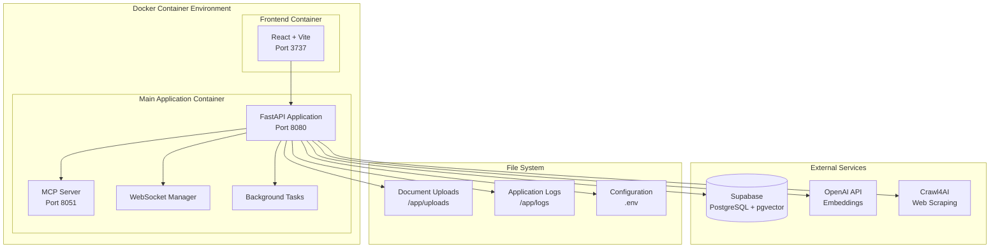
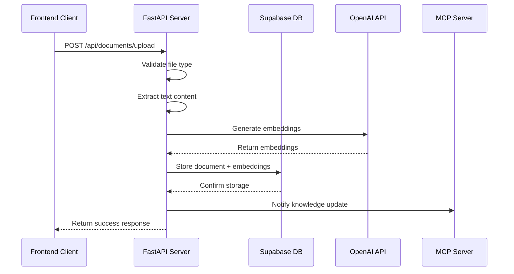

# Server Architecture

Archon's backend is built on a modern, scalable architecture using FastAPI, Docker containers, and microservices patterns. This guide provides comprehensive coverage of the server components, configuration, and deployment strategies.

## 🏗️ Architecture Overview



## 📁 Project Structure

```
mcp-crawl4ai-rag/
├── python/                      # Python backend application
│   ├── src/                     # Main application source
│   │   ├── api_wrapper.py       # FastAPI application entry point
│   │   ├── mcp_server.py        # MCP server implementation
│   │   ├── config.py            # Configuration management
│   │   ├── credential_service.py# API key and settings management
│   │   ├── utils.py             # Utility functions
│   │   └── modules/             # Feature modules
│   │       ├── __init__.py
│   │       ├── rag_module.py    # RAG functionality
│   │       └── tasks_module.py  # Task management
│   ├── tests/                   # Backend test suite
│   ├── Dockerfile               # Backend container configuration
│   ├── requirements.txt         # Python dependencies
│   ├── startup.py               # Application startup script
│   └── pyproject.toml           # Python project configuration
├── archon-ui-main/              # React frontend application
├── docs/                        # Docusaurus documentation
├── migration/                   # Database migration scripts
├── docker-compose.yml           # Container orchestration
└── .env                         # Environment configuration
```

## 🚀 FastAPI Application (`api_wrapper.py`)

The main FastAPI application serves as the central API gateway, handling all HTTP requests and coordinating between different services.

### Core Components

#### Application Initialization

```python
from fastapi import FastAPI, HTTPException, UploadFile, File
from fastapi.middleware.cors import CORSMiddleware
from fastapi.staticfiles import StaticFiles
import uvicorn

# Initialize FastAPI app
app = FastAPI(
    title="Archon Knowledge Engine API",
    description="MCP-enabled RAG system with document management",
    version="1.0.0",
    docs_url="/docs",
    redoc_url="/redoc"
)

# Configure CORS for frontend integration
app.add_middleware(
    CORSMiddleware,
    allow_origins=["http://localhost:3737", "http://frontend:3737"],
    allow_credentials=True,
    allow_methods=["*"],
    allow_headers=["*"],
)
```

#### Key API Endpoints

| Endpoint Category | Base Path | Purpose |
|------------------|-----------|----------|
| **Knowledge Management** | `/api/knowledge-items` | CRUD operations for knowledge base |
| **Document Upload** | `/api/documents` | File upload and processing |
| **RAG Operations** | `/api/rag` | Search and retrieval functionality |
| **MCP Server Control** | `/api/mcp` | Start/stop MCP server |
| **Task Management** | `/api/tasks` | Project and task operations |
| **WebSocket Streams** | `/api/ws` | Real-time communication |
| **Settings** | `/api/settings` | Configuration management |

### Request/Response Flow



## 🔌 MCP Server (`mcp_server.py`)

The Model Context Protocol server enables AI clients (Cursor, Windsurf, Claude Desktop) to access the knowledge base.

### MCP Server Architecture

```python
class MCPServer:
    def __init__(self):
        self.app = Server("archon-knowledge-engine")
        self.setup_tools()
        self.setup_resources()
        
    def setup_tools(self):
        """Register MCP tools for AI clients"""
        @self.app.call_tool()
        async def search_knowledge(query: str, filters: dict = None):
            """Search the knowledge base"""
            # Implementation details...
            
        @self.app.call_tool()
        async def create_task(project_id: str, title: str, description: str):
            """Create a new task"""
            # Implementation details...
```

### Available MCP Tools

| Tool Name | Purpose | Parameters |
|-----------|---------|------------|
| `search_knowledge` | Query the knowledge base | `query`, `filters`, `limit` |
| `get_document` | Retrieve specific document | `document_id` |
| `create_task` | Create new task | `project_id`, `title`, `description` |
| `update_task` | Update task status | `task_id`, `status`, `description` |
| `list_projects` | Get all projects | `limit`, `offset` |
| `crawl_url` | Initiate web crawling | `url`, `options` |

### Transport Protocols

The MCP server supports multiple transport protocols:

#### Standard I/O (for desktop clients)
```python
# For Cursor, Windsurf, Claude Desktop
async def run_stdio():
    async with mcp.server.stdio.stdio_server() as (read_stream, write_stream):
        await server.run(
            read_stream,
            write_stream,
            InitializationOptions(
                server_name="archon",
                server_version="1.0.0",
                capabilities=server.get_capabilities()
            )
        )
```

#### Server-Sent Events (for web clients)
```python
# For web-based integrations
@app.get("/mcp/sse")
async def mcp_sse_endpoint(request: Request):
    async def event_generator():
        while True:
            # Yield MCP events
            yield f"data: {json.dumps(event)}\n\n"
            await asyncio.sleep(1)
    
    return StreamingResponse(event_generator(), media_type="text/plain")
```

## 🗄️ Database Integration

### Supabase Configuration

Archon uses Supabase (PostgreSQL + pgvector) for data persistence:

```python
# config.py
import os
from supabase import create_client, Client

class DatabaseConfig:
    def __init__(self):
        self.supabase_url = os.getenv("SUPABASE_URL")
        self.supabase_key = os.getenv("SUPABASE_SERVICE_KEY")
        self.client = create_client(self.supabase_url, self.supabase_key)
    
    def get_client(self) -> Client:
        return self.client
```

### Database Schema

#### Core Tables

**crawled_pages** - Main knowledge storage
```sql
CREATE TABLE crawled_pages (
    id SERIAL PRIMARY KEY,
    url TEXT NOT NULL,
    title TEXT,
    content TEXT NOT NULL,
    embedding vector(1536),
    source_type VARCHAR(50) DEFAULT 'web',
    knowledge_type VARCHAR(50) DEFAULT 'general',
    tags TEXT[] DEFAULT '{}',
    metadata JSONB DEFAULT '{}',
    created_at TIMESTAMP DEFAULT CURRENT_TIMESTAMP,
    updated_at TIMESTAMP DEFAULT CURRENT_TIMESTAMP
);
```

**projects** - Task management
```sql
CREATE TABLE projects (
    id UUID PRIMARY KEY DEFAULT gen_random_uuid(),
    title TEXT NOT NULL,
    prd JSONB DEFAULT '{}'::jsonb,
    docs JSONB DEFAULT '[]'::jsonb,
    features JSONB DEFAULT '[]'::jsonb,
    data JSONB DEFAULT '[]'::jsonb,
    github_repo TEXT,
    created_at TIMESTAMPTZ DEFAULT NOW(),
    updated_at TIMESTAMPTZ DEFAULT NOW()
);
```

**tasks** - Individual tasks
```sql
CREATE TABLE tasks (
    id UUID PRIMARY KEY DEFAULT gen_random_uuid(),
    project_id UUID NOT NULL REFERENCES projects(id),
    parent_task_id UUID REFERENCES tasks(id),
    title TEXT NOT NULL,
    description TEXT,
    sources JSONB DEFAULT '[]'::jsonb,
    code_examples JSONB DEFAULT '[]'::jsonb,
    status task_status DEFAULT 'todo',
    created_at TIMESTAMPTZ DEFAULT NOW(),
    updated_at TIMESTAMPTZ DEFAULT NOW()
);
```

**credentials** - Settings storage
```sql
CREATE TABLE credentials (
    id SERIAL PRIMARY KEY,
    key_name VARCHAR(255) UNIQUE NOT NULL,
    key_value TEXT NOT NULL,
    created_at TIMESTAMP DEFAULT CURRENT_TIMESTAMP,
    updated_at TIMESTAMP DEFAULT CURRENT_TIMESTAMP
);
```

## 🔧 Configuration Management

### Environment Variables

| Variable | Required | Default | Description |
|----------|----------|---------|-------------|
| `SUPABASE_URL` | ✅ | - | Supabase project URL |
| `SUPABASE_SERVICE_KEY` | ✅ | - | Supabase service role key |
| `OPENAI_API_KEY` | ⚠️ | - | OpenAI API key (can be set via UI) |
| `FRONTEND_PORT` | ❌ | 3737 | Frontend application port |
| `BACKEND_PORT` | ❌ | 8080 | Backend API port |
| `MCP_PORT` | ❌ | 8051 | MCP server port |
| `LOG_LEVEL` | ❌ | INFO | Application log level |
| `ENABLE_CORS` | ❌ | true | Enable CORS middleware |
| `MAX_UPLOAD_SIZE` | ❌ | 50MB | Maximum file upload size |

### Configuration Loading

```python
# config.py
import os
from typing import Optional
from pydantic import BaseSettings

class Settings(BaseSettings):
    # Database
    supabase_url: str
    supabase_service_key: str
    
    # API Keys
    openai_api_key: Optional[str] = None
    
    # Server Configuration
    frontend_port: int = 3737
    backend_port: int = 8080
    mcp_port: int = 8051
    
    # Application Settings
    log_level: str = "INFO"
    enable_cors: bool = True
    max_upload_size: int = 50 * 1024 * 1024  # 50MB
    
    class Config:
        env_file = ".env"
        case_sensitive = False

settings = Settings()
```

## 🔄 Background Tasks & Processing

### Async Task Management

Archon uses FastAPI's background tasks for long-running operations:

```python
from fastapi import BackgroundTasks
import asyncio
from typing import Dict, Any

class TaskManager:
    def __init__(self):
        self.active_tasks: Dict[str, Any] = {}
        
    async def crawl_website(self, url: str, options: dict, progress_id: str):
        """Background task for web crawling"""
        try:
            self.active_tasks[progress_id] = {
                "status": "running",
                "progress": 0,
                "message": "Starting crawl..."
            }
            
            # Crawling implementation
            async for progress in crawl_with_progress(url, options):
                self.active_tasks[progress_id].update(progress)
                await self.broadcast_progress(progress_id, progress)
                
        except Exception as e:
            self.active_tasks[progress_id] = {
                "status": "error",
                "error": str(e)
            }
```

### WebSocket Communication

Real-time updates are handled via WebSocket connections:

```python
from fastapi import WebSocket, WebSocketDisconnect
from typing import List

class WebSocketManager:
    def __init__(self):
        self.active_connections: List[WebSocket] = []
        self.progress_connections: Dict[str, List[WebSocket]] = {}
    
    async def connect(self, websocket: WebSocket, progress_id: str = None):
        await websocket.accept()
        if progress_id:
            if progress_id not in self.progress_connections:
                self.progress_connections[progress_id] = []
            self.progress_connections[progress_id].append(websocket)
        else:
            self.active_connections.append(websocket)
    
    async def broadcast_progress(self, progress_id: str, data: dict):
        if progress_id in self.progress_connections:
            for connection in self.progress_connections[progress_id]:
                try:
                    await connection.send_json(data)
                except WebSocketDisconnect:
                    self.progress_connections[progress_id].remove(connection)
```

## 🐳 Docker Configuration

### Dockerfile

```dockerfile
FROM python:3.11-slim

# Set working directory
WORKDIR /app

# Install system dependencies
RUN apt-get update && apt-get install -y \
    curl \
    git \
    && rm -rf /var/lib/apt/lists/*

# Copy requirements and install Python dependencies
COPY requirements.txt .
RUN pip install --no-cache-dir -r requirements.txt

# Copy application code
COPY src/ ./src/
COPY startup.py .

# Create directories for uploads and logs
RUN mkdir -p /app/uploads /app/logs

# Expose ports
EXPOSE 8080 8051

# Health check
HEALTHCHECK --interval=30s --timeout=30s --start-period=5s --retries=3 \
    CMD curl -f http://localhost:8080/health || exit 1

# Start application
CMD ["python", "startup.py"]
```

### Docker Compose Configuration

```yaml
version: '3.8'

services:
  backend:
    build: .
    ports:
      - "${BACKEND_PORT:-8080}:8080"
      - "${MCP_PORT:-8051}:8051"
    environment:
      - SUPABASE_URL=${SUPABASE_URL}
      - SUPABASE_SERVICE_KEY=${SUPABASE_SERVICE_KEY}
      - OPENAI_API_KEY=${OPENAI_API_KEY:-}
    volumes:
      - ./uploads:/app/uploads
      - ./logs:/app/logs
    restart: unless-stopped
    healthcheck:
      test: ["CMD", "curl", "-f", "http://localhost:8080/health"]
      interval: 30s
      timeout: 10s
      retries: 3
      start_period: 40s

  frontend:
    build: ./archon-ui-main
    ports:
      - "${FRONTEND_PORT:-3737}:3737"
    environment:
      - REACT_APP_API_URL=http://localhost:${BACKEND_PORT:-8080}
    depends_on:
      - backend
    restart: unless-stopped
```

## 📊 Monitoring & Logging

### Application Logging

```python
import logging
import sys
from datetime import datetime

# Configure logging
logging.basicConfig(
    level=logging.INFO,
    format='%(asctime)s - %(name)s - %(levelname)s - %(message)s',
    handlers=[
        logging.FileHandler('/app/logs/application.log'),
        logging.StreamHandler(sys.stdout)
    ]
)

logger = logging.getLogger(__name__)

# Usage in application
logger.info(f"Document uploaded: {filename}")
logger.error(f"Failed to process document: {error}")
```

### Health Check Endpoint

```python
@app.get("/health")
async def health_check():
    """Health check endpoint for monitoring"""
    try:
        # Check database connection
        db_status = await check_database_connection()
        
        # Check external services
        openai_status = await check_openai_connection()
        
        return {
            "status": "healthy",
            "timestamp": datetime.utcnow().isoformat(),
            "services": {
                "database": db_status,
                "openai": openai_status,
                "mcp_server": check_mcp_server_status()
            }
        }
    except Exception as e:
        raise HTTPException(status_code=503, detail=f"Service unhealthy: {str(e)}")
```

### Performance Metrics

```python
from prometheus_client import Counter, Histogram, generate_latest

# Metrics collection
REQUEST_COUNT = Counter('http_requests_total', 'Total HTTP requests', ['method', 'endpoint'])
REQUEST_DURATION = Histogram('http_request_duration_seconds', 'HTTP request duration')
DOCUMENT_UPLOADS = Counter('documents_uploaded_total', 'Total documents uploaded')
RAG_QUERIES = Counter('rag_queries_total', 'Total RAG queries')

@app.middleware("http")
async def metrics_middleware(request: Request, call_next):
    start_time = time.time()
    response = await call_next(request)
    duration = time.time() - start_time
    
    REQUEST_COUNT.labels(method=request.method, endpoint=request.url.path).inc()
    REQUEST_DURATION.observe(duration)
    
    return response

@app.get("/metrics")
async def metrics():
    return Response(generate_latest(), media_type="text/plain")
```

## 🔒 Security Considerations

### API Key Management

```python
from cryptography.fernet import Fernet
import os

class CredentialService:
    def __init__(self):
        self.encryption_key = os.getenv("ENCRYPTION_KEY", Fernet.generate_key())
        self.cipher = Fernet(self.encryption_key)
    
    def encrypt_credential(self, value: str) -> str:
        return self.cipher.encrypt(value.encode()).decode()
    
    def decrypt_credential(self, encrypted_value: str) -> str:
        return self.cipher.decrypt(encrypted_value.encode()).decode()
```

### Input Validation

```python
from pydantic import BaseModel, validator
from typing import Optional, List

class DocumentUploadRequest(BaseModel):
    knowledge_type: str
    tags: Optional[List[str]] = []
    
    @validator('knowledge_type')
    def validate_knowledge_type(cls, v):
        allowed_types = ['technical', 'business', 'general']
        if v not in allowed_types:
            raise ValueError(f'knowledge_type must be one of {allowed_types}')
        return v
    
    @validator('tags')
    def validate_tags(cls, v):
        if len(v) > 10:
            raise ValueError('Maximum 10 tags allowed')
        return v
```

### Rate Limiting

```python
from slowapi import Limiter, _rate_limit_exceeded_handler
from slowapi.util import get_remote_address
from slowapi.errors import RateLimitExceeded

limiter = Limiter(key_func=get_remote_address)
app.state.limiter = limiter
app.add_exception_handler(RateLimitExceeded, _rate_limit_exceeded_handler)

@app.post("/api/documents/upload")
@limiter.limit("10/minute")
async def upload_document(request: Request, file: UploadFile = File(...)):
    # Upload implementation
    pass
```

## 🚀 Performance Optimization

### Database Connection Pooling

```python
from sqlalchemy.pool import QueuePool
from sqlalchemy import create_engine

engine = create_engine(
    database_url,
    poolclass=QueuePool,
    pool_size=20,
    max_overflow=30,
    pool_pre_ping=True,
    pool_recycle=3600
)
```

### Caching Strategy

```python
from functools import lru_cache
import redis
import json

# Redis cache for frequent queries
redis_client = redis.Redis(host='localhost', port=6379, db=0)

@lru_cache(maxsize=1000)
def get_cached_embedding(text_hash: str):
    """Cache embeddings to avoid recomputation"""
    cached = redis_client.get(f"embedding:{text_hash}")
    if cached:
        return json.loads(cached)
    return None

def cache_embedding(text_hash: str, embedding: list):
    redis_client.setex(
        f"embedding:{text_hash}", 
        3600,  # 1 hour TTL
        json.dumps(embedding)
    )
```

### Async Processing

```python
import asyncio
from concurrent.futures import ThreadPoolExecutor

# Thread pool for CPU-intensive tasks
executor = ThreadPoolExecutor(max_workers=4)

async def process_document_async(file_content: bytes):
    """Process document in thread pool"""
    loop = asyncio.get_event_loop()
    return await loop.run_in_executor(
        executor, 
        extract_text_from_pdf, 
        file_content
    )
```

## 🔧 Development & Debugging

### Local Development Setup

```bash
# Install dependencies
pip install -r requirements.txt
pip install -r requirements-dev.txt

# Run in development mode with hot reload
uvicorn src.api_wrapper:app --host 0.0.0.0 --port 8080 --reload

# Run MCP server separately for testing
python python/src/mcp_server.py
```

### Debug Configuration

```python
# For development debugging
if os.getenv("DEBUG", "false").lower() == "true":
    import debugpy
    debugpy.listen(("0.0.0.0", 5678))
    print("Waiting for debugger attach...")
    debugpy.wait_for_client()
```

### Testing Endpoints

```bash
# Test health endpoint
curl http://localhost:8080/health

# Test document upload
curl -X POST "http://localhost:8080/api/documents/upload" \
  -F "file=@test.pdf" \
  -F "knowledge_type=technical" \
  -F "tags=[\"test\"]"

# Test RAG query
curl -X POST "http://localhost:8080/api/rag/query" \
  -H "Content-Type: application/json" \
  -d '{"query": "How to install Python?", "limit": 5}'
```

## 🌐 WebSocket Communication

Archon implements real-time WebSocket communication for streaming progress updates, server logs, and live data synchronization between the Python backend and React frontend.

### Key Features

- **🔄 Real-Time Progress Tracking**: Live updates during crawling operations with actual progress percentages
- **📡 Server Log Streaming**: WebSocket-based log streaming from MCP server to UI dashboard  
- **🎯 Progress Callback Pattern**: Business logic reports progress via callbacks to WebSocket broadcasts
- **🔗 Auto-Reconnection**: Robust connection handling with automatic reconnect on failures
- **📱 Responsive UI Updates**: Instant feedback without polling or page refreshes

### WebSocket Endpoints

| Endpoint | Purpose | Status | Pattern |
|----------|---------|--------|---------|
| `/api/mcp/logs/stream` | MCP Server logs streaming | ✅ Working | Server-to-Client Broadcast |
| `/api/crawl-progress/{progress_id}` | Crawl progress updates | ✅ Working | Progress Tracking Pattern |
| `/api/knowledge-items/stream` | Knowledge base updates | ✅ Working | Data Synchronization |

### Python Backend WebSocket Patterns

#### Pattern 1: Progress Tracking with Callbacks

**Use Case**: Real-time progress updates during long-running operations (crawling, processing)

```python
class CrawlProgressManager:
    def __init__(self):
        self.active_crawls: Dict[str, Dict[str, Any]] = {}
        self.progress_websockets: Dict[str, List[WebSocket]] = {}
    
    async def add_websocket(self, progress_id: str, websocket: WebSocket) -> None:
        """Add WebSocket connection for progress updates"""
        # CRITICAL: Accept WebSocket connection FIRST
        await websocket.accept()
        
        if progress_id not in self.progress_websockets:
            self.progress_websockets[progress_id] = []
        
        self.progress_websockets[progress_id].append(websocket)
        
        # Send current progress if available
        if progress_id in self.active_crawls:
            data = self.active_crawls[progress_id].copy()
            data['progressId'] = progress_id
            
            # Convert datetime objects for JSON serialization
            if 'start_time' in data and hasattr(data['start_time'], 'isoformat'):
                data['start_time'] = data['start_time'].isoformat()
            
            await websocket.send_json({
                "type": "crawl_progress",
                "data": data
            })
    
    async def update_progress(self, progress_id: str, update_data: Dict[str, Any]) -> None:
        """Update progress and broadcast to connected clients"""
        if progress_id not in self.active_crawls:
            return
        
        self.active_crawls[progress_id].update(update_data)
        await self._broadcast_progress(progress_id)
    
    async def _broadcast_progress(self, progress_id: str) -> None:
        """Broadcast progress to all connected WebSocket clients"""
        if progress_id not in self.progress_websockets:
            return
        
        progress_data = self.active_crawls.get(progress_id, {}).copy()
        progress_data['progressId'] = progress_id
        
        # Serialize datetime objects
        if 'start_time' in progress_data and hasattr(progress_data['start_time'], 'isoformat'):
            progress_data['start_time'] = progress_data['start_time'].isoformat()
        
        message = {
            "type": "crawl_progress" if progress_data.get('status') != 'completed' else "crawl_completed",
            "data": progress_data
        }
        
        # Send to all connected clients with error handling
        disconnected = []
        for websocket in self.progress_websockets[progress_id]:
            try:
                await websocket.send_json(message)
            except Exception as e:
                disconnected.append(websocket)
        
        # Clean up disconnected WebSockets
        for ws in disconnected:
            self.remove_websocket(progress_id, ws)
```

#### Pattern 2: Server-to-Client Broadcasting

**Use Case**: Server logs, system status updates, general notifications

```python
class MCPServerManager:
    def __init__(self):
        self.log_websockets: List[WebSocket] = []
        self.logs: deque = deque(maxlen=1000)
    
    def _add_log(self, level: str, message: str):
        """Add log entry and broadcast to connected WebSockets"""
        log_entry = {
            'timestamp': datetime.utcnow().isoformat() + 'Z',
            'level': level,
            'message': message
        }
        self.logs.append(log_entry)
        
        # Broadcast asynchronously
        asyncio.create_task(self._broadcast_log(log_entry))
    
    async def _broadcast_log(self, log_entry: Dict[str, Any]):
        """Broadcast log entry to all connected WebSockets"""
        disconnected = []
        for ws in self.log_websockets:
            try:
                await ws.send_json(log_entry)
            except Exception:
                disconnected.append(ws)
        
        # Remove disconnected WebSockets
        for ws in disconnected:
            self.log_websockets.remove(ws)
    
    async def add_websocket(self, websocket: WebSocket):
        """Add WebSocket for log streaming"""
        await websocket.accept()
        self.log_websockets.append(websocket)
        
        # Send recent logs to new connection
        for log in list(self.logs)[-50:]:
            try:
                await websocket.send_json(log)
            except Exception:
                break
```

#### Pattern 3: Progress Callback Integration

**Use Case**: Integrating progress callbacks with long-running MCP functions

```python
# In API wrapper
async def _perform_crawl_with_progress(progress_id: str, request: KnowledgeItemRequest):
    """Perform crawl with real-time progress tracking"""
    
    # Create progress callback
    async def progress_callback(status: str, percentage: int, message: str, **kwargs):
        """Callback for real-time progress updates from crawling functions"""
        await progress_manager.update_progress(progress_id, {
            'status': status,
            'percentage': percentage,
            'currentUrl': kwargs.get('currentUrl', str(request.url)),
            'totalPages': kwargs.get('totalPages', 0),
            'processedPages': kwargs.get('processedPages', 0),
            'log': message,
            **kwargs
        })
    
    # Pass callback to MCP function
    ctx.progress_callback = progress_callback
    
    # Call crawling function with progress support
    result = await mcp_smart_crawl_url(ctx=ctx, url=str(request.url))
```

### Frontend Integration Patterns

#### WebSocket Service Management

```typescript
interface CrawlProgressData {
  progressId: string;
  status: string;
  percentage: number;
  currentUrl?: string;
  totalPages?: number;
  processedPages?: number;
  log?: string;
}

class CrawlProgressService {
  private connections: Map<string, WebSocket> = new Map();
  
  streamProgress(
    progressId: string, 
    onProgress: (data: CrawlProgressData) => void,
    options: { autoReconnect?: boolean; reconnectDelay?: number } = {}
  ): void {
    const wsUrl = `ws://localhost:8080/api/crawl-progress/${progressId}`;
    
    const connect = () => {
      const ws = new WebSocket(wsUrl);
      this.connections.set(progressId, ws);
      
      ws.onopen = () => {
        console.log(`🚀 WebSocket connected for progress: ${progressId}`);
      };
      
      ws.onmessage = (event) => {
        try {
          const message = JSON.parse(event.data);
          
          // Handle different message types
          if (message.type === 'crawl_progress' || message.type === 'crawl_completed') {
            onProgress(message.data);
          }
        } catch (error) {
          console.error('Failed to parse WebSocket message:', error);
        }
      };
      
      ws.onclose = (event) => {
        this.connections.delete(progressId);
        
        // Auto-reconnect for non-normal closures
        if (options.autoReconnect && event.code !== 1000) {
          setTimeout(connect, options.reconnectDelay || 5000);
        }
      };
    };
    
    connect();
  }
}
```

### Best Practices & Common Pitfalls

#### ✅ Do's

1. **Always Accept WebSocket First**: Call `await websocket.accept()` before any send operations
2. **Handle Datetime Serialization**: Convert datetime objects to ISO strings for JSON
3. **Implement Reconnection Logic**: Auto-reconnect on non-normal closures (code !== 1000)
4. **Use Progress IDs**: Unique identifiers for tracking multiple concurrent operations  
5. **Clean Up Connections**: Remove disconnected WebSockets from collections
6. **Send Initial State**: When client connects, send current progress if available

#### ❌ Don'ts

1. **Don't Ignore Connection Errors**: Always handle `onclose` and `onerror` events
2. **Don't Hardcode Progress**: Base percentages on actual work completed
3. **Don't Mix Local and Prop State**: Use either props OR local state, not both
4. **Don't Block WebSocket Sends**: Use try-catch around WebSocket operations
5. **Don't Forget Cleanup**: Always disconnect WebSockets on component unmount

### Testing WebSocket Connections

```bash
# Test WebSocket endpoint directly
wscat -c ws://localhost:8080/api/crawl-progress/test-id

# Expected response:
# {"type": "connection_established", "data": {"progressId": "test-id", "status": "waiting"}}
```

---

**Next Steps**: Explore the [API Reference](./api-reference) for detailed endpoint documentation or learn about [MCP Integration](./mcp-reference) for connecting AI clients.
