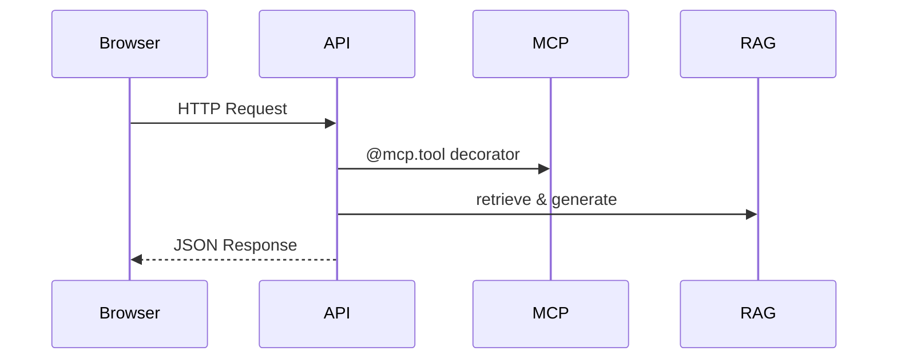

# Server

The **server** is built with FastAPI, exposing REST endpoints and managing RAG and MCP logic.

## Directory Layout

```bash
tree src -L 2
```

```text
src/
├── startup.py           # Application entrypoint
├── api/                 # FastAPI routers
│   └── mcp.py
├── core/                # Core business logic
├── services/            # External integrations (vector store, supabase)
└── mcp/                 # MCP decorators and tools
```

## Key Environment Variables

| Variable                  | Description                                 |
|---------------------------|---------------------------------------------|
| HOST                      | Host for FastAPI                            |
| PORT                      | Port for FastAPI                            |
| MODEL_CHOICE              | Default LLM model choice                    |

## Starting the Server

```bash
uvicorn startup:app --host $HOST --port $PORT
```

## Request Flow



For details on endpoints, see the [API Reference](api-reference).
