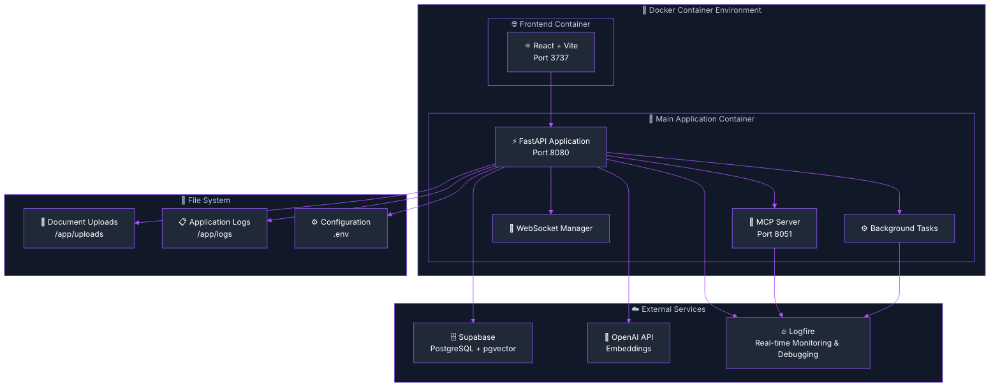

import Tabs from '@theme/Tabs';
import TabItem from '@theme/TabItem';
import Admonition from '@theme/Admonition';

# 🏗️ Server Architecture & Real-Time Monitoring

<div className="hero hero--primary">
  <div className="container">
    <h2 className="hero__subtitle">
      Archon's backend: **FastAPI + Docker + Logfire** = Complete observability for your AI knowledge engine
    </h2>
  </div>
</div>

Archon's backend is built on a modern, scalable architecture using FastAPI, Docker containers, and microservices patterns with **comprehensive Logfire monitoring and observability**. This guide provides in-depth coverage of the server components, Logfire integration, real-time debugging capabilities, and deployment strategies.

## 🎯 Architecture Overview



## 📁 Project Structure

<details>
<summary>📂 **Click to expand complete project structure**</summary>

```
archon/
├── python/                      # Python backend application
│   ├── src/                     # Main application source
│   │   ├── main.py              # FastAPI application entry point (246 lines)
│   │   ├── mcp_server.py        # MCP server implementation (396 lines)
│   │   ├── config.py            # Configuration management (118 lines)
│   │   ├── credential_service.py# API key and settings management (310 lines)
│   │   ├── utils.py             # Utility functions (1063 lines)
│   │   ├── logfire_config.py    # 🔥 Logfire monitoring setup (147 lines)
│   │   ├── api/                 # 🎯 Modular API routers (6 modules)
│   │   │   ├── __init__.py      # API module registration
│   │   │   ├── knowledge_api.py # Knowledge & crawling endpoints (891 lines)
│   │   │   ├── mcp_api.py       # MCP server control & WebSockets (705 lines)
│   │   │   ├── settings_api.py  # Settings & credential management (345 lines)
│   │   │   ├── projects_api.py  # Project & task management (528 lines)
│   │   │   ├── agent_chat_api.py# AI agent chat interface (516 lines)
│   │   │   └── tests_api.py     # Test execution with streaming (525 lines)
│   │   ├── agents/              # 🤖 PydanticAI-powered agents (3 agents)
│   │   │   ├── __init__.py      # Agent module exports
│   │   │   ├── base_agent.py    # Base agent class (157 lines)
│   │   │   └── document_agent.py    # Documentation processing agent (766 lines)
│   │   ├── modules/             # 📦 MCP tool modules (14 total tools)
│   │   │   ├── __init__.py      # Module initialization
│   │   │   ├── models.py        # Pydantic data models (208 lines)
│   │   │   ├── rag_module.py    # RAG functionality (7 MCP tools, 1225 lines)
│   │   │   └── project_module.py# Project & task management (5 MCP tools, refactored)
│   │   ├── original_crawl4aiMCP/# Legacy crawling implementation
│   │   └── __init__.py          # Package initialization
│   ├── tests/                   # Backend test suite
│   ├── Dockerfile               # Python server container configuration
│   ├── requirements.txt         # Python dependencies
│   ├── startup.py               # Application startup script
│   └── pyproject.toml           # Python project configuration
├── archon-ui-main/              # React frontend application
│   ├── src/                     # Frontend source code
│   │   ├── components/          # React components
│   │   ├── pages/               # Page components
│   │   ├── services/            # API service layer
│   │   ├── types/               # TypeScript type definitions
│   │   ├── hooks/               # Custom React hooks
│   │   ├── contexts/            # React context providers
│   │   └── lib/                 # Utility libraries
├── docs/                        # Docusaurus documentation
├── migration/                   # Database migration scripts
├── docker-compose.yml           # Container orchestration
└── .env                         # Environment configuration
```

</details>

## 🔥 Logfire Integration & Real-Time Monitoring

<Admonition type="tip" title="🎯 Why Logfire?">
  Logfire by Pydantic provides **real-time debugging superpowers** for Archon. See every RAG query, MCP tool call, and WebSocket connection as it happens - perfect for debugging complex AI workflows!
</Admonition>

Archon implements comprehensive monitoring and observability through **[Logfire](https://logfire.pydantic.dev/)** by Pydantic. This provides real-time debugging, performance monitoring, and detailed request tracing across all components.

### 🎯 Key Monitoring Features

<div className="row">
  <div className="col col--6">
    <div className="card">
      <div className="card__header">
        <h4>🔍 **Real-Time Debugging**</h4>
      </div>
      <div className="card__body">
        <ul>
          <li>**RAG Query Debugging**: Monitor embedding generation, vector searches, result ranking</li>
          <li>**MCP Server Performance**: Track tool execution times and connection health</li>
          <li>**WebSocket Monitoring**: Real-time progress tracking and connection management</li>
        </ul>
      </div>
    </div>
  </div>
  <div className="col col--6">
    <div className="card">
      <div className="card__header">
        <h4>📊 **Performance Analytics**</h4>
      </div>
      <div className="card__body">
        <ul>
          <li>**FastAPI Request Tracing**: Complete request lifecycle with timing</li>
          <li>**AI Agent Interactions**: Monitor all MCP tool calls from Cursor, Windsurf, Claude</li>
          <li>**Performance Metrics**: Database query times, embedding generation, API response times</li>
        </ul>
      </div>
    </div>
  </div>
</div>

### ⚙️ Logfire Configuration

<Tabs>
<TabItem value="env" label="🔧 Environment Setup">

```bash title=".env"
# Required: Logfire authentication token
LOGFIRE_TOKEN=your_logfire_token_here

# Optional: Service identification  
LOGFIRE_SERVICE_NAME=archon-mcp-server
LOGFIRE_PROJECT_NAME=archon-knowledge-engine
```

</TabItem>
<TabItem value="config" label="🐍 Python Configuration">

```python title="src/config/logfire_config.py"
import logfire
import os
from typing import Optional

def setup_logfire(service_name: str = "archon-mcp-server") -> None:
    """Configure Logfire with proper service identification and settings"""
    
    token = os.getenv("LOGFIRE_TOKEN")
    if not token:
        print("⚠️  LOGFIRE_TOKEN not set - monitoring disabled")
        return
    
    try:
        # Configure Logfire with service identification
        logfire.configure(
            service_name=service_name,
            token=token,
            project_name=os.getenv("LOGFIRE_PROJECT_NAME", "archon"),
            send_to_logfire=True,
            console=False,  # Disable console output to avoid conflicts
        )
        
        print(f"🔥 Logfire monitoring active for {service_name}")
        print(f"📊 Dashboard: https://logfire-us.pydantic.dev/{service_name}")
        
    except Exception as e:
        print(f"❌ Logfire setup failed: {e}")
        # Continue without monitoring rather than crash

# Global logfire instance for application-wide usage
logfire_logger = logfire
```

</TabItem>
</Tabs>

### 📊 Real-Time RAG Query Monitoring

<Admonition type="info" title="🔍 Complete Request Tracing">
  Every RAG query is traced from start to finish with detailed performance metrics and error handling.
</Admonition>

Monitor every aspect of RAG operations with detailed spans and metrics:

<Tabs>
<TabItem value="rag-monitoring" label="🧠 RAG Monitoring">

```python title="rag_module.py"
import logfire
from src.config.logfire_config import logfire_logger

async def perform_rag_query(query: str, source: Optional[str] = None) -> dict:
    """RAG query with comprehensive Logfire monitoring"""
    
    with logfire_logger.span("rag_query", query=query, source=source) as span:
        try:
            # 1. Query preprocessing with monitoring
            with logfire_logger.span("preprocess_query") as preprocess_span:
                processed_query = preprocess_query_text(query)
                preprocess_span.set_attribute("processed_length", len(processed_query))
            
            # 2. Embedding generation with timing
            with logfire_logger.span("generate_embeddings") as embedding_span:
                embeddings = await generate_embeddings(processed_query)
                embedding_span.set_attribute("embedding_dimension", len(embeddings))
                embedding_span.set_attribute("model", "text-embedding-3-small")
            
            # 3. Vector search with performance metrics
            with logfire_logger.span("vector_search") as search_span:
                search_results = await search_documents(
                    query_embedding=embeddings,
                    filter_metadata={"source": source} if source else None,
                    match_count=5
                )
                search_span.set_attribute("results_found", len(search_results))
                search_span.set_attribute("search_type", "vector_similarity")
            
            # 4. Result processing and ranking
            with logfire_logger.span("process_results") as process_span:
                processed_results = process_search_results(search_results)
                process_span.set_attribute("final_results", len(processed_results))
            
            span.set_attribute("success", True)
            span.set_attribute("total_results", len(processed_results))
            
            return {
                "results": processed_results,
                "query": query,
                "total_results": len(processed_results)
            }
            
        except Exception as e:
            span.set_attribute("success", False)
            span.set_attribute("error", str(e))
            logfire_logger.error(f"RAG query failed: {e}", query=query, source=source)
            raise
```

</TabItem>
<TabItem value="mcp-monitoring" label="🔌 MCP Server Monitoring">

```python title="mcp_server.py"
import logfire
from src.config.logfire_config import setup_logfire, logfire_logger

class MCPServer:
    def __init__(self):
        setup_logfire("archon-mcp-server")
        self.app = Server("archon-knowledge-engine")
        self.setup_tools()
    
    def setup_tools(self):
        @self.app.call_tool()
        async def search_knowledge(query: str, source: Optional[str] = None) -> str:
            """Search knowledge base with Logfire monitoring"""
            
            with logfire_logger.span("mcp_tool_search_knowledge") as span:
                span.set_attribute("tool", "search_knowledge")
                span.set_attribute("query", query)
                span.set_attribute("source", source or "all")
                
                try:
                    # Call the actual RAG function (already monitored)
                    results = await perform_rag_query(query, source)
                    
                    span.set_attribute("success", True)
                    span.set_attribute("results_count", len(results.get("results", [])))
                    
                    return json.dumps(results)
                    
                except Exception as e:
                    span.set_attribute("success", False)
                    span.set_attribute("error", str(e))
                    logfire_logger.error(f"MCP search_knowledge failed: {e}")
                    raise
        
        @self.app.call_tool()
        async def create_task(project_id: str, title: str, description: str) -> str:
            """Create task with monitoring"""
            
            with logfire_logger.span("mcp_tool_create_task") as span:
                span.set_attribute("tool", "create_task")
                span.set_attribute("project_id", project_id)
                span.set_attribute("title", title)
                
                # Implementation with monitoring...
                return json.dumps({"task_id": "created"})
```

</TabItem>
</Tabs>

### 📡 WebSocket Progress Monitoring

Monitor real-time WebSocket connections and progress updates:

```python title="websocket_manager.py"
import logfire
from src.config.logfire_config import logfire_logger

class WebSocketManager:
    async def connect(self, websocket: WebSocket, progress_id: str = None):
        """WebSocket connection with Logfire monitoring"""
        
        with logfire_logger.span("websocket_connect") as span:
            span.set_attribute("progress_id", progress_id or "general")
            
            try:
                await websocket.accept()
                
                if progress_id:
                    if progress_id not in self.progress_connections:
                        self.progress_connections[progress_id] = []
                    self.progress_connections[progress_id].append(websocket)
                    
                    span.set_attribute("connection_type", "progress_tracking")
                    span.set_attribute("active_connections", len(self.progress_connections[progress_id]))
                else:
                    self.active_connections.append(websocket)
                    span.set_attribute("connection_type", "general")
                
                span.set_attribute("success", True)
                logfire_logger.info(f"WebSocket connected: {progress_id or 'general'}")
                
            except Exception as e:
                span.set_attribute("success", False)
                span.set_attribute("error", str(e))
                logfire_logger.error(f"WebSocket connection failed: {e}")
                raise
    
    async def broadcast_progress(self, progress_id: str, data: dict):
        """Broadcast progress with monitoring"""
        
        with logfire_logger.span("websocket_broadcast") as span:
            span.set_attribute("progress_id", progress_id)
            span.set_attribute("data_type", data.get("type", "unknown"))
            span.set_attribute("progress_percentage", data.get("percentage", 0))
            
            if progress_id not in self.progress_connections:
                span.set_attribute("connections_found", 0)
                return
            
            connections = self.progress_connections[progress_id]
            span.set_attribute("connections_found", len(connections))
            
            # Broadcast to all connections with error tracking
            successful_sends = 0
            failed_sends = 0
            
            for websocket in connections[:]:  # Copy list to avoid modification during iteration
                try:
                    await websocket.send_json({
                        "type": "crawl_progress" if data.get('status') != 'completed' else "crawl_completed",
                        "data": data
                    })
                    successful_sends += 1
                except Exception as e:
                    failed_sends += 1
                    self.progress_connections[progress_id].remove(websocket)
                    logfire_logger.warning(f"WebSocket send failed, removing connection: {e}")
            
            span.set_attribute("successful_sends", successful_sends)
            span.set_attribute("failed_sends", failed_sends)
```

### 🔗 Logfire Dashboard Access

<div className="hero hero--secondary">
  <div className="container">
    <h3>🔗 **Dashboard URL**: `https://logfire-us.pydantic.dev/your-project-name/`</h3>
  </div>
</div>

#### 📊 Dashboard Features

<div className="row">
  <div className="col col--4">
    <div className="card">
      <div className="card__header">
        <h4>📊 **Real-Time Spans**</h4>
      </div>
      <div className="card__body">
        See every RAG query, MCP tool call, and WebSocket connection live
      </div>
    </div>
  </div>
  <div className="col col--4">
    <div className="card">
      <div className="card__header">
        <h4>⚡ **Performance Metrics**</h4>
      </div>
      <div className="card__body">
        Response times, error rates, and throughput analysis
      </div>
    </div>
  </div>
  <div className="col col--4">
    <div className="card">
      <div className="card__header">
        <h4>🔍 **Detailed Traces**</h4>
      </div>
      <div className="card__body">
        Drill down into specific requests with full context
      </div>
    </div>
  </div>
</div>

<div className="row">
  <div className="col col--4">
    <div className="card">
      <div className="card__header">
        <h4>📈 **Historical Data**</h4>
      </div>
      <div className="card__body">
        Analyze patterns and performance over time
      </div>
    </div>
  </div>
  <div className="col col--4">
    <div className="card">
      <div className="card__header">
        <h4>🚨 **Error Tracking**</h4>
      </div>
      <div className="card__body">
        Automatic error detection and alerting
      </div>
    </div>
  </div>
  <div className="col col--4">
    <div className="card">
      <div className="card__header">
        <h4>💻 **Client Identification**</h4>
      </div>
      <div className="card__body">
        Track which AI client (Cursor, Windsurf, Claude) made requests
      </div>
    </div>
  </div>
</div>

## 🚀 FastAPI Application Architecture

The main FastAPI application serves as the central API gateway, mounting modular routers and coordinating between different services. The application follows a clean separation of concerns with dedicated routers for each functional area.

### 🎯 Modular Architecture Benefits

<div className="row">
  <div className="col col--3">
    <div className="text--center">
      <h4>🔧 **Maintainability**</h4>
      <p>Each router handles a specific domain</p>
    </div>
  </div>
  <div className="col col--3">
    <div className="text--center">
      <h4>🧪 **Testability**</h4>
      <p>Individual routers tested in isolation</p>
    </div>
  </div>
  <div className="col col--3">
    <div className="text--center">
      <h4>📈 **Scalability**</h4>
      <p>Routers can become microservices</p>
    </div>
  </div>
  <div className="col col--3">
    <div className="text--center">
      <h4>🔒 **Security**</h4>
      <p>Fine-grained access control per router</p>
    </div>
  </div>
</div>

### 📚 Router Organization

| Router Module | Base Path | Endpoints | Purpose |
|--------------|-----------|-----------|----------|
| **`knowledge_api.py`** | `/api/knowledge-items`, `/api/documents` | Knowledge CRUD, crawling, upload | Core knowledge management |
| **`mcp_api.py`** | `/api/mcp` | Server control, logs, WebSockets | MCP server management & real-time communication |
| **`settings_api.py`** | `/api/settings` | Configuration, credentials | Application settings |
| **`projects_api.py`** | `/api/projects`, `/api/tasks` | Project/task CRUD | Task management |

## 🔧 Configuration Management

### 🌍 Environment Variables

<Admonition type="warning" title="⚠️ Logfire Token Required">
  While not technically required, **LOGFIRE_TOKEN** is highly recommended for production deployments. It provides invaluable debugging insights for AI workflows.
</Admonition>

| Variable | Required | Default | Description |
|----------|----------|---------|-------------|
| `SUPABASE_URL` | ✅ | - | Supabase project URL |
| `SUPABASE_SERVICE_KEY` | ✅ | - | Supabase service role key |
| `OPENAI_API_KEY` | ⚠️ | - | OpenAI API key (can be set via UI) |
| `LOGFIRE_TOKEN` | ⚠️ | - | **Logfire monitoring token (highly recommended)** |
| `LOGFIRE_SERVICE_NAME` | ❌ | archon-mcp-server | Logfire service identifier |
| `LOGFIRE_PROJECT_NAME` | ❌ | archon | Logfire project name |
| `FRONTEND_PORT` | ❌ | 3737 | Frontend application port |
| `BACKEND_PORT` | ❌ | 8080 | Backend API port |
| `MCP_PORT` | ❌ | 8051 | MCP server port |
| `LOG_LEVEL` | ❌ | INFO | Application log level |
| `ENABLE_CORS` | ❌ | true | Enable CORS middleware |
| `MAX_UPLOAD_SIZE` | ❌ | 50MB | Maximum file upload size |

## 🐳 Docker Configuration

### 📋 Docker Compose Setup

<Tabs>
<TabItem value="docker-compose" label="🐳 docker-compose.yml">

```yaml title="docker-compose.yml"
version: '3.8'

services:
  backend:
    build: .
    ports:
      - "${BACKEND_PORT:-8080}:8080"
      - "${MCP_PORT:-8051}:8051"
    environment:
      - SUPABASE_URL=${SUPABASE_URL}
      - SUPABASE_SERVICE_KEY=${SUPABASE_SERVICE_KEY}
      - OPENAI_API_KEY=${OPENAI_API_KEY:-}
      - LOGFIRE_TOKEN=${LOGFIRE_TOKEN:-}
      - LOGFIRE_SERVICE_NAME=${LOGFIRE_SERVICE_NAME:-archon-mcp-server}
      - LOGFIRE_PROJECT_NAME=${LOGFIRE_PROJECT_NAME:-archon}
    volumes:
      - ./uploads:/app/uploads
      - ./logs:/app/logs
    restart: unless-stopped
    healthcheck:
      test: ["CMD", "curl", "-f", "http://localhost:8080/health"]
      interval: 30s
      timeout: 10s
      retries: 3
      start_period: 40s

  frontend:
    build: ./archon-ui-main
    ports:
      - "${FRONTEND_PORT:-3737}:3737"
    environment:
      - REACT_APP_API_URL=http://localhost:${BACKEND_PORT:-8080}
    depends_on:
      - backend
    restart: unless-stopped
```

</TabItem>
<TabItem value="dockerfile" label="🐳 Dockerfile">

```dockerfile title="Dockerfile"
FROM python:3.11-slim

# Set working directory
WORKDIR /app

# Install system dependencies
RUN apt-get update && apt-get install -y \
    curl \
    git \
    && rm -rf /var/lib/apt/lists/*

# Copy requirements and install Python dependencies
COPY requirements.txt .
RUN pip install --no-cache-dir -r requirements.txt

# Copy application code
COPY src/ ./src/
COPY startup.py .

# Create directories for uploads and logs
RUN mkdir -p /app/uploads /app/logs

# Expose ports
EXPOSE 8080 8051

# Health check
HEALTHCHECK --interval=30s --timeout=30s --start-period=5s --retries=3 \
    CMD curl -f http://localhost:8080/health || exit 1

# Start application
CMD ["python", "startup.py"]
```

</TabItem>
</Tabs>

---

**Next Steps**: 
- Explore the [API Reference](./api-reference) for detailed endpoint documentation
- Learn about [MCP Integration](./mcp-overview) for connecting AI clients  
- Check the [WebSocket Communication Guide](./websockets) for real-time features 