import Tabs from '@theme/Tabs';
import TabItem from '@theme/TabItem';
import Admonition from '@theme/Admonition';

# 🏗️ Server Architecture & Services Documentation

<div className="hero hero--primary">
  <div className="container">
    <h2 className="hero__subtitle">
      Archon's backend: **Server + MCP + Modular Services** = Complete AI knowledge engine
    </h2>
  </div>
</div>

Archon's backend is built on a clear, scalable architecture with the **Server** as the core containing all business logic, **MCP** as a lightweight protocol wrapper for IDE access, and **modular Services** within the Server for specific functionality.

## 🎯 Architecture Overview

<Admonition type="warning" icon="⚠️" title="Critical Understanding: Core Architecture">

**This is the FUNDAMENTAL architecture you need to understand:**

1. **Server (Port 8080)**: The core FastAPI application containing **ALL** business logic, services, ML models, and data operations
2. **MCP (Port 8051)**: A **lightweight protocol wrapper** that exposes Server functionality as MCP tools for IDE access (Cursor, Windsurf, Claude)
3. **Services**: **Modular business logic components** within the Server that handle specific functionality

**The Server contains ALL business logic. MCP is just a protocol adapter with NO business logic.**

</Admonition>

### Key Architecture Principles

- **Server-Centric**: ALL business logic, ML models, and data operations live in the Server
- **MCP as Protocol Adapter**: MCP makes HTTP calls to Server and exposes them as MCP tools
- **Modular Services**: Business logic is organized into focused service modules for maintainability
- **Single Source of Truth**: The Server is the only place where business logic exists

## 🎯 Architecture Diagram

```mermaid
%%{init:{
  'theme':'base',
  'themeVariables': {
    'primaryColor':'#1f2937',
    'primaryTextColor':'#ffffff',
    'primaryBorderColor':'#8b5cf6',
    'lineColor':'#a855f7',
    'textColor':'#ffffff',
    'fontFamily':'Inter',
    'fontSize':'14px',
    'background':'#000000',
    'mainBkg':'#1f2937',
    'secondBkg':'#111827',
    'borderColor':'#8b5cf6',
    'clusterBkg':'#111827',
    'clusterBorder':'#8b5cf6'
  }
}}%%
graph TB
    subgraph "🐳 Docker Environment"
        subgraph "🚀 Server (Archon-Server)"
            FastAPI["⚡ FastAPI Application<br/>Port 8080"]
            WS["📡 Socket.IO Server<br/>Real-time Updates"]
            Services["🔧 Modular Services<br/>All Business Logic"]
        end
        
        subgraph "🔌 MCP (archon-mcp)"
            MCP["🤖 MCP Protocol Server<br/>Port 8051<br/>IDE Access Layer"]
        end
        
        subgraph "🌐 Frontend (archon-ui)"
            React["⚛️ React + Vite<br/>Port 3737"]
        end
    end
    
    subgraph "☁️ External Services"
        Supabase["🗄️ Supabase<br/>PostgreSQL + pgvector"]
        OpenAI["🤖 OpenAI API<br/>Embeddings"]
        IDEs["💻 IDEs<br/>Cursor, Windsurf, Claude"]
    end
    
    React --> FastAPI
    React -.->|Socket.IO| WS
    IDEs --> MCP
    MCP -->|HTTP API Calls| FastAPI
    Services --> Supabase
    Services --> OpenAI
    FastAPI --> Services
```



### 🎯 Component Breakdown

<div className="row">
  <div className="col col--6">
    <div className="card">
      <div className="card__header">
        <h4>⚡ **Server (Core)**</h4>
      </div>
      <div className="card__body">
        <ul>
          <li><strong>Contains ALL business logic</strong></li>
          <li>FastAPI + Socket.IO application</li>
          <li>Modular service architecture</li>
          <li>REST API endpoints for UI</li>
          <li>Database operations</li>
          <li>ML models & embeddings</li>
          <li>Authentication & settings</li>
          <li>Port: **8080**</li>
        </ul>
        <div className="alert alert--success" role="alert">
          <strong>This is where ALL functionality lives</strong>
        </div>
      </div>
    </div>
  </div>
  <div className="col col--6">
    <div className="card">
      <div className="card__header">
        <h4>🔌 **MCP (Protocol Wrapper)**</h4>
      </div>
      <div className="card__body">
        <ul>
          <li><strong>Lightweight protocol adapter</strong></li>
          <li>Exposes Server functionality as MCP tools</li>
          <li>Makes HTTP calls to Server APIs</li>
          <li>Enables IDE access (Cursor, Windsurf, Claude)</li>
          <li>NO business logic</li>
          <li>NO ML models</li>
          <li>NO database operations</li>
          <li>Port: **8051**</li>
        </ul>
        <div className="alert alert--warning" role="alert">
          <strong>Pure protocol adapter - no logic here</strong>
        </div>
      </div>
    </div>
  </div>
</div>

## 🔧 Comprehensive Services Documentation

<Admonition type="tip" title="🎯 Service Architecture">
  The Server uses a **modular service architecture** where each service handles specific business functionality. All services are within the Server - there is no separate "Agents Service".
</Admonition>

### 📊 Complete Services Table

Below is the comprehensive documentation of ALL services within the Server, including their functions, descriptions, parameters, inputs, and outputs:

#### **Core Infrastructure Services**

<details>
<summary>📋 **Click to expand Core Infrastructure Services**</summary>

| Service | Function | Description | Parameters | Inputs | Outputs |
|---------|----------|-------------|------------|--------|---------|
| **CredentialService** | `load_all_credentials()` | Loads all API keys and settings from database with encryption support | None | Database settings table | Dict of credentials |
| | `get_credential(key, default)` | Retrieves a specific credential by key | `key: str, default: Any` | Credential key | Decrypted credential value |
| | `set_credential(key, value, encrypted)` | Stores a credential with optional encryption | `key: str, value: str, is_encrypted: bool` | Credential data | Success boolean |
| | `get_credentials_by_category(category)` | Gets credentials filtered by category | `category: str` | Category name | Dict of category credentials |
| **ClientManager** | `get_client()` | Provides database connection pooling | None | None | Configured Supabase client |
| | `initialize_pool()` | Sets up connection pool with optimal settings | None | None | Pool configuration |
| **ThreadingService** | `get_threading_service()` | Manages thread pools and rate limiting | None | None | ThreadingService instance |
| | `rate_limited_operation(tokens)` | Controls OpenAI API rate limiting (200k tokens/min) | `tokens: int` | Estimated token count | Async context manager |
| | `submit_task(func, *args)` | Submits task to thread pool for parallel processing | `func: callable, *args` | Function and arguments | Future object |
| **PromptService** | `load_prompts()` | Loads AI prompts from configuration | None | Prompt files | Loaded prompt templates |
| | `get_prompt(name)` | Retrieves specific prompt template | `name: str` | Prompt name | Formatted prompt string |

</details>

#### **Project Management Services**

<details>
<summary>📋 **Click to expand Project Management Services**</summary>

| Service | Function | Description | Parameters | Inputs | Outputs |
|---------|----------|-------------|------------|--------|---------|
| **ProjectService** | `create_project(title, prd, github_repo)` | Creates new project with optional PRD and GitHub integration | `title: str, prd: Dict, github_repo: str` | Project data | Tuple(success: bool, result: Dict) |
| | `list_projects()` | Retrieves all projects ordered by creation date | None | None | Tuple(success: bool, projects: List) |
| | `get_project(project_id)` | Gets specific project with linked sources | `project_id: str` | Project UUID | Tuple(success: bool, project: Dict) |
| | `delete_project(project_id)` | Deletes project and cascades to tasks | `project_id: str` | Project UUID | Tuple(success: bool, result: Dict) |
| | `get_project_features(project_id)` | Extracts feature options from project | `project_id: str` | Project UUID | Tuple(success: bool, features: List) |
| **TaskService** | `create_task(project_id, title, description)` | Creates new task within project | `project_id: str, title: str, description: str, assignee: str` | Task data | Tuple(success: bool, task: Dict) |
| | `list_tasks(project_id, filters)` | Lists tasks with filtering and status options | `project_id: str, include_archived: bool` | Filter parameters | Tuple(success: bool, tasks: List) |
| | `get_task(task_id)` | Retrieves specific task with full details | `task_id: str` | Task UUID | Tuple(success: bool, task: Dict) |
| | `update_task(task_id, updates)` | Updates task fields including status transitions | `task_id: str, update_fields: Dict` | Task updates | Tuple(success: bool, task: Dict) |
| | `archive_task(task_id)` | Archives task and handles subtask cascading | `task_id: str` | Task UUID | Tuple(success: bool, result: Dict) |
| **DocumentService** | `create_document(project_id, type, title, content)` | Creates project document with versioning | `project_id: str, doc_type: str, title: str, content: Dict` | Document data | Tuple(success: bool, document: Dict) |
| | `list_documents(project_id)` | Lists all documents for a project | `project_id: str` | Project UUID | Tuple(success: bool, documents: List) |
| | `update_document(doc_id, content)` | Updates document with automatic versioning | `doc_id: str, content: Dict, metadata: Dict` | Document updates | Tuple(success: bool, document: Dict) |
| **VersioningService** | `create_version(project_id, field, content)` | Creates version snapshot of project field | `project_id: str, field_name: str, content: Dict` | Version data | Tuple(success: bool, version: Dict) |
| | `list_versions(project_id, field)` | Lists all versions for a project field | `project_id: str, field_name: str` | Field identifier | Tuple(success: bool, versions: List) |
| | `restore_version(project_id, field, version_num)` | Restores project field to specific version | `project_id: str, field_name: str, version_number: int` | Restoration data | Tuple(success: bool, result: Dict) |

</details>

#### **RAG & Knowledge Services**

<details>
<summary>📋 **Click to expand RAG & Knowledge Services**</summary>

| Service | Function | Description | Parameters | Inputs | Outputs |
|---------|----------|-------------|------------|--------|---------|
| **CrawlingService** | `crawl_single_page(url, retry_count)` | Crawls single web page with retry logic and content validation | `url: str, retry_count: int = 3` | Web URL | Dict with success, content, metadata |
| | `crawl_batch_with_progress(urls, max_concurrent)` | Batch crawls multiple URLs with parallel processing | `urls: List[str], max_concurrent: int, progress_callback` | URL list, concurrency settings | List of crawl results |
| | `crawl_recursive_with_progress(start_urls, max_depth)` | Recursively crawls internal links up to specified depth | `start_urls: List[str], max_depth: int` | Starting URLs, depth limit | List of crawled pages |
| | `parse_sitemap(sitemap_url)` | Parses XML sitemap and extracts URLs | `sitemap_url: str` | Sitemap URL | List of extracted URLs |
| **DocumentStorageService** | `store_documents_parallel(documents, source_id)` | Stores documents with parallel processing and embeddings | `documents: List[Dict], source_id: str, websocket` | Document data, progress callback | Storage results with metrics |
| | `chunk_document(content, chunk_size)` | Splits large documents into optimal chunks for embeddings | `content: str, chunk_size: int = 5000` | Document content | List of content chunks |
| | `generate_document_metadata(doc)` | Extracts metadata from document content | `document: Dict` | Document data | Metadata dictionary |
| **SearchService** | `perform_rag_query(query, source, match_count)` | Executes complete RAG query with ranking | `query: str, source: str, match_count: int` | Search parameters | Ranked search results |
| | `perform_code_search(query, source_id, match_count)` | Searches specifically for code examples | `query: str, source_id: str, match_count: int` | Code search parameters | Code-specific results |
| | `hybrid_search(query, filters)` | Combines vector and text search for better results | `query: str, filter_metadata: Dict` | Hybrid search parameters | Combined search results |

</details>

#### **Embeddings & ML Services**

<details>
<summary>📋 **Click to expand Embeddings & ML Services**</summary>

| Service | Function | Description | Parameters | Inputs | Outputs |
|---------|----------|-------------|------------|--------|---------|
| **EmbeddingService** | `create_embedding_async(text)` | Creates single embedding using OpenAI API with rate limiting | `text: str` | Text content | List[float] embedding vector |
| | `create_embeddings_batch_async(texts, websocket)` | Batch creates embeddings with progress tracking | `texts: List[str], websocket, progress_callback` | Text list, progress handlers | List of embedding vectors |
| | `get_openai_client()` | Provides configured async OpenAI client | None | Environment API key | AsyncOpenAI client |
| **ContextualEmbeddingService** | `create_contextual_embedding(text, context)` | Creates context-aware embeddings for better RAG performance | `text: str, context: str` | Text and context | Enhanced embedding vector |
| | `batch_contextual_embeddings(texts, contexts)` | Batch processes contextual embeddings with threading | `texts: List[str], contexts: List[str]` | Text and context lists | List of contextual embeddings |
| | `optimize_context_window(text, context, max_tokens)` | Optimizes context to fit within token limits | `text: str, context: str, max_tokens: int` | Content and limits | Optimized context string |

</details>

#### **Storage & Data Services**

<details>
<summary>📋 **Click to expand Storage & Data Services**</summary>

| Service | Function | Description | Parameters | Inputs | Outputs |
|---------|----------|-------------|------------|--------|---------|
| **CodeStorageService** | `extract_code_examples(content, source_url)` | Extracts and indexes code examples from content | `content: str, source_url: str` | Document content | List of code examples |
| | `store_code_examples(examples, source_id)` | Stores code examples with embeddings and metadata | `examples: List[Dict], source_id: str` | Code examples data | Storage results |
| | `analyze_code_structure(code)` | Analyzes code structure and generates metadata | `code: str` | Code content | Structure analysis results |
| **VectorSearchService** | `search_documents(query_embedding, filter_metadata, match_count)` | Performs vector similarity search using pgvector | `query_embedding: List[float], filter_metadata: Dict, match_count: int` | Search parameters | Ranked similarity results |
| | `search_code_examples(query_embedding, source_id, match_count)` | Vector search specifically for code examples | `query_embedding: List[float], source_id: str, match_count: int` | Code search parameters | Code-specific vector results |
| | `hybrid_vector_search(query_embedding, text_query, filters)` | Combines vector similarity with text search | `query_embedding: List[float], text_query: str, filters: Dict` | Hybrid parameters | Combined search results |
| **SourceManagementService** | `create_source(source_data)` | Creates new content source with metadata | `source_data: Dict` | Source information | Created source object |
| | `list_available_sources()` | Lists all available content sources | None | None | List of source objects |
| | `delete_source(source_id)` | Deletes source and all associated content | `source_id: str` | Source identifier | Deletion results |
| | `get_source_statistics(source_id)` | Gets content statistics for a source | `source_id: str` | Source identifier | Statistics dictionary |

</details>

#### **Session & Connection Services**

<details>
<summary>📋 **Click to expand Session & Connection Services**</summary>

| Service | Function | Description | Parameters | Inputs | Outputs |
|---------|----------|-------------|------------|--------|---------|
| **MCPSessionManager** | `create_session(session_id)` | Creates new MCP session for tool access | `session_id: str` | Session identifier | Session object |
| | `get_session(session_id)` | Retrieves existing MCP session | `session_id: str` | Session identifier | Session object or None |
| | `cleanup_expired_sessions()` | Removes expired or inactive sessions | None | None | Cleanup results |
| **MCPServiceClient** | `call_mcp_tool(tool_name, parameters)` | Makes HTTP calls to MCP service tools | `tool_name: str, parameters: Dict` | Tool call parameters | Tool execution results |
| | `list_available_tools()` | Lists all available MCP tools | None | None | List of tool definitions |
| | `get_tool_schema(tool_name)` | Gets parameter schema for specific tool | `tool_name: str` | Tool name | Tool schema definition |

</details>

</div>

### 🚀 Service Integration Patterns

#### **How Services Work Together**

```python title="Example: Complete RAG Operation"
# 1. CrawlingService crawls content
crawl_result = await crawling_service.crawl_single_page(url)

# 2. EmbeddingService creates embeddings  
embeddings = await embedding_service.create_embeddings_batch_async([crawl_result['content']])

# 3. DocumentStorageService stores with embeddings
storage_result = await storage_service.store_documents_parallel(
    documents=[crawl_result], 
    embeddings=embeddings
)

# 4. VectorSearchService enables future searches
search_results = await search_service.search_documents(
    query_embedding=query_embeddings,
    match_count=5
)
```

#### **Service Dependencies**

- **All Services** → `CredentialService` (for API keys)
- **All Services** → `ClientManager` (for database access)
- **ML Services** → `ThreadingService` (for rate limiting)
- **Storage Services** → `EmbeddingService` (for vector creation)
- **Search Services** → `VectorSearchService` (for similarity search)

## 📁 Server File Structure

```
python/src/server/
├── main.py                      # FastAPI application entry point
├── socketio_app.py             # Socket.IO real-time communication
├── utils.py                    # Utility functions
├── fastapi/                    # API route modules
│   ├── knowledge_api.py        # Knowledge & RAG endpoints
│   ├── projects_api.py         # Project & task endpoints  
│   ├── settings_api.py         # Settings & credentials
│   ├── mcp_api.py             # MCP server control
│   └── tests_api.py           # Test execution
├── services/                   # 🔧 All business logic services
│   ├── credential_service.py   # API keys & settings
│   ├── client_manager.py       # Database connections
│   ├── threading_service.py    # Thread pools & rate limiting
│   ├── prompt_service.py       # AI prompt management
│   ├── embeddings/            # ML embedding services
│   │   ├── embedding_service.py
│   │   └── contextual_embedding_service.py
│   ├── storage/               # Data storage services
│   │   ├── document_storage_service.py
│   │   └── code_storage_service.py
│   ├── search/                # Search services
│   │   └── vector_search_service.py
│   ├── projects/              # Project management
│   │   ├── project_service.py
│   │   ├── task_service.py
│   │   ├── document_service.py
│   │   └── versioning_service.py
│   └── rag/                   # RAG services
│       ├── crawling_service.py
│       ├── document_storage_service.py
│       └── search_service.py
└── config/                    # Configuration
    ├── service_discovery.py   # Inter-service communication
    └── logfire_config.py      # Monitoring setup
```

## 🐳 Docker Deployment

### Service Containers

<Tabs>
<TabItem value="docker-compose" label="🐳 docker-compose.yml">

```yaml title="docker-compose.yml"
services:
  # Server: Core application with ALL business logic
  archon-server:
    build:
      context: ./python
      dockerfile: Dockerfile.server
    container_name: Archon-Server
    ports:
      - "8080:8080"
    environment:
      - SUPABASE_URL=${SUPABASE_URL}
      - SUPABASE_SERVICE_KEY=${SUPABASE_SERVICE_KEY}
      - OPENAI_API_KEY=${OPENAI_API_KEY:-}
      - API_SERVICE_URL=http://archon-server:8080
    volumes:
      - ./python/src:/app/src:ro
    networks:
      - app-network

  # MCP: Lightweight protocol wrapper for IDE access
  archon-mcp:
    build:
      context: ./python  
      dockerfile: Dockerfile.mcp
    container_name: Archon-MCP
    ports:
      - "8051:8051"
    environment:
      - SUPABASE_URL=${SUPABASE_URL}
      - SUPABASE_SERVICE_KEY=${SUPABASE_SERVICE_KEY}
      - OPENAI_API_KEY=${OPENAI_API_KEY:-}
      - API_SERVICE_URL=http://archon-server:8080
    volumes:
      - ./python/src:/app/src:ro
    networks:
      - app-network
    depends_on:
      - archon-server

  # Frontend: React UI
  frontend:
    build: ./archon-ui-main
    container_name: Archon-Frontend
    ports:
      - "3737:5173"
    environment:
      - VITE_API_URL=http://localhost:8080
    networks:
      - app-network
    depends_on:
      - archon-server

networks:
  app-network:
    driver: bridge
```

</TabItem>
</Tabs>

## 🚀 Quick Start

1. **Clone and setup**
   ```bash
   git clone https://github.com/archon/archon.git
   cd archon
   cp .env.example .env
   # Edit .env with your Supabase and OpenAI credentials
   ```

2. **Start the services**
   ```bash
   docker compose up -d
   ```

3. **Verify services are running**
   ```bash
   docker compose ps
   # Should show archon-server, archon-mcp, and frontend as running
   ```

4. **Access the application**
   - **Web UI**: http://localhost:3737
   - **Server API**: http://localhost:8080/docs  
   - **MCP Tools**: http://localhost:8051/sse (for IDEs)

## 📊 Service Performance Monitoring

### Built-in Logfire Integration

All services include comprehensive monitoring through Logfire:

- **Real-time request tracing** across all services
- **Performance metrics** for embeddings, searches, and API calls
- **Error tracking** with detailed stack traces  
- **Resource usage** monitoring per service

### Health Checks

Each service provides health check endpoints:

```bash
# Server health
curl http://localhost:8080/health

# MCP health  
curl http://localhost:8051/health
```

---

**Next Steps**:
- Explore the [API Reference](./api-reference) for detailed endpoint documentation
- Learn about [MCP Integration](./mcp-overview) for connecting IDEs
- Check the [WebSocket Guide](./websockets) for real-time features 