import Tabs from '@theme/Tabs';
import TabItem from '@theme/TabItem';
import Admonition from '@theme/Admonition';

# 🏗️ Server Architecture & Real-Time Monitoring

<div className="hero hero--primary">
  <div className="container">
    <h2 className="hero__subtitle">
      Archon's backend: **Microservices + Docker + Logfire** = Complete observability for your AI knowledge engine
    </h2>
  </div>
</div>

Archon's backend is built on a modern, scalable architecture using FastAPI microservices, Docker containers, and comprehensive **Logfire monitoring and observability**. This guide provides in-depth coverage of the server components, microservices architecture, Logfire integration, real-time debugging capabilities, and deployment strategies.

## 🎯 Architecture Principles

<Admonition type="warning" icon="⚠️" title="Critical Understanding: Service Responsibilities">

**These principles are FUNDAMENTAL to understanding Archon's architecture:**

1. **Server Service (Port 8080)**: Contains **ALL** business logic, services, ML models, and data operations
2. **MCP Service (Port 8051)**: A **lightweight HTTP-based protocol wrapper** that calls Server APIs and exposes them as MCP tools
3. **Agents Service (Port 8052)**: Contains **ONLY** PydanticAI agents that use MCP tools

**There is NO business logic outside the Server. MCP and Agents are lightweight HTTP-based consumers of Server functionality.**

</Admonition>

### Key Architecture Rules

- **Single Source of Truth**: ALL business logic lives in the Server service (`/src/server/`)
- **Inter-Service Communication**: Services communicate via HTTP APIs for true microservices separation
- **MCP is a Lightweight Wrapper**: MCP makes HTTP calls to Server and exposes them as MCP tools
- **Agents are Pure AI**: Agents only contain PydanticAI logic and use MCP tools for everything else
- **ML Models in Server**: ALL ML models (embeddings, reranking, etc.) belong in Server, NOT in Agents or MCP

## 🎯 Microservices Architecture Overview

```mermaid
%%{init:{
  'theme':'base',
  'themeVariables': {
    'primaryColor':'#1f2937',
    'primaryTextColor':'#ffffff',
    'primaryBorderColor':'#8b5cf6',
    'lineColor':'#a855f7',
    'textColor':'#ffffff',
    'fontFamily':'Inter',
    'fontSize':'14px',
    'background':'#000000',
    'mainBkg':'#1f2937',
    'secondBkg':'#111827',
    'borderColor':'#8b5cf6',
    'clusterBkg':'#111827',
    'clusterBorder':'#8b5cf6'
  }
}}%%
graph TB
    subgraph "🐳 Docker Microservices Environment"
        subgraph "🚀 Server Service (Archon-Server)"
            FastAPI["⚡ FastAPI Application<br/>Port 8080"]
            WS["📡 Socket.IO Server<br/>Port 8080"]
        end
        
        subgraph "🔌 MCP Service (archon-mcp)"
            MCP["🤖 MCP Server<br/>Port 8051<br/>14 AI Tools"]
        end
        
        subgraph "⚙️ Agents Service (archon-agents)"
            Agents["🧠 AI Processing<br/>Port 8052<br/>Document & Task Agents"]
        end
        
        subgraph "🌐 Frontend (archon-frontend)"
            React["⚛️ React + Vite<br/>Port 3737"]
        end
        
        subgraph "📚 Docs (archon-docs)"
            Docs["📖 Docusaurus<br/>Port 3838"]
        end
    end
    
    subgraph "☁️ External Services"
        Supabase["🗄️ Supabase<br/>PostgreSQL + pgvector"]
        OpenAI["🤖 OpenAI API<br/>Embeddings"]
        Logfire["🔥 Logfire<br/>Real-time Monitoring & Debugging"]
    end
    
    React --> FastAPI
    React -.->|Socket.IO| WS
    FastAPI --> Agents
    FastAPI --> MCP
    MCP --> Supabase
    MCP --> FastAPI
    Agents --> Supabase
    Agents --> OpenAI
    FastAPI --> Supabase
    FastAPI --> OpenAI
    FastAPI --> Logfire
    MCP --> Logfire
    Agents --> Logfire
```



### 🎯 Service Breakdown

<Admonition type="info" icon="🏗️" title="Critical Architecture Principle">

**The Server contains ALL business logic, services, and ML models. MCP and Agents are lightweight layers that use the Server's functionality.**

</Admonition>

<div className="row">
  <div className="col col--4">
    <div className="card">
      <div className="card__header">
        <h4>⚡ **Server Service (Archon-Server)**</h4>
      </div>
      <div className="card__body">
        <ul>
          <li><strong>Contains ALL business logic</strong></li>
          <li>FastAPI + Socket.IO server</li>
          <li>REST API endpoints for UI</li>
          <li>ALL service implementations</li>
          <li>ALL ML models (embeddings, reranking)</li>
          <li>Database operations</li>
          <li>Authentication & settings</li>
          <li>Port: **8080**</li>
        </ul>
        <div className="alert alert--success" role="alert">
          <strong>This is the ONLY place where business logic lives</strong>
        </div>
      </div>
    </div>
  </div>
  <div className="col col--4">
    <div className="card">
      <div className="card__header">
        <h4>🔌 **MCP Service (archon-mcp)**</h4>
      </div>
      <div className="card__body">
        <ul>
          <li><strong>Lightweight MCP protocol server</strong></li>
          <li>Exposes 14 MCP tools to AI clients</li>
          <li>Makes HTTP calls to Server APIs</li>
          <li>NO business logic</li>
          <li>NO ML models</li>
          <li>Simply exposes Server functionality as MCP tools</li>
          <li>Port: **8051**</li>
        </ul>
        <div className="alert alert--warning" role="alert">
          <strong>This is just a protocol adapter - no logic here</strong>
        </div>
      </div>
    </div>
  </div>
  <div className="col col--4">
    <div className="card">
      <div className="card__header">
        <h4>⚙️ **Agents Service (archon-agents)**</h4>
      </div>
      <div className="card__body">
        <ul>
          <li><strong>ONLY PydanticAI agents</strong></li>
          <li>Document analysis agent</li>
          <li>RAG conversation agent</li>
          <li>Task automation agent</li>
          <li>Uses MCP tools for ALL operations</li>
          <li>NO ML models or embeddings</li>
          <li>NO direct database access</li>
          <li>Port: **8052**</li>
        </ul>
        <div className="alert alert--info" role="alert">
          <strong>Pure AI agents - they use MCP tools for everything</strong>
        </div>
      </div>
    </div>
  </div>
</div>

## 🏗️ Modular Service Architecture

<Admonition type="tip" title="🎯 New Modular Architecture">
  Archon now features a **fully modular service architecture** where each major functionality is separated into dedicated service modules for better maintainability, testability, and performance.
</Admonition>

### 📦 Service Modules Overview

The refactored architecture splits the monolithic `utils.py` (previously 1600+ lines) into focused service modules:

<div className="row">
  <div className="col col--6">
    <div className="card">
      <div className="card__header">
        <h4>🧠 **Embeddings Services**</h4>
      </div>
      <div className="card__body">
        <ul>
          <li>**embedding_service.py**: OpenAI embeddings with rate limiting</li>
          <li>**contextual_embedding_service.py**: Context-aware embeddings for better RAG</li>
          <li>Automatic rate limiting and retry logic</li>
          <li>Batch processing optimizations</li>
        </ul>
      </div>
    </div>
  </div>
  <div className="col col--6">
    <div className="card">
      <div className="card__header">
        <h4>💾 **Storage Services**</h4>
      </div>
      <div className="card__body">
        <ul>
          <li>**document_storage_service.py**: Parallel document storage</li>
          <li>**code_storage_service.py**: Code extraction and indexing</li>
          <li>ThreadPoolExecutor for parallel processing</li>
          <li>WebSocket progress tracking</li>
        </ul>
      </div>
    </div>
  </div>
</div>

<div className="row">
  <div className="col col--6">
    <div className="card">
      <div className="card__header">
        <h4>🔍 **Search Services**</h4>
      </div>
      <div className="card__body">
        <ul>
          <li>**vector_search_service.py**: Similarity search with pgvector</li>
          <li>Hybrid search capabilities</li>
          <li>Source filtering and metadata search</li>
          <li>Result ranking and relevance scoring</li>
        </ul>
      </div>
    </div>
  </div>
  <div className="col col--6">
    <div className="card">
      <div className="card__header">
        <h4>🔧 **Core Services**</h4>
      </div>
      <div className="card__body">
        <ul>
          <li>**client_manager.py**: Database connection pooling</li>
          <li>**source_management_service.py**: Source metadata</li>
          <li>**threading_service.py**: Thread pool & rate limiting</li>
          <li>**mcp_session_manager.py**: MCP session handling</li>
        </ul>
      </div>
    </div>
  </div>
</div>

### 🚀 Benefits of Modular Architecture

1. **Better Performance**: Each service is optimized for its specific task
2. **Easier Testing**: Services can be tested in isolation
3. **Maintainability**: Clear separation of concerns
4. **Scalability**: Services can be scaled independently
5. **Rate Limiting**: Built-in OpenAI API rate limiting (200k tokens/min)

## 📁 Project Structure

<details>
<summary>📂 **Click to expand complete project structure**</summary>

```
archon/
├── python/                      # Python backend microservices
│   ├── src/                     # Main application source
│   │   ├── main.py              # FastAPI application entry point
│   │   ├── socketio_app.py      # Socket.IO configuration
│   │   ├── mcp_server.py        # MCP server implementation
│   │   ├── config.py            # Configuration management
│   │   ├── credential_service.py# API key and settings management
│   │   ├── utils.py             # Utility functions (compatibility layer)
│   │   ├── logfire_config.py    # 🔥 Logfire monitoring setup
│   │   ├── api/                 # 🎯 Modular API routers (6 modules)
│   │   │   ├── knowledge_api.py # Knowledge & crawling endpoints
│   │   │   ├── mcp_api.py       # MCP server control & monitoring
│   │   │   ├── settings_api.py  # Settings & credential management
│   │   │   ├── projects_api.py  # Project & task management
│   │   │   ├── agent_chat_api.py# AI agent chat interface
│   │   │   └── tests_api.py     # Test execution with streaming
│   │   ├── agents/              # 🤖 AI agent microservice
│   │   │   ├── server.py        # Agents service FastAPI app
│   │   │   ├── base_agent.py    # Base agent class
│   │   │   ├── document_agent.py# Documentation processing agent
│   │   │   └── rag_agent.py     # RAG operations agent
│   │   ├── config/              # 🔧 Service configuration
│   │   │   ├── __init__.py      # Config module init
│   │   │   └── service_discovery.py # Inter-service communication
│   │   ├── modules/             # 📦 MCP tool modules (14 total tools)
│   │   │   ├── models.py        # Pydantic data models
│   │   │   ├── rag_module.py    # RAG functionality (7 MCP tools)
│   │   │   └── project_module.py# Project & task management (7 MCP tools)
│   │   ├── services/            # 🔧 Modular service layer
│   │   │   ├── embeddings/              # Embedding operations
│   │   │   │   ├── embedding_service.py # OpenAI embeddings with rate limiting
│   │   │   │   └── contextual_embedding_service.py # Contextual embeddings
│   │   │   ├── storage/                 # Storage operations
│   │   │   │   ├── document_storage_service.py # Document storage with parallel processing
│   │   │   │   └── code_storage_service.py     # Code example extraction & storage
│   │   │   ├── search/                  # Search operations
│   │   │   │   └── vector_search_service.py    # Vector similarity search
│   │   │   ├── client_manager.py        # Database client management
│   │   │   ├── source_management_service.py    # Source metadata management
│   │   │   ├── threading_service.py     # Thread pool & rate limiting
│   │   │   ├── mcp_client_service.py    # MCP client management
│   │   │   ├── mcp_session_manager.py   # Session handling
│   │   │   ├── prompt_service.py        # Prompt management
│   │   │   ├── projects/                # Project services
│   │   │   └── rag/                     # RAG services
│   │   └── models/              # 📊 Data models
│   ├── Dockerfile.server        # Server service container
│   ├── Dockerfile.mcp           # MCP service container
│   ├── Dockerfile.agents        # Agents service container
│   ├── pyproject.toml           # Python project configuration
│   └── uv.lock                  # Dependency lock file
├── archon-ui-main/              # React frontend application
│   ├── src/                     # Frontend source code
│   │   ├── components/          # React components
│   │   ├── pages/               # Page components
│   │   ├── services/            # API service layer
│   │   └── types/               # TypeScript definitions
│   ├── Dockerfile               # Frontend container
│   └── vite.config.ts           # Vite configuration
├── docs/                        # Docusaurus documentation
├── migration/                   # Database migration scripts
├── docker-compose.yml           # Container orchestration
└── .env                         # Environment configuration
```

</details>

## 🔥 Logfire Integration & Real-Time Monitoring

<Admonition type="tip" title="🎯 Why Logfire?">
  Logfire by Pydantic provides **real-time debugging superpowers** for Archon. See every RAG query, MCP tool call, and Socket.IO connection as it happens - perfect for debugging complex AI workflows across all microservices!
</Admonition>

Archon implements comprehensive monitoring and observability through **[Logfire](https://logfire.pydantic.dev/)** by Pydantic. This provides real-time debugging, performance monitoring, and detailed request tracing across all microservices.

### 🎯 Key Monitoring Features

<div className="row">
  <div className="col col--6">
    <div className="card">
      <div className="card__header">
        <h4>🔍 **Real-Time Debugging**</h4>
      </div>
      <div className="card__body">
        <ul>
          <li>**RAG Query Debugging**: Monitor embedding generation, vector searches, result ranking</li>
          <li>**MCP Server Performance**: Track tool execution times and connection health</li>
          <li>**Socket.IO Monitoring**: Real-time progress tracking with automatic reconnection</li>
          <li>**Cross-Service Tracing**: Follow requests across API, MCP, and Agents services</li>
        </ul>
      </div>
    </div>
  </div>
  <div className="col col--6">
    <div className="card">
      <div className="card__header">
        <h4>📊 **Performance Analytics**</h4>
      </div>
      <div className="card__body">
        <ul>
          <li>**FastAPI Request Tracing**: Complete request lifecycle with timing</li>
          <li>**AI Agent Interactions**: Monitor all MCP tool calls from Cursor, Windsurf, Claude</li>
          <li>**Performance Metrics**: Database query times, embedding generation, API response times</li>
          <li>**Service Health**: Monitor each microservice independently</li>
        </ul>
      </div>
    </div>
  </div>
</div>

### ⚙️ Logfire Configuration

<Tabs>
<TabItem value="env" label="🔧 Environment Setup">

```bash title=".env"
# Required: Logfire authentication token
LOGFIRE_TOKEN=your_logfire_token_here

# Optional: Service identification  
LOGFIRE_SERVICE_NAME=archon-mcp-server
LOGFIRE_PROJECT_NAME=archon-knowledge-engine
```

</TabItem>
<TabItem value="config" label="🐍 Python Configuration">

```python title="src/config/logfire_config.py"
import logfire
import os
from typing import Optional

def setup_logfire(service_name: str = "archon-mcp-server") -> None:
    """Configure Logfire with proper service identification and settings"""
    
    token = os.getenv("LOGFIRE_TOKEN")
    if not token:
        print("⚠️  LOGFIRE_TOKEN not set - monitoring disabled")
        return
    
    try:
        # Configure Logfire with service identification
        logfire.configure(
            service_name=service_name,
            token=token,
            project_name=os.getenv("LOGFIRE_PROJECT_NAME", "archon"),
            send_to_logfire=True,
            console=False,  # Disable console output to avoid conflicts
        )
        
        print(f"🔥 Logfire monitoring active for {service_name}")
        print(f"📊 Dashboard: https://logfire-us.pydantic.dev/{service_name}")
        
    except Exception as e:
        print(f"❌ Logfire setup failed: {e}")
        # Continue without monitoring rather than crash

# Global logfire instance for application-wide usage
logfire_logger = logfire
```

</TabItem>
</Tabs>

### 📊 Real-Time RAG Query Monitoring

<Admonition type="info" title="🔍 Complete Request Tracing">
  Every RAG query is traced from start to finish with detailed performance metrics and error handling.
</Admonition>

Monitor every aspect of RAG operations with detailed spans and metrics:

<Tabs>
<TabItem value="rag-monitoring" label="🧠 RAG Monitoring">

```python title="rag_module.py"
import logfire
from src.config.logfire_config import logfire_logger

async def perform_rag_query(query: str, source: Optional[str] = None) -> dict:
    """RAG query with comprehensive Logfire monitoring"""
    
    with logfire_logger.span("rag_query", query=query, source=source) as span:
        try:
            # 1. Query preprocessing with monitoring
            with logfire_logger.span("preprocess_query") as preprocess_span:
                processed_query = preprocess_query_text(query)
                preprocess_span.set_attribute("processed_length", len(processed_query))
            
            # 2. Embedding generation with timing
            with logfire_logger.span("generate_embeddings") as embedding_span:
                embeddings = await generate_embeddings(processed_query)
                embedding_span.set_attribute("embedding_dimension", len(embeddings))
                embedding_span.set_attribute("model", "text-embedding-3-small")
            
            # 3. Vector search with performance metrics
            with logfire_logger.span("vector_search") as search_span:
                search_results = await search_documents(
                    query_embedding=embeddings,
                    filter_metadata={"source": source} if source else None,
                    match_count=5
                )
                search_span.set_attribute("results_found", len(search_results))
                search_span.set_attribute("search_type", "vector_similarity")
            
            # 4. Result processing and ranking
            with logfire_logger.span("process_results") as process_span:
                processed_results = process_search_results(search_results)
                process_span.set_attribute("final_results", len(processed_results))
            
            span.set_attribute("success", True)
            span.set_attribute("total_results", len(processed_results))
            
            return {
                "results": processed_results,
                "query": query,
                "total_results": len(processed_results)
            }
            
        except Exception as e:
            span.set_attribute("success", False)
            span.set_attribute("error", str(e))
            logfire_logger.error(f"RAG query failed: {e}", query=query, source=source)
            raise
```

</TabItem>
<TabItem value="mcp-monitoring" label="🔌 MCP Server Monitoring">

```python title="mcp_server.py"
import logfire
from src.config.logfire_config import setup_logfire, logfire_logger

class MCPServer:
    def __init__(self):
        setup_logfire("archon-mcp-server")
        self.app = Server("archon-knowledge-engine")
        self.setup_tools()
    
    def setup_tools(self):
        @self.app.call_tool()
        async def search_knowledge(query: str, source: Optional[str] = None) -> str:
            """Search knowledge base with Logfire monitoring"""
            
            with logfire_logger.span("mcp_tool_search_knowledge") as span:
                span.set_attribute("tool", "search_knowledge")
                span.set_attribute("query", query)
                span.set_attribute("source", source or "all")
                
                try:
                    # Call the actual RAG function (already monitored)
                    results = await perform_rag_query(query, source)
                    
                    span.set_attribute("success", True)
                    span.set_attribute("results_count", len(results.get("results", [])))
                    
                    return json.dumps(results)
                    
                except Exception as e:
                    span.set_attribute("success", False)
                    span.set_attribute("error", str(e))
                    logfire_logger.error(f"MCP search_knowledge failed: {e}")
                    raise
        
        @self.app.call_tool()
        async def create_task(project_id: str, title: str, description: str) -> str:
            """Create task with monitoring"""
            
            with logfire_logger.span("mcp_tool_create_task") as span:
                span.set_attribute("tool", "create_task")
                span.set_attribute("project_id", project_id)
                span.set_attribute("title", title)
                
                # Implementation with monitoring...
                return json.dumps({"task_id": "created"})
```

</TabItem>
</Tabs>

### 📡 Socket.IO Real-time Monitoring

Monitor real-time Socket.IO connections and progress updates with improved reliability:

```python title="socketio_progress_manager.py"
import logfire
from src.config.logfire_config import logfire_logger
from src.socketio_app import get_socketio_instance, NAMESPACE_CRAWL

class CrawlProgressManagerSocketIO:
    def __init__(self):
        self.sio = get_socketio_instance()
        self._setup_handlers()
    
    @self.sio.on('connect', namespace=NAMESPACE_CRAWL)
    async def on_connect(self, sid, environ):
        """Socket.IO connection with Logfire monitoring"""
        
        with logfire_logger.span("socketio_connect") as span:
            span.set_attribute("session_id", sid)
            span.set_attribute("namespace", NAMESPACE_CRAWL)
            
            try:
                await self.sio.emit('connected', 
                                   {'message': 'Connected to crawl progress'}, 
                                   to=sid, namespace=NAMESPACE_CRAWL)
                
                span.set_attribute("success", True)
                logfire_logger.info(f"Socket.IO client connected: {sid}")
                
            except Exception as e:
                span.set_attribute("success", False)
                span.set_attribute("error", str(e))
                logfire_logger.error(f"Socket.IO connection failed: {e}")
                raise
    
    @self.sio.on('subscribe', namespace=NAMESPACE_CRAWL)
    async def on_subscribe(self, sid, data):
        """Subscribe to progress updates with room-based broadcasting"""
        
        with logfire_logger.span("socketio_subscribe") as span:
            progress_id = data.get('progress_id')
            span.set_attribute("progress_id", progress_id)
            span.set_attribute("session_id", sid)
            
            # Join Socket.IO room for this progress ID
            await self.sio.enter_room(sid, progress_id, namespace=NAMESPACE_CRAWL)
            
            # Get room size for monitoring
            room_sessions = self.sio.manager.rooms.get(NAMESPACE_CRAWL, {}).get(progress_id, set())
            span.set_attribute("room_size", len(room_sessions))
            
            logfire_logger.info(f"Client {sid} subscribed to progress {progress_id}")
    
    async def broadcast_progress(self, progress_id: str, data: dict):
        """Broadcast progress using Socket.IO rooms"""
        
        with logfire_logger.span("socketio_broadcast") as span:
            span.set_attribute("progress_id", progress_id)
            span.set_attribute("data_type", data.get("type", "unknown"))
            span.set_attribute("progress_percentage", data.get("percentage", 0))
            
            # Socket.IO handles room broadcasting and connection management
            event_type = 'progress_update' if data.get('status') != 'completed' else 'progress_complete'
            
            try:
                await self.sio.emit(
                    event_type,
                    data,
                    room=progress_id,
                    namespace=NAMESPACE_CRAWL
                )
                
                # Monitor room size
                room_sessions = self.sio.manager.rooms.get(NAMESPACE_CRAWL, {}).get(progress_id, set())
                span.set_attribute("broadcast_to", len(room_sessions))
                span.set_attribute("success", True)
                
            except Exception as e:
                span.set_attribute("success", False)
                span.set_attribute("error", str(e))
                logfire_logger.error(f"Socket.IO broadcast failed: {e}")
```

### 🔗 Logfire Dashboard Access

<div className="hero hero--secondary">
  <div className="container">
    <h3>🔗 **Dashboard URL**: `https://logfire-us.pydantic.dev/your-project-name/`</h3>
  </div>
</div>

#### 📊 Dashboard Features

<div className="row">
  <div className="col col--4">
    <div className="card">
      <div className="card__header">
        <h4>📊 **Real-Time Spans**</h4>
      </div>
      <div className="card__body">
        See every RAG query, MCP tool call, and Socket.IO connection live
      </div>
    </div>
  </div>
  <div className="col col--4">
    <div className="card">
      <div className="card__header">
        <h4>⚡ **Performance Metrics**</h4>
      </div>
      <div className="card__body">
        Response times, error rates, and throughput analysis
      </div>
    </div>
  </div>
  <div className="col col--4">
    <div className="card">
      <div className="card__header">
        <h4>🔍 **Detailed Traces**</h4>
      </div>
      <div className="card__body">
        Drill down into specific requests with full context
      </div>
    </div>
  </div>
</div>

<div className="row">
  <div className="col col--4">
    <div className="card">
      <div className="card__header">
        <h4>📈 **Historical Data**</h4>
      </div>
      <div className="card__body">
        Analyze patterns and performance over time
      </div>
    </div>
  </div>
  <div className="col col--4">
    <div className="card">
      <div className="card__header">
        <h4>🚨 **Error Tracking**</h4>
      </div>
      <div className="card__body">
        Automatic error detection and alerting
      </div>
    </div>
  </div>
  <div className="col col--4">
    <div className="card">
      <div className="card__header">
        <h4>🔗 **Service Maps**</h4>
      </div>
      <div className="card__body">
        Visualize microservice communication patterns
      </div>
    </div>
  </div>
</div>

## 🏗️ Server Service Architecture

The Server service (`Archon-Server`) is the main entry point for the application:

### Key Components

1. **FastAPI Application** (`main.py`)
   - REST API endpoints
   - Request validation
   - Authentication middleware
   - CORS configuration

2. **Socket.IO Integration** (`socketio_app.py`)
   - Real-time event handling
   - Progress updates
   - Chat functionality
   - Connection management

3. **Service Communication**
   - Communicates with MCP service for AI tools
   - Delegates heavy processing to Agents service
   - Direct database access for CRUD operations

### API Routers

```python
# API module registration in main.py
from src.api import (
    knowledge_api,
    mcp_api,
    settings_api,
    projects_api,
    agent_chat_api,
    tests_api
)

app.include_router(knowledge_api.router, prefix="/api")
app.include_router(mcp_api.router, prefix="/api/mcp")
app.include_router(settings_api.router, prefix="/api")
app.include_router(projects_api.router, prefix="/api")
app.include_router(agent_chat_api.router, prefix="/api")
app.include_router(tests_api.router, prefix="/api")
```

## 🤖 MCP Service Architecture

The MCP service (`archon-mcp`) provides AI agent connectivity:

### Features

1. **14 MCP Tools**
   - 7 RAG tools (search, crawl, store, etc.)
   - 7 Project/Task tools (create, update, list, etc.)

2. **Transport Protocols**
   - SSE (Server-Sent Events) for Cursor/Windsurf
   - stdio for Claude Desktop
   - WebSocket support (experimental)

3. **Service Integration**
   - Connects to API service for data
   - Direct Supabase access for RAG operations
   - Logfire monitoring for all tool calls

## ⚙️ Agents Service Architecture

The Agents service (`archon-agents`) handles CPU-intensive AI processing:

### Components

1. **Document Agent**
   - Document analysis
   - Content extraction
   - Metadata generation

2. **RAG Agent**
   - Embedding generation
   - Similarity search
   - Result ranking

3. **Task Agent**
   - Task execution
   - Workflow processing
   - Status updates

## 🐳 Docker Deployment

### Microservices Configuration

<Tabs>
<TabItem value="docker-compose" label="🐳 docker-compose.yml">

```yaml title="docker-compose.yml"
services:
  # Server Service (FastAPI + Socket.IO)
  archon-server:
    build:
      context: ./python
      dockerfile: Dockerfile.server
    container_name: Archon-Server
    ports:
      - "8080:8080"
    environment:
      - SUPABASE_URL=${SUPABASE_URL}
      - SUPABASE_SERVICE_KEY=${SUPABASE_SERVICE_KEY}
      - OPENAI_API_KEY=${OPENAI_API_KEY:-}
      - LOGFIRE_TOKEN=${LOGFIRE_TOKEN:-}
      - SERVICE_DISCOVERY_MODE=docker_compose
      - LOG_LEVEL=${LOG_LEVEL:-INFO}
    volumes:
      - ./python/src:/app/src:ro
    networks:
      - app-network
    healthcheck:
      test: ["CMD", "python", "-c", "import urllib.request; urllib.request.urlopen('http://localhost:8080/health')"]
      interval: 30s
      timeout: 10s
      retries: 3
      start_period: 40s

  # MCP Server Service
  archon-mcp:
    build:
      context: ./python
      dockerfile: Dockerfile.mcp
    container_name: archon-mcp
    ports:
      - "8051:8051"
    environment:
      - SUPABASE_URL=${SUPABASE_URL}
      - SUPABASE_SERVICE_KEY=${SUPABASE_SERVICE_KEY}
      - OPENAI_API_KEY=${OPENAI_API_KEY:-}
      - LOGFIRE_TOKEN=${LOGFIRE_TOKEN:-}
      - SERVICE_DISCOVERY_MODE=docker_compose
      - TRANSPORT=sse
      - LOG_LEVEL=${LOG_LEVEL:-INFO}
    volumes:
      - ./python/src:/app/src:ro
    networks:
      - app-network
    healthcheck:
      test: ["CMD", "python", "-c", "import socket; s=socket.socket(); s.connect(('localhost', 8051)); s.close()"]
      interval: 30s
      timeout: 10s
      retries: 3

  # AI Agents Service
  archon-agents:
    build:
      context: ./python
      dockerfile: Dockerfile.agents
    container_name: archon-agents
    ports:
      - "8052:8052"
    environment:
      - SUPABASE_URL=${SUPABASE_URL}
      - SUPABASE_SERVICE_KEY=${SUPABASE_SERVICE_KEY}
      - OPENAI_API_KEY=${OPENAI_API_KEY:-}
      - LOGFIRE_TOKEN=${LOGFIRE_TOKEN:-}
      - SERVICE_DISCOVERY_MODE=docker_compose
      - LOG_LEVEL=${LOG_LEVEL:-INFO}
    volumes:
      - ./python/src:/app/src:ro
    networks:
      - app-network
    healthcheck:
      test: ["CMD", "python", "-c", "import urllib.request; urllib.request.urlopen('http://localhost:8052/health')"]
      interval: 30s
      timeout: 10s
      retries: 3

  # Frontend
  frontend:
    build: ./archon-ui-main
    container_name: archon-frontend
    ports:
      - "3737:5173"
    environment:
      - VITE_API_URL=http://localhost:8080
    networks:
      - app-network
    healthcheck:
      test: ["CMD", "curl", "-f", "http://localhost:5173"]
      interval: 30s
      timeout: 10s
      retries: 3
    volumes:
      - ./archon-ui-main/src:/app/src
      - ./archon-ui-main/public:/app/public
    depends_on:
      - archon-api

  # Documentation
  docs:
    build:
      context: ./docs
      dockerfile: Dockerfile
    container_name: archon-docs
    ports:
      - "3838:80"
    networks:
      - app-network
    depends_on:
      - archon-api
      - frontend

networks:
  app-network:
    driver: bridge
```

</TabItem>
<TabItem value="dockerfiles" label="🐳 Dockerfiles">

#### Server Service Dockerfile

```dockerfile title="Dockerfile.server"
# Multi-stage build for smaller image size
FROM python:3.12-slim AS builder

WORKDIR /app

# Install system dependencies
RUN apt-get update && apt-get install -y \
    curl \
    git \
    build-essential \
    && rm -rf /var/lib/apt/lists/*

# Install uv for faster dependency installation
RUN pip install --no-cache-dir uv

# Copy dependency files
COPY pyproject.toml uv.lock ./

# Install dependencies
RUN uv sync --all-extras

# Copy application files
COPY src/ src/

# Compile Python files for faster startup
RUN python -m compileall src/

# Runtime stage
FROM python:3.12-slim

WORKDIR /app

# Copy virtual environment from builder
COPY --from=builder /app/.venv /app/.venv
COPY --from=builder /app/src /app/src

# Set environment variables
ENV PATH="/app/.venv/bin:$PATH"
ENV PYTHONPATH="/app/src:$PYTHONPATH"
ENV PYTHONUNBUFFERED=1

# Expose port
EXPOSE 8080

# Run the FastAPI application with Socket.IO
CMD ["python", "-m", "uvicorn", "src.main:socket_app", "--host", "0.0.0.0", "--port", "8080", "--workers", "1"]
```

</TabItem>
</Tabs>

### Service Discovery

Archon includes automatic service discovery for seamless inter-service communication:

```python title="src/config/service_discovery.py"
import os
from typing import Dict, Optional

class ServiceDiscovery:
    """Service discovery for microservices communication"""
    
    def __init__(self):
        self.mode = os.getenv("SERVICE_DISCOVERY_MODE", "local")
        self.services = self._configure_services()
    
    def _configure_services(self) -> Dict[str, str]:
        """Configure service URLs based on environment"""
        if self.mode == "docker_compose":
            return {
                "server": "http://Archon-Server:8080",
                "mcp": "http://archon-mcp:8051",
                "agents": "http://archon-agents:8052"
            }
        else:  # local development
            return {
                "server": "http://localhost:8080",
                "mcp": "http://localhost:8051", 
                "agents": "http://localhost:8052"
            }
    
    def get_service_url(self, service: str) -> str:
        """Get URL for a specific service"""
        return self.services.get(service, "")

# Global instance
discovery = ServiceDiscovery()
```

### Scaling Services

Each microservice can be scaled independently:

```bash
# Scale the Agents service for more processing power
docker compose up -d --scale archon-agents=3

# Scale the Server service for more concurrent requests
docker compose up -d --scale archon-server=2

# MCP typically doesn't need scaling as it's connection-based
```

## 🚀 Quick Start

1. **Clone the repository**
   ```bash
   git clone https://github.com/archon/archon.git
   cd archon
   ```

2. **Set up environment variables**
   ```bash
   cp .env.example .env
   # Edit .env with your credentials
   ```

3. **Start all services**
   ```bash
   docker compose up -d
   ```

4. **Verify services are running**
   ```bash
   docker compose ps
   # All services should show as "healthy"
   ```

5. **Access the application**
   - Web UI: http://localhost:3737
   - API Docs: http://localhost:8080/docs
   - MCP Connection: http://localhost:8051/sse
   - Agents API: http://localhost:8052/docs

## 📈 Performance Optimization

### Service-Specific Optimizations

1. **Server Service**
   - Connection pooling for database
   - Request caching with Redis
   - Async request handling

2. **MCP Service**
   - Tool execution timeout management
   - Connection recycling
   - Memory-efficient streaming

3. **Agents Service**
   - Worker process pooling
   - GPU acceleration support
   - Batch processing for embeddings

### Monitoring Best Practices

1. **Set up alerts** in Logfire for:
   - High error rates
   - Slow response times
   - Service health issues

2. **Regular performance reviews**:
   - Analyze Logfire dashboards weekly
   - Identify bottlenecks
   - Plan scaling strategies

3. **Resource monitoring**:
   - CPU/Memory usage per service
   - Network traffic patterns
   - Database connection pools

---

**Next Steps**: 
- Explore the [API Reference](./api-reference) for detailed endpoint documentation
- Learn about [MCP Integration](./mcp-overview) for connecting AI clients  
- Check the [WebSocket Communication Guide](./websockets) for real-time features 