import Tabs from '@theme/Tabs';
import TabItem from '@theme/TabItem';
import Admonition from '@theme/Admonition';

# 🏗️ Server Architecture & Real-Time Monitoring

<div className="hero hero--primary">
  <div className="container">
    <h2 className="hero__subtitle">
      Archon's backend: **FastAPI + Docker + Logfire** = Complete observability for your AI knowledge engine
    </h2>
  </div>
</div>

Archon's backend is built on a modern, scalable architecture using FastAPI, Docker containers, and microservices patterns with **comprehensive Logfire monitoring and observability**. This guide provides in-depth coverage of the server components, Logfire integration, real-time debugging capabilities, and deployment strategies.

## 🎯 Architecture Overview


## 📁 Project Structure

<details>
<summary>📂 **Click to expand complete project structure**</summary>

```
archon/
├── python/                      # Python backend application
│   ├── src/                     # Main application source
│   │   ├── main.py              # FastAPI application entry point (246 lines)
│   │   ├── mcp_server.py        # MCP server implementation (396 lines)
│   │   ├── config.py            # Configuration management (118 lines)
│   │   ├── credential_service.py# API key and settings management (310 lines)
│   │   ├── utils.py             # Utility functions (1063 lines)
│   │   ├── logfire_config.py    # 🔥 Logfire monitoring setup (147 lines)
│   │   ├── api/                 # 🎯 Modular API routers (6 modules)
│   │   │   ├── __init__.py      # API module registration
│   │   │   ├── knowledge_api.py # Knowledge & crawling endpoints (891 lines)
│   │   │   ├── mcp_api.py       # MCP server control & monitoring (705 lines)
│   │   │   ├── settings_api.py  # Settings & credential management (345 lines)
│   │   │   ├── projects_api.py  # Project & task management (528 lines)
│   │   │   ├── agent_chat_api.py# AI agent chat interface (516 lines)
│   │   │   └── tests_api.py     # Test execution with streaming (525 lines)
│   │   ├── agents/              # 🤖 PydanticAI-powered agents (3 agents)
│   │   │   ├── __init__.py      # Agent module exports
│   │   │   ├── base_agent.py    # Base agent class (157 lines)
│   │   │   └── document_agent.py    # Documentation processing agent (766 lines)
│   │   ├── modules/             # 📦 MCP tool modules (14 total tools)
│   │   │   ├── __init__.py      # Module initialization
│   │   │   ├── models.py        # Pydantic data models (208 lines)
│   │   │   ├── rag_module.py    # RAG functionality (7 MCP tools, 1225 lines)
│   │   │   └── project_module.py# Project & task management (5 MCP tools, refactored)
│   │   ├── original_crawl4aiMCP/# Legacy crawling implementation
│   │   └── __init__.py          # Package initialization
│   ├── tests/                   # Backend test suite
│   ├── Dockerfile               # Python server container configuration
│   ├── requirements.txt         # Python dependencies
│   ├── startup.py               # Application startup script
│   └── pyproject.toml           # Python project configuration
├── archon-ui-main/              # React frontend application
│   ├── src/                     # Frontend source code
│   │   ├── components/          # React components
│   │   ├── pages/               # Page components
│   │   ├── services/            # API service layer
│   │   ├── types/               # TypeScript type definitions
│   │   ├── hooks/               # Custom React hooks
│   │   ├── contexts/            # React context providers
│   │   └── lib/                 # Utility libraries
├── docs/                        # Docusaurus documentation
├── migration/                   # Database migration scripts
├── docker-compose.yml           # Container orchestration
└── .env                         # Environment configuration
```

</details>

## 🔥 Logfire Integration & Real-Time Monitoring

<Admonition type="tip" title="🎯 Why Logfire?">
  Logfire by Pydantic provides **real-time debugging superpowers** for Archon. See every RAG query, MCP tool call, and Socket.IO connection as it happens - perfect for debugging complex AI workflows!
</Admonition>

Archon implements comprehensive monitoring and observability through **[Logfire](https://logfire.pydantic.dev/)** by Pydantic. This provides real-time debugging, performance monitoring, and detailed request tracing across all components.

### 🎯 Key Monitoring Features

<div className="row">
  <div className="col col--6">
    <div className="card">
      <div className="card__header">
        <h4>🔍 **Real-Time Debugging**</h4>
      </div>
      <div className="card__body">
        <ul>
          <li>**RAG Query Debugging**: Monitor embedding generation, vector searches, result ranking</li>
          <li>**MCP Server Performance**: Track tool execution times and connection health</li>
          <li>**Socket.IO Monitoring**: Real-time progress tracking with automatic reconnection</li>
        </ul>
      </div>
    </div>
  </div>
  <div className="col col--6">
    <div className="card">
      <div className="card__header">
        <h4>📊 **Performance Analytics**</h4>
      </div>
      <div className="card__body">
        <ul>
          <li>**FastAPI Request Tracing**: Complete request lifecycle with timing</li>
          <li>**AI Agent Interactions**: Monitor all MCP tool calls from Cursor, Windsurf, Claude</li>
          <li>**Performance Metrics**: Database query times, embedding generation, API response times</li>
        </ul>
      </div>
    </div>
  </div>
</div>

### ⚙️ Logfire Configuration

<Tabs>
<TabItem value="env" label="🔧 Environment Setup">

```bash title=".env"
# Required: Logfire authentication token
LOGFIRE_TOKEN=your_logfire_token_here

# Optional: Service identification  
LOGFIRE_SERVICE_NAME=archon-mcp-server
LOGFIRE_PROJECT_NAME=archon-knowledge-engine
```

</TabItem>
<TabItem value="config" label="🐍 Python Configuration">

```python title="src/config/logfire_config.py"
import logfire
import os
from typing import Optional

def setup_logfire(service_name: str = "archon-mcp-server") -> None:
    """Configure Logfire with proper service identification and settings"""
    
    token = os.getenv("LOGFIRE_TOKEN")
    if not token:
        print("⚠️  LOGFIRE_TOKEN not set - monitoring disabled")
        return
    
    try:
        # Configure Logfire with service identification
        logfire.configure(
            service_name=service_name,
            token=token,
            project_name=os.getenv("LOGFIRE_PROJECT_NAME", "archon"),
            send_to_logfire=True,
            console=False,  # Disable console output to avoid conflicts
        )
        
        print(f"🔥 Logfire monitoring active for {service_name}")
        print(f"📊 Dashboard: https://logfire-us.pydantic.dev/{service_name}")
        
    except Exception as e:
        print(f"❌ Logfire setup failed: {e}")
        # Continue without monitoring rather than crash

# Global logfire instance for application-wide usage
logfire_logger = logfire
```

</TabItem>
</Tabs>

### 📊 Real-Time RAG Query Monitoring

<Admonition type="info" title="🔍 Complete Request Tracing">
  Every RAG query is traced from start to finish with detailed performance metrics and error handling.
</Admonition>

Monitor every aspect of RAG operations with detailed spans and metrics:

<Tabs>
<TabItem value="rag-monitoring" label="🧠 RAG Monitoring">

```python title="rag_module.py"
import logfire
from src.config.logfire_config import logfire_logger

async def perform_rag_query(query: str, source: Optional[str] = None) -> dict:
    """RAG query with comprehensive Logfire monitoring"""
    
    with logfire_logger.span("rag_query", query=query, source=source) as span:
        try:
            # 1. Query preprocessing with monitoring
            with logfire_logger.span("preprocess_query") as preprocess_span:
                processed_query = preprocess_query_text(query)
                preprocess_span.set_attribute("processed_length", len(processed_query))
            
            # 2. Embedding generation with timing
            with logfire_logger.span("generate_embeddings") as embedding_span:
                embeddings = await generate_embeddings(processed_query)
                embedding_span.set_attribute("embedding_dimension", len(embeddings))
                embedding_span.set_attribute("model", "text-embedding-3-small")
            
            # 3. Vector search with performance metrics
            with logfire_logger.span("vector_search") as search_span:
                search_results = await search_documents(
                    query_embedding=embeddings,
                    filter_metadata={"source": source} if source else None,
                    match_count=5
                )
                search_span.set_attribute("results_found", len(search_results))
                search_span.set_attribute("search_type", "vector_similarity")
            
            # 4. Result processing and ranking
            with logfire_logger.span("process_results") as process_span:
                processed_results = process_search_results(search_results)
                process_span.set_attribute("final_results", len(processed_results))
            
            span.set_attribute("success", True)
            span.set_attribute("total_results", len(processed_results))
            
            return {
                "results": processed_results,
                "query": query,
                "total_results": len(processed_results)
            }
            
        except Exception as e:
            span.set_attribute("success", False)
            span.set_attribute("error", str(e))
            logfire_logger.error(f"RAG query failed: {e}", query=query, source=source)
            raise
```

</TabItem>
<TabItem value="mcp-monitoring" label="🔌 MCP Server Monitoring">

```python title="mcp_server.py"
import logfire
from src.config.logfire_config import setup_logfire, logfire_logger

class MCPServer:
    def __init__(self):
        setup_logfire("archon-mcp-server")
        self.app = Server("archon-knowledge-engine")
        self.setup_tools()
    
    def setup_tools(self):
        @self.app.call_tool()
        async def search_knowledge(query: str, source: Optional[str] = None) -> str:
            """Search knowledge base with Logfire monitoring"""
            
            with logfire_logger.span("mcp_tool_search_knowledge") as span:
                span.set_attribute("tool", "search_knowledge")
                span.set_attribute("query", query)
                span.set_attribute("source", source or "all")
                
                try:
                    # Call the actual RAG function (already monitored)
                    results = await perform_rag_query(query, source)
                    
                    span.set_attribute("success", True)
                    span.set_attribute("results_count", len(results.get("results", [])))
                    
                    return json.dumps(results)
                    
                except Exception as e:
                    span.set_attribute("success", False)
                    span.set_attribute("error", str(e))
                    logfire_logger.error(f"MCP search_knowledge failed: {e}")
                    raise
        
        @self.app.call_tool()
        async def create_task(project_id: str, title: str, description: str) -> str:
            """Create task with monitoring"""
            
            with logfire_logger.span("mcp_tool_create_task") as span:
                span.set_attribute("tool", "create_task")
                span.set_attribute("project_id", project_id)
                span.set_attribute("title", title)
                
                # Implementation with monitoring...
                return json.dumps({"task_id": "created"})
```

</TabItem>
</Tabs>

### 📡 Socket.IO Real-time Monitoring

Monitor real-time Socket.IO connections and progress updates with improved reliability:

```python title="socketio_progress_manager.py"
import logfire
from src.config.logfire_config import logfire_logger
from src.socketio_app import get_socketio_instance, NAMESPACE_CRAWL

class CrawlProgressManagerSocketIO:
    def __init__(self):
        self.sio = get_socketio_instance()
        self._setup_handlers()
    
    @self.sio.on('connect', namespace=NAMESPACE_CRAWL)
    async def on_connect(self, sid, environ):
        """Socket.IO connection with Logfire monitoring"""
        
        with logfire_logger.span("socketio_connect") as span:
            span.set_attribute("session_id", sid)
            span.set_attribute("namespace", NAMESPACE_CRAWL)
            
            try:
                await self.sio.emit('connected', 
                                   {'message': 'Connected to crawl progress'}, 
                                   to=sid, namespace=NAMESPACE_CRAWL)
                
                span.set_attribute("success", True)
                logfire_logger.info(f"Socket.IO client connected: {sid}")
                
            except Exception as e:
                span.set_attribute("success", False)
                span.set_attribute("error", str(e))
                logfire_logger.error(f"Socket.IO connection failed: {e}")
                raise
    
    @self.sio.on('subscribe', namespace=NAMESPACE_CRAWL)
    async def on_subscribe(self, sid, data):
        """Subscribe to progress updates with room-based broadcasting"""
        
        with logfire_logger.span("socketio_subscribe") as span:
            progress_id = data.get('progress_id')
            span.set_attribute("progress_id", progress_id)
            span.set_attribute("session_id", sid)
            
            # Join Socket.IO room for this progress ID
            await self.sio.enter_room(sid, progress_id, namespace=NAMESPACE_CRAWL)
            
            # Get room size for monitoring
            room_sessions = self.sio.manager.rooms.get(NAMESPACE_CRAWL, {}).get(progress_id, set())
            span.set_attribute("room_size", len(room_sessions))
            
            logfire_logger.info(f"Client {sid} subscribed to progress {progress_id}")
    
    async def broadcast_progress(self, progress_id: str, data: dict):
        """Broadcast progress using Socket.IO rooms"""
        
        with logfire_logger.span("socketio_broadcast") as span:
            span.set_attribute("progress_id", progress_id)
            span.set_attribute("data_type", data.get("type", "unknown"))
            span.set_attribute("progress_percentage", data.get("percentage", 0))
            
            # Socket.IO handles room broadcasting and connection management
            event_type = 'progress_update' if data.get('status') != 'completed' else 'progress_complete'
            
            try:
                await self.sio.emit(
                    event_type,
                    data,
                    room=progress_id,
                    namespace=NAMESPACE_CRAWL
                )
                
                # Monitor room size
                room_sessions = self.sio.manager.rooms.get(NAMESPACE_CRAWL, {}).get(progress_id, set())
                span.set_attribute("broadcast_to", len(room_sessions))
                span.set_attribute("success", True)
                
            except Exception as e:
                span.set_attribute("success", False)
                span.set_attribute("error", str(e))
                logfire_logger.error(f"Socket.IO broadcast failed: {e}")
```

### 🔗 Logfire Dashboard Access

<div className="hero hero--secondary">
  <div className="container">
    <h3>🔗 **Dashboard URL**: `https://logfire-us.pydantic.dev/your-project-name/`</h3>
  </div>
</div>

#### 📊 Dashboard Features

<div className="row">
  <div className="col col--4">
    <div className="card">
      <div className="card__header">
        <h4>📊 **Real-Time Spans**</h4>
      </div>
      <div className="card__body">
        See every RAG query, MCP tool call, and Socket.IO connection live
      </div>
    </div>
  </div>
  <div className="col col--4">
    <div className="card">
      <div className="card__header">
        <h4>⚡ **Performance Metrics**</h4>
      </div>
      <div className="card__body">
        Response times, error rates, and throughput analysis
      </div>
    </div>
  </div>
  <div className="col col--4">
    <div className="card">
      <div className="card__header">
        <h4>🔍 **Detailed Traces**</h4>
      </div>
      <div className="card__body">
        Drill down into specific requests with full context
      </div>
    </div>
  </div>
</div>

<div className="row">
  <div className="col col--4">
    <div className="card">
      <div className="card__header">
        <h4>📈 **Historical Data**</h4>
      </div>
      <div className="card__body">
        Analyze patterns and performance over time
      </div>
    </div>
  </div>
  <div className="col col--4">
    <div className="card">
      <div className="card__header">
        <h4>🚨 **Error Tracking**</h4>
      </div>
      <div className="card__body">
        Automatic error detection and alerting
      </div>
    </div>
  </div>
  <div className="col col--4">
    <div className="card">
      <div className="card__header">
        <h4>💻 **Client Identification**</h4>
      </div>
      <div className="card__body">
        Track which AI client (Cursor, Windsurf, Claude) made requests
      </div>
    </div>
  </div>
</div>

## 🚀 FastAPI Application Architecture

The main FastAPI application serves as the central API gateway, mounting modular routers and coordinating between different services. The application follows a clean separation of concerns with dedicated routers for each functional area.

### 🎯 Modular Architecture Benefits

<div className="row">
  <div className="col col--3">
    <div className="text--center">
      <h4>🔧 **Maintainability**</h4>
      <p>Each router handles a specific domain</p>
    </div>
  </div>
  <div className="col col--3">
    <div className="text--center">
      <h4>🧪 **Testability**</h4>
      <p>Individual routers tested in isolation</p>
    </div>
  </div>
  <div className="col col--3">
    <div className="text--center">
      <h4>📈 **Scalability**</h4>
      <p>Routers can become microservices</p>
    </div>
  </div>
  <div className="col col--3">
    <div className="text--center">
      <h4>🔒 **Security**</h4>
      <p>Fine-grained access control per router</p>
    </div>
  </div>
</div>

### 📚 Router Organization

| Router Module | Base Path | Endpoints | Purpose |
|--------------|-----------|-----------|----------|
| **`knowledge_api.py`** | `/api/knowledge-items`, `/api/documents` | Knowledge CRUD, crawling, upload | Core knowledge management |
| **`mcp_api.py`** | `/api/mcp` | Server control, logs, monitoring | MCP server management & real-time monitoring |
| **`settings_api.py`** | `/api/settings` | Configuration, credentials | Application settings |
| **`projects_api.py`** | `/api/projects`, `/api/tasks` | Project/task CRUD | Task management |

## ⚡ Threading & Concurrency Architecture

<Admonition type="warning" title="🚨 Critical: Threading Best Practices">
Archon's performance and stability heavily depend on proper threading patterns. With Socket.IO handling reconnections automatically, the focus shifts to preventing event loop blocking and maintaining responsive real-time communication.
</Admonition>

Archon implements sophisticated threading and concurrency patterns to handle high-performance AI workloads while maintaining real-time Socket.IO connections and responsive UI interactions.

### 🧵 Backend Threading Patterns

```mermaid
%%{init:{
  'theme':'base',
  'themeVariables': {
    'primaryColor':'#1f2937',
    'primaryTextColor':'#ffffff',
    'primaryBorderColor':'#8b5cf6',
    'lineColor':'#a855f7',
    'textColor':'#ffffff',
    'fontFamily':'Inter',
    'fontSize':'14px',
    'background':'#000000',
    'mainBkg':'#1f2937',
    'secondBkg':'#111827',
    'borderColor':'#8b5cf6',
    'actorBkg':'#1f2937',
    'actorBorder':'#8b5cf6',
    'actorTextColor':'#ffffff',
    'activationBkgColor':'#111827',
    'activationBorderColor':'#a855f7',
    'sequenceNumberColor':'#a855f7'
  }
}}%%
flowchart TB
    subgraph "🎯 Main Event Loop"
        FastAPI["🚀 FastAPI<br/>Async Request Handling"]
        WS["📡 Socket.IO Manager<br/>Real-time Updates"]
    end
    
    subgraph "🔄 ThreadPoolExecutor"
        CPUTasks["🧠 CPU-Intensive Tasks<br/>AI Summaries, Embeddings"]
        FileIO["📁 File Operations<br/>Document Processing"]
        NetworkIO["🌐 External API Calls<br/>Rate-Limited Requests"]
    end
    
    subgraph "⚙️ Background Tasks"
        Crawling["🕷️ Web Crawling<br/>Adaptive Concurrency"]
        Progress["📊 Progress Tracking<br/>Real-time Updates"]
        Cleanup["🧹 Resource Cleanup<br/>Periodic Maintenance"]
    end
    
    subgraph "💾 Database Pool"
        Supabase["🗄️ Supabase Connection Pool<br/>Optimized for Vector Operations"]
    end
    
    FastAPI --> CPUTasks
    FastAPI --> FileIO
    FastAPI --> NetworkIO
    WS --> Progress
    CPUTasks --> Supabase
    FileIO --> Supabase
    NetworkIO --> Supabase
    Crawling --> Progress
    Progress --> WS
```



### 🎯 Critical Threading Rules

<Tabs>
<TabItem value="dos" label="✅ DO - Best Practices" default>

**1. CPU-Intensive Operations**
```python title="✅ Correct: Use ThreadPoolExecutor for CPU work"
import asyncio
from concurrent.futures import ThreadPoolExecutor

# CPU-intensive work in thread pool
async def process_documents_async(documents):
    with ThreadPoolExecutor(max_workers=2) as executor:
        # AI summary generation (CPU-intensive)
        summary_tasks = [
            asyncio.get_event_loop().run_in_executor(
                executor, generate_ai_summary, doc
            ) for doc in documents
        ]
        summaries = await asyncio.gather(*summary_tasks)
    return summaries
```

**2. Socket.IO-Safe Operations**
```python title="✅ Correct: Non-blocking Socket.IO patterns"
async def socketio_safe_processing(sio, namespace, room, data):
    """Process data without blocking Socket.IO event loop"""
    
    # Yield control frequently during processing
    for i, item in enumerate(data):
        # Process item
        result = await process_item_async(item)
        
        # Yield control every 10 items
        if i % 10 == 0:
            await asyncio.sleep(0.1)  # Allow Socket.IO event processing
            await sio.emit('progress_update', 
                          {"progress": i/len(data)}, 
                          room=room, namespace=namespace)
    
    return results
```

**3. Rate-Limited API Calls**
```python title="✅ Correct: Smart rate limiting with backoff"
import asyncio
from tenacity import retry, stop_after_attempt, wait_exponential

@retry(
    stop=stop_after_attempt(3),
    wait=wait_exponential(multiplier=1, min=4, max=10)
)
async def rate_limited_openai_call(text):
    """OpenAI API call with exponential backoff"""
    async with asyncio.Semaphore(2):  # Max 2 concurrent calls
        return await openai.Embedding.acreate(
            input=text,
            model="text-embedding-3-small"
        )
```

**4. Database Connection Pooling**
```python title="✅ Correct: Proper connection management"
# Supabase client with optimized connection pool
supabase = create_client(
    url=SUPABASE_URL,
    key=SUPABASE_KEY,
    options=ClientOptions(
        postgrest_client_timeout=30,
        storage_client_timeout=30,
        schema="public",
        auto_refresh_token=True,
        persist_session=True,
        # Connection pool optimization
        pool_config={
            "max_size": 20,      # Maximum connections
            "min_size": 5,       # Minimum connections
            "max_overflow": 10,  # Extra connections when needed
            "pool_timeout": 30,  # Connection acquisition timeout
            "pool_recycle": 3600 # Recycle connections hourly
        }
    )
)
```

</TabItem>
<TabItem value="donts" label="❌ DON'T - Common Mistakes">

**1. Blocking Operations in Main Thread**
```python title="❌ Wrong: Blocking main event loop"
# This blocks the entire server!
def slow_cpu_work():
    time.sleep(5)  # Blocks everything!
    return process_heavy_computation()

# FastAPI endpoint - WRONG
@app.post("/process")
async def bad_endpoint():
    result = slow_cpu_work()  # Blocks all other requests!
    return result
```

**2. Synchronous Database Calls**
```python title="❌ Wrong: Sync DB calls in async context"
async def bad_database_pattern():
    # This blocks the event loop!
    result = supabase.table("documents").select("*").execute()
    return result
```

**3. Uncontrolled Concurrent Operations**
```python title="❌ Wrong: No concurrency limits"
async def bad_crawling():
    # This could spawn 1000+ simultaneous requests!
    tasks = [fetch_url(url) for url in large_url_list]
    await asyncio.gather(*tasks)  # System overload!
```

**4. Socket.IO Blocking Patterns**
```python title="❌ Wrong: Blocking Socket.IO event loop"
@sio.on('process', namespace='/tasks')
async def bad_socketio_handler(sid, data):
    # Long-running operation without yielding
    heavy_computation()  # Blocks Socket.IO event loop!
    await sio.emit('done', room=sid, namespace='/tasks')
```

</TabItem>
</Tabs>

### 🏗️ Proven Backend Threading Architecture

<Admonition type="success" title="🎯 Battle-Tested Patterns">
These patterns are derived from the original `crawl4ai_mcp.py` implementation that successfully handles high-volume document processing without threading issues.
</Admonition>

**1. MemoryAdaptiveDispatcher Pattern**
```python title="Advanced: Memory-aware concurrency control"
class MemoryAdaptiveDispatcher:
    """Dynamically adjusts concurrency based on system resources"""
    
    def __init__(self, base_workers=2, max_workers=8):
        self.base_workers = base_workers
        self.max_workers = max_workers
        self.current_workers = base_workers
    
    async def adaptive_process(self, items, process_func):
        """Process items with dynamic worker adjustment"""
        
        # Monitor memory usage
        memory_percent = psutil.virtual_memory().percent
        
        if memory_percent < 70:
            workers = min(self.max_workers, self.current_workers + 1)
        elif memory_percent > 85:
            workers = max(self.base_workers, self.current_workers - 1)
        else:
            workers = self.current_workers
        
        self.current_workers = workers
        
        # Process with adaptive workers
        with ThreadPoolExecutor(max_workers=workers) as executor:
            tasks = [
                asyncio.get_event_loop().run_in_executor(
                    executor, process_func, item
                ) for item in items
            ]
            return await asyncio.gather(*tasks)
```

**2. Batch Processing with Progress**
```python title="Proven: Smooth progress reporting"
async def batch_process_with_progress(
    items: List, 
    batch_size: int = 15,
    websocket: WebSocket = None
):
    """Process items in batches with WebSocket progress updates"""
    
    total_items = len(items)
    processed = 0
    
    for batch_start in range(0, total_items, batch_size):
        batch = items[batch_start:batch_start + batch_size]
        
        # Process batch with controlled concurrency
        with ThreadPoolExecutor(max_workers=2) as executor:
            batch_tasks = [
                asyncio.get_event_loop().run_in_executor(
                    executor, process_single_item, item
                ) for item in batch
            ]
            
            # Process with progress updates
            batch_results = []
            for completed_task in asyncio.as_completed(batch_tasks):
                result = await completed_task
                batch_results.append(result)
                processed += 1
                
                # Smooth progress updates
                progress_percent = (processed / total_items) * 100
                if websocket:
                    await websocket.send_json({
                        "type": "progress",
                        "percentage": progress_percent,
                        "processed": processed,
                        "total": total_items,
                        "batch": f"Batch {batch_start//batch_size + 1}"
                    })
                
                # Yield control for WebSocket health
                await asyncio.sleep(0.1)
    
    return all_results
```

### 🌐 Frontend Threading Considerations

<Admonition type="info" title="🔄 WebSocket Connection Health">
Frontend threading patterns directly impact WebSocket connection stability. Follow these patterns to prevent disconnections.
</Admonition>

**WebSocket-Safe React Patterns**
```typescript title="✅ Correct: WebSocket-safe useCallback patterns"
// ✅ GOOD: Only include primitive values in dependencies
const handleTaskUpdate = useCallback(async (taskId: string, updates: TaskUpdate) => {
  try {
    // Call API service (don't include in dependencies!)
    await projectService.updateTask(taskId, updates);
    
    // Show success (don't include showToast in dependencies!)
    showToast("Task updated successfully", "success");
    
  } catch (error) {
    showToast("Failed to update task", "error");
  }
}, [taskId]); // Only primitive values!

// ❌ BAD: Including functions causes constant re-renders
const badCallback = useCallback(async () => {
  await apiService.doSomething();
  showToast("Done", "success");
}, [apiService, showToast]); // Causes WebSocket instability!
```

### 📊 Performance Monitoring & Optimization

**Real-Time Performance Metrics**
```python title="Performance monitoring with Logfire"
import time
import psutil
from src.config.logfire_config import logfire_logger

async def monitor_system_performance():
    """Monitor and log system performance metrics"""
    
    while True:
        with logfire_logger.span("system_performance") as span:
            # CPU and Memory metrics
            cpu_percent = psutil.cpu_percent(interval=1)
            memory = psutil.virtual_memory()
            
            # Active connections
            active_websockets = len(websocket_manager.active_connections)
            
            # Database pool status
            db_pool_size = get_db_pool_size()
            
            span.set_attribute("cpu_percent", cpu_percent)
            span.set_attribute("memory_percent", memory.percent)
            span.set_attribute("memory_available_gb", memory.available / (1024**3))
            span.set_attribute("active_websockets", active_websockets)
            span.set_attribute("db_pool_size", db_pool_size)
            
            # Alert on high resource usage
            if cpu_percent > 80 or memory.percent > 85:
                logfire_logger.warning(
                    "High resource usage detected",
                    cpu=cpu_percent,
                    memory=memory.percent
                )
        
        await asyncio.sleep(30)  # Monitor every 30 seconds
```

### 🔧 Production Deployment Considerations

<Tabs>
<TabItem value="scaling" label="📈 Horizontal Scaling">

**Multi-Instance Deployment**
```yaml title="docker-compose.production.yml"
version: '3.8'

services:
  backend-1:
    build: .
    ports:
      - "8080:8080"
      - "8051:8051"
    environment:
      - INSTANCE_ID=backend-1
      - MAX_WORKERS=4
      - DB_POOL_SIZE=10
    deploy:
      resources:
        limits:
          cpus: '2.0'
          memory: 4G
        reservations:
          cpus: '1.0'
          memory: 2G

  backend-2:
    build: .
    ports:
      - "8081:8080"
      - "8052:8051"
    environment:
      - INSTANCE_ID=backend-2
      - MAX_WORKERS=4
      - DB_POOL_SIZE=10

  load-balancer:
    image: nginx:alpine
    ports:
      - "80:80"
    depends_on:
      - backend-1
      - backend-2
    volumes:
      - ./nginx.conf:/etc/nginx/nginx.conf
```

</TabItem>
<TabItem value="optimization" label="⚡ Performance Tuning">

**Production Configuration**
```python title="Optimized production settings"
# FastAPI configuration for production
app = FastAPI(
    title="Archon Knowledge Engine",
    docs_url="/docs" if DEBUG else None,  # Disable docs in production
    redoc_url=None,
    
    # Performance optimizations
    generate_unique_id_function=lambda route: f"{route.tags[0]}-{route.name}",
    swagger_ui_parameters={"displayRequestDuration": True},
    
    # Resource limits
    max_request_size=50 * 1024 * 1024,  # 50MB max request
    timeout=300,  # 5 minute timeout for long operations
)

# Uvicorn production settings
if __name__ == "__main__":
    uvicorn.run(
        "main:app",
        host="0.0.0.0",
        port=8080,
        workers=4,  # Number of worker processes
        loop="uvloop",  # Use faster event loop
        http="httptools",  # Use faster HTTP parser
        access_log=False,  # Disable access logs for performance
        
        # Production SSL configuration
        ssl_keyfile="/path/to/ssl/key.pem",
        ssl_certfile="/path/to/ssl/cert.pem",
        
        # Resource limits
        limit_concurrency=1000,  # Max concurrent connections
        limit_max_requests=10000,  # Restart worker after N requests
        timeout_keep_alive=2,
        timeout_graceful_shutdown=30,
    )
```

</TabItem>
<TabItem value="monitoring" label="📊 Production Monitoring">

**Comprehensive Monitoring Setup**
```python title="Production monitoring configuration"
# Enhanced Logfire configuration for production
def setup_production_monitoring():
    """Configure comprehensive production monitoring"""
    
    logfire.configure(
        service_name="archon-production",
        token=os.getenv("LOGFIRE_TOKEN"),
        
        # Production settings
        send_to_logfire=True,
        console=False,
        
        # Sampling for high-volume production
        sampling_rate=0.1,  # Sample 10% of requests
        
        # Performance optimization
        max_attributes=100,
        max_events=1000,
        max_links=100,
        
        # Resource limits
        resource_attributes={
            "service.name": "archon-knowledge-engine",
            "service.version": get_app_version(),
            "deployment.environment": "production",
            "container.id": get_container_id(),
        }
    )
    
    # Set up alerting for critical issues
    setup_production_alerts()

def setup_production_alerts():
    """Configure alerting for production issues"""
    
    # Monitor critical metrics
    @logfire.instrument()
    async def check_system_health():
        health_metrics = {
            "websocket_connections": len(websocket_manager.active_connections),
            "db_pool_active": get_active_db_connections(),
            "memory_usage": psutil.virtual_memory().percent,
            "cpu_usage": psutil.cpu_percent(),
            "disk_usage": psutil.disk_usage('/').percent
        }
        
        # Alert on critical thresholds
        for metric, value in health_metrics.items():
            if should_alert(metric, value):
                logfire_logger.error(
                    f"Critical threshold exceeded: {metric}",
                    metric=metric,
                    value=value,
                    threshold=get_threshold(metric)
                )
        
        return health_metrics
```

</TabItem>
</Tabs>

## 🔧 Configuration Management

### 🌍 Environment Variables

<Admonition type="warning" title="⚠️ Logfire Token Required">
  While not technically required, **LOGFIRE_TOKEN** is highly recommended for production deployments. It provides invaluable debugging insights for AI workflows.
</Admonition>

| Variable | Required | Default | Description |
|----------|----------|---------|-------------|
| `SUPABASE_URL` | ✅ | - | Supabase project URL |
| `SUPABASE_SERVICE_KEY` | ✅ | - | Supabase service role key |
| `OPENAI_API_KEY` | ⚠️ | - | OpenAI API key (can be set via UI) |
| `LOGFIRE_TOKEN` | ⚠️ | - | **Logfire monitoring token (highly recommended)** |
| `LOGFIRE_SERVICE_NAME` | ❌ | archon-mcp-server | Logfire service identifier |
| `LOGFIRE_PROJECT_NAME` | ❌ | archon | Logfire project name |
| `FRONTEND_PORT` | ❌ | 3737 | Frontend application port |
| `BACKEND_PORT` | ❌ | 8080 | Backend API port |
| `MCP_PORT` | ❌ | 8051 | MCP server port |
| `LOG_LEVEL` | ❌ | INFO | Application log level |
| `ENABLE_CORS` | ❌ | true | Enable CORS middleware |
| `MAX_UPLOAD_SIZE` | ❌ | 50MB | Maximum file upload size |

## 🐳 Docker Configuration

### 📋 Docker Compose Setup

<Tabs>
<TabItem value="docker-compose" label="🐳 docker-compose.yml">

```yaml title="docker-compose.yml"
version: '3.8'

services:
  backend:
    build: .
    ports:
      - "${BACKEND_PORT:-8080}:8080"
      - "${MCP_PORT:-8051}:8051"
    environment:
      - SUPABASE_URL=${SUPABASE_URL}
      - SUPABASE_SERVICE_KEY=${SUPABASE_SERVICE_KEY}
      - OPENAI_API_KEY=${OPENAI_API_KEY:-}
      - LOGFIRE_TOKEN=${LOGFIRE_TOKEN:-}
      - LOGFIRE_SERVICE_NAME=${LOGFIRE_SERVICE_NAME:-archon-mcp-server}
      - LOGFIRE_PROJECT_NAME=${LOGFIRE_PROJECT_NAME:-archon}
    volumes:
      - ./uploads:/app/uploads
      - ./logs:/app/logs
    restart: unless-stopped
    healthcheck:
      test: ["CMD", "curl", "-f", "http://localhost:8080/health"]
      interval: 30s
      timeout: 10s
      retries: 3
      start_period: 40s

  frontend:
    build: ./archon-ui-main
    ports:
      - "${FRONTEND_PORT:-3737}:3737"
    environment:
      - REACT_APP_API_URL=http://localhost:${BACKEND_PORT:-8080}
    depends_on:
      - backend
    restart: unless-stopped
```

</TabItem>
<TabItem value="dockerfile" label="🐳 Dockerfile">

```dockerfile title="Dockerfile"
FROM python:3.11-slim

# Set working directory
WORKDIR /app

# Install system dependencies
RUN apt-get update && apt-get install -y \
    curl \
    git \
    && rm -rf /var/lib/apt/lists/*

# Copy requirements and install Python dependencies
COPY requirements.txt .
RUN pip install --no-cache-dir -r requirements.txt

# Copy application code
COPY src/ ./src/
COPY startup.py .

# Create directories for uploads and logs
RUN mkdir -p /app/uploads /app/logs

# Expose ports
EXPOSE 8080 8051

# Health check
HEALTHCHECK --interval=30s --timeout=30s --start-period=5s --retries=3 \
    CMD curl -f http://localhost:8080/health || exit 1

# Start application
CMD ["python", "startup.py"]
```

</TabItem>
</Tabs>

---

**Next Steps**: 
- Explore the [API Reference](./api-reference) for detailed endpoint documentation
- Learn about [MCP Integration](./mcp-overview) for connecting AI clients  
- Check the [WebSocket Communication Guide](./websockets) for real-time features 