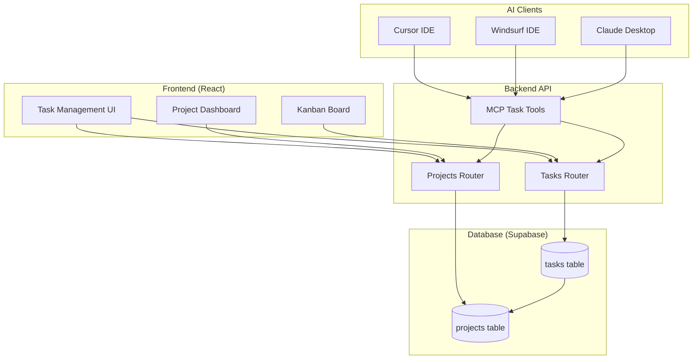
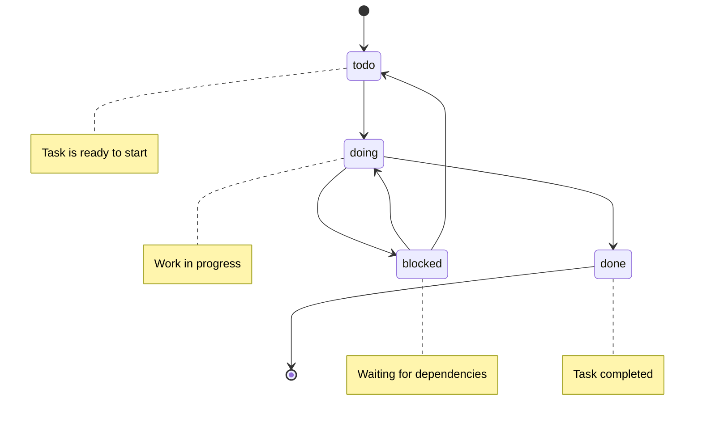
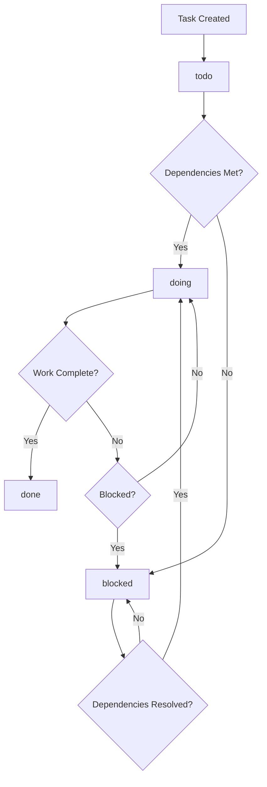

# Task Management System (Archon)

Archon includes a comprehensive project and task management system that integrates seamlessly with your knowledge base and AI coding assistants. This system enables structured project organization, task tracking, and autonomous task management through MCP integration.

## 🎯 Overview

The Archon task management system provides:

- **Project Organization**: Structured project management with PRDs, features, and documentation
- **Hierarchical Tasks**: Support for parent-child task relationships
- **Status Tracking**: Todo, Doing, Blocked, Done status management
- **MCP Integration**: AI agents can create, update, and query tasks autonomously
- **Reference Management**: Link tasks to code examples and documentation sources
- **GitHub Integration**: Connect projects to repositories for context

## 🏗️ System Architecture



## 📊 Database Schema

The task management system uses two main tables in Supabase:

### Projects Table

```sql
CREATE TABLE projects (
  id UUID PRIMARY KEY DEFAULT gen_random_uuid(),
  title TEXT NOT NULL,
  prd JSONB DEFAULT '{}'::jsonb,           -- Product Requirements Document
  docs JSONB DEFAULT '[]'::jsonb,          -- Reference documentation
  features JSONB DEFAULT '[]'::jsonb,      -- Feature list with status
  data JSONB DEFAULT '[]'::jsonb,          -- Sample datasets or resources
  github_repo TEXT,                        -- GitHub repository URL
  created_at TIMESTAMPTZ DEFAULT NOW(),
  updated_at TIMESTAMPTZ DEFAULT NOW()
);
```

#### Project Fields Explained

| Field | Type | Purpose | Example |
|-------|------|---------|----------|
| `id` | UUID | Unique project identifier | `550e8400-e29b-41d4-a716-446655440000` |
| `title` | TEXT | Project name | "API Documentation Overhaul" |
| `prd` | JSONB | Product Requirements Document | `{"overview": "...", "goals": [...]}` |
| `docs` | JSONB | Reference documentation links | `[{"name": "API Spec", "url": "..."}]` |
| `features` | JSONB | Feature list with status | `[{"name": "Auth", "status": "done"}]` |
| `data` | JSONB | Sample data or resources | `[{"name": "Test Data", "url": "..."}]` |
| `github_repo` | TEXT | Repository URL | `https://github.com/user/repo` |

### Tasks Table

```sql
CREATE TYPE task_status AS ENUM ('todo','doing','blocked','done');

CREATE TABLE tasks (
  id UUID PRIMARY KEY DEFAULT gen_random_uuid(),
  project_id UUID NOT NULL REFERENCES projects(id) ON DELETE CASCADE,
  parent_task_id UUID REFERENCES tasks(id) ON DELETE CASCADE,
  title TEXT NOT NULL,
  description TEXT,
  sources JSONB DEFAULT '[]'::jsonb,       -- Reference documentation
  code_examples JSONB DEFAULT '[]'::jsonb, -- Code snippets and examples
  status task_status DEFAULT 'todo',
  created_at TIMESTAMPTZ DEFAULT NOW(),
  updated_at TIMESTAMPTZ DEFAULT NOW()
);

-- Indexes for performance
CREATE INDEX idx_tasks_project ON tasks(project_id);
CREATE INDEX idx_tasks_parent ON tasks(parent_task_id);
CREATE INDEX idx_tasks_status ON tasks(status);
```

#### Task Fields Explained

| Field | Type | Purpose | Example |
|-------|------|---------|----------|
| `id` | UUID | Unique task identifier | `660e8400-e29b-41d4-a716-446655440001` |
| `project_id` | UUID | Parent project reference | Links to projects table |
| `parent_task_id` | UUID | Parent task for subtasks | Creates task hierarchy |
| `title` | TEXT | Task name | "Implement JWT authentication" |
| `description` | TEXT | Detailed task description | "Add JWT-based auth to all API endpoints" |
| `sources` | JSONB | Reference documentation | `[{"name": "JWT Guide", "url": "..."}]` |
| `code_examples` | JSONB | Related code snippets | `[{"language": "python", "code": "..."}]` |
| `status` | ENUM | Current task status | `todo`, `doing`, `blocked`, `done` |

## 🚀 Getting Started

### Creating Your First Project

#### Via Web Interface

1. **Open Archon**: Navigate to http://localhost:3737
2. **Go to Tasks**: Click the "Tasks" tab
3. **Create Project**: Click "New Project"
4. **Fill Details**:
   - **Title**: "My Documentation Project"
   - **Description**: Brief project overview
   - **GitHub Repo**: (optional) Repository URL
5. **Save Project**: Click "Create"

#### Via API

```bash
curl -X POST "http://localhost:8080/api/projects" \
  -H "Content-Type: application/json" \
  -d '{
    "title": "API Documentation Overhaul",
    "prd": {
      "overview": "Improve API documentation for better developer experience",
      "goals": [
        "Add comprehensive examples",
        "Improve navigation structure",
        "Add interactive API explorer"
      ],
      "success_criteria": [
        "Reduce support tickets by 30%",
        "Increase API adoption by 50%"
      ]
    },
    "docs": [
      {
        "name": "Current API Docs",
        "url": "https://api.example.com/docs"
      },
      {
        "name": "Design System",
        "url": "https://design.example.com"
      }
    ],
    "features": [
      {
        "name": "Authentication Examples",
        "status": "planned",
        "priority": "high"
      },
      {
        "name": "Error Handling Guide",
        "status": "planned",
        "priority": "medium"
      }
    ],
    "github_repo": "https://github.com/company/api-docs"
  }'
```

### Creating Tasks

#### Via Web Interface

1. **Select Project**: Choose your project from the dropdown
2. **Add Task**: Click "New Task"
3. **Fill Details**:
   - **Title**: Clear, actionable task name
   - **Description**: Detailed requirements
   - **Status**: Initial status (usually "todo")
   - **Sources**: Add reference documentation
   - **Code Examples**: Add relevant code snippets
4. **Save Task**: Click "Create"

#### Via API

```bash
curl -X POST "http://localhost:8080/api/tasks" \
  -H "Content-Type: application/json" \
  -d '{
    "project_id": "550e8400-e29b-41d4-a716-446655440000",
    "title": "Create authentication examples",
    "description": "Write comprehensive examples showing how to implement JWT authentication with our API, including token generation, validation, and error handling.",
    "sources": [
      {
        "name": "JWT.io Introduction",
        "url": "https://jwt.io/introduction/",
        "description": "Basic JWT concepts and structure"
      },
      {
        "name": "FastAPI Security",
        "url": "https://fastapi.tiangolo.com/tutorial/security/",
        "description": "FastAPI authentication patterns"
      }
    ],
    "code_examples": [
      {
        "language": "python",
        "description": "JWT token generation",
        "code": "import jwt\nfrom datetime import datetime, timedelta\n\ndef create_token(user_id: str) -> str:\n    payload = {\n        'user_id': user_id,\n        'exp': datetime.utcnow() + timedelta(hours=24)\n    }\n    return jwt.encode(payload, SECRET_KEY, algorithm='HS256')"
      },
      {
        "language": "javascript",
        "description": "Client-side token usage",
        "code": "const response = await fetch('/api/protected', {\n  headers: {\n    'Authorization': `Bearer ${token}`\n  }\n});"
      }
    ],
    "status": "todo"
  }'
```

## 🔧 Task Management Features

### Task Hierarchy

Create subtasks to break down complex work:

```bash
# Create parent task
curl -X POST "http://localhost:8080/api/tasks" \
  -H "Content-Type: application/json" \
  -d '{
    "project_id": "550e8400-e29b-41d4-a716-446655440000",
    "title": "Implement user authentication system",
    "description": "Complete authentication system with JWT tokens",
    "status": "todo"
  }'

# Create subtasks
curl -X POST "http://localhost:8080/api/tasks" \
  -H "Content-Type: application/json" \
  -d '{
    "project_id": "550e8400-e29b-41d4-a716-446655440000",
    "parent_task_id": "parent-task-uuid-here",
    "title": "Design JWT token structure",
    "description": "Define token payload and expiration strategy",
    "status": "todo"
  }'
```

### Status Management

Update task status as work progresses:

```bash
# Update task status
curl -X PATCH "http://localhost:8080/api/tasks/task-uuid-here" \
  -H "Content-Type: application/json" \
  -d '{
    "status": "doing",
    "description": "Updated description with current progress notes"
  }'
```

#### Status Workflow



### Task Filtering and Queries

#### Get Tasks by Status

```bash
# Get all "doing" tasks
curl "http://localhost:8080/api/tasks?status=doing"

# Get all tasks for a project
curl "http://localhost:8080/api/tasks?project_id=550e8400-e29b-41d4-a716-446655440000"

# Get subtasks of a parent task
curl "http://localhost:8080/api/tasks?parent_task_id=parent-uuid-here"
```

#### Advanced Filtering

```bash
# Get high-priority blocked tasks
curl "http://localhost:8080/api/tasks?status=blocked&limit=10&sort_by=created_at&sort_order=desc"
```

## 🤖 MCP Integration

AI coding assistants can autonomously manage tasks through MCP tools:

### Available MCP Tools

#### `create_project`
AI agents can create new projects based on conversation context.

**Example AI Usage**:
```
User: "I want to start a new project to improve our API documentation"
AI: Uses create_project tool to set up the project with appropriate PRD
```

#### `create_task`
AI agents can break down work into actionable tasks.

**Example AI Usage**:
```
User: "We need to implement authentication"
AI: Creates tasks for JWT implementation, documentation, testing, etc.
```

#### `update_task`
AI agents can update task status and add progress notes.

**Example AI Usage**:
```
User: "I finished the authentication implementation"
AI: Updates task status to "done" and adds completion notes
```

#### `list_projects` & `list_tasks`
AI agents can query existing work to provide context.

**Example AI Usage**:
```
User: "What tasks do I have in progress?"
AI: Queries tasks with status="doing" and provides summary
```

### AI-Driven Task Management Examples

#### Scenario 1: Project Planning

**User Prompt**:
```
I need to plan a new feature for user profile management. 
Create a project and break it down into tasks.
```

**AI Actions**:
1. Uses `search_knowledge` to find existing user management patterns
2. Uses `create_project` with comprehensive PRD
3. Uses `create_task` multiple times to create structured task breakdown
4. Links relevant documentation in task sources

#### Scenario 2: Progress Tracking

**User Prompt**:
```
I just finished implementing the user registration endpoint. 
Update my tasks and suggest what to work on next.
```

**AI Actions**:
1. Uses `list_tasks` to find registration-related tasks
2. Uses `update_task` to mark completed tasks as "done"
3. Uses `list_tasks` to find next priority tasks
4. Provides recommendations based on task dependencies

#### Scenario 3: Code Review Integration

**User Prompt**:
```
Review this code and create tasks for any improvements needed:
[code snippet]
```

**AI Actions**:
1. Uses `search_knowledge` to find coding standards
2. Analyzes code against documented patterns
3. Uses `create_task` for each improvement needed
4. Links relevant documentation in task sources
5. Adds code examples showing correct patterns

## 📊 Project Management Patterns

### PRD (Product Requirements Document) Structure

Structure your PRD for maximum clarity:

```json
{
  "prd": {
    "overview": "Brief project description and goals",
    "problem_statement": "What problem are we solving?",
    "goals": [
      "Specific, measurable objectives",
      "User experience improvements",
      "Technical achievements"
    ],
    "success_criteria": [
      "Quantifiable success metrics",
      "User satisfaction targets",
      "Performance benchmarks"
    ],
    "scope": {
      "in_scope": ["Features to include"],
      "out_of_scope": ["Features explicitly excluded"]
    },
    "timeline": {
      "start_date": "2024-01-15",
      "target_completion": "2024-03-15",
      "milestones": [
        {
          "name": "MVP Complete",
          "date": "2024-02-15",
          "deliverables": ["Core functionality"]
        }
      ]
    },
    "stakeholders": [
      {
        "name": "Product Manager",
        "role": "Requirements owner",
        "contact": "pm@company.com"
      }
    ]
  }
}
```

### Feature Tracking

Track feature development progress:

```json
{
  "features": [
    {
      "name": "User Authentication",
      "status": "done",
      "priority": "high",
      "effort_estimate": "5 days",
      "actual_effort": "4 days",
      "dependencies": [],
      "tasks": [
        "660e8400-e29b-41d4-a716-446655440001",
        "660e8400-e29b-41d4-a716-446655440002"
      ]
    },
    {
      "name": "User Profile Management",
      "status": "in_progress",
      "priority": "medium",
      "effort_estimate": "8 days",
      "dependencies": ["User Authentication"],
      "blockers": []
    }
  ]
}
```

### Documentation Links

Organize project documentation:

```json
{
  "docs": [
    {
      "name": "API Specification",
      "url": "https://api.company.com/docs",
      "type": "api_spec",
      "description": "OpenAPI specification for all endpoints"
    },
    {
      "name": "Design Mockups",
      "url": "https://figma.com/project-mockups",
      "type": "design",
      "description": "UI/UX designs and user flows"
    },
    {
      "name": "Database Schema",
      "url": "https://dbdocs.io/project-schema",
      "type": "technical",
      "description": "Database design and relationships"
    },
    {
      "name": "Security Requirements",
      "url": "https://wiki.company.com/security",
      "type": "requirements",
      "description": "Security standards and compliance requirements"
    }
  ]
}
```

## 🎨 Frontend Integration

The React frontend provides intuitive task management interfaces:

### Task Dashboard

```jsx
import React, { useState, useEffect } from 'react';
import { TaskCard } from './TaskCard';
import { ProjectSelector } from './ProjectSelector';

const TaskDashboard = () => {
  const [projects, setProjects] = useState([]);
  const [selectedProject, setSelectedProject] = useState(null);
  const [tasks, setTasks] = useState([]);
  const [filter, setFilter] = useState('all');

  useEffect(() => {
    fetchProjects();
  }, []);

  useEffect(() => {
    if (selectedProject) {
      fetchTasks(selectedProject.id, filter);
    }
  }, [selectedProject, filter]);

  const fetchProjects = async () => {
    const response = await fetch('/api/projects');
    const data = await response.json();
    setProjects(data.projects);
  };

  const fetchTasks = async (projectId, status = 'all') => {
    const params = new URLSearchParams({ project_id: projectId });
    if (status !== 'all') {
      params.append('status', status);
    }
    
    const response = await fetch(`/api/tasks?${params}`);
    const data = await response.json();
    setTasks(data.tasks);
  };

  const updateTaskStatus = async (taskId, newStatus) => {
    await fetch(`/api/tasks/${taskId}`, {
      method: 'PATCH',
      headers: { 'Content-Type': 'application/json' },
      body: JSON.stringify({ status: newStatus })
    });
    
    // Refresh tasks
    fetchTasks(selectedProject.id, filter);
  };

  return (
    <div className="task-dashboard">
      <div className="dashboard-header">
        <ProjectSelector 
          projects={projects}
          selected={selectedProject}
          onSelect={setSelectedProject}
        />
        
        <div className="task-filters">
          {['all', 'todo', 'doing', 'blocked', 'done'].map(status => (
            <button
              key={status}
              className={filter === status ? 'active' : ''}
              onClick={() => setFilter(status)}
            >
              {status.charAt(0).toUpperCase() + status.slice(1)}
            </button>
          ))}
        </div>
      </div>

      <div className="tasks-grid">
        {tasks.map(task => (
          <TaskCard
            key={task.id}
            task={task}
            onStatusChange={updateTaskStatus}
          />
        ))}
      </div>
    </div>
  );
};

export default TaskDashboard;
```

### Kanban Board

```jsx
import React from 'react';
import { DragDropContext, Droppable, Draggable } from 'react-beautiful-dnd';

const KanbanBoard = ({ tasks, onTaskMove }) => {
  const columns = {
    todo: { title: 'To Do', tasks: tasks.filter(t => t.status === 'todo') },
    doing: { title: 'In Progress', tasks: tasks.filter(t => t.status === 'doing') },
    blocked: { title: 'Blocked', tasks: tasks.filter(t => t.status === 'blocked') },
    done: { title: 'Done', tasks: tasks.filter(t => t.status === 'done') }
  };

  const handleDragEnd = (result) => {
    if (!result.destination) return;

    const { source, destination, draggableId } = result;
    
    if (source.droppableId !== destination.droppableId) {
      onTaskMove(draggableId, destination.droppableId);
    }
  };

  return (
    <DragDropContext onDragEnd={handleDragEnd}>
      <div className="kanban-board">
        {Object.entries(columns).map(([columnId, column]) => (
          <div key={columnId} className="kanban-column">
            <h3>{column.title}</h3>
            <Droppable droppableId={columnId}>
              {(provided) => (
                <div
                  {...provided.droppableProps}
                  ref={provided.innerRef}
                  className="task-list"
                >
                  {column.tasks.map((task, index) => (
                    <Draggable key={task.id} draggableId={task.id} index={index}>
                      {(provided) => (
                        <div
                          ref={provided.innerRef}
                          {...provided.draggableProps}
                          {...provided.dragHandleProps}
                          className="task-card"
                        >
                          <h4>{task.title}</h4>
                          <p>{task.description}</p>
                          {task.sources.length > 0 && (
                            <div className="task-sources">
                              {task.sources.map((source, idx) => (
                                <a key={idx} href={source.url} target="_blank" rel="noopener noreferrer">
                                  {source.name}
                                </a>
                              ))}
                            </div>
                          )}
                        </div>
                      )}
                    </Draggable>
                  ))}
                  {provided.placeholder}
                </div>
              )}
            </Droppable>
          </div>
        ))}
      </div>
    </DragDropContext>
  );
};

export default KanbanBoard;
```

## 📈 Analytics and Reporting

### Project Progress Tracking

```sql
-- Get project completion percentage
SELECT 
  p.title,
  COUNT(t.id) as total_tasks,
  COUNT(CASE WHEN t.status = 'done' THEN 1 END) as completed_tasks,
  ROUND(
    (COUNT(CASE WHEN t.status = 'done' THEN 1 END)::float / COUNT(t.id)) * 100, 
    2
  ) as completion_percentage
FROM projects p
LEFT JOIN tasks t ON p.id = t.project_id
GROUP BY p.id, p.title
ORDER BY completion_percentage DESC;
```

### Task Velocity Analysis

```sql
-- Tasks completed per week
SELECT 
  DATE_TRUNC('week', updated_at) as week,
  COUNT(*) as tasks_completed
FROM tasks 
WHERE status = 'done'
  AND updated_at >= NOW() - INTERVAL '8 weeks'
GROUP BY week
ORDER BY week;
```

### Blocked Tasks Report

```sql
-- Currently blocked tasks with duration
SELECT 
  t.title,
  p.title as project,
  t.description,
  t.updated_at,
  NOW() - t.updated_at as blocked_duration
FROM tasks t
JOIN projects p ON t.project_id = p.id
WHERE t.status = 'blocked'
ORDER BY blocked_duration DESC;
```

## 🔧 Advanced Features

### Task Templates

Create reusable task templates for common workflows:

```json
{
  "templates": {
    "feature_development": {
      "name": "Feature Development",
      "tasks": [
        {
          "title": "Design and Planning",
          "description": "Create technical design and implementation plan",
          "sources": [
            {"name": "Architecture Guidelines", "url": "internal://arch-guide"}
          ]
        },
        {
          "title": "Implementation",
          "description": "Implement the feature according to design",
          "parent": "Design and Planning"
        },
        {
          "title": "Testing",
          "description": "Write and execute comprehensive tests",
          "parent": "Implementation"
        },
        {
          "title": "Documentation",
          "description": "Update documentation and examples",
          "parent": "Implementation"
        },
        {
          "title": "Code Review",
          "description": "Peer review and address feedback",
          "parent": "Testing"
        }
      ]
    }
  }
}
```

### Automated Task Creation

Integrate with GitHub webhooks to automatically create tasks:

```python
# webhook_handler.py
from fastapi import APIRouter, Request
import json

router = APIRouter()

@router.post("/webhooks/github")
async def github_webhook(request: Request):
    payload = await request.json()
    event_type = request.headers.get("X-GitHub-Event")
    
    if event_type == "issues" and payload["action"] == "opened":
        # Create task from GitHub issue
        issue = payload["issue"]
        
        task_data = {
            "title": issue["title"],
            "description": issue["body"],
            "sources": [
                {
                    "name": f"GitHub Issue #{issue['number']}",
                    "url": issue["html_url"]
                }
            ],
            "status": "todo"
        }
        
        # Find or create project based on repository
        project = await find_or_create_project_for_repo(
            payload["repository"]["full_name"]
        )
        task_data["project_id"] = project["id"]
        
        # Create the task
        await create_task(task_data)
        
    return {"status": "processed"}
```

### Task Dependencies

Implement task dependencies for complex workflows:

```sql
-- Add dependencies table
CREATE TABLE task_dependencies (
  id UUID PRIMARY KEY DEFAULT gen_random_uuid(),
  task_id UUID NOT NULL REFERENCES tasks(id) ON DELETE CASCADE,
  depends_on_task_id UUID NOT NULL REFERENCES tasks(id) ON DELETE CASCADE,
  dependency_type VARCHAR(50) DEFAULT 'blocks', -- 'blocks', 'related', 'subtask'
  created_at TIMESTAMPTZ DEFAULT NOW()
);

-- Prevent circular dependencies
CREATE UNIQUE INDEX idx_task_dependencies_unique 
ON task_dependencies(task_id, depends_on_task_id);
```

```python
# Check if task can be started (all dependencies completed)
async def can_start_task(task_id: str) -> bool:
    query = """
    SELECT COUNT(*) as blocked_dependencies
    FROM task_dependencies td
    JOIN tasks t ON td.depends_on_task_id = t.id
    WHERE td.task_id = $1 
      AND td.dependency_type = 'blocks'
      AND t.status != 'done'
    """
    
    result = await database.fetch_one(query, task_id)
    return result["blocked_dependencies"] == 0
```

## 🔍 Best Practices

### Task Writing Guidelines

#### Good Task Examples

✅ **Good**: "Implement JWT authentication middleware for FastAPI"
- Specific technology mentioned
- Clear deliverable
- Actionable

✅ **Good**: "Write unit tests for user registration endpoint covering happy path and error cases"
- Specific scope
- Clear acceptance criteria
- Testable outcome

#### Poor Task Examples

❌ **Poor**: "Fix authentication"
- Too vague
- No clear scope
- Not actionable

❌ **Poor**: "Make the app better"
- No specific deliverable
- Subjective criteria
- Not measurable

### Project Organization

#### Recommended Project Structure

```
Project: "User Management System"
├── Epic: "Authentication"
│   ├── Task: "Design JWT token structure"
│   ├── Task: "Implement login endpoint"
│   ├── Task: "Implement logout endpoint"
│   └── Task: "Add authentication middleware"
├── Epic: "User Profiles"
│   ├── Task: "Design user profile schema"
│   ├── Task: "Implement profile CRUD endpoints"
│   └── Task: "Add profile validation"
└── Epic: "Testing & Documentation"
    ├── Task: "Write integration tests"
    ├── Task: "Update API documentation"
    └── Task: "Create user guides"
```

### Status Management Best Practices

#### When to Use Each Status

- **Todo**: Task is ready to start, all dependencies met
- **Doing**: Work is actively in progress
- **Blocked**: Cannot proceed due to external dependencies
- **Done**: Task is completed and verified

#### Status Transition Guidelines



## 🚀 Integration Examples

### Cursor IDE Integration

Example of AI-assisted task management in Cursor:

```
User: "I need to implement user authentication for our API"

AI Response:
I'll help you plan the authentication implementation. Let me create a project and break this down into manageable tasks.

[AI uses MCP tools to:]
1. search_knowledge("FastAPI authentication JWT")
2. create_project with authentication project details
3. create_task for each implementation step
4. Link relevant documentation from knowledge base

I've created a project "User Authentication System" with the following tasks:

1. ✅ Design JWT token structure
   - Sources: FastAPI Security docs, JWT.io guide
   - Code examples: Token generation and validation

2. ✅ Implement authentication middleware
   - Sources: FastAPI middleware documentation
   - Code examples: Dependency injection patterns

3. ✅ Create login/logout endpoints
   - Sources: FastAPI routing documentation
   - Code examples: Request/response models

4. ✅ Add password hashing
   - Sources: Security best practices
   - Code examples: bcrypt implementation

5. ✅ Write authentication tests
   - Sources: FastAPI testing guide
   - Code examples: Test fixtures and mocks

Would you like me to start with any specific task?
```

### GitHub Integration

Automatic task creation from GitHub issues:

```python
# github_integration.py
import asyncio
from github import Github
from typing import List, Dict

class GitHubTaskSync:
    def __init__(self, github_token: str, repo_name: str):
        self.github = Github(github_token)
        self.repo = self.github.get_repo(repo_name)
    
    async def sync_issues_to_tasks(self, project_id: str) -> List[Dict]:
        """Sync GitHub issues to Archon tasks"""
        issues = self.repo.get_issues(state='open')
        created_tasks = []
        
        for issue in issues:
            # Check if task already exists
            existing_task = await self.find_task_by_github_issue(issue.number)
            
            if not existing_task:
                task_data = {
                    "project_id": project_id,
                    "title": issue.title,
                    "description": issue.body or "",
                    "sources": [
                        {
                            "name": f"GitHub Issue #{issue.number}",
                            "url": issue.html_url,
                            "description": "Original GitHub issue"
                        }
                    ],
                    "status": "todo",
                    "metadata": {
                        "github_issue_number": issue.number,
                        "github_issue_id": issue.id,
                        "labels": [label.name for label in issue.labels]
                    }
                }
                
                # Add assignee if available
                if issue.assignee:
                    task_data["assignee"] = issue.assignee.login
                
                # Create task
                task = await self.create_task(task_data)
                created_tasks.append(task)
        
        return created_tasks
    
    async def update_github_from_tasks(self, project_id: str):
        """Update GitHub issues based on task status changes"""
        tasks = await self.get_tasks_with_github_issues(project_id)
        
        for task in tasks:
            github_issue_number = task["metadata"].get("github_issue_number")
            if github_issue_number:
                issue = self.repo.get_issue(github_issue_number)
                
                # Update issue based on task status
                if task["status"] == "done" and issue.state == "open":
                    issue.edit(state="closed")
                    issue.create_comment(
                        f"Task completed in Archon: {task['title']}\n\n"
                        f"Task ID: {task['id']}"
                    )
```

## 🔮 Future Enhancements

### Planned Features

- **Time Tracking**: Built-in time tracking for tasks
- **Task Templates**: Reusable task templates for common workflows
- **Advanced Dependencies**: Complex dependency graphs with visualization
- **Team Collaboration**: Multi-user task assignment and collaboration
- **Reporting Dashboard**: Advanced analytics and progress reporting
- **Integration Hub**: Pre-built integrations with popular tools

### Experimental Features

- **AI Task Estimation**: Automatic effort estimation based on historical data
- **Smart Task Suggestions**: AI-powered task recommendations
- **Automated Testing Integration**: Automatic task creation from failing tests
- **Code Change Tracking**: Link tasks to specific code changes and commits

---

**Next Steps**:
- Learn about [RAG System](./rag) for knowledge-driven task creation
- Explore [User Interface](./ui) for task management workflows
- Check [API Reference](./api-reference) for programmatic task management
