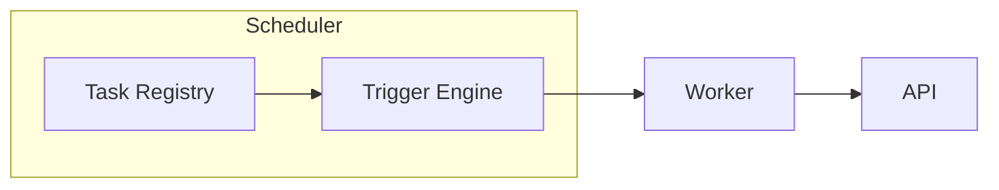

# Tasks

Define and schedule MCP tasks.

## Creating a Task

```python
from mcp import task

@task(name="daily-summary", schedule="0 0 * * *")
def daily_summary():
    # ...
```

## Viewing Tasks

- GET `/api/mcp/tasks`
- GET `/api/mcp/task/{id}`

## Workflow Diagram



Dive into [MCP Reference](mcp-reference) for decorator usage.
