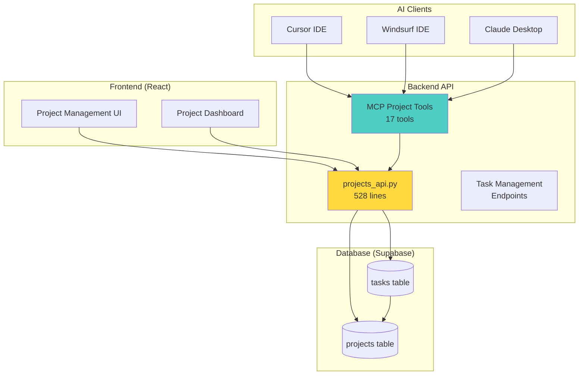
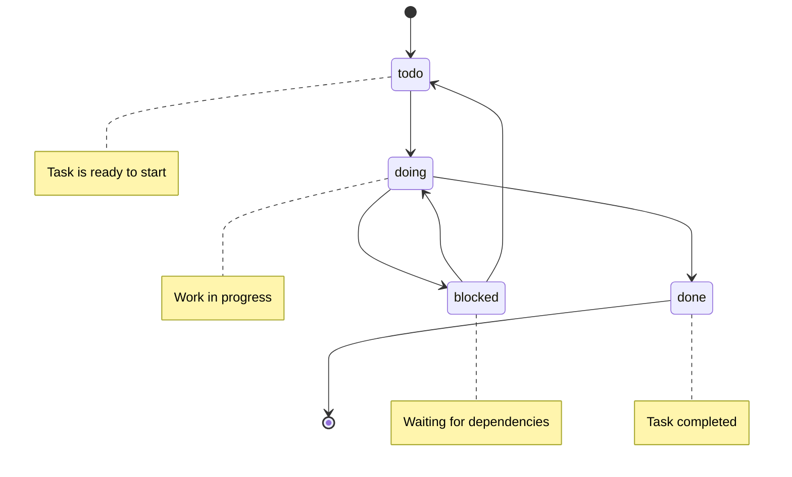
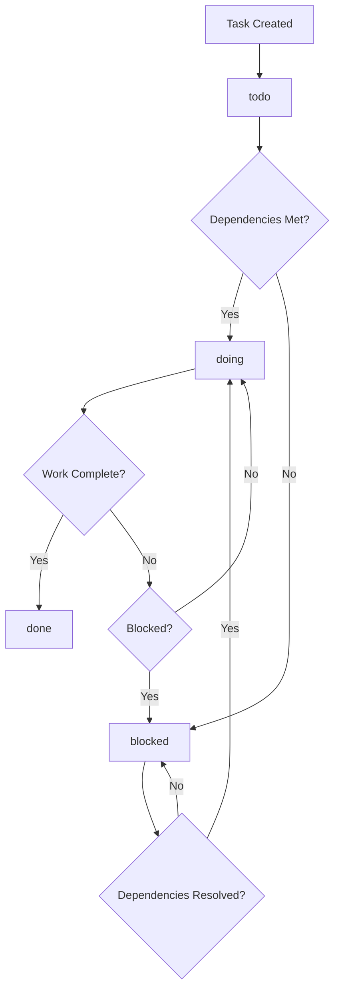

import Tabs from '@theme/Tabs';
import TabItem from '@theme/TabItem';
import Admonition from '@theme/Admonition';

# Task Management System (Archon)

Archon includes a comprehensive project and task management system that integrates seamlessly with your knowledge base and AI coding assistants. This system enables structured project organization, task tracking, and autonomous task management through MCP integration.

## 🎯 Overview

The Archon task management system provides:

- **Project Organization**: Structured project management with PRDs, features, and documentation
- **Hierarchical Tasks**: Support for parent-child task relationships
- **Status Tracking**: Todo, Doing, Blocked, Done status management
- **MCP Integration**: AI agents can create, update, and query tasks autonomously
- **Reference Management**: Link tasks to code examples and documentation sources
- **GitHub Integration**: Connect projects to repositories for context

## 🏗️ System Architecture



## 📊 Database Schema

The task management system uses two main tables in Supabase:

### Projects Table

```sql
CREATE TABLE projects (
  id UUID PRIMARY KEY DEFAULT gen_random_uuid(),
  title TEXT NOT NULL,
  prd JSONB DEFAULT '{}'::jsonb,           -- Product Requirements Document
  docs JSONB DEFAULT '[]'::jsonb,          -- Reference documentation array
  features JSONB DEFAULT '[]'::jsonb,      -- Feature list with status
  data JSONB DEFAULT '[]'::jsonb,          -- Sample datasets or resources
  github_repo TEXT,                        -- GitHub repository URL
  created_at TIMESTAMPTZ DEFAULT NOW(),
  updated_at TIMESTAMPTZ DEFAULT NOW()
);
```

#### Project Fields Explained

| Field | Type | Purpose | Example |
|-------|------|---------|----------|
| `id` | UUID | Unique project identifier | `550e8400-e29b-41d4-a716-446655440000` |
| `title` | TEXT | Project name | "API Documentation Overhaul" |
| `prd` | JSONB | Product Requirements Document | `{"overview": "...", "goals": [...]}` |
| `docs` | JSONB | Reference documentation array | `[{"id": "uuid", "title": "API Spec", "content": {...}}]` |
| `features` | JSONB | Feature list with status | `[{"name": "Auth", "status": "done"}]` |
| `data` | JSONB | Sample data or resources | `[{"name": "Test Data", "url": "..."}]` |
| `github_repo` | TEXT | Repository URL | `https://github.com/user/repo` |

### Tasks Table

```sql
CREATE TYPE task_status AS ENUM ('todo','doing','blocked','done');

CREATE TABLE tasks (
  id UUID PRIMARY KEY DEFAULT gen_random_uuid(),
  project_id UUID NOT NULL REFERENCES projects(id) ON DELETE CASCADE,
  parent_task_id UUID REFERENCES tasks(id) ON DELETE CASCADE,
  title TEXT NOT NULL,
  description TEXT,
  sources JSONB DEFAULT '[]'::jsonb,       -- Reference documentation
  code_examples JSONB DEFAULT '[]'::jsonb, -- Code snippets and examples
  status task_status DEFAULT 'todo',
  created_at TIMESTAMPTZ DEFAULT NOW(),
  updated_at TIMESTAMPTZ DEFAULT NOW()
);

-- Indexes for performance
CREATE INDEX idx_tasks_project ON tasks(project_id);
CREATE INDEX idx_tasks_parent ON tasks(parent_task_id);
CREATE INDEX idx_tasks_status ON tasks(status);
```

#### Task Fields Explained

| Field | Type | Purpose | Example |
|-------|------|---------|----------|
| `id` | UUID | Unique task identifier | `660e8400-e29b-41d4-a716-446655440001` |
| `project_id` | UUID | Parent project reference | Links to projects table |
| `parent_task_id` | UUID | Parent task for subtasks | Creates task hierarchy |
| `title` | TEXT | Task name | "Implement JWT authentication" |
| `description` | TEXT | Detailed task description | "Add JWT-based auth to all API endpoints" |
| `sources` | JSONB | Reference documentation | `[{"name": "JWT Guide", "url": "..."}]` |
| `code_examples` | JSONB | Related code snippets | `[{"language": "python", "code": "..."}]` |
| `status` | ENUM | Current task status | `todo`, `doing`, `blocked`, `done` |

## 🚀 Getting Started

### Creating Your First Project

#### Via Web Interface

1. **Open Archon**: Navigate to http://localhost:3737
2. **Go to Projects**: Click the "Projects" tab in the navigation
3. **Create Project**: Click "New Project"
4. **Fill Details**:
   - **Title**: "My Documentation Project"
   - **Description**: Brief project overview
   - **GitHub Repo**: (optional) Repository URL
5. **Save Project**: Click "Create"

#### Via API

```bash
curl -X POST "http://localhost:8080/api/projects" \
  -H "Content-Type: application/json" \
  -d '{
    "title": "API Documentation Overhaul",
    "prd": {
      "overview": "Improve API documentation for better developer experience",
      "goals": [
        "Add comprehensive examples",
        "Improve navigation structure",
        "Add interactive API explorer"
      ],
      "success_criteria": [
        "Reduce support tickets by 30%",
        "Increase API adoption by 50%"
      ]
    },
    "github_repo": "https://github.com/company/api-docs"
  }'
```

#### Via MCP (AI Agent)

AI agents can autonomously create projects:

```
User: "I need to start a new project to improve our API documentation"
AI: [Uses create_project MCP tool] 
    "I've created a new project 'API Documentation Improvement' with a comprehensive PRD..."
```

### Creating Tasks

#### Via Web Interface

1. **Select Project**: Choose your project from the project list
2. **Add Task**: Click "New Task"
3. **Fill Details**:
   - **Title**: Clear, actionable task name
   - **Description**: Detailed requirements
   - **Status**: Initial status (usually "todo")
   - **Assignee**: Choose from User, Archon, or AI IDE Agent
   - **Sources**: Add reference documentation
   - **Code Examples**: Add relevant code snippets
4. **Save Task**: Click "Create"

#### Via API

```bash
curl -X POST "http://localhost:8080/api/tasks" \
  -H "Content-Type: application/json" \
  -d '{
    "project_id": "550e8400-e29b-41d4-a716-446655440000",
    "title": "Create authentication examples",
    "description": "Write comprehensive examples showing how to implement JWT authentication with our API, including token generation, validation, and error handling.",
    "assignee": "Archon",
    "sources": [
      {
        "name": "JWT.io Introduction",
        "url": "https://jwt.io/introduction/",
        "description": "Basic JWT concepts and structure"
      },
      {
        "name": "FastAPI Security",
        "url": "https://fastapi.tiangolo.com/tutorial/security/",
        "description": "FastAPI authentication patterns"
      }
    ],
    "code_examples": [
      {
        "language": "python",
        "description": "JWT token generation",
        "code": "import jwt\nfrom datetime import datetime, timedelta\n\ndef create_token(user_id: str) -> str:\n    payload = {\n        'user_id': user_id,\n        'exp': datetime.utcnow() + timedelta(hours=24)\n    }\n    return jwt.encode(payload, SECRET_KEY, algorithm='HS256')"
      }
    ],
    "status": "todo"
  }'
```

## 🔧 Task Management Features

### Task Hierarchy

Create subtasks to break down complex work:

<Tabs>
<TabItem value="api" label="API Example">

```bash
# Create parent task
curl -X POST "http://localhost:8080/api/tasks" \
  -H "Content-Type: application/json" \
  -d '{
    "project_id": "550e8400-e29b-41d4-a716-446655440000",
    "title": "Implement user authentication system",
    "description": "Complete authentication system with JWT tokens",
    "status": "todo"
  }'

# Create subtasks (using parent_task_id from response)
curl -X POST "http://localhost:8080/api/tasks" \
  -H "Content-Type: application/json" \
  -d '{
    "project_id": "550e8400-e29b-41d4-a716-446655440000",
    "parent_task_id": "parent-task-uuid-here",
    "title": "Design JWT token structure",
    "description": "Define token payload and expiration strategy",
    "status": "todo"
  }'
```

</TabItem>
<TabItem value="mcp" label="MCP (AI) Example">

```
User: "Break down the authentication task into smaller pieces"
AI: [Uses create_task MCP tool multiple times]
    "I've broken down your authentication task into 5 subtasks:
    1. Design JWT token structure
    2. Implement token generation
    3. Create middleware for validation
    4. Add authentication endpoints
    5. Write comprehensive tests"
```

</TabItem>
</Tabs>

### Status Management

Update task status as work progresses:

<Tabs>
<TabItem value="api" label="API Status Update">

```bash
# Update task status
curl -X PATCH "http://localhost:8080/api/tasks/task-uuid-here" \
  -H "Content-Type: application/json" \
  -d '{
    "status": "doing",
    "description": "Started implementing JWT token generation. Updated payload structure to include user roles and permissions."
  }'
```

</TabItem>
<TabItem value="mcp" label="MCP Status Update">

```
User: "I finished implementing the authentication middleware"
AI: [Uses update_task_status MCP tool]
    "Great! I've updated the authentication middleware task to 'done' and added your completion notes."
```

</TabItem>
</Tabs>

#### Status Workflow



### Task Filtering and Queries

#### Get Tasks by Status

```bash
# Get all "doing" tasks
curl "http://localhost:8080/api/tasks?status=doing"

# Get all tasks for a project
curl "http://localhost:8080/api/tasks?project_id=550e8400-e29b-41d4-a716-446655440000"

# Get subtasks of a parent task
curl "http://localhost:8080/api/tasks?parent_task_id=parent-uuid-here"
```

#### Advanced Filtering

```bash
# Get tasks by status with project filter
curl "http://localhost:8080/api/tasks?project_id=550e8400-e29b-41d4-a716-446655440000&status=blocked"
```

## 🤖 MCP Integration

AI coding assistants can autonomously manage tasks through MCP tools:

### Available MCP Tools (17 Project Tools)

<Admonition type="info" title="MCP Tools Overview">
  The project module (`project_module.py` - 1065 lines) provides 17 MCP tools for complete project and task management automation.
</Admonition>

#### Core Project Tools

| Tool | Purpose | AI Usage Example |
|------|---------|------------------|
| `create_project` | Create new projects with PRD | "Start a new project for user management features" |
| `list_projects` | Query existing projects | "What projects do we have?" |
| `get_project` | Get detailed project info | "Show me details of the authentication project" |
| `delete_project` | Remove completed projects | "Archive the completed migration project" |

#### Task Management Tools

| Tool | Purpose | AI Usage Example |
|------|---------|------------------|
| `create_task` | Create new tasks with context and assignee | "Create tasks for implementing OAuth login assigned to Archon" |
| `list_tasks_by_project` | Get all project tasks | "Show me all tasks for the API project" |
| `get_task` | Get detailed task info | "What's the status of the authentication task?" |
| `update_task_status` | Change task status | "Mark the login feature as completed" |
| `update_task` | Modify task details | "Update the task description with new requirements" |
| `delete_task` | Remove obsolete tasks | "Remove the deprecated API task" |
| `get_task_subtasks` | Get child tasks | "What subtasks are under the authentication epic?" |
| `get_tasks_by_status` | Filter by status | "Show me all blocked tasks" |

#### Document Management Tools

| Tool | Purpose | AI Usage Example |
|------|---------|------------------|
| `add_project_document` | Add documentation | "Create a technical spec document" |
| `list_project_documents` | Get all project docs | "What documentation exists for this project?" |
| `get_project_document` | Retrieve specific doc | "Show me the API specification document" |
| `update_project_document` | Modify documents | "Update the PRD with new requirements" |
| `delete_project_document` | Remove outdated docs | "Remove the old design mockups" |

### AI-Driven Task Management Examples

#### Scenario 1: Project Planning

**User Prompt**:
```
I need to plan a new feature for user profile management. 
Create a project and break it down into tasks.
```

**AI Actions**:
1. `create_project` - Creates "User Profile Management" project with comprehensive PRD
2. `search_knowledge` - Finds existing user management patterns in knowledge base
3. `create_task` (multiple calls) - Creates structured task breakdown:
   - Design user profile schema
   - Implement profile CRUD endpoints
   - Add profile validation
   - Create profile UI components
   - Write integration tests
4. Links relevant documentation in task sources

#### Scenario 2: Progress Tracking

**User Prompt**:
```
I just finished implementing the user registration endpoint. 
Update my tasks and suggest what to work on next.
```

**AI Actions**:
1. `list_tasks_by_project` - Gets current project tasks
2. `get_tasks_by_status` - Finds tasks with status "doing"
3. `update_task_status` - Marks registration task as "done"
4. `update_task` - Adds completion notes and implementation details
5. `get_task_subtasks` - Checks for dependent tasks
6. Provides recommendations for next priority tasks

#### Scenario 3: Code Review Integration

**User Prompt**:
```
Review this authentication code and create tasks for any improvements needed:
[code snippet]
```

**AI Actions**:
1. `search_knowledge` - Finds coding standards and security patterns
2. Analyzes code against documented best practices
3. `create_task` - Creates improvement tasks:
   - Add input validation
   - Implement rate limiting
   - Add comprehensive error handling
   - Improve test coverage
4. Links relevant documentation and code examples
5. Sets appropriate priorities and dependencies

## 📊 Project Management Patterns

### PRD (Product Requirements Document) Structure

When creating projects, Archon automatically generates a structured PRD:

```json
{
  "prd": {
    "overview": "Clear description of what we're building and why",
    "problem_statement": "What problem are we solving?",
    "goals": [
      "Specific, measurable objectives",
      "User experience improvements",
      "Technical achievements"
    ],
    "success_criteria": [
      "Quantifiable success metrics",
      "User satisfaction targets",
      "Performance benchmarks"
    ],
    "scope": {
      "in_scope": ["Features to include"],
      "out_of_scope": ["Features explicitly excluded"]
    },
    "technical_requirements": [
      "Performance requirements",
      "Security requirements",
      "Scalability requirements"
    ],
    "stakeholders": [
      {
        "name": "Product Manager",
        "role": "Requirements owner",
        "contact": "pm@company.com"
      }
    ]
  }
}
```

### Project Document Management

The `docs` JSONB field stores structured documents:

```json
{
  "docs": [
    {
      "id": "doc-uuid-1",
      "document_type": "prd",
      "title": "Product Requirements Document",
      "content": {
        "overview": "...",
        "goals": ["..."],
        "requirements": ["..."]
      },
      "status": "approved",
      "tags": ["default", "prd"],
      "version": "1.0",
      "author": "AI Assistant",
      "created_at": "2024-01-15T10:00:00Z",
      "updated_at": "2024-01-15T10:00:00Z"
    },
    {
      "id": "doc-uuid-2", 
      "document_type": "technical_spec",
      "title": "Authentication Technical Specification",
      "content": {
        "architecture": "...",
        "apis": ["..."],
        "security": "..."
      },
      "status": "draft",
      "tags": ["auth", "technical"],
      "version": "0.1",
      "created_at": "2024-01-16T09:00:00Z"
    }
  ]
}
```

### Feature Tracking

Track feature development progress:

```json
{
  "features": [
    {
      "name": "User Authentication",
      "status": "done",
      "priority": "high",
      "effort_estimate": "5 days",
      "actual_effort": "4 days",
      "dependencies": [],
      "tasks": [
        "660e8400-e29b-41d4-a716-446655440001",
        "660e8400-e29b-41d4-a716-446655440002"
      ]
    },
    {
      "name": "User Profile Management",
      "status": "in_progress",
      "priority": "medium",
      "effort_estimate": "8 days",
      "dependencies": ["User Authentication"],
      "blockers": []
    }
  ]
}
```

## 🎨 Frontend Integration

The React frontend (`ProjectPage.tsx` - 593 lines) provides intuitive task management interfaces:

### Project Dashboard Features

- **Project Overview**: Title, description, GitHub integration
- **Task Summary**: Status breakdown, progress indicators
- **Document Management**: PRD viewer, document creation
- **Feature Tracking**: Feature status and dependencies

### Task Management Interface

- **Task List**: Filterable by status, searchable
- **Task Details**: Full task information, sources, code examples
- **Status Updates**: Drag-and-drop status changes
- **Subtask Management**: Hierarchical task display

### Real-time Updates

The frontend receives real-time updates via WebSocket connections when:
- Tasks are created or updated by AI agents
- Project status changes
- Documents are added or modified

## 📈 Analytics and Reporting

### Project Progress Tracking

```sql
-- Get project completion percentage
SELECT 
  p.title,
  COUNT(t.id) as total_tasks,
  COUNT(CASE WHEN t.status = 'done' THEN 1 END) as completed_tasks,
  ROUND(
    (COUNT(CASE WHEN t.status = 'done' THEN 1 END)::float / COUNT(t.id)) * 100, 
    2
  ) as completion_percentage
FROM projects p
LEFT JOIN tasks t ON p.id = t.project_id
GROUP BY p.id, p.title
ORDER BY completion_percentage DESC;
```

### Task Velocity Analysis

```sql
-- Tasks completed per week
SELECT 
  DATE_TRUNC('week', updated_at) as week,
  COUNT(*) as tasks_completed
FROM tasks 
WHERE status = 'done'
  AND updated_at >= NOW() - INTERVAL '8 weeks'
GROUP BY week
ORDER BY week;
```

### Blocked Tasks Report

```sql
-- Currently blocked tasks with duration
SELECT 
  t.title,
  p.title as project,
  t.description,
  t.updated_at,
  NOW() - t.updated_at as blocked_duration
FROM tasks t
JOIN projects p ON t.project_id = p.id
WHERE t.status = 'blocked'
ORDER BY blocked_duration DESC;
```

## 🔍 Best Practices

### Task Writing Guidelines

#### Good Task Examples

✅ **Good**: "Implement JWT authentication middleware for FastAPI"
- Specific technology mentioned
- Clear deliverable
- Actionable

✅ **Good**: "Write unit tests for user registration endpoint covering happy path and validation errors"
- Specific scope
- Clear acceptance criteria
- Testable outcome

#### Poor Task Examples

❌ **Poor**: "Fix authentication"
- Too vague
- No clear scope
- Not actionable

❌ **Poor**: "Make the app better"
- No specific deliverable
- Subjective criteria
- Not measurable

### Project Organization

#### Recommended Project Structure

```
Project: "User Management System"
├── Epic: "Authentication"
│   ├── Task: "Design JWT token structure"
│   ├── Task: "Implement login endpoint"
│   ├── Task: "Implement logout endpoint"
│   └── Task: "Add authentication middleware"
├── Epic: "User Profiles"
│   ├── Task: "Design user profile schema"
│   ├── Task: "Implement profile CRUD endpoints"
│   └── Task: "Add profile validation"
└── Epic: "Testing & Documentation"
    ├── Task: "Write integration tests"
    ├── Task: "Update API documentation"
    └── Task: "Create user guides"
```

### Status Management Best Practices

#### When to Use Each Status

- **Todo**: Task is ready to start, all dependencies met
- **Doing**: Work is actively in progress
- **Blocked**: Cannot proceed due to external dependencies
- **Done**: Task is completed and verified

#### Status Transition Guidelines



## 🚀 Integration Examples

### Cursor IDE Integration

Example of AI-assisted task management in Cursor:

```
User: "I need to implement user authentication for our API"

AI Response:
I'll help you plan the authentication implementation. Let me create a project and break this down into manageable tasks.

[AI uses MCP tools to:]
1. create_project with authentication project details
2. search_knowledge("FastAPI authentication JWT")
3. create_task for each implementation step
4. Link relevant documentation from knowledge base

I've created a project "User Authentication System" with the following tasks:

1. ✅ Design JWT token structure
   - Status: todo
   - Sources: FastAPI Security docs, JWT.io guide
   - Code examples: Token generation and validation

2. ✅ Implement authentication middleware
   - Status: todo  
   - Sources: FastAPI middleware documentation
   - Code examples: Dependency injection patterns

3. ✅ Create login/logout endpoints
   - Status: todo
   - Sources: FastAPI routing documentation
   - Code examples: Request/response models

4. ✅ Add password hashing
   - Status: todo
   - Sources: Security best practices
   - Code examples: bcrypt implementation

5. ✅ Write authentication tests
   - Status: todo
   - Sources: FastAPI testing guide
   - Code examples: Test fixtures and mocks

Would you like me to start with any specific task?
```

### GitHub Integration

While not directly implemented yet, the system is designed for GitHub integration:

```python
# Future GitHub integration example
class GitHubTaskSync:
    async def sync_issues_to_tasks(self, project_id: str) -> List[Dict]:
        """Sync GitHub issues to Archon tasks"""
        issues = self.repo.get_issues(state='open')
        created_tasks = []
        
        for issue in issues:
            # Check if task already exists
            existing_task = await self.find_task_by_github_issue(issue.number)
            
            if not existing_task:
                task_data = {
                    "project_id": project_id,
                    "title": issue.title,
                    "description": issue.body or "",
                    "sources": [
                        {
                            "name": f"GitHub Issue #{issue.number}",
                            "url": issue.html_url,
                            "description": "Original GitHub issue"
                        }
                    ],
                    "status": "todo"
                }
                
                # Create task via MCP tool
                task = await self.create_task(task_data)
                created_tasks.append(task)
        
        return created_tasks
```

## 🔮 Future Enhancements

### Planned Features

- **Time Tracking**: Built-in time tracking for tasks
- **Task Templates**: Reusable task templates for common workflows
- **Advanced Dependencies**: Complex dependency graphs with visualization
- **Team Collaboration**: Multi-user task assignment and collaboration
- **Reporting Dashboard**: Advanced analytics and progress reporting
- **GitHub Integration**: Bidirectional sync with GitHub issues

### Experimental Features

- **AI Task Estimation**: Automatic effort estimation based on historical data
- **Smart Task Suggestions**: AI-powered task recommendations based on code changes
- **Automated Testing Integration**: Automatic task creation from failing tests
- **Code Change Tracking**: Link tasks to specific code changes and commits

---

**Next Steps**:
- Learn about [RAG System](./rag) for knowledge-driven task creation
- Explore [User Interface](./ui) for task management workflows
- Check [API Reference](./api-reference) for programmatic task management
- Review [MCP Integration](./mcp-reference) for AI client setup 