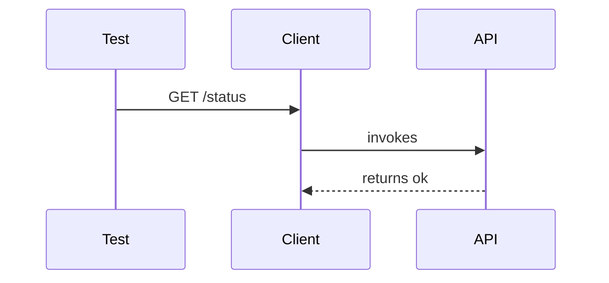

# Testing

Leverages **pytest** for unit and integration tests.

## Directory Structure

```bash
tree tests -L 2
```

```text
tests/
├── unit/
├── integration/
└── conftest.py
```

## Running Tests

```bash
pytest --cov=src
```

## Sample Test

```python
def test_status(client):
    response = client.get('/api/mcp/status')
    assert response.json()['status'] == 'ok'
```


