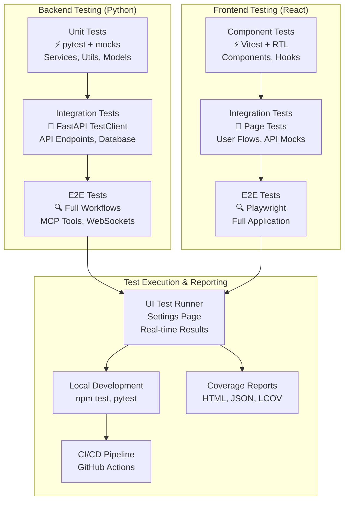

# Testing Overview

Archon employs a comprehensive testing strategy across both backend (Python/pytest) and frontend (React/Vitest) components. This guide provides an overview of our testing approach, with detailed strategies available for each technology stack.

## 🎯 Core Testing Principles

1. **Test at the Right Level**: Follow the testing pyramid - many unit tests, fewer integration tests, minimal E2E tests
2. **Fast Feedback**: Tests should run quickly to enable rapid development
3. **Isolation**: Each test should be independent and repeatable
4. **User-Focused**: Test behavior and outcomes, not implementation details
5. **Comprehensive Coverage**: Aim for high coverage of critical paths

## 🏗️ Testing Architecture



## 🚀 UI Test Runner & Results Dashboard

Archon includes a built-in test runner with comprehensive reporting accessible from the Settings page. This provides:

### **Test Results Modal Features**
- **Test Health Score**: Executive summary combining test success rate + coverage percentage
- **Test Summary**: Pass/fail counts, duration, and individual test suite breakdown
- **Coverage Analysis**: Lines, functions, statements, and branches coverage with visual progress bars
- **Color-coded Indicators**: Green ≥80%, Yellow ≥60%, Red `<60%`
- **Real-time Updates**: Button appears automatically after successful test runs

### **Accessing the Test Runner**
1. Navigate to **Settings** in the Archon UI
2. Scroll to the **Archon Unit Tests** section
3. Run React UI tests to generate test results and coverage
4. Click **Test Results** button (appears after tests complete)
5. View comprehensive test health report in modal

### **Key Capabilities**
- **On-Demand Execution**: Run Python and React test suites without command line
- **Streaming Output**: Real-time test results via WebSockets
- **Visual Feedback**: Color-coded status indicators and progress bars
- **Coverage Integration**: Automatic HTML coverage report generation
- **Test History**: Previous test run tracking

## 📋 Testing Strategy Documents

For detailed testing strategies and best practices:

- **[Vitest Testing Strategy](./testing-vitest-strategy)** - Comprehensive React & TypeScript testing guide
- **[Python Testing Strategy](./testing-python-strategy)** - Backend testing with pytest

## 📁 Test Directory Structure

### Frontend (React/TypeScript)

```
archon-ui-main/
├── vitest.config.ts           # Vitest configuration with coverage
├── vite.config.ts             # Dev server with test endpoints
├── test/
│   ├── setup.ts              # Enhanced test setup with mocks
│   ├── README_TEST_GUIDE.md   # Comprehensive testing guide
│   ├── TEST_STRUCTURE.md      # File structure documentation
│   ├── components/           # Component tests (73 files)
│   │   ├── ui/               # UI component tests
│   │   ├── layouts/          # Layout component tests
│   │   ├── mcp/              # MCP component tests
│   │   ├── settings/         # Settings component tests
│   │   └── project-tasks/    # Project task component tests
│   ├── services/             # Service layer tests (12 files)
│   ├── pages/                # Page component tests (5 files)
│   ├── hooks/                # Custom hook tests (2 files)
│   ├── contexts/             # Context provider tests (3 files)
│   ├── lib/                  # Utility function tests (2 files)
│   ├── integration/          # Integration tests (8 files)
│   ├── e2e/                  # End-to-end tests (5 files)
│   ├── performance/          # Performance tests (3 files)
│   ├── fixtures/             # Test data and mocks
│   └── utils/                # Test utilities
└── coverage/                 # Generated coverage reports
    ├── index.html            # HTML coverage report
    ├── coverage-summary.json # Coverage summary
    └── test-results.json     # Test execution results
```

### Backend (Python)

```
python/
├── tests/                    # Backend test suite
│   ├── unit/                # Unit tests
│   ├── integration/         # Integration tests
│   ├── e2e/                 # End-to-end tests
│   ├── performance/         # Performance tests
│   ├── fixtures/            # Test data
│   ├── conftest.py         # Pytest configuration
│   └── pytest.ini         # Pytest settings
├── src/                     # Application source code
└── pyproject.toml          # Python project configuration
```

## 🔧 Test Configuration

### Frontend Vitest Configuration

```typescript
// vitest.config.ts
export default defineConfig({
  plugins: [react()],
  test: {
    globals: true,
    environment: 'jsdom',
    setupFiles: './test/setup.ts',
    include: ['test/**/*.{test,spec}.{js,mjs,cjs,ts,mts,cts,jsx,tsx}'],
    exclude: ['node_modules', 'dist', '.git', '.cache'],
    reporters: ['default', 'json'],
    outputFile: { 
      json: './coverage/test-results.json' 
    },
    coverage: {
      provider: 'v8',
      reporter: [
        'text-summary', 
        'html', 
        'json', 
        'json-summary',
        'lcov'
      ],
      reportsDirectory: './coverage',
      thresholds: {
        global: {
          statements: 70,
          branches: 65,
          functions: 70,
          lines: 70,
        },
        'src/services/**/*.ts': {
          statements: 80,
          branches: 75,
          functions: 80,
          lines: 80,
        }
      }
    },
  },
})
```

### Enhanced Test Setup

```typescript
// test/setup.ts - Comprehensive test environment setup
import '@testing-library/jest-dom'
import { vi } from 'vitest'

// Comprehensive Lucide React icon mocks (170+ icons)
vi.mock('lucide-react', () => ({
  Settings: ({ className, ...props }: any) => 
    React.createElement('span', { 
      className, 
      'data-testid': 'settings-icon',
      'data-lucide': 'Settings',
      ...props 
    }, 'Settings'),
  // ... 170+ icon mocks
}))

// Enhanced WebSocket mocking with lifecycle simulation
export class MockWebSocket {
  static CONNECTING = 0
  static OPEN = 1
  static CLOSING = 2
  static CLOSED = 3

  constructor(url: string) {
    this.url = url
    // Simulate connection opening asynchronously
    setTimeout(() => {
      this.readyState = MockWebSocket.OPEN
      if (this.onopen) {
        this.onopen(new Event('open'))
      }
    }, 0)
  }

  send = vi.fn()
  close = vi.fn(() => {
    this.readyState = MockWebSocket.CLOSED
    if (this.onclose) {
      this.onclose(new CloseEvent('close'))
    }
  })
}

// Enhanced WebSocket service mock
vi.mock('@/services/websocketService', () => ({
  websocketService: {
    connect: vi.fn().mockResolvedValue(undefined),
    disconnect: vi.fn(),
    subscribe: vi.fn().mockReturnValue(vi.fn()),
    send: vi.fn(),
    getConnectionState: vi.fn().mockReturnValue('connected')
  }
}))
```

## 🚀 Quick Start Commands

### Frontend Testing (React/Vitest)

```bash
# Navigate to frontend directory
cd archon-ui-main

# Run all tests
npm test

# Run tests with coverage and results generation
npm run test:coverage

# Run tests in watch mode
npm test -- --watch

# Run tests with UI
npm run test:ui

# Run specific test file
npm test -- Button.test.tsx

# Run tests matching pattern
npm test -- --grep "should handle"
```

### Backend Testing (Python/Pytest)

```bash
# Navigate to backend directory
cd python

# Run all tests
pytest

# Run with coverage
pytest --cov=src --cov-report=html

# Run specific test categories
pytest -m "unit"
pytest -m "integration"
pytest -m "mcp"
```

### Docker Testing

```bash
# Run frontend tests in Docker
docker exec -it archon-frontend-1 npm run test:coverage

# Run backend tests in Docker
docker exec -it archon-pyserver pytest --cov=src
```

## 📊 Coverage Goals & Current Status

| Component | Target Coverage | Critical Path Coverage | Implementation Status |
|-----------|----------------|----------------------|---------------------|
| React Components | 80% | 90% | 🔴 15% (In Progress) |
| Services | 85% | 95% | 🔴 25% (In Progress) |
| Pages | 80% | 90% | 🟡 75% (Good Progress) |
| Hooks | 90% | 95% | 🔴 0% (Not Started) |
| Utils | 95% | 100% | 🔴 0% (Not Started) |
| **Overall Frontend** | **80%** | **90%** | **🔴 15%** |

### Test Implementation Progress

- **Total Test Files Planned**: 68
- **Already Implemented**: 7 files ✅
- **To Be Implemented**: 61 files 📝
- **Total Test Cases**: ~465

## 🔄 Test Execution Environments

### 1. Local Development
- **Command Line**: Direct npm/pytest execution
- **IDE Integration**: VS Code test runner support
- **Watch Mode**: Automatic re-execution on file changes

### 2. UI Test Runner (Settings Page)
- **Visual Interface**: Click-to-run test execution
- **Real-time Output**: Streaming test results
- **Coverage Integration**: Automatic HTML report generation
- **Test Results Modal**: Comprehensive health dashboard

### 3. Docker Environment
- **Isolated Execution**: Consistent environment across machines
- **Production-like**: Tests run in containerized environment
- **CI/CD Ready**: Same environment as deployment

### 4. Continuous Integration
- **GitHub Actions**: Automated test execution on PRs
- **Coverage Reporting**: Automatic coverage upload
- **Quality Gates**: Failed tests block merges

## 🛠️ WebSocket Testing Strategy

WebSocket functionality is critical to Archon's real-time features. Our testing approach:

### **Safety First**
- **Never create real WebSocket connections** in tests
- **Always mock** the websocketService module
- **Clean up subscriptions** in afterEach hooks
- **Avoid function references** in useCallback dependencies

### **Mock Implementation**
```typescript
// Enhanced WebSocket mocking
vi.mock('@/services/websocketService', () => ({
  websocketService: {
    connect: vi.fn().mockResolvedValue(undefined),
    disconnect: vi.fn(),
    subscribe: vi.fn().mockReturnValue(vi.fn()),
    send: vi.fn(),
    getConnectionState: vi.fn().mockReturnValue('connected')
  }
}))
```

### **Testing Patterns**
- Test connection establishment
- Test message handling
- Test reconnection logic
- Test error scenarios
- Test cleanup and disconnection

## 🎯 Quality Assurance Checklist

### Before Committing Code

- [ ] All tests pass locally
- [ ] Coverage meets minimum thresholds
- [ ] No console errors in test output
- [ ] WebSocket mocks are properly implemented
- [ ] Test names are descriptive and clear

### For New Features

- [ ] Unit tests for core functionality
- [ ] Integration tests for user workflows
- [ ] Error scenario testing
- [ ] Accessibility testing
- [ ] Performance impact assessment

### For Bug Fixes

- [ ] Regression test added
- [ ] Root cause identified and tested
- [ ] Edge cases covered
- [ ] Documentation updated if needed

## 📚 Best Practices Summary

1. **User-Centric Testing**: Test from the user's perspective, not implementation details
2. **Test Isolation**: Each test should be independent and repeatable
3. **Mock External Dependencies**: Keep tests fast and deterministic
4. **Descriptive Test Names**: Clearly describe what is being tested
5. **WebSocket Safety**: Always mock WebSocket connections in tests
6. **Coverage Quality**: Focus on meaningful coverage, not just numbers
7. **Regular Maintenance**: Update tests when requirements change
8. **Documentation**: Keep test documentation current and accurate

## 🔗 Related Documentation

- **[Vitest Testing Strategy](./testing-vitest-strategy)** - Detailed frontend testing patterns
- **[Python Testing Strategy](./testing-python-strategy)** - Backend testing guide
- **[UI Documentation](./ui)** - Component documentation and guidelines
- **[WebSocket Documentation](./websockets)** - Real-time communication patterns
- **[API Reference](./api-reference)** - Backend API testing endpoints

---

**Quick Links:**
- 🚀 [Get Started with Testing](./testing-vitest-strategy#quick-start)
- 📊 [View Test Coverage Reports](#coverage-goals--current-status)
- 🎯 [UI Test Runner Guide](#ui-test-runner--results-dashboard)
- 🔧 [Docker Testing Setup](#docker-testing)
