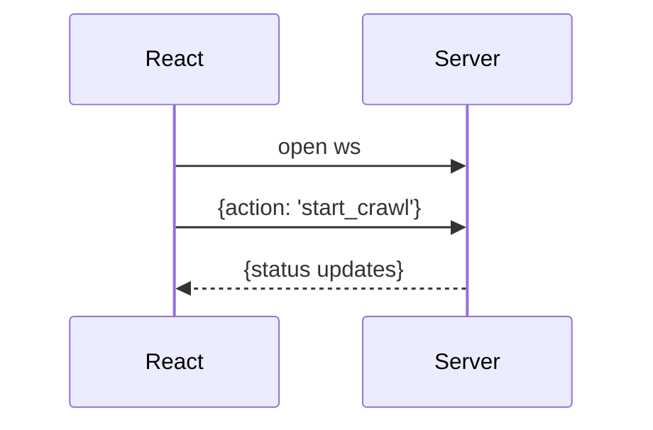

# Frontend UI

Built with **React** and **WebSockets**.

## Structure

```
archon-ui-main/src/
├── components/
├── hooks/
└── App.tsx
```

## WebSocket Flow


```mermaid
sequenceDiagram
  participant React
  participant Server
  React->>Server: open ws
  React->>Server: {action: 'start_crawl'}
  Server-->>React: {status updates}
```
