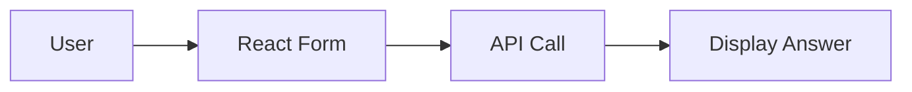

# UI

Built with React and Vite.

## Directory Structure

```bash
tree archon-ui-main/src -L 2
```

```text
src/
├── components/
├── pages/
├── hooks/
└── App.jsx
```

## Environment Variables

| Variable                  | Description                       |
|---------------------------|-----------------------------------|
| VITE_API_URL              | Backend API base URL              |

## Running Locally

```bash
cd archon-ui-main
npm install
npm run dev
```

## Component Communication



See [Getting Started](getting-started) for details.
