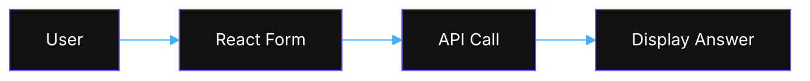

# UI

Built with React and Vite.

## Directory Structure

```text
src/
├── components/
│   ├── animations/
│   │   └── Animations.tsx
│   ├── knowledge-base/
│   │   └── KnowledgeTable.tsx
│   ├── layouts/
│   │   ├── ArchonChatPanel.tsx
│   │   ├── MainLayout.tsx
│   │   └── SideNavigation.tsx
│   ├── mcp/
│   │   ├── ClientCard.tsx
│   │   ├── MCPClients.tsx
│   │   └── ToolTestingPanel.tsx
│   ├── project-tasks/
│   │   ├── BlockNoteEditor.tsx
│   │   ├── DataTab.tsx
│   │   ├── DocsTab.tsx
│   │   ├── DraggableTaskCard.tsx
│   │   ├── FeaturesTab.tsx
│   │   ├── Tabs.tsx
│   │   ├── TaskBoardView.tsx
│   │   ├── TaskTableView.tsx
│   │   └── VersionHistoryModal.tsx
│   ├── settings/
│   │   ├── APIKeysSection.tsx
│   │   ├── FeaturesSection.tsx
│   │   ├── IDEGlobalRules.tsx
│   │   ├── RAGSettings.tsx
│   │   └── TestStatus.tsx
│   ├── ui/
│   │   ├── Badge.tsx
│   │   ├── Button.tsx
│   │   ├── Card.tsx
│   │   ├── Input.tsx
│   │   ├── Select.tsx
│   │   ├── ThemeToggle.tsx
│   │   └── Toggle.tsx
│   ├── CrawlingProgressCard.tsx
│   └── ProjectCreationProgressCard.tsx
├── contexts/
│   ├── SettingsContext.tsx
│   ├── ThemeContext.tsx
│   └── ToastContext.tsx
├── hooks/
│   ├── useNeonGlow.ts
│   └── useStaggeredEntrance.ts
├── lib/
│   ├── projectSchemas.ts
│   ├── task-utils.tsx
│   └── utils.ts
├── pages/
│   ├── KnowledgeBasePage.tsx
│   ├── MCPPage.tsx
│   ├── ProjectPage.tsx
│   └── SettingsPage.tsx
├── services/
│   ├── agentChatService.ts
│   ├── api.ts
│   ├── crawlProgressService.ts
│   ├── credentialsService.ts
│   ├── knowledgeBaseService.ts
│   ├── mcpClientService.ts
│   ├── mcpServerService.ts
│   ├── mcpService.ts
│   ├── projectCreationProgressService.ts
│   ├── projectService.ts
│   ├── testService.ts
│   └── webSocketService.ts
└── types/
    ├── knowledge.ts
    └── project.ts
```

## Environment Variables

| Variable                  | Description                       |
|---------------------------|-----------------------------------|
| VITE_API_URL              | Backend API base URL              |
| VITE_API_BASE_URL         | Base URL used by some services    |

## Running Locally

```bash
cd archon-ui-main
npm install
npm run dev
```

## Component Communication



See [Getting Started](getting-started) for details.

# Archon UI - Knowledge Engine Web Interface

A modern React-based web interface for the Archon Knowledge Engine MCP Server. Built with TypeScript, Vite, and Tailwind CSS.

## 🎨 UI Overview

Archon UI provides a comprehensive dashboard for managing your AI's knowledge base:


### Key Features

- **📊 MCP Dashboard**: Monitor and control the MCP server
- **⚙️ Settings Management**: Configure credentials and RAG strategies
- **📚 Knowledge Management**: Browse, search, and organize knowledge items
- **📈 Real-time Updates**: Socket.IO-based live updates across the UI

## 🏗️ Architecture

### Technology Stack

- **React 18.3**: Modern React with hooks and functional components
- **TypeScript**: Full type safety and IntelliSense support
- **Vite**: Fast build tool and dev server
- **Tailwind CSS**: Utility-first styling
- **Framer Motion**: Smooth animations and transitions
- **Lucide Icons**: Beautiful and consistent iconography
- **React Router**: Client-side routing


## 📄 Pages Documentation

### 1. Knowledge Base (`/`)

Browse and manage your knowledge items with multiple view modes.

**Components:**
- **Knowledge Grid**: Card-based knowledge display with domain grouping
- **Knowledge Table**: Full-width table view with sortable columns
- **Search/Filter**: Search by title, type, tags
- **Crawling Progress**: Real-time progress tracking for URL crawling
- **Actions**: Delete, add sources, file upload

**Features:**
- Grid and table view modes
- Real-time updates via Socket.IO
- Type-based filtering (technical/business)
- Domain-based grouping for URLs
- Tag tooltips for overflow
- Progress tracking for crawling operations

### 2. Projects (`/projects`)

Project dashboard with task management and documentation tabs.

**Components:**
- **Project List**: Create and select projects
- **Task Tabs**: Manage tasks, features, docs and data
- **Progress Cards**: Real-time project creation status

**Features:**
- Hierarchical tasks
- GitHub repository links
- Socket.IO project progress

### 3. Settings (`/settings`)

Comprehensive configuration management with organized sections.

**Sections:**
- **Features**: 
  - Projects toggle (enable/disable Projects feature)
  - Other feature flags
- **API Keys**: 
  - OpenAI API key (encrypted storage)
  - Other API credentials
- **RAG Settings**:
  - Contextual Embeddings toggle
  - Hybrid Search toggle
  - Agentic RAG (code extraction) toggle
  - Reranking toggle
  - Model selection
- **Archon Unit Tests** (Collapsible):
  - Python MCP tests with real-time output
  - React UI tests with local execution
  - Pretty/Raw view modes
  - Error summary display

**Features:**
- Secure credential storage with encryption
- Real-time test execution and monitoring
- Toast notifications for actions
- Collapsible test section (collapsed by default)

### 4. MCP Dashboard (`/mcp`)

Central control panel for the MCP server.

**Components:**
- **Server Control Panel**: Start/stop server, view status, select transport mode
- **Server Logs Viewer**: Real-time log streaming with auto-scroll
- **Available Tools Table**: Dynamic tool discovery and documentation
- **MCP Test Panel**: Interactive tool testing interface

**Features:**
- Dual transport support (SSE/stdio)
- Real-time status polling (5-second intervals)
- Socket.IO-based log streaming
- Copy-to-clipboard configuration
- Tool parameter validation

Browse and manage your knowledge items.

**Components:**
- **Knowledge Grid**: Card-based knowledge display
- **Search/Filter**: Search by title, type, tags
- **Knowledge Details**: View full item details
- **Actions**: Delete, refresh, organize

**Features:**
- Pagination support
- Real-time updates via Socket.IO
- Type-based filtering (technical/business)
- Metadata display


## 🧩 Component Library

### Base UI Components

#### Button
```tsx
<Button 
  variant="primary|secondary|ghost" 
  size="sm|md|lg"
  accentColor="blue|green|purple|orange|pink"
  onClick={handleClick}
>
  Click me
</Button>
```

#### Card
```tsx
<Card accentColor="blue" className="p-6">
  <h3>Card Title</h3>
  <p>Card content</p>
</Card>
```

#### LoadingSpinner
```tsx
<LoadingSpinner size="sm|md|lg" />
```

### Layout Components

#### Sidebar
- Collapsible navigation
- Active route highlighting
- Icon + text navigation items
- Responsive design

#### Header
- Dark mode toggle
- User menu
- Breadcrumb navigation

### Animation Components

#### PageTransition
Wraps pages with smooth fade/slide animations:
```tsx
<PageTransition>
  <YourPageContent />
</PageTransition>
```

## 🔌 Socket.IO Integration

All real-time connections in the frontend now use **Socket.IO** through the WebSocketService for improved reliability:

### Key Services Using Socket.IO

| Service | Purpose | Status |
|---------|---------|--------|
| `crawlProgressService` | Progress tracking for crawling | ✅ Socket.IO |
| `webSocketService` | Socket.IO client wrapper | ✅ Socket.IO |
| `taskUpdateService` | Real-time task updates | ✅ Socket.IO |
| `agentChatService` | Agent chat streaming | ✅ Socket.IO |

### Socket.IO Usage Pattern

```typescript
import { createWebSocketService } from './services/webSocketService';

// Create service
const wsService = createWebSocketService({
  maxReconnectAttempts: 5,
  reconnectInterval: 1000
});

// Connect to Socket.IO namespace (automatically mapped)
await wsService.connect('/api/endpoint');

wsService.addMessageHandler('message_type', (message) => {
  // Handle message
});

// Clean up
wsService.disconnect();
```

### Component Integration

```typescript
useEffect(() => {
  const ws = createWebSocketService();
  
  ws.addMessageHandler('update', (data) => {
    setState(data);
  });
  
  ws.connect('/api/endpoint');
  
  return () => ws.disconnect();
}, []); // Only stable dependencies
```

## 🔌 Services

### mcpService
Handles all MCP server communication:
- `startServer()`: Start the MCP server
- `stopServer()`: Stop the MCP server
- `getStatus()`: Get current server status
- `streamLogs()`: Socket.IO log streaming
- `getAvailableTools()`: Fetch MCP tools

### api
Base API configuration with:
- Automatic error handling
- Request/response interceptors
- Base URL configuration
- TypeScript generics

### chatService
RAG query interface:
- `sendMessage()`: Send RAG query
- `streamResponse()`: Stream responses
- `getSources()`: Get available sources

## 🎨 Styling

### Tailwind Configuration
- Custom color palette
- Dark mode support
- Custom animations
- Responsive breakpoints

### Theme Variables
```css
--primary: Blue accent colors
--secondary: Gray/neutral colors
--success: Green indicators
--warning: Orange indicators
--error: Red indicators
```

## 🚀 Development

### Setup
```bash
# Install dependencies
npm install

# Start dev server
npm run dev

# Build for production
npm run build

# Run tests
npm test
```

### Environment Variables
```env
VITE_API_URL=http://localhost:8080
VITE_API_BASE_URL=http://localhost:8080
```

### Hot Module Replacement
Vite provides instant HMR for:
- React components
- CSS modules
- TypeScript files

## 🧪 Testing

### Unit Tests
- Component testing with React Testing Library
- Service mocking with MSW
- Hook testing with @testing-library/react-hooks

### Integration Tests
- Page-level testing
- API integration tests
- Socket.IO testing

## 📦 Build & Deployment

### Docker Support
```dockerfile
FROM node:18-alpine
WORKDIR /app
COPY package*.json ./
RUN npm ci
COPY . .
RUN npm run build
EXPOSE 5173
CMD ["npm", "run", "preview"]
```

### Production Optimization
- Code splitting by route
- Lazy loading for pages
- Image optimization
- Bundle size analysis

## 🔧 Configuration Files

### vite.config.ts
- Path aliases
- Build optimization
- Development server config

### tsconfig.json
- Strict type checking
- Path mappings
- Compiler options

### tailwind.config.js
- Custom theme
- Plugin configuration
- Purge settings

## ✅ Frontend Development Standards

### Socket.IO Best Practices

**DO:**
- ✅ Use WebSocketService (Socket.IO) for all real-time connections
- ✅ Clean up connections in useEffect return
- ✅ Handle all connection states (connecting, connected, failed)
- ✅ Use typed message handlers

**DON'T:**
- ❌ Create direct WebSocket instances with `new WebSocket()` or native Socket.IO clients
- ❌ Include unstable functions in useCallback dependencies
- ❌ Forget to handle reconnection scenarios
- ❌ Create multiple connections to the same endpoint

### Stable Dependencies Pattern

```typescript
// ✅ CORRECT: Only stable dependencies
const handleUpdate = useCallback(() => {
  updateData(value);
  showToast('Updated', 'success'); // Can call without dependency
}, [value]); // Only primitive values

// ❌ WRONG: Unstable function dependencies
const handleUpdate = useCallback(() => {
  updateData(value);
  showToast('Updated', 'success');
}, [value, showToast]); // showToast causes re-renders
```

### Event Handling Pattern

**Single Source of Truth**: Avoid duplicate event handlers for the same action.

```typescript
// ✅ CORRECT: One place handles completion
const handleSocketMessage = (message) => {
  if (message.type === 'completed') {
    showToast('Operation completed', 'success');
    refreshData();
  }
};

// ❌ WRONG: Multiple handlers for same event
// In Socket.IO handler:
showToast('Operation completed', 'success');
// In API callback:
showToast('Operation completed', 'success');
// Causes duplicate toasts!
```

