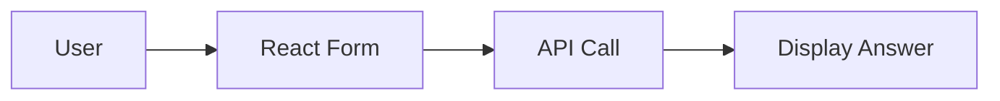

# UI

Built with React and Vite.

## Directory Structure

```text
src/
├── components/
│   ├── animations/
│   ├── layouts/
│   ├── project-tasks/
│   ├── settings/
│   └── ui/
├── contexts/
├── hooks/
├── lib/
├── pages/
│   ├── KnowledgeBasePage.tsx
│   ├── MCPPage.tsx
│   ├── ProjectPage.tsx
│   ├── SettingsPage.tsx
│   └── SettingsPageNew.tsx
├── services/
└── types/
```

## Environment Variables

| Variable                  | Description                       |
|---------------------------|-----------------------------------|
| VITE_API_URL              | Backend API base URL              |
| VITE_API_BASE_URL         | Base URL used by some services    |

## Running Locally

```bash
cd archon-ui-main
npm install
npm run dev
```

## Component Communication



See [Getting Started](getting-started) for details.

# Archon UI - Knowledge Engine Web Interface

A modern React-based web interface for the Archon Knowledge Engine MCP Server. Built with TypeScript, Vite, and Tailwind CSS.

## 🎨 UI Overview

Archon UI provides a comprehensive dashboard for managing your AI's knowledge base:


### Key Features

- **📊 MCP Dashboard**: Monitor and control the MCP server
- **⚙️ Settings Management**: Configure credentials and RAG strategies
- **📚 Knowledge Management**: Browse, search, and organize knowledge items
- **📈 Real-time Updates**: WebSocket-based live updates across the UI

## 🏗️ Architecture

### Technology Stack

- **React 18.3**: Modern React with hooks and functional components
- **TypeScript**: Full type safety and IntelliSense support
- **Vite**: Fast build tool and dev server
- **Tailwind CSS**: Utility-first styling
- **Framer Motion**: Smooth animations and transitions
- **Lucide Icons**: Beautiful and consistent iconography
- **React Router**: Client-side routing


## 📄 Pages Documentation

### 1. Knowledge Base (`/`)

Browse and manage your knowledge items.

**Components:**
- **Knowledge Grid**: Card-based knowledge display
- **Search/Filter**: Search by title, type, tags
- **Knowledge Details**: View full item details
- **Actions**: Delete, refresh, organize

**Features:**
- Pagination support
- Real-time updates via WebSocket
- Type-based filtering (technical/business)
- Metadata display

### 2. Projects (`/projects`)

Project dashboard with task management and documentation tabs.

**Components:**
- **Project List**: Create and select projects
- **Task Tabs**: Manage tasks, features, docs and data
- **Progress Cards**: Real-time project creation status

**Features:**
- Hierarchical tasks
- GitHub repository links
- WebSocket project progress

### 3. Settings (`/settings`)

Comprehensive configuration management.

**Sections:**
- **Credentials**: 
  - OpenAI API key (encrypted storage)
  - Supabase connection details
  - MCP server configuration
- **RAG Strategies**:
  - Contextual Embeddings toggle
  - Hybrid Search toggle
  - Agentic RAG (code extraction) toggle
  - Reranking toggle

**Features:**
- Secure credential storage with encryption
- Real-time validation
- Toast notifications for actions
- Default value management

### 4. MCP Dashboard (`/mcp`)

Central control panel for the MCP server.

**Components:**
- **Server Control Panel**: Start/stop server, view status, select transport mode
- **Server Logs Viewer**: Real-time log streaming with auto-scroll
- **Available Tools Table**: Dynamic tool discovery and documentation
- **MCP Test Panel**: Interactive tool testing interface

**Features:**
- Dual transport support (SSE/stdio)
- Real-time status polling (5-second intervals)
- WebSocket-based log streaming
- Copy-to-clipboard configuration
- Tool parameter validation

Browse and manage your knowledge items.

**Components:**
- **Knowledge Grid**: Card-based knowledge display
- **Search/Filter**: Search by title, type, tags
- **Knowledge Details**: View full item details
- **Actions**: Delete, refresh, organize

**Features:**
- Pagination support
- Real-time updates via WebSocket
- Type-based filtering (technical/business)
- Metadata display


## 🧩 Component Library

### Base UI Components

#### Button
```tsx
<Button 
  variant="primary|secondary|ghost" 
  size="sm|md|lg"
  accentColor="blue|green|purple|orange|pink"
  onClick={handleClick}
>
  Click me
</Button>
```

#### Card
```tsx
<Card accentColor="blue" className="p-6">
  <h3>Card Title</h3>
  <p>Card content</p>
</Card>
```

#### LoadingSpinner
```tsx
<LoadingSpinner size="sm|md|lg" />
```

### Layout Components

#### Sidebar
- Collapsible navigation
- Active route highlighting
- Icon + text navigation items
- Responsive design

#### Header
- Dark mode toggle
- User menu
- Breadcrumb navigation

### Animation Components

#### PageTransition
Wraps pages with smooth fade/slide animations:
```tsx
<PageTransition>
  <YourPageContent />
</PageTransition>
```

## 🔌 Services

### mcpService
Handles all MCP server communication:
- `startServer()`: Start the MCP server
- `stopServer()`: Stop the MCP server
- `getStatus()`: Get current server status
- `streamLogs()`: WebSocket log streaming
- `getAvailableTools()`: Fetch MCP tools

### api
Base API configuration with:
- Automatic error handling
- Request/response interceptors
- Base URL configuration
- TypeScript generics

### chatService
RAG query interface:
- `sendMessage()`: Send RAG query
- `streamResponse()`: Stream responses
- `getSources()`: Get available sources

## 🎨 Styling

### Tailwind Configuration
- Custom color palette
- Dark mode support
- Custom animations
- Responsive breakpoints

### Theme Variables
```css
--primary: Blue accent colors
--secondary: Gray/neutral colors
--success: Green indicators
--warning: Orange indicators
--error: Red indicators
```

## 🚀 Development

### Setup
```bash
# Install dependencies
npm install

# Start dev server
npm run dev

# Build for production
npm run build

# Run tests
npm test
```

### Environment Variables
```env
VITE_API_URL=http://localhost:8080
VITE_API_BASE_URL=http://localhost:8080
```

### Hot Module Replacement
Vite provides instant HMR for:
- React components
- CSS modules
- TypeScript files

## 🧪 Testing

### Unit Tests
- Component testing with React Testing Library
- Service mocking with MSW
- Hook testing with @testing-library/react-hooks

### Integration Tests
- Page-level testing
- API integration tests
- WebSocket testing

## 📦 Build & Deployment

### Docker Support
```dockerfile
FROM node:18-alpine
WORKDIR /app
COPY package*.json ./
RUN npm ci
COPY . .
RUN npm run build
EXPOSE 5173
CMD ["npm", "run", "preview"]
```

### Production Optimization
- Code splitting by route
- Lazy loading for pages
- Image optimization
- Bundle size analysis

## 🔧 Configuration Files

### vite.config.ts
- Path aliases
- Build optimization
- Development server config

### tsconfig.json
- Strict type checking
- Path mappings
- Compiler options

### tailwind.config.js
- Custom theme
- Plugin configuration
- Purge settings

