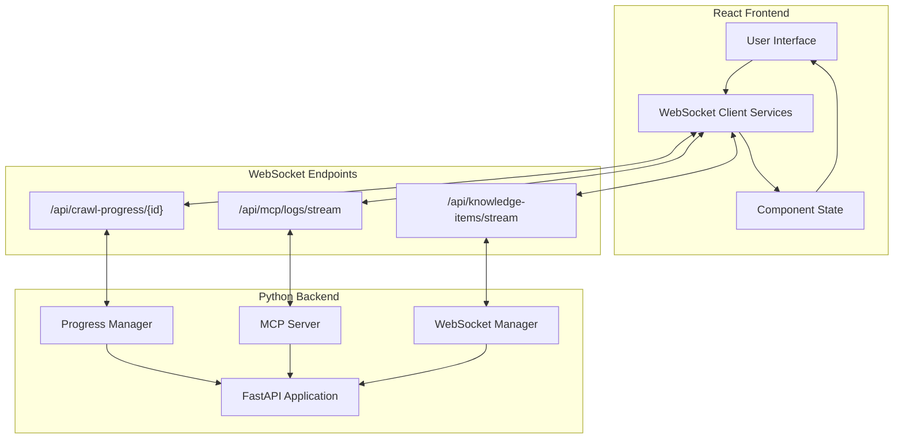

# WebSocket Communication

Archon implements real-time WebSocket communication for streaming progress updates, server logs, and live data synchronization between the Python backend and React frontend.

## 🌐 Overview

WebSocket connections enable real-time, bidirectional communication without the overhead of HTTP polling. Archon uses WebSockets for:

- **🔄 Real-Time Progress Tracking**: Live updates during crawling operations
- **📡 Server Log Streaming**: MCP server logs streamed to UI dashboard  
- **🎯 Knowledge Base Updates**: Real-time synchronization of knowledge items
- **💬 Chat Streaming**: Live RAG query responses

## 🏗️ Architecture



## 📡 WebSocket Endpoints

### Progress Tracking: `/api/crawl-progress/{progress_id}`

**Purpose**: Real-time progress updates during crawling operations

**Message Types**:
- `crawl_progress`: Ongoing progress updates
- `crawl_completed`: Final completion notification
- `heartbeat`: Keep-alive ping

**Example Message Flow**:
```json
// Initial connection
{
  "type": "crawl_progress",
  "data": {
    "progressId": "8b74d6a0-4970-4d7f-bf82-52a7c08916ad",
    "status": "crawling",
    "percentage": 10,
    "start_time": "2025-06-04T20:57:34.081424",
    "currentUrl": "https://www.example.com",
    "totalPages": 24,
    "processedPages": 2,
    "log": "Starting crawl...",
    "logs": ["Starting crawl...", "Analyzing URL type..."]
  }
}

// Progress update
{
  "type": "crawl_progress", 
  "data": {
    "progressId": "8b74d6a0-4970-4d7f-bf82-52a7c08916ad",
    "status": "crawling",
    "percentage": 45,
    "processedPages": 11,
    "log": "Processed 11/24 pages"
  }
}

// Completion
{
  "type": "crawl_completed",
  "data": {
    "progressId": "8b74d6a0-4970-4d7f-bf82-52a7c08916ad", 
    "status": "completed",
    "percentage": 100,
    "chunksStored": 89,
    "wordCount": 25000,
    "completed_at": "2025-06-04T20:58:45.123456"
  }
}
```

### MCP Logs: `/api/mcp/logs/stream`

**Purpose**: Stream MCP server logs to the dashboard

**Message Format**:
```json
{
  "timestamp": "2025-06-04T20:45:30.123Z",
  "level": "INFO",
  "logger": "mcp.server", 
  "message": "Tool 'search_knowledge' called with query: 'Python exceptions'",
  "metadata": {
    "client_id": "cursor_client_001",
    "tool_name": "search_knowledge",
    "execution_time": 0.245
  }
}
```

### Knowledge Items: `/api/knowledge-items/stream`

**Purpose**: Real-time updates when knowledge base changes

**Message Format**:
```json
{
  "type": "knowledge_items_update",
  "data": {
    "items": [...],
    "total": 156,
    "page": 1,
    "per_page": 20
  }
}
```

## 🐛 The DateTime Serialization Bug

### The Problem

The most critical WebSocket issue we encountered was silent connection failures due to datetime serialization:

```python
# ❌ BROKEN: This would crash WebSocket sends
progress_data = {
    'start_time': datetime.now(),  # Can't serialize to JSON!
    'updated_at': datetime.now(),
    'completed_at': datetime.now()
}

await websocket.send_json({
    "type": "crawl_progress",
    "data": progress_data  # TypeError: Object of type datetime is not JSON serializable
})
```

### The Symptoms

1. **WebSocket connects successfully** ✅
2. **First progress update fails silently** ❌ 
3. **WebSocket gets disconnected and removed** ❌
4. **All subsequent updates show "No WebSockets found"** ❌

### The Fix

Convert ALL datetime objects to ISO format strings before JSON serialization:

```python
# ✅ FIXED: Convert all datetime objects
for key, value in progress_data.items():
    if hasattr(value, 'isoformat'):
        progress_data[key] = value.isoformat()

await websocket.send_json({
    "type": "crawl_progress", 
    "data": progress_data  # Now JSON serializable!
})
```

## 🐍 Backend Implementation

### Core WebSocket Manager

```python
from fastapi import WebSocket, WebSocketDisconnect
from typing import Dict, List, Any
import json
import asyncio
from datetime import datetime

class CrawlProgressManager:
    def __init__(self):
        self.active_crawls: Dict[str, Dict[str, Any]] = {}
        self.progress_websockets: Dict[str, List[WebSocket]] = {}
    
    async def add_websocket(self, progress_id: str, websocket: WebSocket) -> None:
        """Add WebSocket connection for progress tracking"""
        try:
            print(f"DEBUG: WebSocket connecting for progress_id: {progress_id}")
            
            # CRITICAL: Accept WebSocket connection FIRST
            await websocket.accept()
            print(f"DEBUG: WebSocket accepted for progress_id: {progress_id}")
            
            if progress_id not in self.progress_websockets:
                self.progress_websockets[progress_id] = []
            
            self.progress_websockets[progress_id].append(websocket)
            print(f"DEBUG: WebSocket added. Total connections: {len(self.progress_websockets[progress_id])}")
            
            # Send current progress if available
            if progress_id in self.active_crawls:
                print(f"DEBUG: Found active crawl, sending current state")
                data = self.active_crawls[progress_id].copy()
                data['progressId'] = progress_id
                
                # Convert ALL datetime objects to strings for JSON serialization
                for key, value in data.items():
                    if hasattr(value, 'isoformat'):
                        data[key] = value.isoformat()
                
                message = {
                    "type": "crawl_progress",
                    "data": data
                }
                await websocket.send_json(message)
            else:
                # Send waiting state
                await websocket.send_json({
                    "type": "crawl_progress",
                    "data": {
                        "progressId": progress_id,
                        "status": "waiting",
                        "percentage": 0,
                        "logs": ["Waiting for crawl to start..."]
                    }
                })
                
        except Exception as e:
            print(f"ERROR: Exception in add_websocket: {e}")
            raise
    
    async def update_progress(self, progress_id: str, update_data: Dict[str, Any]) -> None:
        """Update progress and broadcast to connected clients"""
        if progress_id not in self.active_crawls:
            return
        
        # Update progress data
        self.active_crawls[progress_id].update(update_data)
        self.active_crawls[progress_id]['updated_at'] = datetime.now()
        
        # Broadcast to all connected WebSockets
        await self._broadcast_progress(progress_id)
    
    async def _broadcast_progress(self, progress_id: str) -> None:
        """Broadcast progress update to all connected clients"""
        if progress_id not in self.progress_websockets:
            print(f"DEBUG: No WebSockets found for progress_id: {progress_id}")
            return
        
        progress_data = self.active_crawls.get(progress_id, {}).copy()
        progress_data['progressId'] = progress_id
        
        # Convert ALL datetime objects to strings for JSON serialization
        for key, value in progress_data.items():
            if hasattr(value, 'isoformat'):
                progress_data[key] = value.isoformat()
        
        message = {
            "type": "crawl_progress" if progress_data.get('status') != 'completed' else "crawl_completed",
            "data": progress_data
        }
        
        print(f"DEBUG: Broadcasting to {len(self.progress_websockets[progress_id])} WebSocket(s)")
        
        # Send to all connected WebSocket clients
        disconnected = []
        for websocket in self.progress_websockets[progress_id]:
            try:
                await websocket.send_json(message)
                print(f"DEBUG: Successfully sent progress update to WebSocket")
            except Exception as e:
                print(f"DEBUG: Failed to send to WebSocket: {e}")
                disconnected.append(websocket)
        
        # Clean up disconnected WebSockets
        for ws in disconnected:
            self.remove_websocket(progress_id, ws)
```

### WebSocket Endpoint Definition

```python
from fastapi import APIRouter, WebSocket, WebSocketDisconnect
import asyncio

router = APIRouter(prefix="/api", tags=["websockets"])

@router.websocket("/crawl-progress/{progress_id}")
async def websocket_crawl_progress(websocket: WebSocket, progress_id: str):
    """WebSocket endpoint for tracking specific crawl progress"""
    try:
        print(f"DEBUG: WebSocket connecting for progress_id: {progress_id}")
        
        # Add WebSocket to progress manager (handles accept internally)
        await progress_manager.add_websocket(progress_id, websocket)
        print(f"DEBUG: WebSocket registered for progress_id: {progress_id}")
        
        # Keep connection alive
        while True:
            try:
                # Wait for messages from client (like ping)
                message = await asyncio.wait_for(websocket.receive_text(), timeout=30.0)
                if message == "ping":
                    await websocket.send_json({"type": "pong"})
            except asyncio.TimeoutError:
                # Send heartbeat every 30 seconds
                await websocket.send_json({"type": "heartbeat"})
            except WebSocketDisconnect:
                break
                
    except WebSocketDisconnect:
        print(f"DEBUG: WebSocket disconnected for progress_id: {progress_id}")
    except Exception as e:
        print(f"DEBUG: WebSocket error for progress_id {progress_id}: {e}")
    finally:
        progress_manager.remove_websocket(progress_id, websocket)
```

### Progress Callback Integration

```python
async def _perform_crawl_with_progress(progress_id: str, request: KnowledgeItemRequest):
    """Perform crawl with real-time progress tracking"""
    
    # Initialize progress state
    progress_manager.start_crawl(progress_id, {
        'status': 'crawling',
        'percentage': 0,
        'start_time': datetime.now(),
        'currentUrl': str(request.url),
        'totalPages': 0,
        'processedPages': 0,
        'logs': ['Starting crawl...']
    })
    
    # Create progress callback
    async def progress_callback(status: str, percentage: int, message: str, **kwargs):
        """Callback for real-time progress updates from crawling functions"""
        await progress_manager.update_progress(progress_id, {
            'status': status,
            'percentage': percentage,
            'currentUrl': kwargs.get('currentUrl', str(request.url)),
            'totalPages': kwargs.get('totalPages', 0),
            'processedPages': kwargs.get('processedPages', 0),
            'log': message,
            **kwargs
        })
    
    # Pass callback to MCP function
    ctx.progress_callback = progress_callback
    
    try:
        # Call crawling function with progress support
        result = await mcp_smart_crawl_url(ctx=ctx, url=str(request.url))
        
        # Mark as completed
        await progress_manager.complete_crawl(progress_id, {
            'status': 'completed',
            'percentage': 100,
            'completed_at': datetime.now(),
            'chunksStored': result.get('chunks_created', 0),
            'wordCount': result.get('total_words', 0)
        })
        
    except Exception as e:
        # Mark as failed
        await progress_manager.error_crawl(progress_id, str(e))
        raise
```

## ⚛️ Frontend Integration

### WebSocket Service

```typescript
interface CrawlProgressData {
  progressId: string;
  status: string;
  percentage: number;
  currentUrl?: string;
  totalPages?: number;
  processedPages?: number;
  log?: string;
  logs?: string[];
  start_time?: string;
  completed_at?: string;
  chunksStored?: number;
  wordCount?: number;
}

class CrawlProgressService {
  private connections: Map<string, WebSocket> = new Map();
  private baseUrl: string;
  
  constructor(baseUrl = 'ws://localhost:8080') {
    this.baseUrl = baseUrl;
  }
  
  streamProgress(
    progressId: string,
    onProgress: (data: CrawlProgressData) => void,
    options: {
      autoReconnect?: boolean;
      reconnectDelay?: number;
      maxReconnectAttempts?: number;
    } = {}
  ): WebSocket {
    const {
      autoReconnect = true,
      reconnectDelay = 5000,
      maxReconnectAttempts = 5
    } = options;
    
    let reconnectAttempts = 0;
    
    const connect = (): WebSocket => {
      const wsUrl = `${this.baseUrl}/api/crawl-progress/${progressId}`;
      console.log(`🔌 Attempting to connect to WebSocket: ${wsUrl}`);
      
      const ws = new WebSocket(wsUrl);
      this.connections.set(progressId, ws);
      
      ws.onopen = () => {
        console.log(`🚀 Connected to crawl progress stream: ${progressId}`);
        reconnectAttempts = 0; // Reset on successful connection
      };
      
      ws.onmessage = (event) => {
        try {
          const message = JSON.parse(event.data);
          console.log(`📨 Received WebSocket message:`, message);
          
          if (message.type === 'crawl_progress' || message.type === 'crawl_completed') {
            onProgress(message.data);
          } else if (message.type === 'heartbeat') {
            // Respond to heartbeat
            ws.send('ping');
          }
        } catch (error) {
          console.error('Failed to parse WebSocket message:', error);
        }
      };
      
      ws.onclose = (event) => {
        console.log(`❌ Crawl progress stream disconnected: ${progressId}`, event);
        this.connections.delete(progressId);
        
        // Auto-reconnect for non-normal closures
        if (autoReconnect && 
            event.code !== 1000 && 
            reconnectAttempts < maxReconnectAttempts) {
          reconnectAttempts++;
          console.log(`🔄 Attempting reconnect ${reconnectAttempts}/${maxReconnectAttempts} in ${reconnectDelay}ms`);
          setTimeout(() => connect(), reconnectDelay);
        }
      };
      
      ws.onerror = (error) => {
        console.error(`❌ WebSocket error for ${progressId}:`, error);
      };
      
      return ws;
    };
    
    return connect();
  }
  
  disconnect(progressId: string): void {
    const ws = this.connections.get(progressId);
    if (ws) {
      ws.close(1000, 'Client disconnecting');
      this.connections.delete(progressId);
    }
  }
  
  disconnectAll(): void {
    for (const [progressId] of this.connections) {
      this.disconnect(progressId);
    }
  }
}
```

### React Component Integration

```tsx
import React, { useState, useEffect, useRef } from 'react';
import { CrawlProgressService } from '../services/crawlProgressService';

interface CrawlProgressProps {
  progressId: string;
  onComplete?: (data: CrawlProgressData) => void;
}

export const CrawlProgress: React.FC<CrawlProgressProps> = ({ 
  progressId, 
  onComplete 
}) => {
  const [progress, setProgress] = useState<CrawlProgressData | null>(null);
  const [isConnected, setIsConnected] = useState(false);
  const wsRef = useRef<WebSocket | null>(null);
  const serviceRef = useRef(new CrawlProgressService());
  
  useEffect(() => {
    if (!progressId) return;
    
    const handleProgress = (data: CrawlProgressData) => {
      setProgress(data);
      
      if (data.status === 'completed' && onComplete) {
        onComplete(data);
      }
    };
    
    // Start WebSocket connection
    wsRef.current = serviceRef.current.streamProgress(progressId, handleProgress);
    
    // Track connection status
    if (wsRef.current) {
      wsRef.current.addEventListener('open', () => setIsConnected(true));
      wsRef.current.addEventListener('close', () => setIsConnected(false));
    }
    
    // Cleanup on unmount
    return () => {
      serviceRef.current.disconnect(progressId);
      setIsConnected(false);
    };
  }, [progressId, onComplete]);
  
  if (!progress) {
    return (
      <div className="flex items-center space-x-2">
        <div className="animate-spin h-4 w-4 border-2 border-blue-500 border-t-transparent rounded-full" />
        <span>Connecting to progress stream...</span>
      </div>
    );
  }
  
  return (
    <div className="space-y-4">
      {/* Connection Status */}
      <div className="flex items-center space-x-2">
        <div className={`h-2 w-2 rounded-full ${isConnected ? 'bg-green-500' : 'bg-red-500'}`} />
        <span className="text-sm text-gray-600">
          {isConnected ? 'Connected' : 'Disconnected'}
        </span>
      </div>
      
      {/* Progress Bar */}
      <div className="w-full bg-gray-200 rounded-full h-2">
        <div 
          className="bg-blue-600 h-2 rounded-full transition-all duration-300"
          style={{ width: `${progress.percentage}%` }}
        />
      </div>
      
      {/* Progress Info */}
      <div className="space-y-2">
        <div className="flex justify-between text-sm">
          <span>Status: {progress.status}</span>
          <span>{progress.percentage}%</span>
        </div>
        
        {progress.currentUrl && (
          <div className="text-sm text-gray-600 truncate">
            Current: {progress.currentUrl}
          </div>
        )}
        
        {progress.totalPages && progress.processedPages !== undefined && (
          <div className="text-sm text-gray-600">
            Pages: {progress.processedPages}/{progress.totalPages}
          </div>
        )}
        
        {progress.log && (
          <div className="text-sm font-mono bg-gray-100 p-2 rounded">
            {progress.log}
          </div>
        )}
      </div>
      
      {/* Completion Summary */}
      {progress.status === 'completed' && (
        <div className="bg-green-50 border border-green-200 rounded-lg p-4">
          <h4 className="font-semibold text-green-800">Crawl Completed!</h4>
          <div className="mt-2 space-y-1 text-sm text-green-700">
            {progress.chunksStored && (
              <div>Chunks stored: {progress.chunksStored}</div>
            )}
            {progress.wordCount && (
              <div>Words processed: {progress.wordCount.toLocaleString()}</div>
            )}
          </div>
        </div>
      )}
    </div>
  );
};
```

## 🔧 Troubleshooting

### Common Issues

#### 1. WebSocket Connection Refused
**Symptoms**: `WebSocket connection to 'ws://localhost:8080/...' failed`
```bash
# Check if backend is running
curl http://localhost:8080/health

# Check WebSocket endpoint specifically
wscat -c ws://localhost:8080/api/crawl-progress/test-id
```

#### 2. Connection Established But No Updates
**Symptoms**: WebSocket connects but no progress messages received

**Possible Causes**:
- Progress ID mismatch between frontend and backend
- Datetime serialization errors (our bug!)
- Progress callback not being called
- WebSocket being removed from manager

**Debug Steps**:
```python
# Add debug logging in backend
print(f"DEBUG: Active crawls: {list(progress_manager.active_crawls.keys())}")
print(f"DEBUG: WebSocket connections: {list(progress_manager.progress_websockets.keys())}")
```

#### 3. Frequent Disconnections
**Symptoms**: WebSocket connects then immediately disconnects

**Possible Causes**:
- JSON serialization errors
- Network timeouts
- Server restart
- CORS issues

#### 4. Memory Leaks
**Symptoms**: Growing memory usage, slow performance

**Solution**: Ensure proper WebSocket cleanup
```python
def remove_websocket(self, progress_id: str, websocket: WebSocket) -> None:
    """Remove WebSocket from progress tracking"""
    if progress_id in self.progress_websockets:
        try:
            self.progress_websockets[progress_id].remove(websocket)
            if not self.progress_websockets[progress_id]:
                del self.progress_websockets[progress_id]
        except ValueError:
            pass  # WebSocket already removed
```

### Debug Tools

#### Backend Debug Logging
```python
import logging
logging.basicConfig(level=logging.DEBUG)

# Add to WebSocket handlers
logger = logging.getLogger(__name__)
logger.debug(f"WebSocket message: {message}")
```

#### Frontend Debug Console
```javascript
// Enable WebSocket debugging
const ws = new WebSocket(url);
ws.addEventListener('open', (e) => console.log('WS Open:', e));
ws.addEventListener('message', (e) => console.log('WS Message:', e.data));
ws.addEventListener('close', (e) => console.log('WS Close:', e.code, e.reason));
ws.addEventListener('error', (e) => console.log('WS Error:', e));
```

#### Network Analysis
```bash
# Monitor WebSocket traffic
npx wscat -c ws://localhost:8080/api/crawl-progress/test-id

# Check HTTP upgrade request
curl -i \
  -H "Connection: Upgrade" \
  -H "Upgrade: websocket" \
  -H "Sec-WebSocket-Key: test" \
  -H "Sec-WebSocket-Version: 13" \
  http://localhost:8080/api/crawl-progress/test-id
```

## ✅ Best Practices

### Backend Development

1. **Always Accept WebSocket First**
```python
# ✅ Correct order
await websocket.accept()
# ... then add to manager and send messages
```

2. **Handle JSON Serialization**
```python
# ✅ Convert datetime objects
for key, value in data.items():
    if hasattr(value, 'isoformat'):
        data[key] = value.isoformat()
```

3. **Implement Cleanup**
```python
# ✅ Clean up disconnected WebSockets
finally:
    progress_manager.remove_websocket(progress_id, websocket)
```

4. **Use Error Handling**
```python
try:
    await websocket.send_json(message)
except Exception as e:
    print(f"Failed to send: {e}")
    disconnected.append(websocket)
```

### Frontend Development

1. **Implement Reconnection Logic**
```typescript
ws.onclose = (event) => {
  if (event.code !== 1000 && autoReconnect) {
    setTimeout(connect, reconnectDelay);
  }
};
```

2. **Clean Up on Unmount**
```typescript
useEffect(() => {
  // ... setup WebSocket
  
  return () => {
    ws.close(1000, 'Component unmounting');
  };
}, []);
```

3. **Handle Connection States**
```typescript
const [connectionState, setConnectionState] = useState<'connecting' | 'connected' | 'disconnected'>('connecting');
```

4. **Use Progress IDs Correctly**
```typescript
// ✅ Use the progressId from the crawl response
const response = await api.post('/api/knowledge-items/crawl', data);
const progressId = response.progressId;
streamProgress(progressId, onProgress);
```

### Monitoring & Debugging

1. **Log Connection Events**
```python
print(f"DEBUG: WebSocket connecting for progress_id: {progress_id}")
print(f"DEBUG: WebSocket accepted for progress_id: {progress_id}")
print(f"DEBUG: Broadcasting to {len(websockets)} WebSocket(s)")
```

2. **Track WebSocket Lifecycle**
```typescript
console.log(`🚀 Connected to progress stream: ${progressId}`);
console.log(`📨 Received message:`, message);
console.log(`❌ Connection closed:`, event.code, event.reason);
```

3. **Monitor Performance**
```python
import time
start_time = time.time()
await websocket.send_json(message)
duration = time.time() - start_time
if duration > 0.1:  # Log slow sends
    print(f"Slow WebSocket send: {duration:.3f}s")
```

## 🎯 Testing WebSocket Connections

### Manual Testing

```bash
# Test WebSocket endpoint directly
wscat -c ws://localhost:8080/api/crawl-progress/test-id

# Should receive:
# {"type": "crawl_progress", "data": {"progressId": "test-progress-id", "status": "waiting", ...}}
```

### Automated Testing

```python
import pytest
import websockets
import json

@pytest.mark.asyncio
async def test_crawl_progress_websocket():
    uri = "ws://localhost:8080/api/crawl-progress/test-id"
    
    async with websockets.connect(uri) as websocket:
        # Should receive initial message
        message = await websocket.recv()
        data = json.loads(message)
        
        assert data["type"] == "crawl_progress"
        assert data["data"]["progressId"] == "test-id"
        assert data["data"]["status"] == "waiting"
```

---

**Next Steps**: 
- Review [API Reference](./api-reference) for endpoint details
- Check [Server Architecture](./server) for implementation details
- Explore [UI Documentation](./ui) for frontend integration patterns