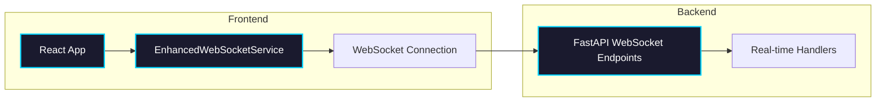

import Tabs from '@theme/Tabs';
import TabItem from '@theme/TabItem';
import Admonition from '@theme/Admonition';

# WebSockets

## Overview

Archon uses WebSockets for real-time communication between the frontend and backend. All WebSocket connections are managed through a centralized service that provides consistent error handling, automatic reconnection, and state management.

## Architecture



## Frontend Implementation

### Core WebSocket Service

The `EnhancedWebSocketService` provides all WebSocket functionality:

<Tabs>
<TabItem value="usage" label="Basic Usage">

```typescript
import { createWebSocketService } from './services/EnhancedWebSocketService';

// Create service instance
const wsService = createWebSocketService({
  maxReconnectAttempts: 5,
  reconnectInterval: 1000,
  enableHeartbeat: true
});

// Connect to endpoint
await wsService.connect('/api/agent-chat/sessions/123/ws');

// Send messages
wsService.send({ type: 'message', content: 'Hello!' });

// Handle incoming messages
wsService.addMessageHandler('message', (msg) => {
  console.log('Received:', msg);
});
```

</TabItem>
<TabItem value="patterns" label="React Patterns">

```typescript
// Custom hook for WebSocket state
function useWebSocket(endpoint: string) {
  const [state, setState] = useState(WebSocketState.DISCONNECTED);
  const wsRef = useRef<EnhancedWebSocketService>();
  
  useEffect(() => {
    const ws = createWebSocketService();
    wsRef.current = ws;
    
    ws.addStateChangeHandler(setState);
    ws.connect(endpoint);
    
    return () => ws.disconnect();
  }, [endpoint]);
  
  return { ws: wsRef.current, state };
}
```

</TabItem>
</Tabs>

### WebSocket States

```typescript
enum WebSocketState {
  CONNECTING = 'CONNECTING',
  CONNECTED = 'CONNECTED',
  RECONNECTING = 'RECONNECTING',
  DISCONNECTED = 'DISCONNECTED',
  FAILED = 'FAILED'
}
```

## Backend Implementation

### FastAPI WebSocket Endpoints

<Tabs>
<TabItem value="basic" label="Basic Handler">

```python
@router.websocket("/ws/{client_id}")
async def websocket_endpoint(websocket: WebSocket, client_id: str):
    await websocket.accept()
    try:
        while True:
            data = await websocket.receive_json()
            # Process message
            await websocket.send_json({
                "type": "response",
                "data": process_message(data)
            })
    except WebSocketDisconnect:
        print(f"Client {client_id} disconnected")
```

</TabItem>
<TabItem value="broadcast" label="Broadcasting">

```python
class ConnectionManager:
    def __init__(self):
        self.active_connections: dict[str, WebSocket] = {}
    
    async def broadcast(self, message: dict):
        """Send message to all connected clients"""
        disconnected = []
        for client_id, ws in self.active_connections.items():
            try:
                await ws.send_json(message)
            except:
                disconnected.append(client_id)
        
        # Clean up disconnected clients
        for client_id in disconnected:
            del self.active_connections[client_id]
```

</TabItem>
</Tabs>

## Best Practices

<Admonition type="tip" title="Connection Management">
1. Always use the `EnhancedWebSocketService` for consistency
2. Handle all WebSocket states in your UI
3. Implement proper cleanup in React components
4. Use heartbeat for connection health monitoring
</Admonition>

### Error Handling

```typescript
wsService.addErrorHandler((error) => {
  console.error('WebSocket error:', error);
  // Show user-friendly error message
  showToast('Connection error. Retrying...', 'error');
});
```

### Memory Management

<Admonition type="warning" title="Prevent Memory Leaks">
Always clean up WebSocket connections and handlers in React cleanup functions:

```typescript
useEffect(() => {
  const ws = createWebSocketService();
  // ... setup
  
  return () => {
    ws.disconnect();
  };
}, []);
```
</Admonition>

## Common Patterns

### Progress Tracking

```typescript
// Real-time progress updates
wsService.addMessageHandler('progress', (msg) => {
  setProgress(msg.percentage);
  setStatus(msg.status);
});
```

### Chat Applications

```typescript
// Bidirectional chat
wsService.addMessageHandler('message', (msg) => {
  addChatMessage(msg);
});

const sendMessage = (text: string) => {
  wsService.send({
    type: 'message',
    content: text,
    timestamp: new Date().toISOString()
  });
};
```

## Troubleshooting

<Tabs>
<TabItem value="connection" label="Connection Issues">

**Problem**: WebSocket fails to connect
```typescript
// Check the endpoint URL
console.log('Connecting to:', endpoint);

// Verify backend is running
fetch('/health').then(res => {
  console.log('Backend status:', res.ok);
});

// Check browser console for errors
```

</TabItem>
<TabItem value="docker" label="Docker Networking">

**Problem**: Connection refused in Docker

In `vite.config.ts`, ensure proxy uses service names:
```typescript
proxy: {
  '/api': {
    target: 'http://archon-pyserver:8080',
    ws: true
  }
}
```

</TabItem>
</Tabs>

## Testing WebSockets

<Admonition type="info" title="Testing Strategy">
Mock WebSocket connections in tests to avoid real network calls:

```typescript
// Mock WebSocket for testing
vi.mock('./EnhancedWebSocketService', () => ({
  createWebSocketService: () => ({
    connect: vi.fn().mockResolvedValue(void 0),
    send: vi.fn(),
    disconnect: vi.fn(),
    addMessageHandler: vi.fn(),
    state: WebSocketState.CONNECTED
  })
}));
```
</Admonition>