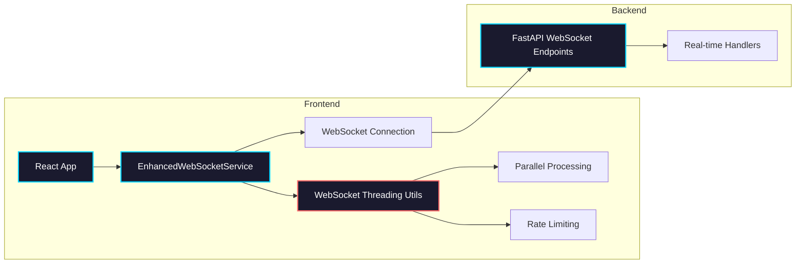

import Tabs from '@theme/Tabs';
import TabItem from '@theme/TabItem';
import Admonition from '@theme/Admonition';

# WebSockets

## Overview

Archon uses WebSockets for real-time communication between the frontend and backend. All WebSocket connections are managed through a centralized service that provides consistent error handling, automatic reconnection, state management, and **WebSocket-safe threading patterns** for long-running operations.

## Architecture



## Frontend Implementation

### Core WebSocket Service

The `EnhancedWebSocketService` provides all WebSocket functionality with built-in threading safety:

<Tabs>
<TabItem value="usage" label="Basic Usage">

```typescript
import { createWebSocketService } from './services/EnhancedWebSocketService';
import { knowledgeWebSocket } from './services/websocketService';

// Create service instance
const wsService = createWebSocketService({
  maxReconnectAttempts: 5,
  reconnectInterval: 1000,
  enableHeartbeat: true
});

// Connect to endpoint
await wsService.connect('/api/agent-chat/sessions/123/ws');

// Send messages
wsService.send({ type: 'message', content: 'Hello!' });

// Handle incoming messages
wsService.addMessageHandler('message', (msg) => {
  console.log('Received:', msg);
});
```

</TabItem>
<TabItem value="threading" label="WebSocket-Safe Threading">

```typescript
// ✅ CORRECT: WebSocket-safe parallel processing
const results = await knowledgeWebSocket.processParallel(
  urls,
  async (url) => {
    const response = await fetch(`/api/crawl`, {
      method: 'POST',
      body: JSON.stringify({ url }),
      headers: { 'Content-Type': 'application/json' }
    });
    return response.json();
  },
  {
    maxConcurrency: 3,        // Max 3 concurrent requests
    batchSize: 10,           // Process in batches of 10
    progressUpdates: true,   // Send progress via WebSocket
    taskName: 'url_crawling' // Name for progress tracking
  }
);
```

</TabItem>
<TabItem value="patterns" label="React Patterns">

```typescript
// Custom hook for WebSocket state
function useWebSocket(endpoint: string) {
  const [state, setState] = useState(WebSocketState.DISCONNECTED);
  const wsRef = useRef<EnhancedWebSocketService>();
  
  useEffect(() => {
    const ws = createWebSocketService();
    wsRef.current = ws;
    
    ws.addStateChangeHandler(setState);
    ws.connect(endpoint);
    
    return () => ws.disconnect();
  }, [endpoint]);
  
  return { ws: wsRef.current, state };
}
```

</TabItem>
</Tabs>

### WebSocket States

```typescript
enum WebSocketState {
  CONNECTING = 'CONNECTING',
  CONNECTED = 'CONNECTED',
  RECONNECTING = 'RECONNECTING',
  DISCONNECTED = 'DISCONNECTED',
  FAILED = 'FAILED'
}
```

## WebSocket-Safe Threading Patterns

<Admonition type="danger" title="Critical: Prevent Event Loop Blocking">
Long-running operations can block the JavaScript event loop, causing WebSocket disconnections. Always use the WebSocket-safe threading utilities for any processing that takes more than a few milliseconds.
</Admonition>

### Pattern 1: Parallel Processing

**Use Case**: Crawling multiple URLs, processing documents, API calls

<Tabs>
<TabItem value="correct" label="✅ Correct Pattern">

```typescript
// This maintains WebSocket health during processing
const results = await knowledgeWebSocket.processParallel(
  items,
  async (item) => await processItem(item),
  {
    maxConcurrency: 3,
    batchSize: 10,
    progressUpdates: true,
    taskName: 'processing'
  }
);
```

</TabItem>
<TabItem value="wrong" label="❌ Wrong Pattern">

```typescript
// ❌ This blocks WebSocket and causes disconnects
for (const item of items) {
  await processItem(item);  // Blocks event loop!
}
```

</TabItem>
</Tabs>

### Pattern 2: CPU-Intensive Tasks

**Use Case**: AI processing, large data transformations

```typescript
const result = await knowledgeWebSocket.runCpuIntensiveTask(
  async () => {
    // Heavy processing that would normally block WebSocket
    return await generateEmbeddings(largeDataset);
  },
  {
    taskName: 'embedding_generation',
    progressUpdates: true
  }
);
```

### Pattern 3: Rate-Limited Processing

**Use Case**: API calls with rate limits, avoiding 429 errors

```typescript
import { WebSocketThreadingUtils } from './services/websocketService';

const results = await WebSocketThreadingUtils.processWithRateLimit(
  apiCalls,
  async (call) => await makeAPICall(call),
  {
    rateLimit: 200,          // 200ms between requests
    maxConcurrency: 2,       // Max 2 concurrent calls
    websocket: knowledgeWebSocket,
    taskName: 'api_processing'
  }
);
```

### Pattern 4: Background Workers

**Use Case**: Continuous processing, job queues

```typescript
const worker = knowledgeWebSocket.createBackgroundWorker(
  async (workItem) => await processWorkItem(workItem),
  {
    maxConcurrency: 3,
    workerName: 'document_processor',
    progressUpdates: true
  }
);

// Add work to queue
await worker.addWork(document1);
await worker.addWork(document2);

// Clean up when done
worker.stop();
```

## Backend Implementation

### FastAPI WebSocket Endpoints

<Tabs>
<TabItem value="basic" label="Basic Handler">

```python
@router.websocket("/ws/{client_id}")
async def websocket_endpoint(websocket: WebSocket, client_id: str):
    await websocket.accept()
    try:
        while True:
            data = await websocket.receive_json()
            # Process message
            await websocket.send_json({
                "type": "response",
                "data": process_message(data)
            })
    except WebSocketDisconnect:
        print(f"Client {client_id} disconnected")
```

</TabItem>
<TabItem value="broadcast" label="Broadcasting">

```python
class ConnectionManager:
    def __init__(self):
        self.active_connections: dict[str, WebSocket] = {}
    
    async def broadcast(self, message: dict):
        """Send message to all connected clients"""
        disconnected = []
        for client_id, ws in self.active_connections.items():
            try:
                await ws.send_json(message)
            except:
                disconnected.append(client_id)
        
        # Clean up disconnected clients
        for client_id in disconnected:
            del self.active_connections[client_id]
```

</TabItem>
<TabItem value="progress" label="Progress Updates">

```python
async def long_running_operation_with_progress(websocket: WebSocket):
    """Send progress updates during long operations"""
    total_items = len(items_to_process)
    
    for i, item in enumerate(items_to_process):
        # Process item
        result = await process_item(item)
        
        # Send progress update
        await websocket.send_json({
            "type": "processing_progress",
            "completed": i + 1,
            "total": total_items,
            "progress_percent": round(((i + 1) / total_items) * 100)
        })
        
        # Yield control to prevent blocking
        await asyncio.sleep(0)
```

</TabItem>
</Tabs>

## Best Practices

<Admonition type="tip" title="Connection Management">
1. Always use the `EnhancedWebSocketService` for consistency
2. Handle all WebSocket states in your UI
3. Implement proper cleanup in React components
4. Use heartbeat for connection health monitoring
5. **Use WebSocket-safe threading for any long-running operations**
</Admonition>

### Performance Guidelines

<Admonition type="warning" title="Prevent WebSocket Blocking">
**Never block the JavaScript event loop during WebSocket operations:**

✅ **DO**: Use `processParallel`, `runCpuIntensiveTask`, or `createBackgroundWorker`  
❌ **DON'T**: Use `for` loops, `Promise.all` without limits, or synchronous operations  
✅ **DO**: Include `progressUpdates: true` for user feedback  
❌ **DON'T**: Process more than 10 items concurrently without testing  
</Admonition>

### Concurrency Limits

```typescript
// Recommended concurrency limits by operation type
const concurrencyLimits = {
  apiCalls: 3,           // External API calls
  fileProcessing: 5,     // Local file operations  
  databaseOps: 10,       // Database queries
  aiProcessing: 2        // AI/LLM calls (expensive)
};
```

### Error Handling

```typescript
wsService.addErrorHandler((error) => {
  console.error('WebSocket error:', error);
  // Show user-friendly error message
  showToast('Connection error. Retrying...', 'error');
});
```

### Memory Management

<Admonition type="warning" title="Prevent Memory Leaks">
Always clean up WebSocket connections and handlers in React cleanup functions:

```typescript
useEffect(() => {
  const ws = createWebSocketService();
  // ... setup
  
  return () => {
    ws.disconnect();
  };
}, []);
```
</Admonition>

## Common Patterns

### Progress Tracking

```typescript
// Real-time progress updates with WebSocket-safe processing
useEffect(() => {
  knowledgeWebSocket.addEventListener('message', (message) => {
    const data = JSON.parse(message.data);
    
    switch (data.type) {
      case 'processing_progress':
        setProgress({
          completed: data.completed,
          total: data.total,
          percent: data.progress_percent,
          taskName: data.task_name
        });
        break;
        
      case 'batch_complete':
        console.log(`Batch completed: ${data.completed}/${data.total}`);
        break;
        
      case 'task_completed':
        console.log(`Task finished: ${data.task_name}`);
        setProgress(null);
        break;
    }
  });
}, []);
```

### Chat Applications

```typescript
// Bidirectional chat
wsService.addMessageHandler('message', (msg) => {
  addChatMessage(msg);
});

const sendMessage = (text: string) => {
  wsService.send({
    type: 'message',
    content: text,
    timestamp: new Date().toISOString()
  });
};
```

### Large-Scale Data Processing

```typescript
async function processLargeDataset(items: any[]) {
  // Use WebSocket-safe parallel processing
  const results = await knowledgeWebSocket.processParallel(
    items,
    async (item) => {
      // Process individual item
      return await transformData(item);
    },
    {
      maxConcurrency: 5,
      batchSize: 20,
      progressUpdates: true,
      taskName: 'data_transformation'
    }
  );
  
  return results;
}
```

## Migration Guide

### From Blocking to Non-Blocking Patterns

<Tabs>
<TabItem value="before" label="❌ Before (Blocking)">

```typescript
// This causes WebSocket disconnects
async function processItems(items: any[]) {
  const results = [];
  
  for (const item of items) {
    const result = await fetch(`/api/process`, {
      method: 'POST',
      body: JSON.stringify(item)
    });
    results.push(await result.json());
  }
  
  return results;
}
```

</TabItem>
<TabItem value="after" label="✅ After (Non-Blocking)">

```typescript
// This maintains WebSocket health
async function processItems(items: any[]) {
  return await knowledgeWebSocket.processParallel(
    items,
    async (item) => {
      const result = await fetch(`/api/process`, {
        method: 'POST',
        body: JSON.stringify(item)
      });
      return await result.json();
    },
    {
      maxConcurrency: 3,
      progressUpdates: true,
      taskName: 'item_processing'
    }
  );
}
```

</TabItem>
</Tabs>

## Troubleshooting

<Tabs>
<TabItem value="connection" label="Connection Issues">

**Problem**: WebSocket fails to connect
```typescript
// Check the endpoint URL
console.log('Connecting to:', endpoint);

// Verify backend is running
fetch('/health').then(res => {
  console.log('Backend status:', res.ok);
});

// Check browser console for errors
```

</TabItem>
<TabItem value="docker" label="Docker Networking">

**Problem**: Connection refused in Docker

In `vite.config.ts`, ensure proxy uses service names:
```typescript
proxy: {
  '/api': {
    target: 'http://archon-pyserver:8080',
    ws: true
  }
}
```

</TabItem>
<TabItem value="blocking" label="Event Loop Blocking">

**Problem**: WebSocket disconnects during processing

**Symptoms**: 
- Disconnect screen appears during operations
- UI becomes unresponsive
- WebSocket connection drops

**Solution**: Use WebSocket-safe threading patterns:
```typescript
// ❌ WRONG - blocks event loop
for (const item of items) {
  await processItem(item);
}

// ✅ RIGHT - maintains WebSocket health
await knowledgeWebSocket.processParallel(
  items, 
  processItem,
  { maxConcurrency: 3 }
);
```

</TabItem>
</Tabs>

## Testing WebSockets

<Admonition type="info" title="Testing Strategy">
Mock WebSocket connections in tests to avoid real network calls:

```typescript
// Mock WebSocket for testing
vi.mock('./EnhancedWebSocketService', () => ({
  createWebSocketService: () => ({
    connect: vi.fn().mockResolvedValue(void 0),
    send: vi.fn(),
    disconnect: vi.fn(),
    addMessageHandler: vi.fn(),
    state: WebSocketState.CONNECTED,
    // Mock threading methods
    processParallel: vi.fn().mockResolvedValue([]),
    runCpuIntensiveTask: vi.fn().mockResolvedValue({}),
    createBackgroundWorker: vi.fn().mockReturnValue({
      addWork: vi.fn().mockResolvedValue({}),
      stop: vi.fn()
    })
  })
}));
```
</Admonition>

## Performance Monitoring

```typescript
// Monitor WebSocket health during operations
const performanceMonitor = {
  startTime: Date.now(),
  
  trackOperation: (name: string, duration: number) => {
    console.log(`Operation ${name} took ${duration}ms`);
    
    if (duration > 5000) {
      console.warn(`Slow operation detected: ${name}`);
    }
  },
  
  checkWebSocketHealth: () => {
    if (!knowledgeWebSocket.isConnected()) {
      console.error('WebSocket disconnected during operation');
    }
  }
};
```