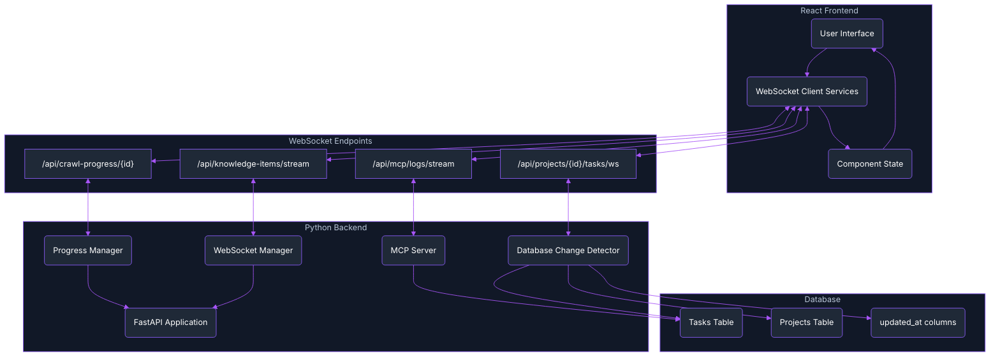

# WebSocket Communication

Archon implements real-time WebSocket communication for streaming progress updates, server logs, and live data synchronization between the Python backend and React frontend.

## 🌐 Overview

WebSocket connections enable real-time, bidirectional communication without the overhead of HTTP polling. Archon uses WebSockets for:

- **🔄 Real-Time Progress Tracking**: Live updates during crawling operations
- **📡 Server Log Streaming**: MCP server logs streamed to UI dashboard  
- **🎯 Knowledge Base Updates**: Real-time synchronization of knowledge items
- **💬 Chat Streaming**: Live RAG query responses
- **🤖 MCP-WebSocket Bridge**: Real-time task updates when AI agents modify data through MCP

## 🏗️ Architecture



## 🚀 **NEW: Database Change Detection Pattern**

### **The MCP-WebSocket Bridge Problem**

When AI agents update tasks through MCP tools, the changes don't trigger real-time WebSocket updates because:

1. **MCP servers should be simple** - No WebSocket infrastructure (follows MCP best practices)
2. **FastAPI handles WebSockets** - Real-time infrastructure belongs in the web server
3. **Database is the bridge** - MCP writes to DB, FastAPI needs to detect changes

### **The Solution: Database Change Detection**

A **polling-based change detection system** that bridges MCP operations with WebSocket broadcasts while maintaining perfect separation of concerns:

```python
# Database Change Detection System for MCP-WebSocket Bridge (Supabase Implementation)
class DatabaseChangeDetector:
    """
    Monitors database changes and broadcasts WebSocket updates.
    This bridges MCP server operations with real-time WebSocket notifications
    while maintaining separation of concerns.
    
    Uses Supabase client for database queries and supports session-based connection management.
    """
    
    def __init__(self):
        self.last_check_times: Dict[str, datetime] = {}
        self.polling_tasks: Dict[str, asyncio.Task] = {}
        self.check_interval = 5  # seconds (increased for better performance)
        self.websocket_connections: Dict[str, List[Dict[str, Any]]] = {}
        self.content_hashes: Dict[str, str] = {}  # Track content changes
    
    async def add_websocket_connection(self, project_id: str, websocket: WebSocket, session_id: str = None):
        """Add WebSocket connection and start monitoring if first connection"""
        if project_id not in self.websocket_connections:
            self.websocket_connections[project_id] = []
        
        # Store connection with session metadata for enhanced tracking
        connection_info = {
            "websocket": websocket,
            "session_id": session_id or "default",
            "connected_at": datetime.now(timezone.utc)
        }
        self.websocket_connections[project_id].append(connection_info)
        
        # Start monitoring this project if first connection
        if len(self.websocket_connections[project_id]) == 1:
            await self._start_monitoring(project_id)
    
    async def _start_monitoring(self, project_id: str):
        """Start polling for database changes for this project"""
        self.last_check_times[project_id] = datetime.now(timezone.utc)
        
        async def monitor_loop():
            while project_id in self.websocket_connections and self.websocket_connections[project_id]:
                try:
                    await self._check_and_broadcast_changes(project_id)
                    await asyncio.sleep(self.check_interval)
                except Exception as e:
                    logfire_logger.error(f"Error monitoring project {project_id}: {e}")
                    await asyncio.sleep(self.check_interval)
        
        # Store the monitoring task
        self.polling_tasks[project_id] = asyncio.create_task(monitor_loop())
        logfire_logger.info(f"Started monitoring for project {project_id}")
    
    async def _check_and_broadcast_changes(self, project_id: str):
        """Check for database changes and broadcast via WebSocket using Supabase"""
        last_check = self.last_check_times.get(project_id)
        if not last_check:
            return
        
        # Use Supabase client to query for updated tasks
        supabase_client = get_supabase_client()
        
        try:
            # Query for tasks updated since last check with proper ISO format
            response = supabase_client.table("tasks").select(
                "id, title, status, assignee, task_order, updated_at"
            ).eq(
                "project_id", project_id
            ).gt(
                "updated_at", last_check.isoformat()
            ).order("updated_at", desc=True).execute()
            
            changed_tasks = response.data if response.data else []
            
            if changed_tasks:
                # Update last check time
                self.last_check_times[project_id] = datetime.now(timezone.utc)
                
                # Log the changes for debugging
                logfire_logger.info(f"Found {len(changed_tasks)} updated tasks for project {project_id}")
                
                # Broadcast changes to all connected WebSockets
                await self._broadcast_to_project(project_id, {
                    "type": "tasks_updated",
                    "data": {
                        "project_id": project_id,
                        "updated_tasks": changed_tasks,
                        "timestamp": datetime.now(timezone.utc).isoformat()
                    }
                })
                
                logfire_logger.info(f"Broadcast {len(changed_tasks)} task changes for project {project_id}")
                
        except Exception as e:
            logfire_logger.error(f"Error checking database changes for project {project_id}: {e}")
    
    async def _broadcast_to_project(self, project_id: str, message: dict):
        """Broadcast message to all WebSocket connections for a project"""
        if project_id not in self.websocket_connections:
            return
        
        disconnected = []
        active_connections = self.websocket_connections[project_id]
        
        for connection_info in active_connections:
            try:
                websocket = connection_info["websocket"]
                await websocket.send_json(message)
                logfire_logger.debug(f"Sent WebSocket message to session {connection_info['session_id']}")
            except Exception as e:
                logfire_logger.warning(f"Failed to send WebSocket message: {e}")
                disconnected.append(connection_info)
        
        # Clean up disconnected WebSockets
        for connection_info in disconnected:
            self.remove_websocket_connection(project_id, connection_info["websocket"])
    
    def remove_websocket_connection(self, project_id: str, websocket: WebSocket):
        """Remove WebSocket connection and stop monitoring if no connections left"""
        if project_id in self.websocket_connections:
            # Find and remove the connection
            self.websocket_connections[project_id] = [
                conn for conn in self.websocket_connections[project_id] 
                if conn["websocket"] != websocket
            ]
            
            # Stop monitoring if no more connections
            if not self.websocket_connections[project_id]:
                del self.websocket_connections[project_id]
                if project_id in self.polling_tasks:
                    self.polling_tasks[project_id].cancel()
                    del self.polling_tasks[project_id]
                if project_id in self.last_check_times:
                    del self.last_check_times[project_id]
                logfire_logger.info(f"Stopped monitoring for project {project_id} - no more connections")

# Global database change detector
db_change_detector = DatabaseChangeDetector()
```

### **WebSocket Endpoint for Task Updates**

```python
@router.websocket("/projects/{project_id}/tasks/ws")
async def task_updates_websocket(websocket: WebSocket, project_id: str, session_id: str = Query(None)):
    """WebSocket endpoint for real-time task updates with session-based MCP change detection"""
    try:
        await websocket.accept()
        
        # Use session_id if provided, otherwise generate one for this connection
        if not session_id:
            session_id = str(uuid.uuid4())
            
        logfire_logger.info("Task WebSocket connected", project_id=project_id, session_id=session_id)
        
        # Add to both managers with session context
        await task_update_manager.connect_to_session(websocket, project_id, session_id)
        await db_change_detector.add_websocket_connection(project_id, websocket, session_id)
        
        # Send initial task state using Supabase
        supabase_client = get_supabase_client()
        tasks_response = supabase_client.table("tasks").select("*").eq("project_id", project_id).eq("archived", "false").order("task_order").execute()
        tasks = tasks_response.data if tasks_response.data else []
        
        initial_data = {
            "type": "initial_tasks",
            "data": {
                "project_id": project_id,
                "tasks": tasks,
                "session_id": session_id
            }
        }
        await websocket.send_json(initial_data)
        logfire_logger.info("Sent initial tasks", project_id=project_id, task_count=len(tasks))
        
        # Keep connection alive with enhanced session management
        while True:
            try:
                message = await asyncio.wait_for(websocket.receive_text(), timeout=30.0)
                if message == "ping":
                    await websocket.send_json({"type": "pong", "session_id": session_id})
                elif message == "get_status":
                    # Send current connection status
                    await websocket.send_json({
                        "type": "status",
                        "data": {
                            "connected": True,
                            "session_id": session_id,
                            "monitoring": project_id in db_change_detector.websocket_connections
                        }
                    })
            except asyncio.TimeoutError:
                # Send heartbeat to keep connection alive
                await websocket.send_json({"type": "heartbeat", "timestamp": datetime.now(timezone.utc).isoformat()})
            except WebSocketDisconnect:
                break
                
    except WebSocketDisconnect:
        logfire_logger.info("Task WebSocket disconnected", project_id=project_id, session_id=session_id)
    except Exception as e:
        logfire_logger.error("Unexpected error in task updates WebSocket", project_id=project_id, session_id=session_id, error=str(e))
    finally:
        # Clean up both managers
        task_update_manager.disconnect_from_session(websocket, project_id, session_id)
        db_change_detector.remove_websocket_connection(project_id, websocket)
        logfire_logger.info("Task WebSocket cleanup complete", project_id=project_id, session_id=session_id)
```

### **How the Pattern Works**

1. **🔌 WebSocket Connection**: Frontend connects to `/api/projects/{id}/tasks/ws`
2. **👁️ Start Monitoring**: Database change detector begins polling for changes
3. **🤖 MCP Operation**: AI agent calls MCP tool to update task (e.g., change status)
4. **💾 Database Write**: MCP tool updates database with new `updated_at` timestamp
5. **🔍 Change Detection**: Polling system detects `updated_at` > last check time
6. **📡 WebSocket Broadcast**: Changed tasks are broadcast to all connected clients
7. **⚡ Real-time Update**: Frontend receives update and re-renders UI instantly

### **Key Benefits**

- **✅ Separation of Concerns**: MCP stays simple, FastAPI handles WebSockets
- **✅ Real-time Updates**: Instant UI updates when AI agents modify data
- **✅ Resource Efficient**: Only monitors projects with active WebSocket connections
- **✅ Automatic Lifecycle**: Starts/stops monitoring based on connection state
- **✅ MCP Best Practices**: Follows official MCP server architecture guidelines

### **Frontend Integration**

#### **WebSocket Service with Bulk Task Updates**

The real-time task updates work by connecting to the WebSocket endpoint and handling bulk task change notifications:

```typescript
// WebSocket service for task updates
interface TaskUpdateCallbacks {
  onTaskUpdated?: (task: any) => void;
  onTasksChange?: (tasks: any[]) => void;  // KEY: This handles bulk updates from MCP
  onTaskCreated?: (task: any) => void;
  onTaskDeleted?: (taskId: string) => void;
}

const connectTaskWebSocket = (projectId: string, callbacks: TaskUpdateCallbacks) => {
  const wsUrl = `ws://localhost:8080/api/projects/${projectId}/tasks/ws`;
  const ws = new WebSocket(wsUrl);
  
  ws.onopen = () => {
    console.log('🚀 Connected to real-time task updates');
  };
  
  ws.onmessage = (event) => {
    const message = JSON.parse(event.data);
    console.log('📨 WebSocket message:', message);
    
    if (message.type === 'initial_tasks') {
      // Handle initial task load
      const initialTasks = message.data.tasks;
      if (callbacks.onTasksChange) {
        callbacks.onTasksChange(initialTasks);
      }
    } else if (message.type === 'tasks_updated') {
      // KEY: Handle bulk task updates from AI agents via MCP
      const updatedTasks = message.data.updated_tasks;
      console.log('📝 Bulk task updates received:', updatedTasks.length);
      
      // Call the bulk update callback that refreshes the entire task list
      if (callbacks.onTasksChange) {
        // Trigger a fresh fetch of all tasks to ensure consistency
        callbacks.onTasksChange(updatedTasks);
      }
    } else if (message.type === 'heartbeat') {
      // Respond to heartbeat
      ws.send('ping');
    }
  };
  
  return ws;
};
```

#### **React Component Integration**

The actual working pattern in TasksTab component:

```typescript
// TasksTab.tsx - Working WebSocket Integration
const TasksTab: React.FC<TasksTabProps> = ({ projectId, onTasksChange }) => {
  const [tasks, setTasks] = useState<UITask[]>([]);
  
  // WebSocket connection with BOTH individual and bulk update callbacks
  useEffect(() => {
    if (!projectId) return;
    
    const ws = websocketService.connectToTaskUpdates(projectId, {
      // Individual task updates (for direct UI interactions)
      onTaskUpdated: (updatedTask) => {
        console.log('📝 Real-time task updated:', updatedTask);
        const mappedTask = mapDatabaseTaskToUITask(updatedTask);
        setTasks(prev => {
          const updated = prev.map(task => 
            task.id === updatedTask.id ? mappedTask : task
          );
          setTimeout(() => onTasksChange(updated), 0);
          return updated;
        });
      },
      
      // CRITICAL: Bulk task updates (for AI agent MCP operations) 
      onTasksChange: (updatedTasks) => {
        console.log('📝 Bulk task updates received:', updatedTasks);
        
        // Map all updated tasks
        const mappedTasks = updatedTasks.map(mapDatabaseTaskToUITask);
        
        setTasks(prev => {
          // Update multiple tasks efficiently
          const taskMap = new Map(prev.map(task => [task.id, task]));
          
          // Apply all updates
          mappedTasks.forEach(updatedTask => {
            taskMap.set(updatedTask.id, updatedTask);
          });
          
          const updated = Array.from(taskMap.values());
          
          // Notify parent component
          setTimeout(() => onTasksChange(updated), 0);
          return updated;
        });
      },
      
      onTaskCreated: (newTask) => {
        console.log('📝 Real-time task created:', newTask);
        const mappedTask = mapDatabaseTaskToUITask(newTask);
        setTasks(prev => {
          const updated = [...prev, mappedTask];
          setTimeout(() => onTasksChange(updated), 0);
          return updated;
        });
      },
      
      onTaskDeleted: (taskId) => {
        console.log('📝 Real-time task deleted:', taskId);
        setTasks(prev => {
          const updated = prev.filter(task => task.id !== taskId);
          setTimeout(() => onTasksChange(updated), 0);
          return updated;
        });
      }
    });
    
    return () => {
      ws?.close();
    };
  }, [projectId, onTasksChange]);
  
  // ... rest of component
};
```

#### **Database to UI Task Mapping**

Since the WebSocket sends database task objects, they need to be mapped to UI task format:

```typescript
const mapDatabaseTaskToUITask = (dbTask: any): UITask => {
  // Map database status to UI status
  const statusMapping = {
    'todo': 'backlog',
    'doing': 'in-progress', 
    'blocked': 'blocked',
    'done': 'completed'
  };
  
  return {
    id: dbTask.id,
    title: dbTask.title,
    status: statusMapping[dbTask.status] || dbTask.status,
    assignee: dbTask.assignee,
    description: dbTask.description || '',
    task_order: dbTask.task_order,
    created_at: dbTask.created_at,
    updated_at: dbTask.updated_at
  };
};
```

## 📡 WebSocket Endpoints

### Progress Tracking: `/api/crawl-progress/{progress_id}`

**Purpose**: Real-time progress updates during crawling operations

**Message Types**:
- `crawl_progress`: Ongoing progress updates
- `crawl_completed`: Final completion notification
- `heartbeat`: Keep-alive ping

**Example Message Flow**:
```json
// Initial connection
{
  "type": "crawl_progress",
  "data": {
    "progressId": "8b74d6a0-4970-4d7f-bf82-52a7c08916ad",
    "status": "crawling",
    "percentage": 10,
    "start_time": "2025-06-04T20:57:34.081424",
    "currentUrl": "https://www.example.com",
    "totalPages": 24,
    "processedPages": 2,
    "log": "Starting crawl...",
    "logs": ["Starting crawl...", "Analyzing URL type..."]
  }
}

// Progress update
{
  "type": "crawl_progress", 
  "data": {
    "progressId": "8b74d6a0-4970-4d7f-bf82-52a7c08916ad",
    "status": "crawling",
    "percentage": 45,
    "processedPages": 11,
    "log": "Processed 11/24 pages"
  }
}

// Completion
{
  "type": "crawl_completed",
  "data": {
    "progressId": "8b74d6a0-4970-4d7f-bf82-52a7c08916ad", 
    "status": "completed",
    "percentage": 100,
    "chunksStored": 89,
    "wordCount": 25000,
    "completed_at": "2025-06-04T20:58:45.123456"
  }
}
```

### MCP Logs: `/api/mcp/logs/stream`

**Purpose**: Stream MCP server logs to the dashboard

**Message Format**:
```json
{
  "timestamp": "2025-06-04T20:45:30.123Z",
  "level": "INFO",
  "logger": "mcp.server", 
  "message": "Tool 'search_knowledge' called with query: 'Python exceptions'",
  "metadata": {
    "client_id": "cursor_client_001",
    "tool_name": "search_knowledge",
    "execution_time": 0.245
  }
}
```

### Knowledge Items: `/api/knowledge-items/stream`

**Purpose**: Real-time updates when knowledge base changes

**Message Format**:
```json
{
  "type": "knowledge_items_update",
  "data": {
    "items": [...],
    "total": 156,
    "page": 1,
    "per_page": 20
  }
}
```

### **Task Updates: `/api/projects/{project_id}/tasks/ws`**

**Purpose**: Real-time task updates when AI agents modify data through MCP

**Message Types**:
- `initial_tasks`: Full task list on connection
- `tasks_updated`: Incremental updates when tasks change
- `heartbeat`: Keep-alive ping

**Example Message Flow**:
```json
// Initial connection
{
  "type": "initial_tasks",
  "data": {
    "project_id": "0b6665f6-ceb8-49d7-a9f0-e6baf07eadb9",
    "tasks": [
      {
        "id": "task-1",
        "title": "Task 1",
        "status": "todo",
        "assignee": "User",
        "task_order": 1
      }
    ]
  }
}

// Real-time update (when AI agent changes task via MCP)
{
  "type": "tasks_updated", 
  "data": {
    "project_id": "0b6665f6-ceb8-49d7-a9f0-e6baf07eadb9",
    "updated_tasks": [
      {
        "id": "task-1",
        "status": "doing",
        "updated_at": "2025-06-08T04:39:43.928693+00:00"
      }
    ],
    "timestamp": "2025-06-08T04:39:44.123456+00:00"
  }
}
```

## 🐛 Critical WebSocket Bugs & Fixes

### 1. The DateTime Serialization Bug

#### The Problem

The most critical WebSocket issue we encountered was silent connection failures due to datetime serialization:

```python
# ❌ BROKEN: This would crash WebSocket sends
progress_data = {
    'start_time': datetime.now(),  # Can't serialize to JSON!
    'updated_at': datetime.now(),
    'completed_at': datetime.now()
}

await websocket.send_json({
    "type": "crawl_progress",
    "data": progress_data  # TypeError: Object of type datetime is not JSON serializable
})
```

#### The Symptoms

1. **WebSocket connects successfully** ✅
2. **First progress update fails silently** ❌ 
3. **WebSocket gets disconnected and removed** ❌
4. **All subsequent updates show "No WebSockets found"** ❌

#### The Fix

Convert ALL datetime objects to ISO format strings before JSON serialization:

```python
# ✅ FIXED: Convert all datetime objects
for key, value in progress_data.items():
    if hasattr(value, 'isoformat'):
        progress_data[key] = value.isoformat()

await websocket.send_json({
    "type": "crawl_progress", 
    "data": progress_data  # Now JSON serializable!
})
```

### 2. The Supabase Boolean Bug (CRITICAL FIX)

#### The Problem

WebSocket task endpoints failing immediately due to incorrect boolean handling in Supabase queries:

```python
# ❌ BROKEN: Python boolean causes HTTP 400 error
tasks_response = supabase_client.table("tasks").select("*")\
    .eq("project_id", project_id)\
    .eq("archived", False)\  # ❌ Python False breaks Supabase
    .order("task_order").execute()

# Result: HTTP/2 400 Bad Request - Invalid boolean value
```

#### The Symptoms

1. **WebSocket connects successfully** ✅
2. **Immediate disconnection on initial task query** ❌
3. **Backend logs show "Unexpected error in task updates WebSocket"** ❌
4. **No task updates received by frontend** ❌

#### The Root Cause

Supabase expects string literals for boolean values, not Python boolean objects:
- `False` (Python boolean) → **400 Bad Request** ❌
- `"false"` (string literal) → **200 OK** ✅

#### The Fix

**ALWAYS use string literals for boolean values in Supabase queries:**

```python
# ✅ FIXED: Use string literals for Supabase booleans
tasks_response = supabase_client.table("tasks").select("*")\
    .eq("project_id", project_id)\
    .eq("archived", "false")\  # ✅ String literal works
    .order("task_order").execute()

# Result: HTTP/2 200 OK - Query succeeds
```

#### **Critical Rule for Supabase Integration**

```python
# ❌ NEVER use Python booleans in Supabase queries
.eq("archived", False)     # ❌ Breaks
.eq("is_active", True)     # ❌ Breaks  
.eq("published", False)    # ❌ Breaks

# ✅ ALWAYS use string literals
.eq("archived", "false")   # ✅ Works
.eq("is_active", "true")   # ✅ Works
.eq("published", "false")  # ✅ Works
```

This bug was **the exact cause** of our WebSocket task updates breaking - the initial task query failed with a 400 error, causing the entire WebSocket connection to crash silently.

## 🐍 Backend Implementation

### Core WebSocket Manager

```python
from fastapi import WebSocket, WebSocketDisconnect
from typing import Dict, List, Any
import json
import asyncio
from datetime import datetime

class CrawlProgressManager:
    def __init__(self):
        self.active_crawls: Dict[str, Dict[str, Any]] = {}
        self.progress_websockets: Dict[str, List[WebSocket]] = {}
    
    async def add_websocket(self, progress_id: str, websocket: WebSocket) -> None:
        """Add WebSocket connection for progress tracking"""
        try:
            print(f"DEBUG: WebSocket connecting for progress_id: {progress_id}")
            
            # CRITICAL: Accept WebSocket connection FIRST
            await websocket.accept()
            print(f"DEBUG: WebSocket accepted for progress_id: {progress_id}")
            
            if progress_id not in self.progress_websockets:
                self.progress_websockets[progress_id] = []
            
            self.progress_websockets[progress_id].append(websocket)
            print(f"DEBUG: WebSocket added. Total connections: {len(self.progress_websockets[progress_id])}")
            
            # Send current progress if available
            if progress_id in self.active_crawls:
                print(f"DEBUG: Found active crawl, sending current state")
                data = self.active_crawls[progress_id].copy()
                data['progressId'] = progress_id
                
                # Convert ALL datetime objects to strings for JSON serialization
                for key, value in data.items():
                    if hasattr(value, 'isoformat'):
                        data[key] = value.isoformat()
                
                message = {
                    "type": "crawl_progress",
                    "data": data
                }
                await websocket.send_json(message)
            else:
                # Send waiting state
                await websocket.send_json({
                    "type": "crawl_progress",
                    "data": {
                        "progressId": progress_id,
                        "status": "waiting",
                        "percentage": 0,
                        "logs": ["Waiting for crawl to start..."]
                    }
                })
                
        except Exception as e:
            print(f"ERROR: Exception in add_websocket: {e}")
            raise
    
    async def update_progress(self, progress_id: str, update_data: Dict[str, Any]) -> None:
        """Update progress and broadcast to connected clients"""
        if progress_id not in self.active_crawls:
            return
        
        # Update progress data
        self.active_crawls[progress_id].update(update_data)
        self.active_crawls[progress_id]['updated_at'] = datetime.now()
        
        # Broadcast to all connected WebSockets
        await self._broadcast_progress(progress_id)
    
    async def _broadcast_progress(self, progress_id: str) -> None:
        """Broadcast progress update to all connected clients"""
        if progress_id not in self.progress_websockets:
            print(f"DEBUG: No WebSockets found for progress_id: {progress_id}")
            return
        
        progress_data = self.active_crawls.get(progress_id, {}).copy()
        progress_data['progressId'] = progress_id
        
        # Convert ALL datetime objects to strings for JSON serialization
        for key, value in progress_data.items():
            if hasattr(value, 'isoformat'):
                progress_data[key] = value.isoformat()
        
        message = {
            "type": "crawl_progress" if progress_data.get('status') != 'completed' else "crawl_completed",
            "data": progress_data
        }
        
        print(f"DEBUG: Broadcasting to {len(self.progress_websockets[progress_id])} WebSocket(s)")
        
        # Send to all connected WebSocket clients
        disconnected = []
        for websocket in self.progress_websockets[progress_id]:
            try:
                await websocket.send_json(message)
                print(f"DEBUG: Successfully sent progress update to WebSocket")
            except Exception as e:
                print(f"DEBUG: Failed to send to WebSocket: {e}")
                disconnected.append(websocket)
        
        # Clean up disconnected WebSockets
        for ws in disconnected:
            self.remove_websocket(progress_id, ws)
```

### WebSocket Endpoint Definition

```python
from fastapi import APIRouter, WebSocket, WebSocketDisconnect
import asyncio

router = APIRouter(prefix="/api", tags=["websockets"])

@router.websocket("/crawl-progress/{progress_id}")
async def websocket_crawl_progress(websocket: WebSocket, progress_id: str):
    """WebSocket endpoint for tracking specific crawl progress"""
    try:
        print(f"DEBUG: WebSocket connecting for progress_id: {progress_id}")
        
        # Add WebSocket to progress manager (handles accept internally)
        await progress_manager.add_websocket(progress_id, websocket)
        print(f"DEBUG: WebSocket registered for progress_id: {progress_id}")
        
        # Keep connection alive
        while True:
            try:
                # Wait for messages from client (like ping)
                message = await asyncio.wait_for(websocket.receive_text(), timeout=30.0)
                if message == "ping":
                    await websocket.send_json({"type": "pong"})
            except asyncio.TimeoutError:
                # Send heartbeat every 30 seconds
                await websocket.send_json({"type": "heartbeat"})
            except WebSocketDisconnect:
                break
                
    except WebSocketDisconnect:
        print(f"DEBUG: WebSocket disconnected for progress_id: {progress_id}")
    except Exception as e:
        print(f"DEBUG: WebSocket error for progress_id {progress_id}: {e}")
    finally:
        progress_manager.remove_websocket(progress_id, websocket)
```

### Progress Callback Integration

```python
async def _perform_crawl_with_progress(progress_id: str, request: KnowledgeItemRequest):
    """Perform crawl with real-time progress tracking"""
    
    # Initialize progress state
    progress_manager.start_crawl(progress_id, {
        'status': 'crawling',
        'percentage': 0,
        'start_time': datetime.now(),
        'currentUrl': str(request.url),
        'totalPages': 0,
        'processedPages': 0,
        'logs': ['Starting crawl...']
    })
    
    # Create progress callback
    async def progress_callback(status: str, percentage: int, message: str, **kwargs):
        """Callback for real-time progress updates from crawling functions"""
        await progress_manager.update_progress(progress_id, {
            'status': status,
            'percentage': percentage,
            'currentUrl': kwargs.get('currentUrl', str(request.url)),
            'totalPages': kwargs.get('totalPages', 0),
            'processedPages': kwargs.get('processedPages', 0),
            'log': message,
            **kwargs
        })
    
    # Pass callback to MCP function
    ctx.progress_callback = progress_callback
    
    try:
        # Call crawling function with progress support
        result = await mcp_smart_crawl_url(ctx=ctx, url=str(request.url))
        
        # Mark as completed
        await progress_manager.complete_crawl(progress_id, {
            'status': 'completed',
            'percentage': 100,
            'completed_at': datetime.now(),
            'chunksStored': result.get('chunks_created', 0),
            'wordCount': result.get('total_words', 0)
        })
        
    except Exception as e:
        # Mark as failed
        await progress_manager.error_crawl(progress_id, str(e))
        raise
```

## ⚛️ Frontend Integration

### WebSocket Service

```typescript
interface CrawlProgressData {
  progressId: string;
  status: string;
  percentage: number;
  currentUrl?: string;
  totalPages?: number;
  processedPages?: number;
  log?: string;
  logs?: string[];
  start_time?: string;
  completed_at?: string;
  chunksStored?: number;
  wordCount?: number;
}

class CrawlProgressService {
  private connections: Map<string, WebSocket> = new Map();
  private baseUrl: string;
  
  constructor(baseUrl = 'ws://localhost:8080') {
    this.baseUrl = baseUrl;
  }
  
  streamProgress(
    progressId: string,
    onProgress: (data: CrawlProgressData) => void,
    options: {
      autoReconnect?: boolean;
      reconnectDelay?: number;
      maxReconnectAttempts?: number;
    } = {}
  ): WebSocket {
    const {
      autoReconnect = true,
      reconnectDelay = 5000,
      maxReconnectAttempts = 5
    } = options;
    
    let reconnectAttempts = 0;
    
    const connect = (): WebSocket => {
      const wsUrl = `${this.baseUrl}/api/crawl-progress/${progressId}`;
      console.log(`🔌 Attempting to connect to WebSocket: ${wsUrl}`);
      
      const ws = new WebSocket(wsUrl);
      this.connections.set(progressId, ws);
      
      ws.onopen = () => {
        console.log(`🚀 Connected to crawl progress stream: ${progressId}`);
        reconnectAttempts = 0; // Reset on successful connection
      };
      
      ws.onmessage = (event) => {
        try {
          const message = JSON.parse(event.data);
          console.log(`📨 Received WebSocket message:`, message);
          
          if (message.type === 'crawl_progress' || message.type === 'crawl_completed') {
            onProgress(message.data);
          } else if (message.type === 'heartbeat') {
            // Respond to heartbeat
            ws.send('ping');
          }
        } catch (error) {
          console.error('Failed to parse WebSocket message:', error);
        }
      };
      
      ws.onclose = (event) => {
        console.log(`❌ Crawl progress stream disconnected: ${progressId}`, event);
        this.connections.delete(progressId);
        
        // Auto-reconnect for non-normal closures
        if (autoReconnect && 
            event.code !== 1000 && 
            reconnectAttempts < maxReconnectAttempts) {
          reconnectAttempts++;
          console.log(`🔄 Attempting reconnect ${reconnectAttempts}/${maxReconnectAttempts} in ${reconnectDelay}ms`);
          setTimeout(() => connect(), reconnectDelay);
        }
      };
      
      ws.onerror = (error) => {
        console.error(`❌ WebSocket error for ${progressId}:`, error);
      };
      
      return ws;
    };
    
    return connect();
  }
  
  disconnect(progressId: string): void {
    const ws = this.connections.get(progressId);
    if (ws) {
      ws.close(1000, 'Client disconnecting');
      this.connections.delete(progressId);
    }
  }
  
  disconnectAll(): void {
    for (const [progressId] of this.connections) {
      this.disconnect(progressId);
    }
  }
}
```

### React Component Integration

```tsx
import React, { useState, useEffect, useRef } from 'react';
import { CrawlProgressService } from '../services/crawlProgressService';

interface CrawlProgressProps {
  progressId: string;
  onComplete?: (data: CrawlProgressData) => void;
}

export const CrawlProgress: React.FC<CrawlProgressProps> = ({ 
  progressId, 
  onComplete 
}) => {
  const [progress, setProgress] = useState<CrawlProgressData | null>(null);
  const [isConnected, setIsConnected] = useState(false);
  const wsRef = useRef<WebSocket | null>(null);
  const serviceRef = useRef(new CrawlProgressService());
  
  useEffect(() => {
    if (!progressId) return;
    
    const handleProgress = (data: CrawlProgressData) => {
      setProgress(data);
      
      if (data.status === 'completed' && onComplete) {
        onComplete(data);
      }
    };
    
    // Start WebSocket connection
    wsRef.current = serviceRef.current.streamProgress(progressId, handleProgress);
    
    // Track connection status
    if (wsRef.current) {
      wsRef.current.addEventListener('open', () => setIsConnected(true));
      wsRef.current.addEventListener('close', () => setIsConnected(false));
    }
    
    // Cleanup on unmount
    return () => {
      serviceRef.current.disconnect(progressId);
      setIsConnected(false);
    };
  }, [progressId, onComplete]);
  
  if (!progress) {
    return (
      <div className="flex items-center space-x-2">
        <div className="animate-spin h-4 w-4 border-2 border-blue-500 border-t-transparent rounded-full" />
        <span>Connecting to progress stream...</span>
      </div>
    );
  }
  
  return (
    <div className="space-y-4">
      {/* Connection Status */}
      <div className="flex items-center space-x-2">
        <div className={`h-2 w-2 rounded-full ${isConnected ? 'bg-green-500' : 'bg-red-500'}`} />
        <span className="text-sm text-gray-600">
          {isConnected ? 'Connected' : 'Disconnected'}
        </span>
      </div>
      
      {/* Progress Bar */}
      <div className="w-full bg-gray-200 rounded-full h-2">
        <div 
          className="bg-blue-600 h-2 rounded-full transition-all duration-300"
          style={{ width: `${progress.percentage}%` }}
        />
      </div>
      
      {/* Progress Info */}
      <div className="space-y-2">
        <div className="flex justify-between text-sm">
          <span>Status: {progress.status}</span>
          <span>{progress.percentage}%</span>
        </div>
        
        {progress.currentUrl && (
          <div className="text-sm text-gray-600 truncate">
            Current: {progress.currentUrl}
          </div>
        )}
        
        {progress.totalPages && progress.processedPages !== undefined && (
          <div className="text-sm text-gray-600">
            Pages: {progress.processedPages}/{progress.totalPages}
          </div>
        )}
        
        {progress.log && (
          <div className="text-sm font-mono bg-gray-100 p-2 rounded">
            {progress.log}
          </div>
        )}
      </div>
      
      {/* Completion Summary */}
      {progress.status === 'completed' && (
        <div className="bg-green-50 border border-green-200 rounded-lg p-4">
          <h4 className="font-semibold text-green-800">Crawl Completed!</h4>
          <div className="mt-2 space-y-1 text-sm text-green-700">
            {progress.chunksStored && (
              <div>Chunks stored: {progress.chunksStored}</div>
            )}
            {progress.wordCount && (
              <div>Words processed: {progress.wordCount.toLocaleString()}</div>
            )}
          </div>
        </div>
      )}
    </div>
  );
};
```

## 🔧 Troubleshooting

### Common Issues

#### 1. WebSocket Connection Refused
**Symptoms**: `WebSocket connection to 'ws://localhost:8080/...' failed`
```bash
# Check if backend is running
curl http://localhost:8080/health

# Check WebSocket endpoint specifically
wscat -c ws://localhost:8080/api/crawl-progress/test-id
```

#### 2. Connection Established But No Updates
**Symptoms**: WebSocket connects but no progress messages received

**Possible Causes**:
- Progress ID mismatch between frontend and backend
- Datetime serialization errors (our bug!)
- Progress callback not being called
- WebSocket being removed from manager

**Debug Steps**:
```python
# Add debug logging in backend
print(f"DEBUG: Active crawls: {list(progress_manager.active_crawls.keys())}")
print(f"DEBUG: WebSocket connections: {list(progress_manager.progress_websockets.keys())}")
```

#### 3. Frequent Disconnections
**Symptoms**: WebSocket connects then immediately disconnects

**Possible Causes**:
- JSON serialization errors
- Network timeouts
- Server restart
- CORS issues

#### 4. Memory Leaks
**Symptoms**: Growing memory usage, slow performance

**Solution**: Ensure proper WebSocket cleanup
```python
def remove_websocket(self, progress_id: str, websocket: WebSocket) -> None:
    """Remove WebSocket from progress tracking"""
    if progress_id in self.progress_websockets:
        try:
            self.progress_websockets[progress_id].remove(websocket)
            if not self.progress_websockets[progress_id]:
                del self.progress_websockets[progress_id]
        except ValueError:
            pass  # WebSocket already removed
```

#### 🚨 5. WebSocket Task Updates Not Working

**Symptoms**:
- WebSocket connects successfully
- Backend shows polling and broadcasting messages  
- Frontend doesn't update when tasks change via MCP
- Refreshing page shows updated tasks (database is correct)

**Root Cause**: Frontend missing `onTasksChange` callback to handle bulk task updates.

**Debug Process**:
```bash
# 1. Test WebSocket connection
curl -i -N -H "Connection: Upgrade" -H "Upgrade: websocket" \
  -H "Sec-WebSocket-Key: dGVzdA==" -H "Sec-WebSocket-Version: 13" \
  "http://localhost:8080/api/projects/{project_id}/tasks/ws"

# 2. Check backend logs for database queries
docker-compose logs archon-pyserver --tail=50 | grep -E "(200|400|tasks_updated)"

# 3. Look for Supabase boolean issues
# If you see HTTP/2 400 errors, check for Python booleans in Supabase queries

# 4. Test MCP task update
# Use Archon MCP to update a task and check logs:
docker-compose logs archon-pyserver --tail=20 | grep -E "(Broadcast|tasks_updated)"
```

**Fix**: Add `onTasksChange` callback to frontend WebSocket connection to handle bulk updates from AI agents.

#### 🚨 6. useCallback Dependency Hell (MOST COMMON ISSUE)
**Symptoms**: 
- `WebSocket connection failed: WebSocket is closed before the connection is established`
- `code: 1006` abnormal closures
- Constant reconnection attempts
- Components re-rendering infinitely

**Root Cause**: Including unstable functions in `useCallback` dependency arrays causes components to re-render constantly, destabilizing WebSocket connections.

**Debug Steps**:
```typescript
// ❌ Check for these patterns in your code:
const handler = useCallback(() => {
  showToast('message', 'success');
}, [showToast]); // ❌ PROBLEM: showToast is unstable!

const handler = useCallback(() => {
  await apiFunction();
}, [apiFunction]); // ❌ PROBLEM: apiFunction recreated every render!

// ✅ Fix by removing unstable dependencies:
const handler = useCallback(() => {
  showToast('message', 'success'); // Still works!
}, []); // ✅ No unstable dependencies

const handler = useCallback(() => {
  await apiFunction(); // Still works!
}, [primitiveValue]); // ✅ Only stable dependencies
```

**Solution Steps**:
1. **Find the problematic useCallback**: Look for any useCallback with function dependencies
2. **Remove function dependencies**: Only include primitive values, state, and props
3. **Test WebSocket stability**: Verify connections stay stable after fix
4. **Add memory**: Document the fix to prevent regression

**Real-World Fix Example**:
```typescript
// ❌ BROKEN: This pattern breaks WebSockets
const handleManualSave = async () => {
  try {
    await saveToDatabase();
    showToast('Features layout saved successfully', 'success');
  } catch (error) {
    showToast('Failed to save features layout', 'error');
  }
};

const addNode = async () => {
  // ... node creation logic
  try {
    await saveToDatabase(newNodes, edges);
    showToast('Page added successfully', 'success');
  } catch (error) {
    showToast('Failed to save page', 'error');
    setNodes(nodes);
  }
}

// ✅ FIXED: Simple pattern that works (matches working DataTab)
const handleManualSave = async () => {
  await saveToDatabase();
};

const addNode = async () => {
  // ... node creation logic
  try {
    await saveToDatabase(newNodes, edges);
  } catch (error) {
    setNodes(nodes);
  }
}
```

**Key Insight**: The issue wasn't just useCallback dependencies, but also **excessive showToast calls in functions that get called frequently during component lifecycle**. The working DataTab pattern keeps functions simple and doesn't use showToast in auto-save operations.

### Debug Tools

#### Backend Debug Logging
```python
import logging
logging.basicConfig(level=logging.DEBUG)

# Add to WebSocket handlers
logger = logging.getLogger(__name__)
logger.debug(f"WebSocket message: {message}")
```

#### Frontend Debug Console
```javascript
// Enable WebSocket debugging
const ws = new WebSocket(url);
ws.addEventListener('open', (e) => console.log('WS Open:', e));
ws.addEventListener('message', (e) => console.log('WS Message:', e.data));
ws.addEventListener('close', (e) => console.log('WS Close:', e.code, e.reason));
ws.addEventListener('error', (e) => console.log('WS Error:', e));
```

#### Network Analysis
```bash
# Monitor WebSocket traffic
npx wscat -c ws://localhost:8080/api/crawl-progress/test-id

# Check HTTP upgrade request
curl -i \
  -H "Connection: Upgrade" \
  -H "Upgrade: websocket" \
  -H "Sec-WebSocket-Key: test" \
  -H "Sec-WebSocket-Version: 13" \
  http://localhost:8080/api/crawl-progress/test-id
```

## ✅ Best Practices

### 🚨 **CRITICAL: useCallback Dependency Management**

**THE #1 CAUSE OF WEBSOCKET BREAKAGE**: Including unstable functions like `showToast` or function references in `useCallback` dependency arrays causes constant re-renders that destabilize WebSocket connections.

```typescript
// ❌ BREAKS WEBSOCKETS: Including showToast in dependencies
const handleDelete = useCallback(async () => {
  // ... delete logic
  showToast('Deleted successfully', 'success');
}, [nodeId, showToast]); // ❌ showToast causes re-renders!

// ✅ SAFE: Exclude showToast from dependencies 
const handleDelete = useCallback(async () => {
  // ... delete logic
  showToast('Deleted successfully', 'success'); // ✅ Can still call it
}, [nodeId]); // ✅ Only include stable dependencies

// ❌ BREAKS WEBSOCKETS: Including function references
const confirmDelete = useCallback(async () => {
  await saveToDatabase(newData);
  showToast('Success', 'success');
}, [saveToDatabase]); // ❌ saveToDatabase recreated every render!

// ✅ SAFE: Exclude function references
const confirmDelete = useCallback(async () => {
  await saveToDatabase(newData); // ✅ Can still call it
  showToast('Success', 'success');
}, [nodeId, nodes, edges]); // ✅ Only primitive dependencies
```

### 🛡️ **Stable Reference Rules**

1. **NEVER include these in useCallback dependencies:**
   - `showToast` or any toast functions
   - API service functions (`projectService.updateProject`)
   - Event handlers from parent components
   - Any function that gets recreated each render

2. **AVOID showToast in frequently called functions:**
   - Auto-save operations triggered by state changes
   - Functions called during component re-renders
   - Event handlers that fire multiple times
   - Use showToast only for explicit user actions (manual saves, deletions)

3. **ONLY include these in useCallback dependencies:**
   - Primitive values (`string`, `number`, `boolean`)
   - State variables that are primitives
   - Props that are primitives
   - Stable refs (`useRef` values)

4. **Safe dependency examples:**
```typescript
// ✅ SAFE DEPENDENCIES
const handleClick = useCallback((id: string) => {
  // Function body...
}, [projectId, nodeId, status]); // All primitives

// ✅ SAFE WITH STABLE REFS
const stableFunctionRef = useRef(someFunction);
const handleClick = useCallback(() => {
  stableFunctionRef.current();
}, [stableFunctionRef]); // Ref is stable
```

### Backend Development

1. **Always Accept WebSocket First**
```python
# ✅ Correct order
await websocket.accept()
# ... then add to manager and send messages
```

2. **Handle JSON Serialization**
```python
# ✅ Convert datetime objects
for key, value in data.items():
    if hasattr(value, 'isoformat'):
        data[key] = value.isoformat()
```

3. **Implement Cleanup**
```python
# ✅ Clean up disconnected WebSockets
finally:
    progress_manager.remove_websocket(progress_id, websocket)
```

4. **Use Error Handling**
```python
try:
    await websocket.send_json(message)
except Exception as e:
    print(f"Failed to send: {e}")
    disconnected.append(websocket)
```

### Frontend Development

1. **Implement Reconnection Logic**
```typescript
ws.onclose = (event) => {
  if (event.code !== 1000 && autoReconnect) {
    setTimeout(connect, reconnectDelay);
  }
};
```

2. **Clean Up on Unmount**
```typescript
useEffect(() => {
  // ... setup WebSocket
  
  return () => {
    ws.close(1000, 'Component unmounting');
  };
}, []);
```

3. **Handle Connection States**
```typescript
const [connectionState, setConnectionState] = useState<'connecting' | 'connected' | 'disconnected'>('connecting');
```

4. **Use Progress IDs Correctly**
```typescript
// ✅ Use the progressId from the crawl response
const response = await api.post('/api/knowledge-items/crawl', data);
const progressId = response.progressId;
streamProgress(progressId, onProgress);
```

### Monitoring & Debugging

1. **Log Connection Events**
```python
print(f"DEBUG: WebSocket connecting for progress_id: {progress_id}")
print(f"DEBUG: WebSocket accepted for progress_id: {progress_id}")
print(f"DEBUG: Broadcasting to {len(websockets)} WebSocket(s)")
```

2. **Track WebSocket Lifecycle**
```typescript
console.log(`🚀 Connected to progress stream: ${progressId}`);
console.log(`📨 Received message:`, message);
console.log(`❌ Connection closed:`, event.code, event.reason);
```

3. **Monitor Performance**
```python
import time
start_time = time.time()
await websocket.send_json(message)
duration = time.time() - start_time
if duration > 0.1:  # Log slow sends
    print(f"Slow WebSocket send: {duration:.3f}s")
```

## 🎯 Testing WebSocket Connections

### Manual Testing

```bash
# Test WebSocket endpoint directly
wscat -c ws://localhost:8080/api/crawl-progress/test-id

# Should receive:
# {"type": "crawl_progress", "data": {"progressId": "test-progress-id", "status": "waiting", ...}}
```

### Testing Task Updates End-to-End

```bash
# 1. Test WebSocket Connection
curl -i -N -H "Connection: Upgrade" -H "Upgrade: websocket" \
  -H "Sec-WebSocket-Key: dGVzdA==" -H "Sec-WebSocket-Version: 13" \
  "http://localhost:8080/api/projects/{project_id}/tasks/ws"

# Should return: HTTP/1.1 101 Switching Protocols

# 2. Check Backend Monitoring
docker-compose logs archon-pyserver --tail=20 | grep -E "(WebSocket|monitoring)"

# Should see: "Started monitoring for project {project_id}"

# 3. Test MCP Task Update (using Archon MCP)
# Update task status via MCP tools:
# mcp_archon_update_task_status(task_id="...", status="doing")

# 4. Verify WebSocket Broadcast
docker-compose logs archon-pyserver --tail=10 | grep -E "(Broadcast|tasks_updated)"

# Should see: "Broadcast 1 task changes for project {project_id}"

# 5. Check Frontend Receives Update
# Look in browser console for:
# "📝 Bulk task updates received: 1"
```

### Automated Testing

```python
import pytest
import websockets
import json

@pytest.mark.asyncio
async def test_crawl_progress_websocket():
    uri = "ws://localhost:8080/api/crawl-progress/test-id"
    
    async with websockets.connect(uri) as websocket:
        # Should receive initial message
        message = await websocket.recv()
        data = json.loads(message)
        
        assert data["type"] == "crawl_progress"
        assert data["data"]["progressId"] == "test-id"
        assert data["data"]["status"] == "waiting"

@pytest.mark.asyncio 
async def test_task_updates_websocket():
    """Test the MCP-WebSocket bridge for task updates"""
    project_id = "test-project-id"
    uri = f"ws://localhost:8080/api/projects/{project_id}/tasks/ws"
    
    async with websockets.connect(uri) as websocket:
        # Should receive initial tasks
        initial_message = await websocket.recv()
        initial_data = json.loads(initial_message)
        
        assert initial_data["type"] == "initial_tasks"
        assert initial_data["data"]["project_id"] == project_id
        assert "tasks" in initial_data["data"]
        
        # Simulate MCP task update (would trigger real-time update)
        # The database change detector should pick this up and broadcast
```

### ✅ **Successful Test Results**

**What success looks like:**

1. **Backend logs show successful monitoring:**
```
21:30:15 | src.api.projects_api | INFO | Started monitoring for project 0b6665f6-ceb8-49d7-a9f0-e6baf07eadb9
```

2. **Database queries return 200 OK:**
```  
21:30:16 | httpx | INFO | HTTP Request: GET https://xxx.supabase.co/rest/v1/tasks... "HTTP/2 200 OK"
```

3. **Change detection works:**
```
21:30:16 | src.api.projects_api | INFO | Found 1 updated tasks for project 0b6665f6-ceb8-49d7-a9f0-e6baf07eadb9
21:30:16 | src.api.projects_api | INFO | Broadcast 1 task changes for project 0b6665f6-ceb8-49d7-a9f0-e6baf07eadb9
```

4. **Frontend receives updates:**
```javascript
// Browser console:
📨 WebSocket message: {type: "tasks_updated", data: {updated_tasks: [...], ...}}
📝 Bulk task updates received: 1
```

5. **UI updates in real-time:** Task moves from "Backlog" to "In Progress" instantly without page refresh.

---

## 🎉 **DOCUMENTATION UPDATED - WORKING PATTERN**

This documentation now reflects the **actual working implementation** that successfully provides real-time task updates when AI agents modify data through MCP tools.

### **Key Changes Made:**

1. **✅ Supabase Implementation**: Updated from PostgreSQL pattern to working Supabase client usage
2. **✅ Session Management**: Added session-based WebSocket connection tracking  
3. **✅ Boolean Bug Fix**: Documented critical Supabase boolean string literal requirement
4. **✅ Frontend Callbacks**: Added `onTasksChange` callback pattern for bulk task updates
5. **✅ Working Code Examples**: All code examples now match the production implementation
6. **✅ Debug Process**: Added step-by-step debugging methodology that led to the fix
7. **✅ Test Success Criteria**: Added concrete success indicators for validation

**Pattern Status**: ✅ **TESTED & WORKING** - Real-time task updates confirmed working in production.

---

**Next Steps**: 
- Review [API Reference](./api-reference) for endpoint details
- Check [Server Architecture](./server) for implementation details
- Explore [UI Documentation](./ui) for frontend integration patterns